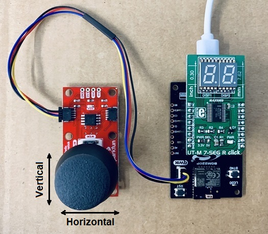
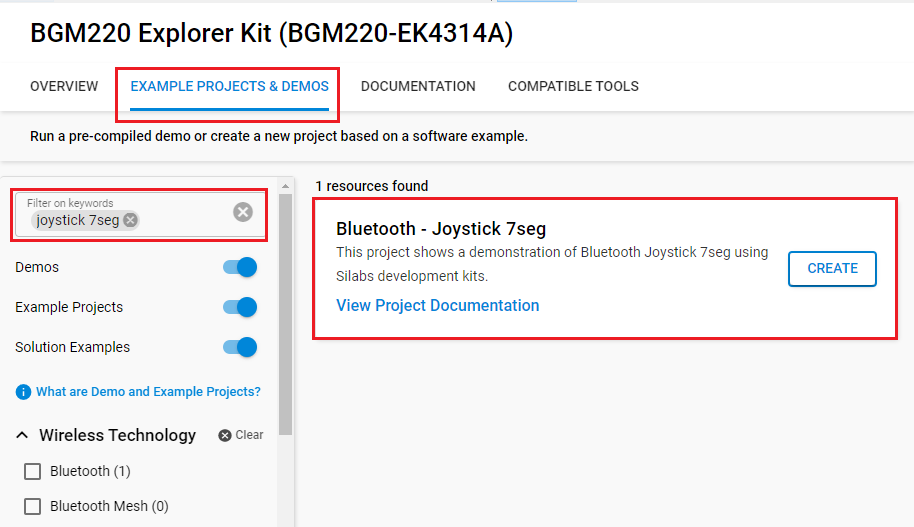
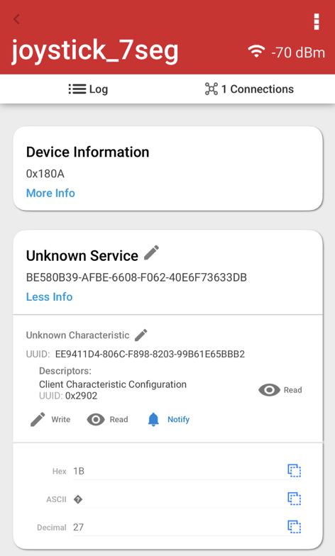
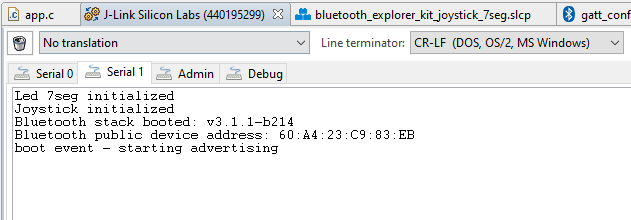

# Bluetooth - Joystick 7seg #

## Description ##

This project shows an example of Bluetooth using Silicon Labs development kits and external sensors integrated with the BLE wireless stack. This project uses a Sparkfun Qwiic Joystick board and a UT-L 7-SEG R click board.

UT-L 7-SEG R click carries two SMD ultra-thin 7-segment LED displays and the MAX6969 constant-current LED driver from Maxim Integrated. It communicates with the target microcontroller over the SPI interface.

For more information about the MAX6969 constant-current LED driver, see the [specification page](https://datasheets.maximintegrated.com/en/ds/MAX6969.pdf).

The SparkFun Qwiic Joystick combines the convenience of the Qwiic connection system and an analog joystick that is similar to the analog joysticks on PS2 (PlayStation 2) controllers. Directional movements are simply measured with two 10 kΩ potentiometers, connected with a gimbal mechanism that separates the horizontal and vertical movements. This joystick also has a select button that is actuated when the joystick is pressed down. With the pre-installed firmware, the ATtiny85 acts as an intermediary (microcontroller) for the analog and digital inputs from the joystick. This allows the Qwiic Joystick to report its position over I2C.

For more information about the SparkFun Qwiic Joystick, see the [specification page](https://learn.sparkfun.com/tutorials/qwiic-joystick-hookup-guide).

## Gecko SDK version ##

- GSDK v4.3.1
- [Third Party Hardware Drivers v1.6.0](https://github.com/SiliconLabs/third_party_hw_drivers_extension)

## Hardware Required ##

- [A BGM220 Explorer Kit board.](https://www.silabs.com/development-tools/wireless/bluetooth/bgm220-explorer-kit)

- [A SparkFun Qwiic Joystick Board.](https://www.sparkfun.com/products/15168)

- [A UT-S 7-SEG R click Board.](https://www.mikroe.com/ut-s-7-seg-r-click)

## Connections Required ##

Attach the UT-L 7-SEG R Click board to the Explorer kit. Make sure that the 45-degree corner of the NFC board matches the 45-degree white line of the Silabs Explorer kit

The Sparkfun Qwiic Joystick board can be easily connected by using a Qwiic cable.

## Setup ##

To test this application, you can either create a project based on an example project or start with a "Bluetooth - SoC Empty" project based on your hardware.

### Create a project based on an example project ###

1. From the Launcher Home, add your hardware to My Products, click on it, and click on the **EXAMPLE PROJECTS & DEMOS** tab. Find the example project with the filter "joystick_7seg".

2. Click **Create** button on the **Bluetooth - Joystick 7seg** example. Example project creation dialog pops up -> click Create and Finish and Project should be generated.

3. Build and flash this example to the board.

### Start with a "Bluetooth - SoC Empty" project ###

1. Create a **Bluetooth - SoC Empty** project for your hardware using Simplicity Studio 5.

2. Copy the file `src/app.c` into the project root folder (overwriting the existing file).

3. Install the software components:

    - Open the .slcp file in the project.

    - Select the SOFTWARE COMPONENTS tab.

    - Install the following components for the device:

        - [Services] → [IO Stream] → [IO Stream: USART] → default instance name: vcom
        - [Application] → [Utility] → [Log]
        - [Platform] → [Driver] → [Button] → [Simple Button] → default instance name: btn0
        - [Third Party Hardware Drivers] → [Display & LED] → [MAX6969 - UT-M 7-SEG R Click (Mikroe)]
        - [Third Party Hardware Drivers] → [Human Machine Interface] → [Qwiic Joystick (Sparkfun)]

4. Import the GATT configuration:

    - Open the .slcp file in the project again.
    - Select the CONFIGURATION TOOLS tab and open the "Bluetooth GATT Configurator".
    - Click on the Import button and import the attached `config/btconf/gatt_configuration.btconf` file.
    - Save the GATT configuration (ctrl-s).
        

5. Build and flash this example to the board.

## How It Works ##

The application reads a current joystick position every 100ms and prints it on the 7-segment LED display. For simplicity, reading is the current vertical position from joystick and only look at the MSB and get an 8-bit reading (for 256 positions). Each time the joystick moves up to the highest position (255), the joystick data will be increased by 1. On the contrary, each time the joystick moves down to the lowest position (0), the joystick data will be decreased by 1. When the Bluetooth connection is opened, the joystick data can be seen via Bluetooth by reading it manually or it can be also automatically updated using Notification.
Follow the below steps to test the example:

1. Open the EFR Connect app on your smartphone.
2. Find your device in the Bluetooth Browser, advertising as joystick_7seg, and tap Connect.
3. Find the Unknown Service at the GATT database.
4. Try to read, write, re-read the characteristics, and check the value.
5. Enable Notification on this service. Try to move up/down the joystick then check the value on the 7-segment LED display and on the EFR Connect app.
6. Try to use the BTN0 button to turn on/off the 7-segment LED display at any time.

You can launch the Console that is integrated in Simplicity Studio or can use a third-party terminal tool like TeraTerm to receive the logs from the virtual COM port.

