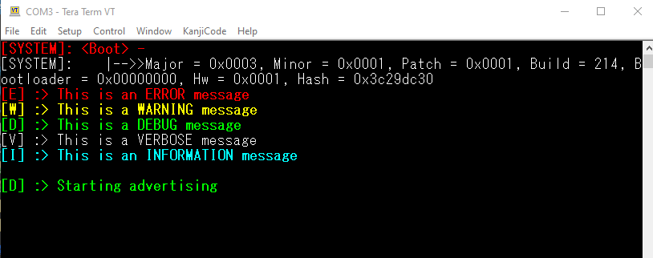
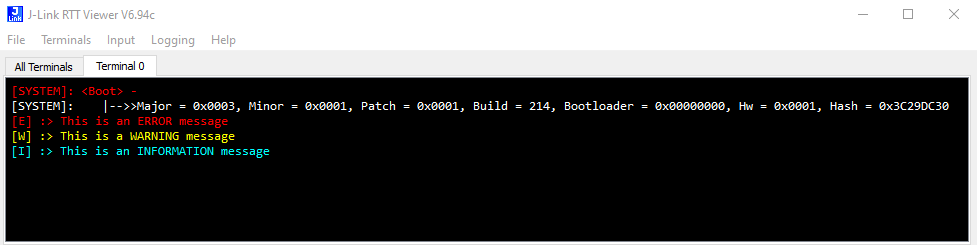

# Bluetooth - Log System ##

## Description ##

Logging is very important for developing embedded products. This is especially true for connection-based wireless products because the use of breakpoints will probably result in dropped connections, whereas issues can be easily addressed by walking through the log.

This example introduces a simple implementation of logging on the EFR32 based devices. The key point of the example code is to introduce a way to classify the log into different levels, where each level of the log has its own identifier. Let’s start with 2 design sketches, which demonstrate outputting the log via RTT and VCOM(UART).

Using RTT

Using VCOM

The images above show different levels of logging in different colors. This example introduces 5 logging levels, as shown below.

| Type                   | color  |
| ---------------------- | ------ |
| Error (highest level)  | Red    |
| Warning                | Yellow |
| Information            | Blue   |
| Debug                  | Green  |
| Verbose (lowest level) | White  |

## Gecko SDK version ##

- GSDK v4.2.1

## Hardware Required ##

- [BGM220 Bluetooth Module Explorer Kit - BGM220-EK4314A](https://www.silabs.com/development-tools/wireless/bluetooth/bgm220-explorer-kit?tab=overview)

**NOTE:**
Tested boards for working with this example:

| Board ID | Description  |
| ---------------------- | ------ |
| BRD2703A | [EFR32xG24 Explorer Kit - XG24-EK2703A ](https://www.silabs.com/development-tools/wireless/efr32xg24-explorer-kit?tab=overview)    |
| BRD2704A | [SparkFun Thing Plus Matter - MGM240P - BRD2704A](https://www.sparkfun.com/products/20270) |
| BRD2601B | [EFR32xG24 Dev Kit - xG24-DK2601B](https://www.silabs.com/development-tools/wireless/efr32xg24-dev-kit?tab=overview)   |
| BRD4314A | [BGM220 Bluetooth Module Explorer Kit - BGM220-EK4314A](https://www.silabs.com/development-tools/wireless/bluetooth/bgm220-explorer-kit?tab=overview)  |
| BRD4108A | [BG22 Bluetooth SoC Explorer Kit - BG22-EK4108A](https://www.silabs.com/development-tools/wireless/bluetooth/bg22-explorer-kit?tab=overview)  |

## Connections Required ##

- Connect the Bluetooth Development Kits to the PC through a compatible-cable. For example, a micro USB cable for the BGM220 Bluetooth Module Explorer Kit.

## Setup ##

To test this application, you can either create a project based on an example project or start with a "Bluetooth - SoC Empty" project based on your hardware.

### Create a project based on an example project ###

1. From the Launcher Home, add your hardware to My Products, click on it, and click on the **EXAMPLE PROJECTS & DEMOS** tab. Find the example project with the filter "logging".

2. Click **Create** button on the **Bluetooth - Log System RTT** or **Bluetooth - Log System VCOM** example. Example project creation dialog pops up -> click Create and Finish and Project should be generated.

3. Build and flash this example to the board.

### Start with a "Bluetooth - SoC Empty" project ###

1. Create a **Bluetooth - SoC Empty** project for your hardware using Simplicity Studio 5.

2. Copy the attached src/app.c, inc/**/log.h  files into your project (overwriting existing app.c).

   - inc/rtt/log.h – the log will be out from J-Link RTT.
   - inc/vcom/log.h – the log will be out from VCOM via USB.

3. Open the .slcp file. Select the SOFTWARE COMPONENTS tab and install the software components:

   - If you use **J-Link RTT** for logging, find and install the following components:
     - [Third Party] → [SEGGER] → [RTT] → [SEGGER RTT]
     - [Third Party] → [SEGGER] → [RTT] → [SEGGER RTT printf]
   - If you use the **VCOM** port (UART) for logging, find and install the following components:
     - [Services] → [IO Stream] → [IO Stream: EUSART] → default instance name: vcom
     - [Platform] → [Board] → [Board Control] → enable *Virtual COM UART*
     - [Application] → [Utility] → [Log]

4. Define LOG_LEVEL in log.h. The definition of LOG_LEVEL determines, which level of logging is sent to the terminal. As you can see from the table above, an error has the highest level while verbose has the lowest level. For example, if the LOG_LEVEL is defined as the information level, then error, warning and information logs are sent to the terminal. The debug and verbose logs, which have a lower level than information, are not sent to the terminal. See the figure below, which shows the log as an information level without modifying anything from the first figure, using RTT.

   

5. Build and flash the project to your device.

**Note:**

- Make sure that this repository is added to [Preferences > Simplicity Studio > External Repos](https://docs.silabs.com/simplicity-studio-5-users-guide/latest/ss-5-users-guide-about-the-launcher/welcome-and-device-tabs).

- Do not forget to flash a bootloader to your board, see [Bootloader](https://github.com/SiliconLabs/bluetooth_applications/blob/master/README.md#bootloader) for more information.

## How It Works ##

1. On your PC open a terminal program and connect to the chosen port (e.g. you can use TeraTerm to connect via VCOM and [RTT Viewer](https://www.segger.com/products/debug-probes/j-link/tools/rtt-viewer/) to connect via DEBUG port).

2. Reset your device and observe the log messages.

3. You may also open a Bluetooth connection to see more logs by using the EFR Connect app on your smartphone. After opening the EFR Connect app, find your device in the Bluetooth Browser, advertising as Empty Example, tap Connect then Disconnect and check the logs.

   
   Using RTT viewer

   
   Using VCOM

You can add new logs to your project. The following are 5 corresponding functions to send the log. The input parameter of these five functions is the same as standard printf();.

- `LOGE()` – Send ERROR log.
- `LOGW()` – Send  WARNING log.
- `LOGI()` – Send INFORMATION log.
- `LOGD()` – Send DEBUG log.
- `LOGV()` – Send VERBOSE log.

Use these functions in your code to print different-level logs.
