# Bluetooth - Man-In-The-Middle #

## Overview ##

This project shows the implementation of Man-In-The-Middle with BLE. It demonstrates how to avoid this vulnerability. It will show how we can prevent the risk in the MITM attack with BLE configuration. This project makes an MITM example in case of using the thermometer server, a smartphone and MITM device.

- MITM device: This device acts as the attacker. It will try to interrupt the connection between a server with smartphone, then it fakes the server to connect with smartphone, then send malicious data to it.

- Thermometer server: This device acts as the server which connect with smartphone at first.

The following picture shows the system view of how it works.

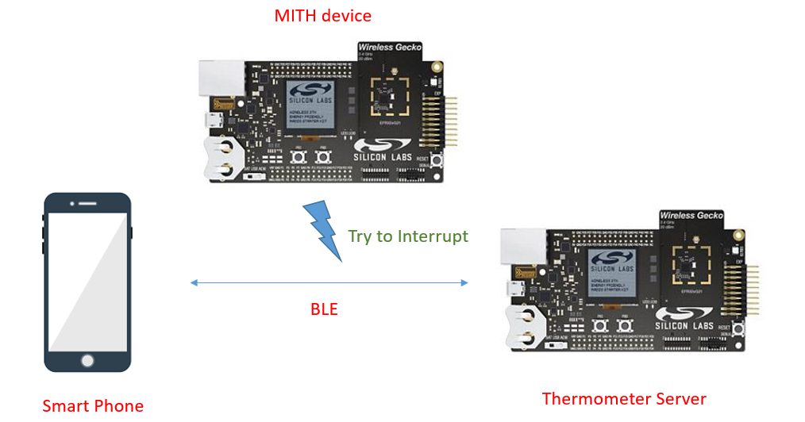

## Gecko SDK Suite version ##

- GSDK v4.2.1

## Hardware Required ##

**Attacker:**
- [EFR32MG12 2.4 GHz 19 dBm Radio Board Brd4161a](https://www.silabs.com/documents/public/reference-manuals/brd4161a-rm.pdf)

- [BRD4001A A01 Wireless Starter Kit Mainboard](https://www.silabs.com/documents/public/schematic-files/BRD4001A-A01-schematic.pdf)

**Server:**
- [EFR32MG12 2.4 GHz 19 dBm Radio Board Brd4162a](https://www.silabs.com/documents/public/reference-manuals/brd4162a-rm.pdf)

- [BRD4001A A01 Wireless Starter Kit Mainboard](https://www.silabs.com/documents/public/schematic-files/BRD4001A-A01-schematic.pdf)

**NOTE:**
Tested boards for working with this example:

**Attacker:** bt_man_in_the_middle.slcp
| Board ID | Description  |
| ---------------------- | ------ |
| BRD4161A | [EFR32MG12 2.4 GHz 19 dBm Radio Board](https://www.silabs.com/documents/public/reference-manuals/brd4161a-rm.pdf)    |
| BRD4162A | [EFR32MG12 2.4 GHz 19 dBm Radio Board](https://www.silabs.com/documents/public/reference-manuals/brd4162a-rm.pdf)    |
| BRD2704A | [SparkFun Thing Plus Matter - MGM240P](https://www.sparkfun.com/products/20270)                                      |
| BRD2703A | [EFR32xG24 Explorer Kit](https://www.silabs.com/development-tools/wireless/efr32xg24-explorer-kit?tab=overview)                                                               |
| BRD2601B | [EFR32xG24 Dev Kit](https://www.silabs.com/development-tools/wireless/efr32xg24-dev-kit?tab=overview)                                                               |
| BRD4108A | [BG22 Bluetooth SoC Explorer Kit](https://www.silabs.com/development-tools/wireless/bluetooth/bg22-explorer-kit?tab=overview)    |
| BRD4314A | [BGM220 Bluetooth Module Explorer Kit](https://www.silabs.com/development-tools/wireless/bluetooth/bgm220-explorer-kit?tab=overview)

**Server:** bt_thermometer_auth.slcp
| Board ID | Description  |
| ---------------------- | ------ |
| BRD4161A | [EFR32MG12 2.4 GHz 19 dBm Radio Board Brd4161a](https://www.silabs.com/documents/public/reference-manuals/brd4161a-rm.pdf)    |
| BRD4162A | [EFR32MG12 2.4 GHz 19 dBm Radio Board Brd4162a](https://www.silabs.com/documents/public/reference-manuals/brd4162a-rm.pdf)    |
| BRD2601B | [EFR32xG24 Dev Kit](https://www.silabs.com/development-tools/wireless/efr32xg24-dev-kit?tab=overview)

## Connections Required ##

The following picture shows the hardware for MITM device.

## Setup ##

To test this application, you can either create a project based on a example project or start with an "Bluetooth - SoC Empty" project based on your hardware.

### Create a project based on a example project ###

1. From the Launcher Home, add the your hardware to MyProducts, click on it, and click on the **EXAMPLE PROJECTS & DEMOS** tab. Find the example project with filter "man in middle".

2. Click **Create** button on the **Bluetooth - Man In The Middle Device Example** and **Bluetooth - Health Thermometer Authenticator Server** example. These example projects creation dialog pops up -> click Create and Finish and Projects should be generated.
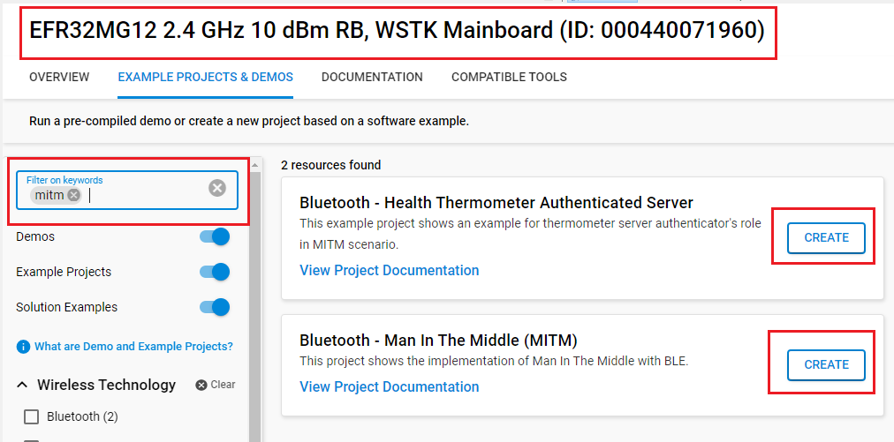

3. Build and flash this example to your boards.

### Start with an "Bluetooth - SoC Empty" project ###

1. Create a **Bluetooth - SoC Empty** project for your hardware using Simplicity Studio 5.

2. Copy all attached files in *inc* and *src/**/app.c* folders into the project root folder (overwriting existing):
   - With **Attacker** (MITM device): *src/mitm_device/app.c*
    - With **Server** device: *src/thermometer_auth/app.c*

3. Import the GATT configuration:

    - Open the .slcp file in the project.

    - Select the **CONFIGURATION TOOLS** tab and open the **Bluetooth GATT Configurator**.

    - Find the Import button and import the attached gatt_configuration.btconf file.

        - With **Attacker** device: *config/mitm_device/gatt_configuration.btconf*
        - With **Server** device: *config/thermometer_auth/gatt_configuration.btconf*

    - Save the GATT configuration (ctrl-s).

4. Open the .slcp file. Select the **SOFTWARE COMPONENTS** tab and install the software components:

    - For **Attacker** device:
        - [Services] → [IO Stream] → [IO Stream: USART] → default instance name: **vcom**
        - [Application] → [Utility] → [Log]
        - [Application] → [Utility] → [Assert]
        - [Bluetooth] → [Feature]: uninstall [Scanner for legacy advertisements]
        - [Bluetooth] → [Feature] → [Scanner Base Feature]
        - [Platform] → [Board] → [Board Control] → enable *Virtual COM UART*
        
    - For **Server** device:
        - [Services] → [IO Stream] → [IO Stream: USART] → default instance name: **vcom**
        - [Application] → [Utility] → [Log]
        - [Application] → [Utility] → [Assert]
        - [Platform] → [Driver] → [I2C] → [I2CSPM] → default instance name: **sensor**
        - [Bluetooth] → [GATT] → [Health Thermometer API]
        - [Application] → [Sensor] → [Relative Humidity and Temperature sensor]
        - [Application] → [Services] → [Simple timer service]
        - [Platform] → [Board] → [Board Control] → enable *Virtual COM UART*

5. Install printf float

    - Open Properties of the project.

    - Select C/C++ Build → Settings → Tool Settings → GNU ARM C Linker → General. Check Printf float.
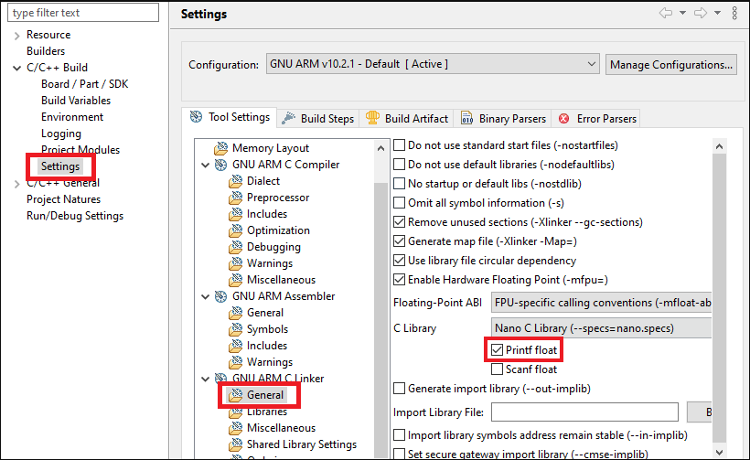

6. Build and flash these projects to your boards.

**Note:**

- Make sure that this repository is added to [Preferences > Simplicity Studio > External Repos](https://docs.silabs.com/simplicity-studio-5-users-guide/latest/ss-5-users-guide-about-the-launcher/welcome-and-device-tabs).
- Do not forget to flash a bootloader to your board, see [Bootloader](https://github.com/SiliconLabs/bluetooth_applications/blob/master/README.md#bootloader) for more information.

## How it Works ##

In this example, we follow the MITM (Man-In-The-Middle) scenario, which means:
1. We have three devices:
    - Attacker (MITM).
    - Real health thermometer server (an example project already included in Simplicity)
    - Smartphone.

2. At first, the smartphone connects to real health thermometer server via its advertisement and transfers data to this.
3. Then a connection issue is visible and smartphone is temporary disconnected.
4. The MITM device connects to the real health thermometer server and advertises itself as the real server.
5. A smart phone connects to the MITM device.
6. The MITM gets the real data from the real health thermometer server, then alters the signs, i.e. changing the value to negative) and sending the wrong data to the smartphone.

These step below shows the operation of the following scenario:

Firstly:

 - Open your EFR app in smartphone:
 - Search device with filter: 'health'
 - Press connect button to establish connection between two device.
 - It's ready to tranfer data.

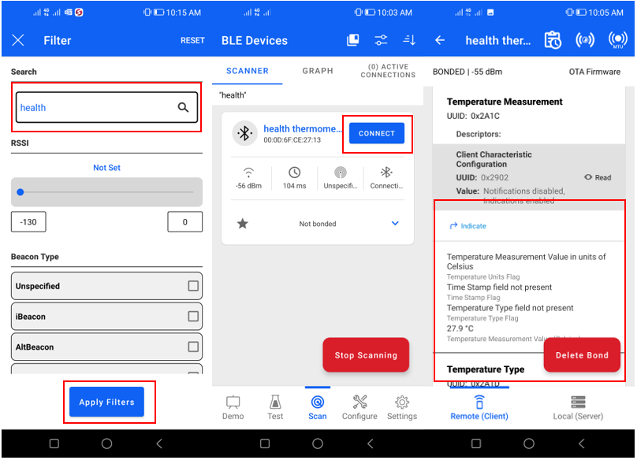

 - In the log console, you will see the status of server:

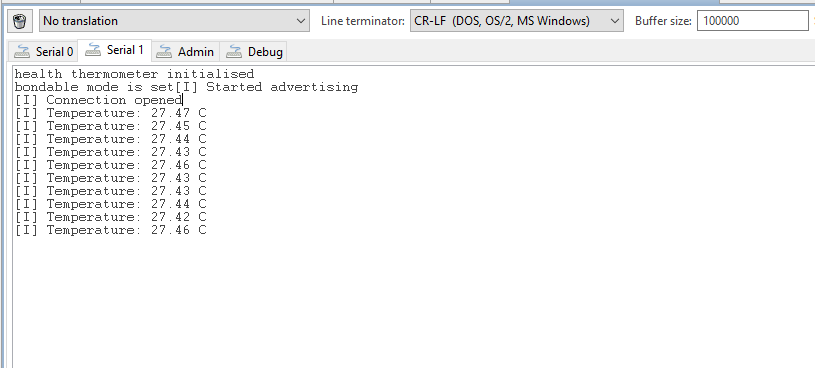

To simulation some problem with connection, temporary disconnect with health thermometer server in EFR app from smartphone.

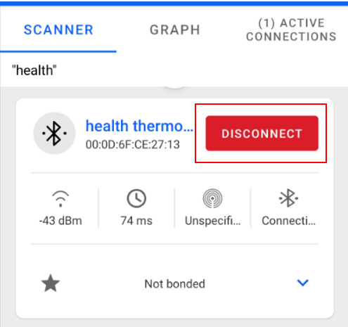

Then turn on the attacker device; the attacker connects to the real health thermometer server and advertises itself as the real server.

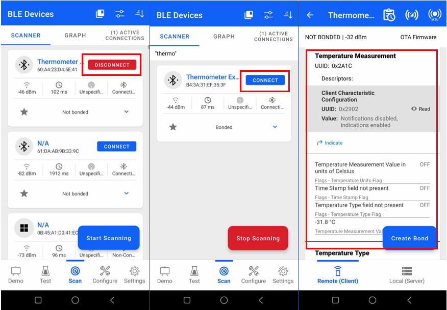
That smartphone is connected to the attacker and gets the malicious data.

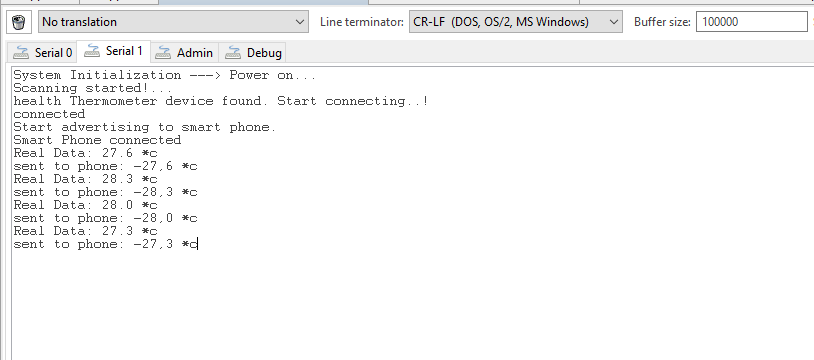

This is the Man-In-The-Middle scenario. To prevent the MITM, another project shows the initialization and configuration with the Bluetooth Security Manager API to prevent MITM. The bt_thermometer_auth project shows how to initialize the security manager in the system_boot_id event. The temperature measurement characteristic is configured with authenticated notify. Replace the Bluetooth - SOC Health Thermometer project with the Bluetooth - health Thermometer Authenticated Server project and try this scenario again.

When **Bluetooth - health Thermometer Authenticated Server** is used, every time health thermometer server connect to another device, it will require bonding and increase security of the connection.

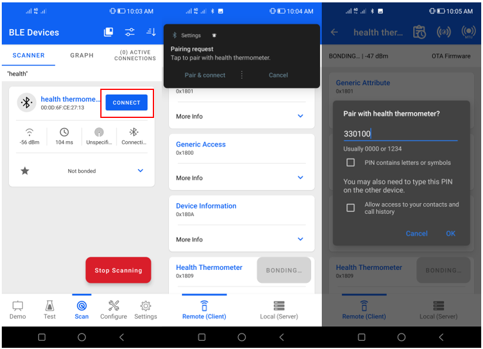

A passkey is generated and transferred.

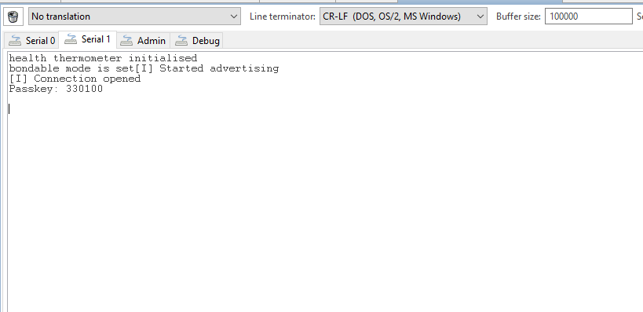

If the passkey matches, the connection will be established.

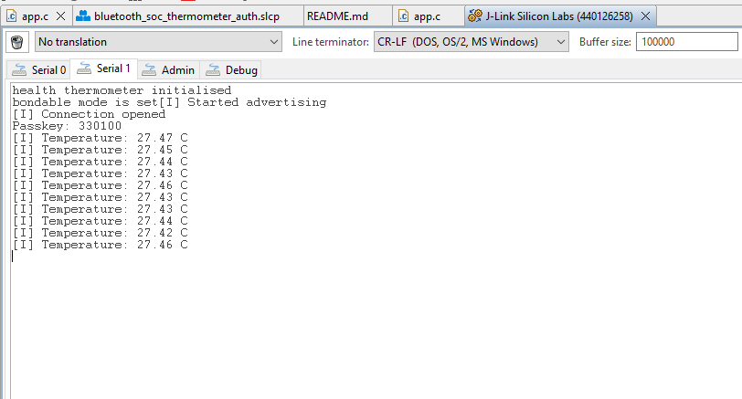

When the attacker tries to connect to the health thermometer authenticated server, it has no passkey for bonding. The health thermometer authenticated server rejects the connection.

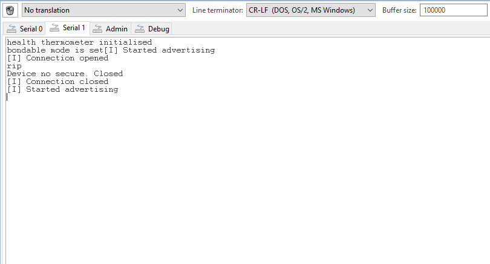

