# Bluetooth - Man-In-The-Middle #

## Overview ##

This project shows the implementation of Man-In-The-Middle with BLE. It demonstrates how to avoid this vulnerability. It will show how we can prevent the risk in the MITM attack with BLE configuration. This project makes an MITM example in the case of using the thermometer server, a smartphone and the MITM device.

- MITM device: This device acts as the attacker. It secretly relays and possibly alters the communications between two devices, in other way it fakes the server to connect with the smartphone, then send malicious data to it.

- Thermometer server: This device acts as the server that connects with the smartphone at first. This runs two projects, one is the Bluetooth - SoC Thermometer example to demonstrate the unsecured server and another project is The Bluetooth - SoC Thermometer Authenticated Server to demonstrate the secure server.

The following picture shows the system view of how it works.

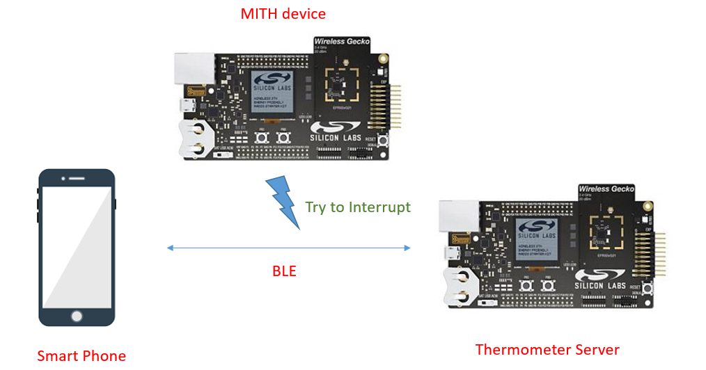

## SDK version ##

- [SiSDK v2024.12.0](https://github.com/SiliconLabs/simplicity_sdk)

## Software Required ##

- [Simplicity Studio v5 IDE](https://www.silabs.com/developers/simplicity-studio)

## Hardware Required ##

- 2x [Bluetooth Low Energy Development Kit](https://www.silabs.com/development-tools/wireless/bluetooth). One is for the Attacker, another is for the Server. For simplicity, Silicon Labs recommends the [BGM220-EK4314A](https://www.silabs.com/development-tools/wireless/bluetooth/bgm220-explorer-kit)
- 1x smartphone running the 'Simplicity Connect' mobile app

## Connections Required ##

- Connect the Bluetooth Development Kits to the PC through a compatible-cable. For example, a micro USB cable for the BGM220 Bluetooth Module Explorer Kit.

## Setup ##

To test this application, you can either create a project based on an example project or start with a "Bluetooth - SoC Empty" project based on your hardware.

**NOTE**:

- Make sure that the [bluetooth_applications](https://github.com/SiliconLabs/bluetooth_applications) repository is added to [Preferences > Simplicity Studio > External Repos](https://docs.silabs.com/simplicity-studio-5-users-guide/latest/ss-5-users-guide-about-the-launcher/welcome-and-device-tabs).

### Create a project based on an example project ###

1. From the Launcher Home, add your product name to MyProducts, click on it, and click on the **EXAMPLE PROJECTS & DEMOS** tab. Find the example project filtering by "mitm".

2. Click **Create** button on the **Bluetooth - Man In The Middle Device Example** and **Bluetooth - SoC Thermometer Authenticator Server** example. These example projects creation dialog pops up -> click Create and Finish and Projects should be generated.
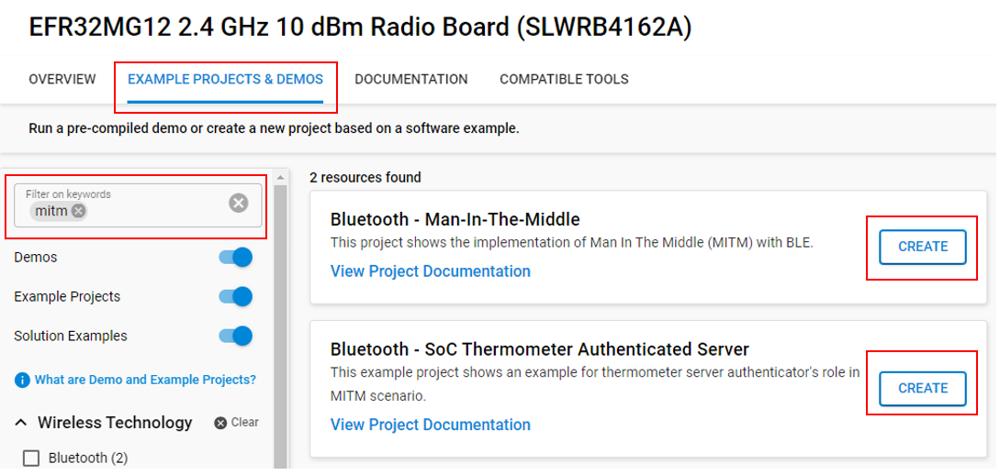

3. Build and flash this example to your boards.

### Start with a "Bluetooth - SoC Empty" project ###

1. Create a **Bluetooth - SoC Empty** project for your hardware using Simplicity Studio 5.

2. Copy all attached files in *inc* and *src/app.c* folders into the project root folder (overwriting existing):
   - With **Attacker** (MITM device): *bluetooth_man_in_the_middle_device/src/app.c*
   - With **Server** device: *bluetooth_thermometer_authenticated_server/src/app.c*

3. Import the GATT configuration:

    - Open the .slcp file in the project.

    - Select the **CONFIGURATION TOOLS** tab and open the **Bluetooth GATT Configurator**.

    - Find the Import button and import the attached gatt_configuration.btconf file.

    - Save the GATT configuration (ctrl-s).

4. Open the .slcp file. Select the **SOFTWARE COMPONENTS** tab and install the software components:

    - For **Attacker** device:
        - [Platform] → [Board] → [Board Control] → enable *Virtual COM UART*
        - [Services] → [IO Stream] → [IO Stream: USART] → default instance name: **vcom**
        - [Application] → [Utility] → [Log]
        - [Application] → [Utility] → [Assert]
        - [Bluetooth] → [GATT] → [Health Thermometer API]
        - [Bluetooth] → [Bluetooth LE Controller (Link Layer)] → [Features with Commands and Events] → [Advertising Base Feature] → Set "Max number of advertising sets reserved for user" to 4

    - For **Server** device:
        - [Platform] → [Board] → [Board Control] → enable *Virtual COM UART*
        - [Services] → [IO Stream] → [IO Stream: USART] → default instance name: **vcom**
        - [Application] → [Utility] → [Log]
        - [Application] → [Utility] → [Assert]
        - [Platform] → [Driver] → [I2C] → [I2CSPM] → default instance name: **sensor**(or **qwiic**)
        - [Bluetooth] → [GATT] → [Health Thermometer API]
        - [Application] → [Sensor] → [Relative Humidity and Temperature sensor mock]
        - [Services] → [Timers] → [Sleep Timer]

5. Install printf float

    - Open Properties of the project.

    - Select C/C++ Build → Settings → Tool Settings → GNU ARM C Linker → General. Check Printf float.
    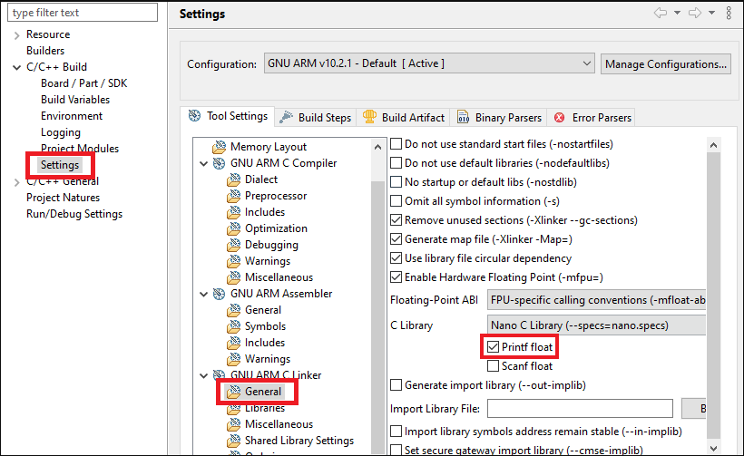

6. Build and flash these projects to your boards.

**Note:**

- A bootloader needs to be flashed to your board if the project starts from the "Bluetooth - SoC Empty" project, see [Bootloader](https://github.com/SiliconLabs/bluetooth_applications/blob/master/README.md#bootloader) for more information.

## How it Works ##

In this example, we follow the MITM (Man-In-The-Middle) scenario, which means:

1. We have three devices:
    - Attacker (MITM).
    - Real health thermometer server. It is an EFR32 radio board + WSTK mainboard which runs the "Bluetooth - SoC Thermometer" project (an example project already included in Simplicity)
    - Smartphone.
2. At first, the smartphone connects to the real health thermometer server via its advertisement and transfers data to this.
3. Then a connection issue is visible and the smartphone is temporarily disconnected.
4. The MITM device connects to the real health thermometer server and advertises itself as the real server.
5. A smartphone connects to the MITM device.
6. The MITM gets the real data from the real health thermometer server, then alters the signs (i.e. changing the value to negative) and sends the wrong data to the smartphone.

The below steps show the operation of the following scenario:

Firstly:

- Open your Simplicity Connect app on your smartphone
- Search device filtering by 'Thermometer'
- Press the 'Connect' button to establish the connection between devices
- It's ready to transfer data

    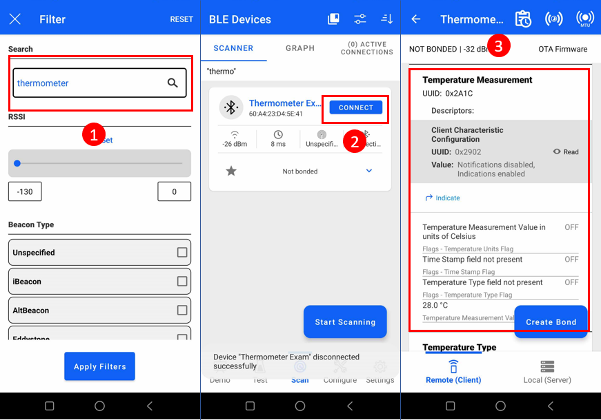

- In the log console, you will see the status of the server:

    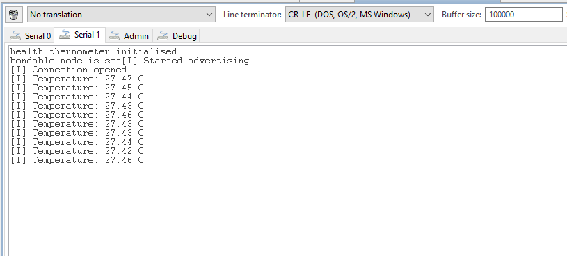

To simulate some problems with the connection, temporarily disconnect the health thermometer server in the EFR app from your smartphone.
Then turn on the attacker device; the attacker connects to the real health thermometer server and advertises itself as the real server with the same name.

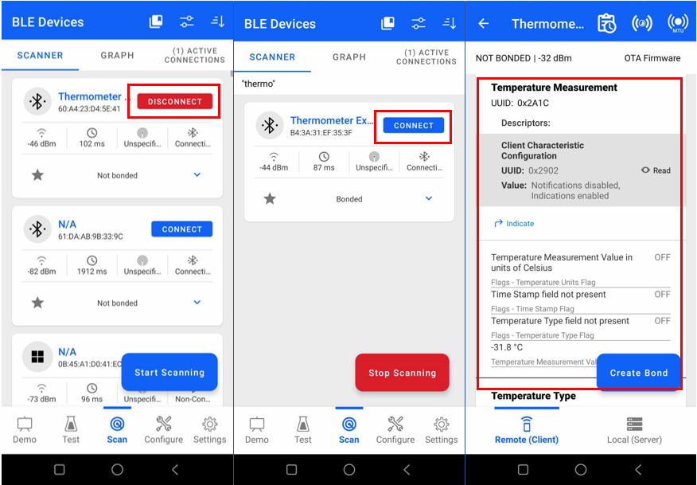

That smartphone is connected to the attacker and gets the malicious data.

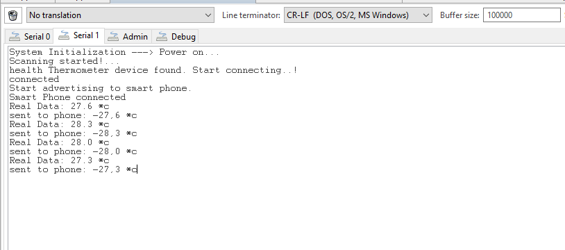

This is the Man-In-The-Middle scenario. To prevent the MITM attack, another project shows the initialization and configuration with the Bluetooth Security Manager API to prevent MITM. The bt_thermometer_auth project shows how to initialize the security manager in the system_boot_id event. The temperature measurement characteristic is configured with authenticated notification. Replace the Bluetooth - SoC Health Thermometer project with the Bluetooth - SoC Thermometer Authenticated Server project and try this scenario again.

When **Bluetooth - SoC Thermometer Authenticated Server** is used, every time the Thermometer Authenticated server connects to another device, it will require bonding and increasing security of the connection.

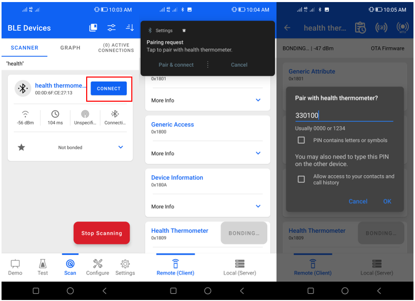

A passkey is generated and transferred.

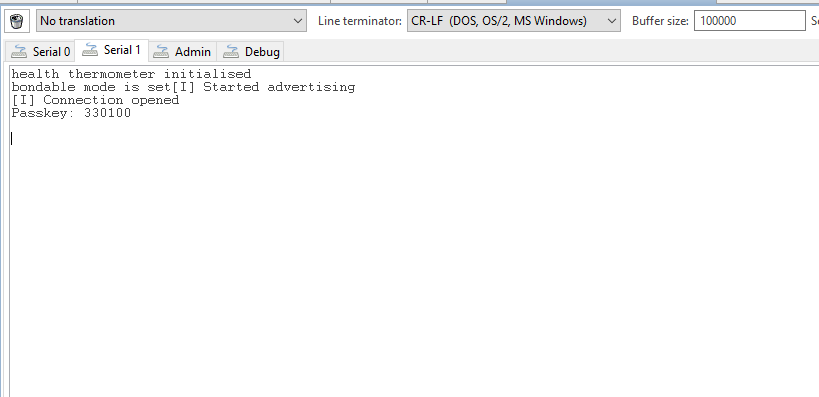

If the passkey matches, the connection will be established.

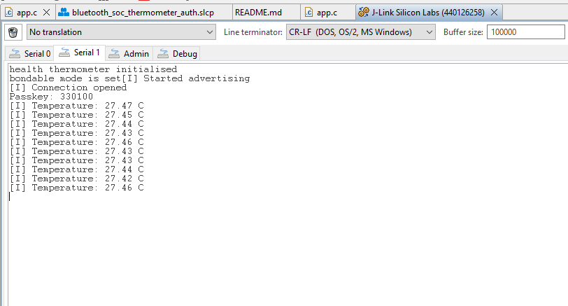

When the attacker tries to connect to the Thermometer Authenticated server, it has no passkey for bonding. The Thermometer Authenticated server rejects the connection.

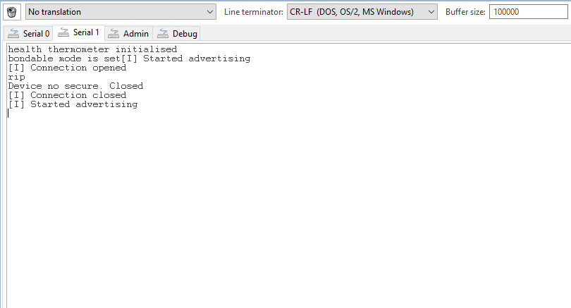
