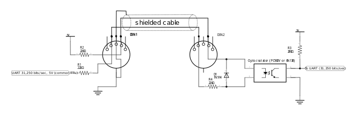
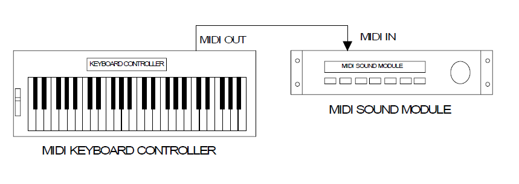
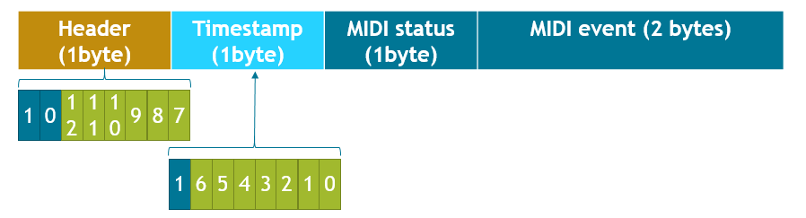

<!--Author: Balázs Leidecker -->

# MIDI over BLE

## Description

This document describes how an EFR32 device can be used as a MIDI controller over Bluetooth Low Energy by providing basic information about the MIDI standard and about the Apple Bluetooth Low Energy MIDI Specification. Finally, the document highlights and explains the most important parts of the attached sample application, which implements a basic MIDI controller.

### Protocol

MIDI is an industry standard music technology protocol that connects products from many different companies including digital musical instruments, computers, tablets, and smartphones. MIDI is used daily around the world by musicians, DJs, producers, educators, artists, and hobbyists to create, perform, learn, and share music and artistic works. Nearly every hit album, film score, TV show, and theatrical production uses MIDI to connect and create. MIDI information is transmitted in "MIDI messages", which can be thought of as instructions which tells a music synthesizer how to play a piece of music. The synthesizer receiving the MIDI data must generate the actual sounds.

### Physical Layer

The MIDI specification for the electrical interface is based on a fully-isolated current loop. The MIDI OUT port nominally sources a +5 volt source through a 220 ohm resistor out through pin 4 on the MIDI OUT DIN connector, in on pin 4 of the receiving device's MIDI IN DIN connector, through a 220 ohm protection resistor and the LED of an optoisolator. The current then returns via pin 5 on the MIDI IN port to the originating device's MIDI OUT port pin 5, again with a 220 ohm resistor in the path, giving a nominal current of about 5 milliamperes. Despite the cable's appearance, there is no conductive path between the two MIDI devices, only an optically isolated one. The data rate on this system is relatively slow (by today standards) 31,250 bits per second, logic 0 being current ON. The MIDI data stream is a unidirectional asynchronous bit stream with 10 bits transmitted per byte (a start bit, 8 data bits, and one stop bit). The MIDI data stream is usually originated by a MIDI controller, such as a musical instrument keyboard.

### MIDI Controller and Sound Module

A MIDI controller is a device, which is played as an instrument. It translates the performance into a MIDI data stream in real time (as it is played). The MIDI data output from a MIDI controller is transmitted via the devices' MIDI OUT connector. The recipient of this MIDI data stream is commonly a MIDI sound generator or sound module, which receives MIDI messages at its MIDI IN connector and respond to these messages by playing sounds.

### MIDI Messages

There are a number of different types of MIDI messages. See the [https://www.midi.org](https://www.midi.org) for details.

In the example code attached, only Note On and Note Off messages are implemented. The Note On message is used for turning on MIDI notes, which is typically sent when a key is pressed on the keyboard. The Note Off message is used for turning off MIDI notes, which is typically sent when a key is released on the keyboard.

### MIDI over BLE

There are number of solutions where the standard DIN connector and physical layer changed to a more modern medium, such as USB or Ethernet. Apple defined a custom BLE service for MIDI support. This is now part of the MIDI standard.

The specification can be found here:

[https://www.midi.org/specifications/item/bluetooth-le-midi](https://www.midi.org/specifications/item/bluetooth-le-midi)

To support MIDI over BLE, the accessory has to fulfill the requirements described below.

### Connection Interval

The accessory shall request a connection interval of 15 ms or less. Apple recommends starting with a request for a connection interval of 11.25 ms and going to 15 ms if the connection request is rejected by the Apple product. Intervals higher than 15 ms are unsuitable for live playback situations.

### MTU negotiation

The accessory shall support MTU negotiation. See the MTU Size section in the Bluetooth Low Energy chapter of the Bluetooth Accessory Design Guidelines for Apple Products for implementation details.

### Multiple packet transmissions

The accessory shall support sending and receiving the maximum number of Bluetooth Low Energy packets that can fit into the connection interval. MIDI minimum bandwidth requirements may not be met otherwise.

### Custom MIDI Service and Characteristic

The GATT should contain the following service and characteristic:

| Name                    | UUID                                 |
| ----------------------- | ------------------------------------ |
| MIDI Service            | 03B80E5A-EDE8-4B33-A751-6CE34EC4C700 |
| MIDI I/O Characteristic | 7772E5DB-3868-4112-A1A9-F2669D106BF3 |

Characteristic properties:

| Name     | Type | Security            | Properties       |                           Comment                            |
| -------- | ---- | ------------------- | ---------------- | :----------------------------------------------------------: |
| MIDI I/O | blob | Read, Write, Notify | Pairing required | Shall require encryption. Writes must not expect a response. |

### Header and Timestamp fields

Additional Header and Timestamp fields have to be added before the standard MIDI message format.

* Header bit 7 is start bit and set to 1
* Header bit 6 is reserved and set to 0
* Header bits 0-5 are upper 6 bits of 13 bit timestamp
* Timestamp bit 7 is start bit and set to 1

Note that the actual timestamp value is split between the Header and Timestamp fields.

The 13-bit timestamp for a MIDI event in any given Bluetooth Low Energy packet is formed from the bottom 6 bits of the Header field and the bottom 7 bits of the Timestamp filed. Timestamps are expressed in milliseconds, implying that the maximum timestamp range is 8192 ms. Timestamps must be sent in monotonically increasing order.

### How it Works
The attached application acts as a very basic MIDI controller. It can send MIDI note on and MIDI note off messages when a button is pressed or released on the WSTK.

The most important steps to enabling the MIDI functionality:
* Enable bonding and setting the device I/O capabilities.
* Set the connection interval to the required 15 ms.

* Function used to send a note on message:
  * The midi_note_on() function prepares and sends a note on message. First, the function gets the tick counter from the Sleeptimer, then converts it to msec. The Sleeptimer provides a 32 bit counter, but according to the specification, only the lower 13 bit is needed. As a result, the rest of the bits are masked. Then, the function fills the header and timestamp fields. The header byte is 0b10xxxxxx where xxxxxxx is top 6 bits of timestamp. The timestamp byte is 0b1xxxxxxx where xxxxxxx is lower 7 bits of timestamp.
  * The status byte is 0x90 is 0b1sssnnnn where sss is message type and nnnn is the MIDI channel.
  * The last two bytes contain the 2 byte long event field. In this case, it is the note and velocity.
  * Finally, the function sends the message with the sl_bt_gatt_server_send_notification API function.

## Setting up

1. Create a new SoC-empty project for your device.

2. Copy the attached app.c file to your project

3. Open the GATT configurator and import the provided **gatt_configuration.btconf**

4. Open the **Software Components** and add the **Simple Button** driver with two instances: **btn0**, and **btn1**

6. Build and flash the application.

## Usage

After the application is flashed to the kit, it starts advertising. Use a mobile app, such as a Korg Module, to search for your device and then connect to it. After connection, it pairs and bonds with the Just Works method. When the device is connected and paired, you can press the buttons on the development kit and the mobile device will play the sounds.

The application was tested with the following iOS apps:
   * Korg Module
   * Korg Gadget
   * Apple GarageBand

## Source

* [app.c](source/app.c)
* [gatt_configuration](config/gatt_configuration.btconf)

