# Bluetooth - Movement Detection (BMA400) #

## Overview ##

This project aims to implement a motion detection example application, the motion detection algorithm and its software module will be used as a building block for the Asset Tracking application.

The block diagram of this application is shown in the image below:

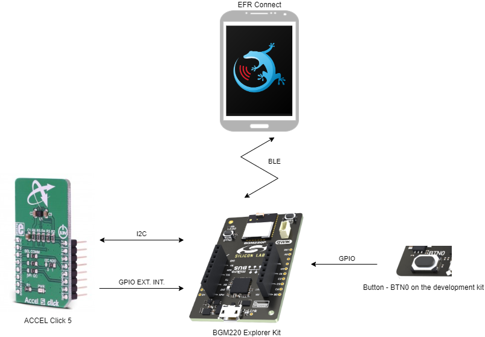

Overall, this application detects movement by calculating the accelerometer value from Accel 5 Click sensor. This application has two modes:

In normal mode, when the sensor value changes, an interrupt signal is generated in the GPIO interrupt pin that wakes the BGM220 board up and checks the movement. If the motion is detected, LED 0 on the board is blinked until the notification break time is over.

In the configure mode, the device starts advertising itself. Users can connect to the device via EFR Connect app and configure threshold value, wakeup time period, notification time, and notification break time.

## Gecko SDK Version ##

- GSDK v4.3.1
- [Third Party Hardware Drivers v1.7.0](https://github.com/SiliconLabs/third_party_hw_drivers_extension)

## Hardware Required ##

- [BGM220 Explorer Kit board](https://www.silabs.com/development-tools/wireless/bluetooth/bgm220-explorer-kit)

- [**MikroE Accel 5 click** ultra-low power triaxial accelerometer sensor](https://www.mikroe.com/accel-5-click)

## Connections Required ##

The Accel 5 Click board supports MikroBus, so it can connect easily to BGM220 Explorer Kit's MikroBus header. Be sure that the  45-degree corner of the sensor board matches the 45-degree white line of the Explorer Kit.

The board also has 4.7k I2C-bus pull-ups. Just be sure that the click board is configured into I2C mode by the resistors and not into SPI mode. Also, the application uses by default **I2C address 0x15** as it is the Accel 5 click default (the resistor labeled "I2C ADD" is on the "1". If setting "I2C ADD" resistor "0", the address will be 0x14).

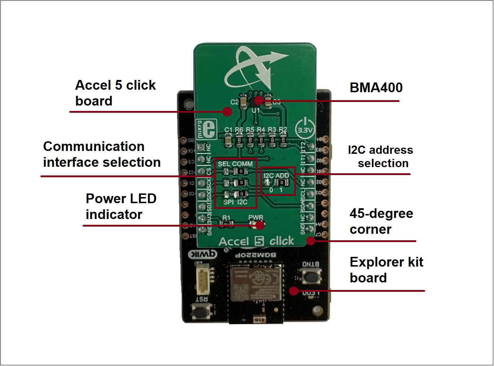

## Setup ##

To test this application, you can either create a project based on an example project or start with an empty example project.

### Create a project based on an example project ###

1. From the Launcher Home, add your product name to My Products, click on it, and click on the **EXAMPLE PROJECTS & DEMOS** tab. Find the example project with the filter "movement".

2. Click **Create** button on **Bluetooth - Movement Detection** project. Example project creation dialog pops up -> click Create and Finish and source code should be generated.

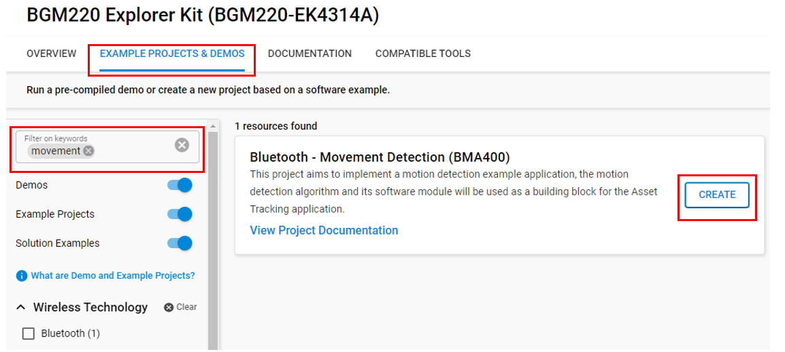

3. Build and flash this example to your board.

### Start with a "Bluetooth - SoC Empty" project ###

1. Create a **Bluetooth - SoC Empty** project for your hardware using Simplicity Studio 5.

2. Copy all attached files in [*inc*](inc/) and [*src*](src/) folders into the project root folder (overwriting the existing files).

3. Import the GATT configuration:

   - Open the .slcp file in the project.

   - Select the **CONFIGURATION TOOLS** tab and open the **Bluetooth GATT Configurator**.

   - Find the Import button and import the attached [gatt_configuration.btconf](config/btconf/gatt_configuration.btconf) file.

   - Save the GATT configuration (ctrl-s).

4. Open the .slcp file again. Install and configure the following components:

    - [Services] →  [Sleep Timer]
    - [Bluetooth] → [NVM] → NVM Support
    - [Services] → [NVM3] → NVM3 Core
    - [Services] → [NVM3] → NVM3 Default Instance
    - [Services] → [IO Stream] → [IO Stream: USART] → Default instance name: **vcom**
    - [Application] → [Utility] → Log
    - [Platform] → [Driver] → [I2C] → [I2CSPM] → Default instance name: **mikroe**
    - [Platform] → [Driver] → [Button] → [Simple Button] → Default instance name: **btn0**
    - [Platform] → [Driver] → [LED] → [Simple LED] → Default instance name: **led0**
    - [Third Party Hardware Drivers] → [Sensors] → [BMA400 - Accel 5 Click (Mikroe) - I2C]

5. Build and flash the project to your device.

**Note:**

- Make sure the [Third Party Hardware Drivers extension](https://github.com/SiliconLabs/third_party_hw_drivers_extension) is added to the required SDK: [Preferences > Simplicity Studio > SDKs](https://github.com/SiliconLabs/third_party_hw_drivers_extension/blob/master/README.md#how-to-add-to-simplicity-studio-ide).

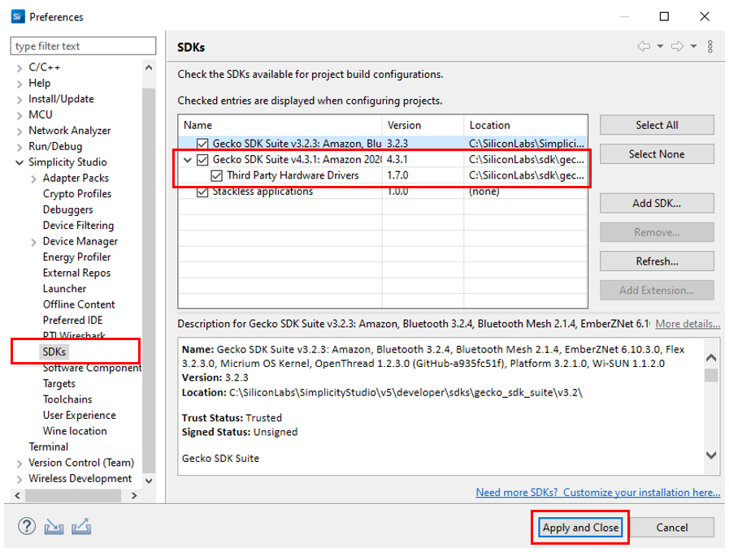

- SDK Extension must be enabled for the project to install components.

- Do not forget to flash a bootloader to your board, see [Bootloader](https://github.com/SiliconLabs/bluetooth_applications/blob/master/README.md#bootloader) for more information.

## How It Works ##

### Application Overview ###

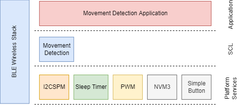

### GATT Configurator ###

The application is based on the Bluetooth - SoC Empty example. Since the example already has the Bluetooth GATT server, advertising, and connection mechanisms, only minor changes are required.

The GATT changes were adding a new custom service (Movement Detection) using UUID `134c8216-77a5-40c8-a640-bca22c27fc77` which are 4 characteristics:

- [Service] **Movement Detection** - `134c8216-77a5-40c8-a640-bca22c27fc77`
  - [Char] **Movement Threshold** - `4addc963-47f9-44cb-8c6c-f42390b7fc07`
    - [R] Get the movement threshold value
    - [W] Set the movement threshold value
  - [Char] **Wake-Up Time Period** - `a1740841-0136-4f40-9d82-ad0993d25c9c`
    - [R] Get the upper threshold value
    - [W] Set the lower threshold value
  - [Char] **Notification Time** - `0370cdec-eea4-40fd-975b-1a7fe3f0222d`
    - [R] Get the threshold mode
    - [W] Set the threshold mode
  - [Char] **Notification Break Time** - `75896182-8482-4626-9b2c-073afa537156`
    - [R] Get configured buzzer volume
    - [W] Set buzzer volume

Where R = Readable, W = Writeable with response.

### Movement Detection implementation ###

#### Initialization ####

The application initialization function is invoked from the *app_init()* function at startup. The initialization can be divided into phases as follows:

- Initialization Phase 1 - General

  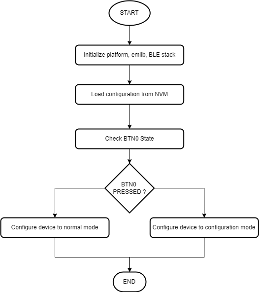

- Initialization Phase 2/A - Normal Mode

  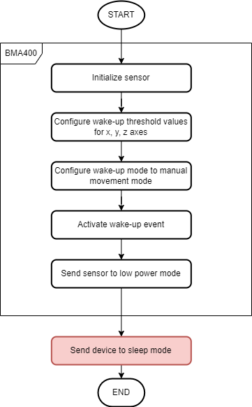

- Initialization Phase 2/B - Configuration Mode

  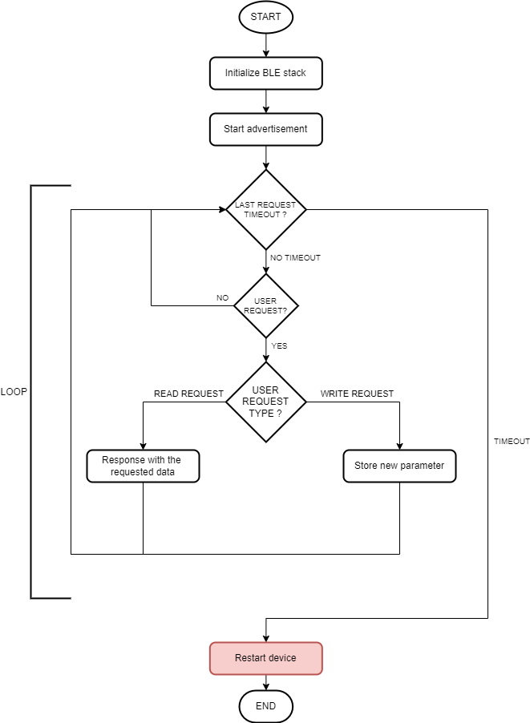

#### Application Logic ####

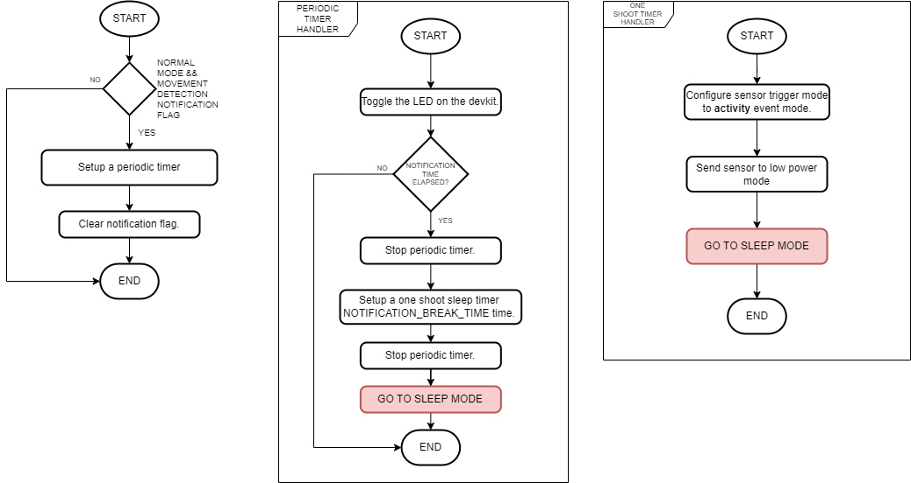

#### Movement Detection algorithm ####

In general, the device and the sensor are in sleep mode, when the accelerometer detects that the device is moving, it wakes up the host MCU triggering an external interrupt via a GPIO pin. Once awakened, the device activates its movement detection algorithm to monitor any further motion. If the detected movement surpasses a predefined threshold value, then the host MCU starts blinking the LED on the development board.

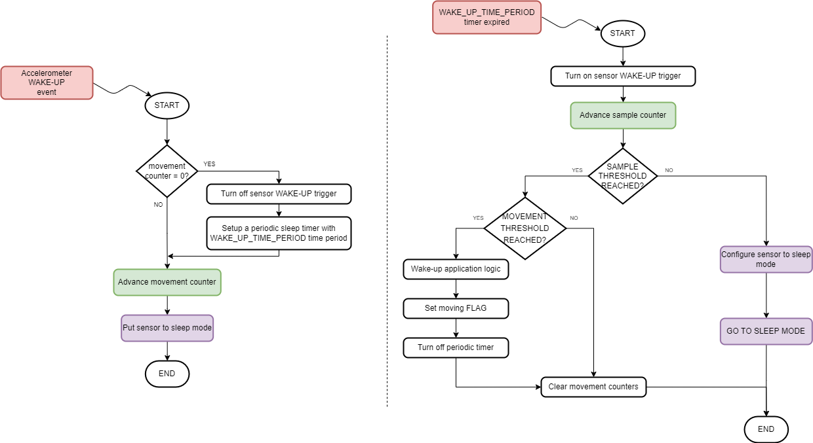

## Testing ##

Upon reset, the device starts in **Normal Mode**. In this state, the device runs the movement detection algorithm without Bluetooth. Try to move the device in some direction and check the logs on the terminal.

  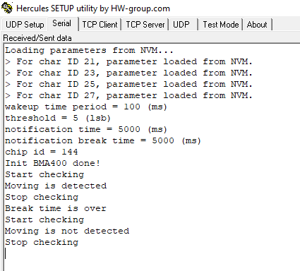

To switch to **Configuration Mode**, button PB0 should be pressed during startup (power-on or reset).

Follow the below steps to test the example with the EFR Connect app when the device is in **Configuration Mode**:

1. Open the EFR Connect app on your iOS/Android device.

2. Find your device in the Bluetooth Browser by scanning for it under the name **Movement Detection**, and tap on Connect button. After the connection is opened, enter the passkey (passkey default as **123456**) to confirm authentication for the pairing process for the first time. After that, wait for the connection to be established and the GATT database to be loaded.

   **Note**: The pairing process on Android and iOS devices is different. For more information, refer to [bluetooth security](https://github.com/SiliconLabs/bluetooth_stack_features/tree/master/security).

3. Find the unknown service at the below of the Device Information service.

4. Tap on the main service to see the available characteristics. Try to read, write, re-read the characteristics, and check the value. Values for the characteristics are handled by the application as ASCII strings. You should expect a similar output to the one below.

    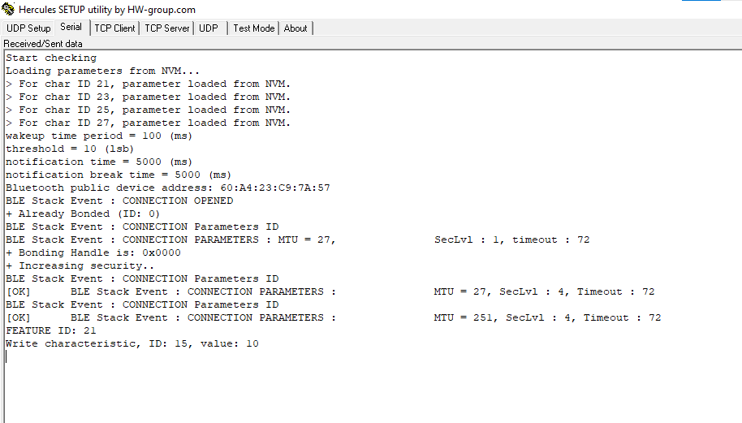
