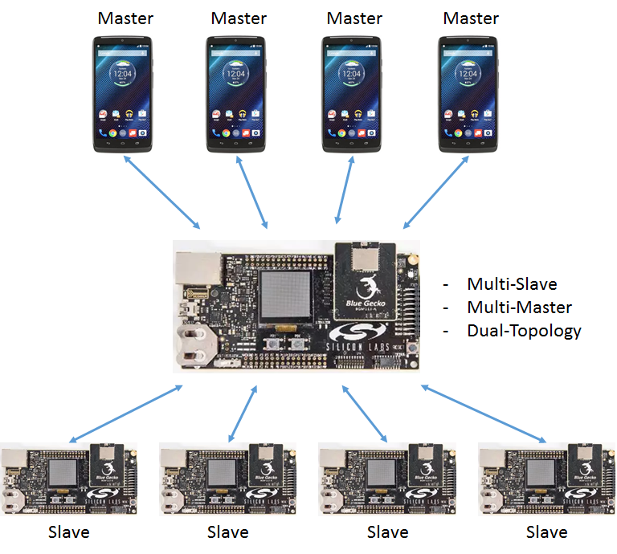
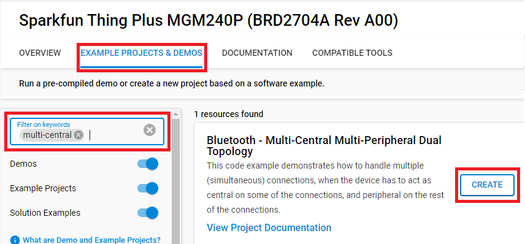
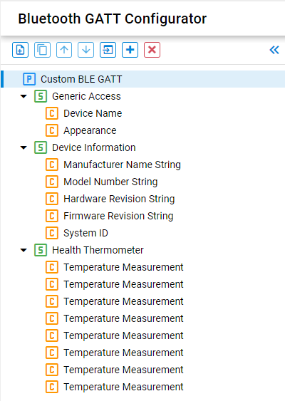
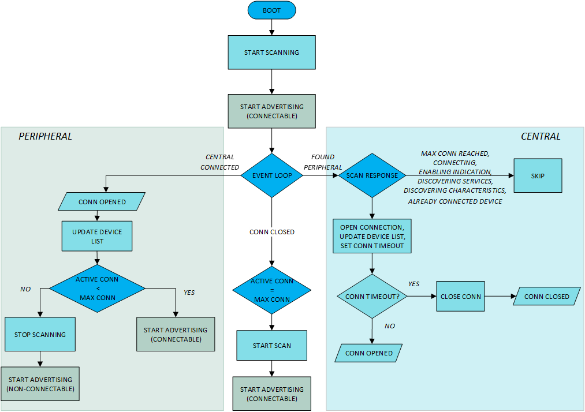
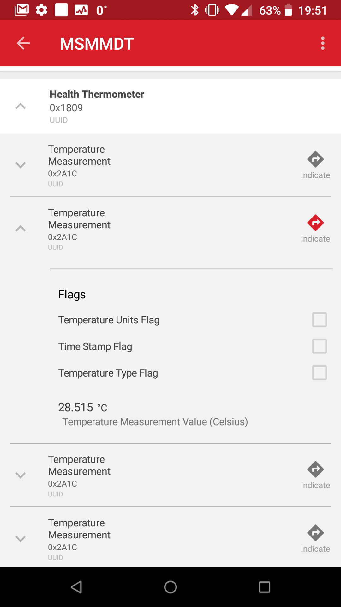

# Bluetooth - Multi-Central Multi-Peripheral Dual Topology #


## Overview ##

This code example demonstrates how to handle multiple (simultaneous) connections, when the device has to act as central on some of the connections, and peripheral on the rest of the connections.



## SDK version ##

- [SiSDK v2024.12.0](https://github.com/SiliconLabs/simplicity_sdk)

## Software Required ##

- [Simplicity Studio v5 IDE](https://www.silabs.com/developers/simplicity-studio)
- [Simplicity Connect Mobile App](https://www.silabs.com/developer-tools/simplicity-connect-mobile-app)

## Hardware Required ##

- 1x [Bluetooth Low Energy Development Kit](https://www.silabs.com/development-tools/wireless/bluetooth). For simplicity, Silicon Labs recommends the [BGM220-EK4314A](https://www.silabs.com/development-tools/wireless/bluetooth/bgm220-explorer-kit)
- 1x smartphone running the 'Simplicity Connect' mobile app

## Connections Required ##

- Connect the Bluetooth Development Kits to the PC through a compatible-cable. For example, a micro USB cable for the BGM220 Bluetooth Module Explorer Kit.

## Setup ##

To test this application, you can either create a project based on an example project or start with a "Bluetooth - SoC Empty" project based on your hardware.

**NOTE**:

- Make sure that the [bluetooth_applications](https://github.com/SiliconLabs/bluetooth_applications) repository is added to [Preferences > Simplicity Studio > External Repos](https://docs.silabs.com/simplicity-studio-5-users-guide/latest/ss-5-users-guide-about-the-launcher/welcome-and-device-tabs).

### Create a project based on an example project ###

1. From the Launcher Home, add your hardware to MyProducts, click on it, and click on the **EXAMPLE PROJECTS & DEMOS** tab. Find the example project filtering by "multi-central".

2. Click **Create** button on the **Bluetooth - Multi-Central Multi-Peripheral Dual Topology** example. Example project creation dialog pops up -> click Create and Finish and Project should be generated.


3. Build and flash this example to the board.

### Start with a "Bluetooth - SoC Empty" project ###

1. Create a **Bluetooth - SoC Empty** project for your hardware using Simplicity Studio 5.

2. Copy all attached files in the *inc* and *src* folders into the project root folder (overwriting existing).

3. Import the GATT configuration:

   - Open the .slcp file in the project.

   - Select the **CONFIGURATION TOOLS** tab and open the **Bluetooth GATT Configurator**.

   - Find the Import button and import the attached **config/btconf/gatt_configuration.btconf** file.

   - Save the GATT configuration (ctrl-s).

      

4. Open the .slcp file. Select the SOFTWARE COMPONENTS tab and install the software components:

   - [Bluetooth] → [Bluetooth LE Controller (Link Layer)] → [Connection] → Set "Max number of connections reserved for user" to 8

   - [Services] → [IO Stream] → [IO Stream: EUSART] → default instance name: vcom

   - [Application] → [Utility] → [Log]

## How It Works ##

The device discovers and connects to nearby devices implementing the Health Thermometer service and reads their temperature values. Meanwhile, the device is also advertising to make it possible for smartphones to connect to it, and read the aggregated data.



### Connecting to Peripherals (Device as a Central) ###

In this example, the device looks for other devices that
advertising the **Health Thermometer Service (UUID: 0x1809)** and it tries to connect to them if there is no another connection ongoing. During the device connecting (and discovering GATT services), new scan responses are blocked using state variables to handle one connection operation at a time (atomic). Even if it is still only connecting (no [sl_bt_evt_connection_opened](https://docs.silabs.com/bluetooth/3.1/group-sl-bt-evt-connection-opened) event yet), it is counted as a connection so that the number of connections would not exceed maximum.

If the number of maximum connections is reached, the scanning process is stopped and the advertisements are made **non-connectable** (the device name can still be seen but it cannot be connected anymore).

When the connection is initiated, a 10 second timeout timer is also initiated, in case the connection didn't go through successfully (e.g., peripheral device goes out of range). When the timer expires, it will cancel the connection operation by using [sl_bt_connection_close()](https://docs.silabs.com/bluetooth/3.1/group-sl-bt-connection#ga7f55470c777dd3c65617d9493ea595c7). This command, on its turn, will trigger the [sl_bt_evt_connection_closed](https://docs.silabs.com/bluetooth/3.1/group-sl-bt-evt-connection-closed) event. In the connection closed event handler, scanning and connectable advertising are restarted again if required.

### Connecting to Central (Device as a Peripheral) ###

As central connections are created and [sl_bt_evt_connection_opened](https://docs.silabs.com/bluetooth/3.1/group-sl-bt-evt-connection-opened) event triggered, the number of connections needs to be checked to see if the **maximum number of supported connections** is reached. If it has not been reached, resume advertising (setting back as **general discoverable and connectable scannable**) because that is automatically stopped when a central connects. Scanning is **not affected** due to connections and continues uninterruptedly. If **MAX_CONNECTIONS** is reached, the device must advertise as **non-connectable**.

### Disconnections ###

If a disconnection occurs ([sl_bt_evt_connection_closed](https://docs.silabs.com/bluetooth/3.1/group-sl-bt-evt-connection-closed) event), the remaining number of connections is checked to see if it is *maximum - 1,* in which case scanning and advertising can be resumed to allow a new connection to form.

### Data Gathering ###

If the device role on a newly opened connection is 'central', the device is connected to a thermometer peripheral device, from which temperature values will be read out. To get temperature values:

1. The Health Thermometer service has to be discovered.
2. The Temperature Measurement characteristic has to be discovered.
3. Indications on the Temperature Measurement characteristic has to be enabled.

Therefore, the example applications go through these steps. After indications are enabled, the new temperature values provided by the thermometers will trigger a [sl_bt_evt_gatt_characteristic_value](https://docs.silabs.com/bluetooth/3.1/group-sl-bt-evt-gatt-characteristic-value) event. In this event handler the central device will forward the indicated value to all those central devices that have subscribed to indications. To differentiate between values received from different thermometers, the central device implements multiple Temperature Measurement characteristics in one Health Thermometer service.

### Testing ###

Open the console window on SimplictyStudio, you will see the output similar as below.

```c
*** MULTIPLE CENTRAL MULTIPLE PERIPHERAL DUAL TOPOLOGY EXAMPLE ***

Stack version: v5.0.0-b108
Local BT public device address: 68:0A:E2:28:89:12
Connecting ...
Connection timeout is cleared.

NEW CONNECTION ESTABLISHED
Device ID .................: 84:2E:14:31:BC:48
Role ......................: PERIPHERAL
Handle ....................: 1
Number of connected devices: 1
Available connections .....: 7

--------------- LIST of CONNECTED DEVICES ----------------
==========================================================
ADDRESS            ROLE          HANDLE        STATE
==========================================================
84:2E:14:31:BC:48  PERIPHERAL    1             CONNECTED

Connecting ...
Connection timeout is cleared.

NEW CONNECTION ESTABLISHED
Device ID .................: 60:A4:23:C9:88:E9
Role ......................: PERIPHERAL
Handle ....................: 2
Number of connected devices: 2
Available connections .....: 6

--------------- LIST of CONNECTED DEVICES ----------------
==========================================================
ADDRESS            ROLE          HANDLE        STATE
==========================================================
84:2E:14:31:BC:48  PERIPHERAL    1             CONNECTED
60:A4:23:C9:88:E9  PERIPHERAL    2             CONNECTED

Connecting ...

NEW CONNECTION ESTABLISHED
Device ID .................: 4D:D3:37:46:B8:4E
Role ......................: CENTRAL
Handle ....................: 3
Number of connected devices: 3
Available connections .....: 5

--------------- LIST of CONNECTED DEVICES ----------------
==========================================================
ADDRESS            ROLE          HANDLE        STATE
==========================================================
84:2E:14:31:BC:48  PERIPHERAL    1             CONNECTED
60:A4:23:C9:88:E9  PERIPHERAL    2             CONNECTED
4D:D3:37:46:B8:4E  CENTRAL       3             CONNECTED

Connecting ...
Connection timeout is cleared.

NEW CONNECTION ESTABLISHED
Device ID .................: 00:0B:57:17:62:30
Role ......................: PERIPHERAL
Handle ....................: 4
Number of connected devices: 4
Available connections .....: 4

--------------- LIST of CONNECTED DEVICES ----------------
==========================================================
ADDRESS            ROLE          HANDLE        STATE
==========================================================
84:2E:14:31:BC:48  PERIPHERAL    1             CONNECTED
60:A4:23:C9:88:E9  PERIPHERAL    2             CONNECTED
4D:D3:37:46:B8:4E  CENTRAL       3             CONNECTED
00:0B:57:17:62:30  PERIPHERAL    4             CONNECTED

Connecting ...

NEW CONNECTION ESTABLISHED
Device ID .................: 52:98:A4:D7:64:1C
Role ......................: CENTRAL
Handle ....................: 5
Number of connected devices: 5
Available connections .....: 3

--------------- LIST of CONNECTED DEVICES ----------------
==========================================================
ADDRESS            ROLE          HANDLE        STATE
==========================================================
84:2E:14:31:BC:48  PERIPHERAL    1             CONNECTED
60:A4:23:C9:88:E9  PERIPHERAL    2             CONNECTED
4D:D3:37:46:B8:4E  CENTRAL       3             CONNECTED
00:0B:57:17:62:30  PERIPHERAL    4             CONNECTED
52:98:A4:D7:64:1C  CENTRAL       5             CONNECTED
```

To see the gathered temperature values, perform the following steps:

1. Open the Simplicity Connect app on your smartphone and allow the permission requested the first time it is opened.
2. Find your device in the Bluetooth Browser, advertising as *MCMPDT*, and tap Connect.
3. Find and open the Health Thermometer service.
4. Open the first Temperature Measurement characteristic and enable indications on it (by tapping the indications icon). Now, the new value should be displayed received from the first thermometer.
5. Do the same for the second Temperature Measurement characteristic.

   
