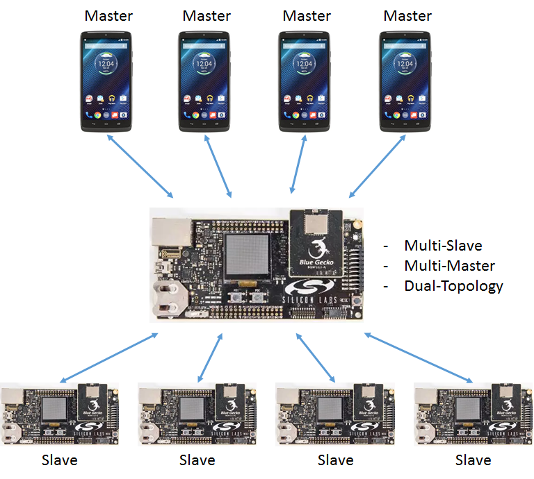
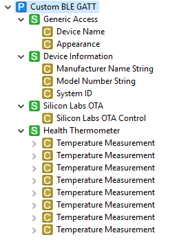
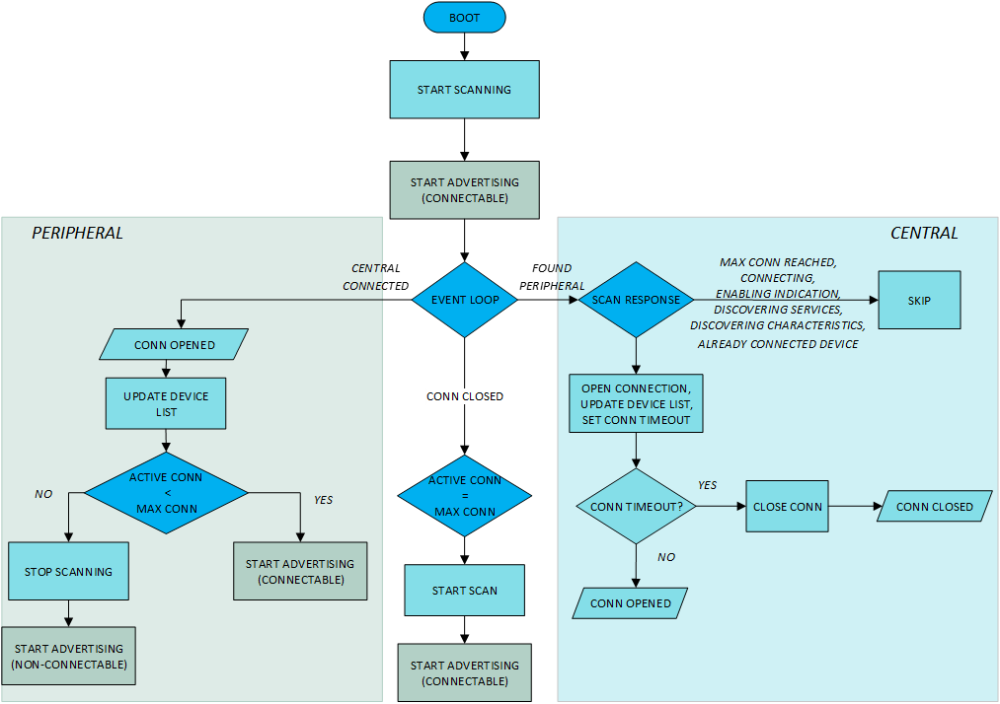
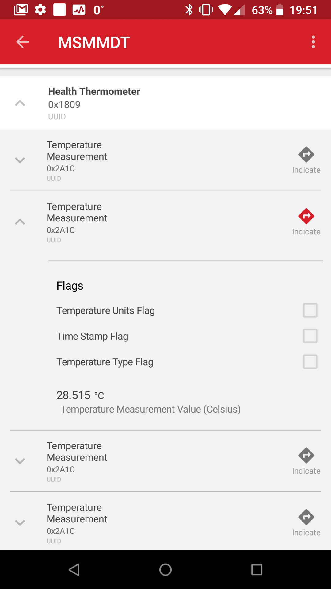

<!--Author: Tiago Monte -->

# Multi-Slave Multi-Master Dual-Topology Example


## Background

This code example has related User's Guides:

* [Multi-Peripheral Topology](~/general/connections/multislave-topology)
* [Multi-Central Topology](~/general/connections/multimaster-topology)
* [Dual Topology](~/general/connections/dualtopology)


## Description

This code example demonstrates how to handle multiple (simultaneous) connections, when the device has to act as central on some of the connections, and peripheral on the rest of the connections.



A typical use case may be when data is gathered from multiple peripheral devices, and then the aggregated data is provided to a central device, e.g., to a smartphone. Therefore, this example implements the functionality of gathering temperature values from different thermometers, and providing them toward a smartphone in one GATT service.



The device discovers and connects to nearby devices implementing the Health Thermometer service and reads their temperature values. Meanwhile, the device is also advertising to make it possible for smartphones to connect to it, and read the aggregated data.



### Connecting to Peripherals (Device as a Central)

In the [scanner_scan_report](https://docs.silabs.com/bluetooth/latest/group-sl-bt-evt-scanner-scan-report) event, this example is looking for devices advertising the Health Thermometer Service (UUID: 0x1809) and it is trying to connect to them if there is no another connection ongoing. During the device connecting (and discovering GATT services), new scan responses are blocked using state variables to handle one connection operation at a time (atomic). Even if it is still only connecting (no [connection_opened](https://docs.silabs.com/bluetooth/3.1/group-sl-bt-evt-connection-opened) event yet), it is counted as a connection so that the number of connections would not exceed maximum.

If the number of maximum connections is reached, the scanning is stopped and the advertisements are made **non-connectable** (the device name can still be seen but it cannot be connected anymore).

When the connection is initiated, a 10 second timeout timer is also initiated, in case the connection didn't go through successfully (e.g., peripheral device goes out of range). When the timer expires, it will cancel the connection operation by using [sl_bt_connection_close()](https://docs.silabs.com/bluetooth/3.1/group-sl-bt-connection#ga7f55470c777dd3c65617d9493ea595c7). This command, on its turn, will trigger the [connection_closed](https://docs.silabs.com/bluetooth/3.1/group-sl-bt-evt-connection-closed) event. In the connection closed event handler, scanning and connectable advertising are restarted again if required.

### Connecting to Central (Device as a Peripheral)

As central connections are created and [connection_opened](https://docs.silabs.com/bluetooth/3.1/group-sl-bt-evt-connection-opened) event triggered, the number of connections needs to be checked to see if the **maximum number of supported connections** is reached. If it has not been reached, resume advertising (setting back as **general discoverable and connectable scannable**) because that is automatically stopped when a central connects. Scanning is **not affected** due to connections and continues uninterruptedly. If **MAX_CONNECTIONS** is reached, the device must advertise as **non-connectable**.

### Disconnections

If a disconnection occurs ([connection_closed](https://docs.silabs.com/bluetooth/3.1/group-sl-bt-evt-connection-closed) event), the remaining number of connections is checked to see if it is *maximum - 1,* in which case scanning and advertising can be resumed to allow a new connection to form.

### Data Gathering

If the device role on a newly opened connection is 'central', the device is connected to a thermometer peripheral device, from which temperature values will be read out. To get temperature values:

1. The Health Thermometer service has to be discovered.
2. The Temperature Measurement characteristic has to be discovered.
3. Indications on the Temperature Measurement characteristic has to be enabled.

Therefore, the example applications goes through these steps. After indications are enabled, the new temperature values provided by the thermometers will trigger a [gatt_characteristic_value](https://docs.silabs.com/bluetooth/3.1/group-sl-bt-evt-gatt-characteristic-value) event. In this event handler the central device will forward the indicated value to all those central devices that have subscribed to indications. To differentiate between values received from different thermometers, the central device implements multiple Temperature Measurement characteristics in one Health Thermometer service.


## Setting up

To try this example, you need multiple radio boards, one for the central device (data aggregator) and one or more for the peripherals (thermometers).

### Central Device

1. Create a new *SoC-Empty* project for your device.

2. Copy the attached *app.c* file into your project overwriting the existing one.

3. Enable debug prints
   1.   Open the Project Configurator

   2. Find the **IO Stream: USART** component (Services > IO Stream > IO Stream: USART), and install it

   3. Find the **Log** component (Bluetooth > Utility > Log), and install it

   4. Navigate to the  **Platform** > **Board** > **Board Control**  software component, open its configurator and **Enable Virtual COM UART**

4. Open the GATT Configurator, import the attached *gatt_configuration.btconf* file with the import button, and save it.

6. Build and flash the project to your device.

### Peripherals

1. Create a new *SoC-Thermometer* project for your device.

2. Build and flash your project to your device.


## Usage

The code example prints out debug information over the WSTK VCOM @ 115200 baud. As you start connecting to slave and master devices, you should see a debug log as depicted below.

Log file from the terminal application:

```
*** MULTIPLE CENTRAL MULTIPLE PERIPHERAL DUAL TOPOLOGY EXAMPLE ***

Stack version: v3.1.2-b256
Local BT public device address: 68:0A:E2:28:89:12
Connecting ...
Connection timeout is cleared.

NEW CONNECTION ESTABLISHED
Device ID .................: 84:2E:14:31:BC:48
Role ......................: PERIPHERAL
Handle ....................: 1
Number of connected devices: 1
Available connections .....: 7

--------------- LIST of CONNECTED DEVICES ----------------
==========================================================
ADDRESS            ROLE          HANDLE        STATE
==========================================================
84:2E:14:31:BC:48  PERIPHERAL    1             CONNECTED

Connecting ...
Connection timeout is cleared.

NEW CONNECTION ESTABLISHED
Device ID .................: 60:A4:23:C9:88:E9
Role ......................: PERIPHERAL
Handle ....................: 2
Number of connected devices: 2
Available connections .....: 6

--------------- LIST of CONNECTED DEVICES ----------------
==========================================================
ADDRESS            ROLE          HANDLE        STATE
==========================================================
84:2E:14:31:BC:48  PERIPHERAL    1             CONNECTED
60:A4:23:C9:88:E9  PERIPHERAL    2             CONNECTED

Connecting ...

NEW CONNECTION ESTABLISHED
Device ID .................: 4D:D3:37:46:B8:4E
Role ......................: CENTRAL
Handle ....................: 3
Number of connected devices: 3
Available connections .....: 5

--------------- LIST of CONNECTED DEVICES ----------------
==========================================================
ADDRESS            ROLE          HANDLE        STATE
==========================================================
84:2E:14:31:BC:48  PERIPHERAL    1             CONNECTED
60:A4:23:C9:88:E9  PERIPHERAL    2             CONNECTED
4D:D3:37:46:B8:4E  CENTRAL       3             CONNECTED

Connecting ...
Connection timeout is cleared.

NEW CONNECTION ESTABLISHED
Device ID .................: 00:0B:57:17:62:30
Role ......................: PERIPHERAL
Handle ....................: 4
Number of connected devices: 4
Available connections .....: 4

--------------- LIST of CONNECTED DEVICES ----------------
==========================================================
ADDRESS            ROLE          HANDLE        STATE
==========================================================
84:2E:14:31:BC:48  PERIPHERAL    1             CONNECTED
60:A4:23:C9:88:E9  PERIPHERAL    2             CONNECTED
4D:D3:37:46:B8:4E  CENTRAL       3             CONNECTED
00:0B:57:17:62:30  PERIPHERAL    4             CONNECTED

Connecting ...

NEW CONNECTION ESTABLISHED
Device ID .................: 52:98:A4:D7:64:1C
Role ......................: CENTRAL
Handle ....................: 5
Number of connected devices: 5
Available connections .....: 3

--------------- LIST of CONNECTED DEVICES ----------------
==========================================================
ADDRESS            ROLE          HANDLE        STATE
==========================================================
84:2E:14:31:BC:48  PERIPHERAL    1             CONNECTED
60:A4:23:C9:88:E9  PERIPHERAL    2             CONNECTED
4D:D3:37:46:B8:4E  CENTRAL       3             CONNECTED
00:0B:57:17:62:30  PERIPHERAL    4             CONNECTED
52:98:A4:D7:64:1C  CENTRAL       5             CONNECTED
```

To see the gathered temperature values, perform the following steps:

1. Open the EFR Connect app on your mobile phone.
2. In the Bluetooth Browser, find the device with the name MPMCDT, and connect to it.
3. Find and open the Health Thermometer service.
4. Open the first Temperature Measurement characteristic and enable indications on it (by tapping the indications icon). Now, the new value should be displayed received from the first thermometer.
5. Do the same for the second Temperature Measurement characteristic.




## Source

* [app.c](src/app.c)
* [gatt_configuration.btconf](src/gatt_configuration.btconf)
