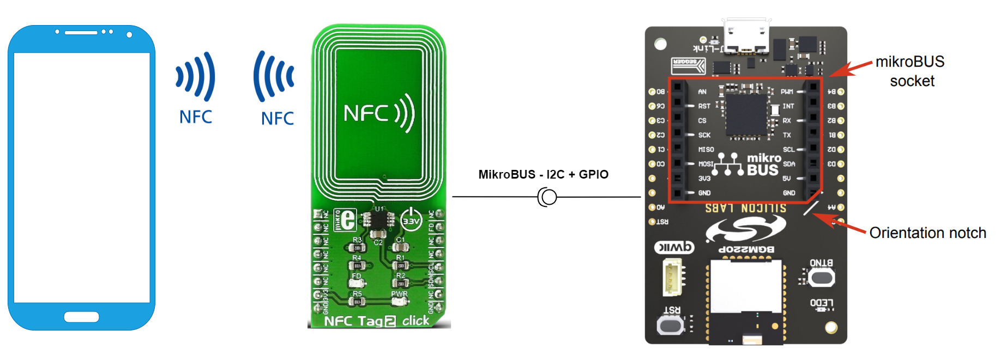
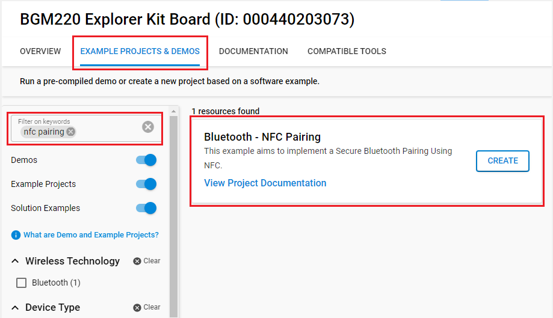
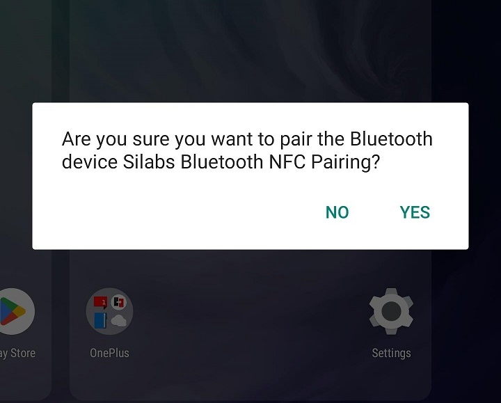
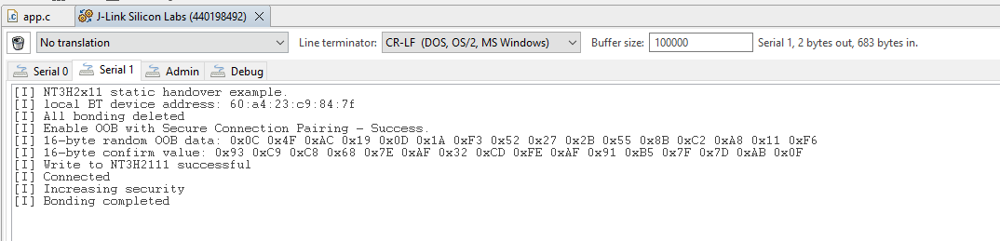

# Bluetooth - NFC Pairing ##

## Description ##

OOB (Out-Of-Band) pairing means that the two devices to be paired exchange the pairing information on a medium other than Bluetooth, which is out-of-band.

Near Field Communication (NFC) can be used to share the data needed for OOB pairing, and thus provides a convenient and secure means of establishing Bluetooth connections. Indeed, the short communication range of NFC contributes to both security and selectivity. Remote attacks are not possible when the unauthorized party needs to be physically present within a few centimeters of the equipment, tapping allows the user to be sure that only the device to be connected has received the key.

This example aims to implement a Secure Bluetooth Pairing Using NFC with an NT3H2111.

## SDK version ##

- [SiSDK v2024.12.0](https://github.com/SiliconLabs/simplicity_sdk)
- [Third Party Hardware Drivers v4.1.0](https://github.com/SiliconLabs/third_party_hw_drivers_extension)

## Hardware Required ##

- 1x [Bluetooth Low Energy Explorer Kit](https://www.silabs.com/development-tools/wireless/bluetooth). For simplicity, Silicon Labs recommends the [BGM220-EK4314A](https://www.silabs.com/development-tools/wireless/bluetooth/bgm220-explorer-kit)
- 1x [NFC Tag 2 Click](https://www.mikroe.com/nfc-tag-2-click)
- 1x NFC-supported smartphone

## Connections Required ##

Attach the NFC Tag 2 Click board to the Explorer kit. Make sure that the 45-degree corner of the NFC board matches the 45-degree white line of the Silicon Labs Explorer kit.

## Setup ##

To test this application, you can either create a project based on an example project or start with a "Bluetooth - SoC Empty" project based on your hardware.

**NOTE**:

- Make sure that the [Third Party Hardware Drivers extension](https://github.com/SiliconLabs/third_party_hw_drivers_extension) is installed as part of the SiSDK and the [bluetooth_applications](https://github.com/SiliconLabs/bluetooth_applications) repository is added to [Preferences > Simplicity Studio > External Repos](https://docs.silabs.com/simplicity-studio-5-users-guide/latest/ss-5-users-guide-about-the-launcher/welcome-and-device-tabs).

- SDK Extension must be enabled for the project to install the required components.

### Create a project based on an example project ###

1. From the Launcher Home, add your hardware to My Products, click on it, and click on the **EXAMPLE PROJECTS & DEMOS** tab. Find the example project filtering by "nfc".

2. Click **Create** button on the **Bluetooth - NFC Pairing** example. Example project creation dialog pops up -> click Create and Finish and Project should be generated.

3. Build and flash this example to the board.

### Start with a "Bluetooth - SoC Empty" project ###

1. Create a **Bluetooth - SoC Empty** project for your hardware using Simplicity Studio 5.

2. Copy all attached files in *inc* and *src* folders into the project root folder (overwriting existing).

3. Open the .slcp file. Select the SOFTWARE COMPONENTS tab and install the software components:

    - [Services] → [IO Stream] → [IO Stream: USART] → default instance name: vcom
    - [Application] → [Utility] → [Log]
    - [Third Party Hardware Drivers] → [Wireless Connectivity] → [NT3H2111 - NFC Tag 2 Click (Mikroe) - I2C] → use default configuration
    - [Third Party Hardware Drivers] → [Services] → [NFC] → [NFC - Common]
    - [Third Party Hardware Drivers] → [Services] → [NFC] → [NFC - NDEF]
    - [Third Party Hardware Drivers] → [Services] → [NFC] → [NFC - Tag]

4. Build and flash the project to your device.

**Note:**

- A bootloader needs to be flashed to your board if the project starts from the "Bluetooth - SoC Empty" project, see [Bootloader](https://github.com/SiliconLabs/bluetooth_applications/blob/master/README.md#bootloader) for more information.

## How It Works ##

After flashing the project to your device, use an NFC reader capable Bluetooth LE device to read the tag content to establish the OOB pairing. Android phones often support system-level NFC pairing (no app required). Try to move the phone closer to the NFC Tag 2 click. After detecting and matching a tag, the phone shows a notification as picture below.

Tap YES to pair with the device, then you will get a "Device connected" or "Pairing complete" notification. You can open the Bluetooth Setting app on your phone and check Connected devices.

Use a serial terminal to monitor the Bluetooth events to make sure connection/bonding works as expected. You should expect a similar output to the one below.

