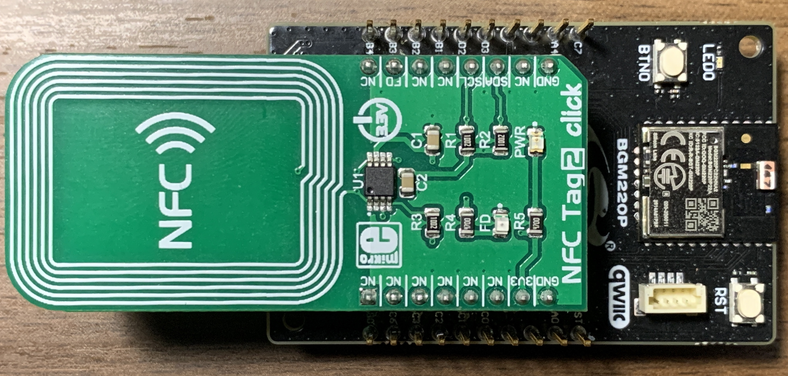
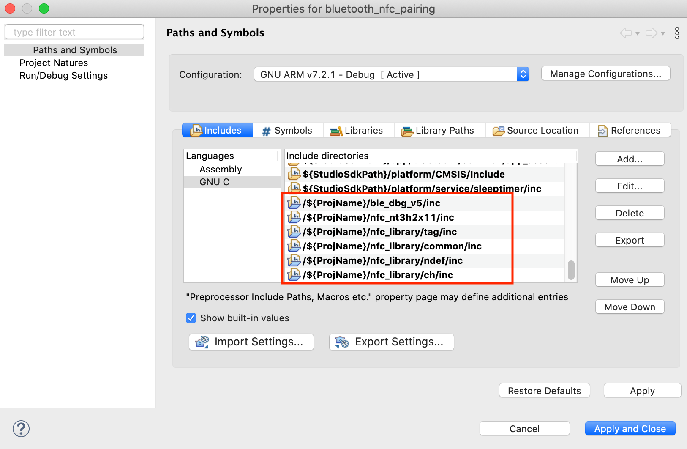

<table border="0">
  <tr>
    <td align="left" valign="middle">
    <h1>NFC Application Examples</h1>
  </td>
  <td align="left" valign="middle">
    <a href="https://www.silabs.com/products/wireless">
      
    </a>
  </td>
  </tr>
</table>

# Bluetooth NFC Pairing with NT3H2x11
This project demonstrates Bluetooth LE static handover with a NT3H2x11.

> NT3H2x11 stands for NT3H2111 and NT3H2211.


## How it works
After loading this project onto silabs devices, use a NFC reader capable Bluetooth LE device to read the tag content to establish the OOB pairing. Android phones often support system level NFC pairing (no app required) but this varies from phone to phone. Use a serial terminal to monitor the bluetooth events to make sure connection/bonding works as expected. To enable/disable secure connection set the following macro in [app.c](src/app.c) accordingly.

```
  #define SECURE_CONNECTION           ENABLED
```

## Hardware Setup
You need one WSTK board, a NT3H2x11 board and another Bluetooth LE device that has NFC reader capability for bluetooth pairing such as an android smart phone. iPhone would not work here.

## SDK Needed
Bluetooth SDK 3.x

### NT3H2x11 boards

[Mikroe NFC TAG 2 CLICK](https://www.mikroe.com/nfc-tag-2-click)




## Supported Silicon Labs Boards

### xG12
BRD4103A, BRD4161A, BRD4162A, BRD4163A, BRD4164A, BRD4166A, BRD4170A, BRD4172A, BRD4172B, BRD4173A, BRD4304A

### xG13
BRD4104A, BRD4158A, BRD4159A, BRD4165B, BRD4167A BRD4168A, BRD4174A, BRD4174B, BRD4175A, BRD4305A, BRD4305C, BRD4305D, BRD4305E, BRD4306A, BRD4306B, BRD4306C, BRD4306D

### xG21
BRD4180A, BRD4180B, BRD4181A, BRD4181B, BRD4181C, BRD4308A, BRD4308B, BRD4309B

### xG22
BRD4182A, BRD4183A, BRD4184A, BRD4310A, BRD4311A, BRD4314A


### Default Pinout

The following table covers most of the boards.

| NT3H2x11 Pin | WSTK EXP Pin | Note |
| :-----: | :-----: | :----- |
| GND | EXP 1 | |
| SCL | EXP 15| defined in [app.c](src/app.c) |
| SDA | EXP 16| defined in [app.c](src/app.c) |
| VCC | EXP 20| |

In the case EXP 15 and EXP 16 are not connected, EXP 8 and EXP 10 are used for I2C. This applies to all xG21 devices.

| NT3H2x11 Pin | WSTK EXP Pin | Note |
| :-----: | :-----: | :----- |
| GND | EXP 1 | |
| SDA | EXP 8 | defined in [app.c](src/app.c) |
| SCL | EXP 10| defined in [app.c](src/app.c) |
| VCC | EXP 20| |

As for BRD4309B and BRD4183A whose GPIO pins are quite limited, VCOM pins are utilized for I2C (VCOM will not be available).

| NT3H2x11 Pin | WSTK EXP Pin | Note |
| :-----: | :-----: | :----- |
| GND | EXP 1 | |
| SDA | EXP 12| defined in [app.c](src/app.c) |
| SCL | EXP 14| defined in [app.c](src/app.c) |
| VCC | EXP 20| |

If the board you are trying to use is not listed above, you can add to the top board pinout macros in [app.c](src/app.c#L186) accordingly to add support.

## Project Hierarchy
```
 -------------------------
|       Application       |
|-------------------------|
|          BTSSP          |
|-------------------------|
|           NDEF          |
|-------------------------|
| Tag (T2T TLV Container) |
|-------------------------|
|     NT3H2x11 Driver     |
|-------------------------|
|          emlib          |
 -------------------------
```

| Layer | Source Files | Docs |
| :----- | :----- | :----- |
| Application | [app.c](src/app.c) for studio 5 | - |
| BTSSP | [bluetooth_handover.c](../../nfc_library/ch/src/bluetooth_handover.c) | [ad_btssp_v1.2.pdf](https://nfc-forum.org/wp-content/uploads/2019/06/NFCForum-AD-BTSSP-1.2.pdf) |
| NDEF | [ndef_record.c](../../nfc_library/ndef/src/ndef_record.c), [ndef_message.c](../../nfc_library/ndef/src/ndef_message.c) | [NDEF specification](https://nfc-forum.org/product/nfc-data-exchange-format-ndef-technical-specification/) |
| Tag | [tlv.c](../../nfc_library/common/src/tlv.c) | [T2T specification](https://nfc-forum.org/product/nfc-forum-type-2-tag-specification-version-1-0/) |
| NT3H2x11 Driver | [nt3h2x11.c](https://github.com/SiliconLabs/platform_hardware_drivers/blob/master/nfc_nt3h2x11/src/nt3h2x11.c), [nt3h2x11_i2c.c](https://github.com/SiliconLabs/platform_hardware_drivers/blob/master/nfc_nt3h2x11/src/nt3h2x11_i2c.c) | [NT3H2111_2211.pdf](https://www.nxp.com/docs/en/data-sheet/NT3H2111_2211.pdf) |
| emlib | Silabs SDK | - |


## Import Instructions

See [import guide](../doc/import_guide.md).

### Needed Include Paths
```
/${ProjName}/nfc_nt3h2x11/inc
/${ProjName}/nfc_library/tag/inc
/${ProjName}/nfc_library/ndef/inc
/${ProjName}/nfc_library/ch/inc
/${ProjName}/nfc_library/common/inc
/${ProjName}/ble_dbg/inc
```
