# Bluetooth - Operation Time Measurement (BMA400) #

## Overview ##

This project exemplifies how to develop an application, which uses the Silabs EFR32xG24 Explorer Kit and Mikroe ACCEL 5 CLICK board and Adafruit IS31FL3741 components to monitor the operation time of machineries and display the information graphically. The application will use BLE for wireless communication between the devices.

**Sensor Device:**
The sensor device is a Silabs Explorer Kit, which is connected to a MikroE ACCEL 5 CLICK sensor board. This device periodically measures the operation time level and advertises the processed time value to the client devices.

The advertisement package contains a measurement counter value and the processed operation time in second.

**Client Device:**
The client device is a Silabs Explorer Kit, which is connected to an Adafruit IS31FL3741 RGB LED Matrix Display.

This device provides two operational modes.

If the BTN0 is pressed during the initialization sequence, then the application boots into the configuration mode. In this operational mode, the device sends normal advertisement packages and is connectable to other BLE devices. Users can connect to the client via the EFR Connect mobile application. This mode provides BLE characteristics to configure the operation time threshold.

If the BTN0 is released during the initialization phase, the application starts scanning the BLE network. The application periodically scans the BLE network looking for a sensor device. The client device subscribes to the operation time characteristic to get notifications about changes in the measured operation time.

## Gecko SDK Suite version

- GSDK v4.2.2
- [Third Party Hardware Drivers v1.3.0](https://github.com/SiliconLabs/third_party_hw_drivers_extension)

## Hardware Required

**Silabs Development Kits**

- [EFR32xG24 Explorer Kit - XG24-EK2703A](https://www.silabs.com/development-tools/wireless/efr32xg24-explorer-kit?tab=overview)

- [BG22 Bluetooth SoC Explorer Kit - BG22-EK4108A](https://www.silabs.com/development-tools/wireless/bluetooth/bg22-explorer-kit?tab=overview)

- [BGM220 Bluetooth Module Explorer Kit - BGM220-EK4314A](https://www.silabs.com/development-tools/wireless/bluetooth/bgm220-explorer-kit?tab=overview)

**External Hardware**

- [Adafruit IS31FL3741 13x9 PWM RGB LED Matrix Driver - STEMMA QT / Qwiic](https://www.adafruit.com/product/5201)

- [ACCEL 5 CLICK](https://www.mikroe.com/accel-5-click)

**NOTE:**
Tested boards for working with this example:

| Board ID | Description  |
| ---------------------- | ------ |
| BRD2703A | [EFR32xG24 Explorer Kit - XG24-EK2703A](https://www.silabs.com/development-tools/wireless/efr32xg24-explorer-kit?tab=overview)    |
| BRD4108A | [BG22 Bluetooth SoC Explorer Kit - BG22-EK4108A](https://www.silabs.com/development-tools/wireless/bluetooth/bg22-explorer-kit?tab=overview) |
| BRD4314A | [BGM220 Bluetooth Module Explorer Kit - BGM220-EK4314A](https://www.silabs.com/development-tools/wireless/bluetooth/bgm220-explorer-kit?tab=overview)   |

## Connections Required

The hardware connection is shown in the image below:

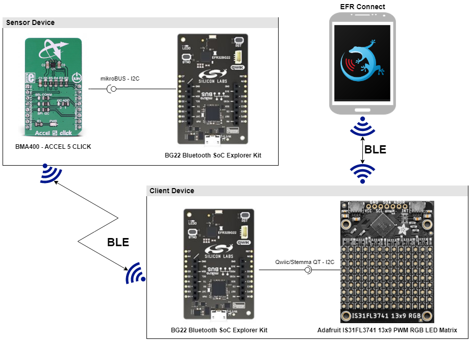

**Sensor:**

The ACCEL 5 CLICK board can be easily connected to the EFR32xG24 Explorer Kit via a mikroBUS

**Client:**

Adafruit IS31FL3741 13x9 PWM RGB LED Matrix board can be easily connected to the EFR32xG24 Explorer Kit by using a Qwiic cable. 

## Setup

To test this application, you can either create a project based on an example project or start with a "Bluetooth - SoC Empty" project based on your hardware.

### Create a project based on an example project

1. From the Launcher Home, add your hardware to My Products, click on it, and click on the **EXAMPLE PROJECTS & DEMOS** tab. Find the example project with the filter "bma400".

2. Click **Create** button on both **Bluetooth - Operation Time Measurement (BMA400) - Client** and **Bluetooth - Operation Time Measurement (BMA400) - Sensor** examples. Example project creation dialog pops up -> click Create and Finish and Project should be generated.

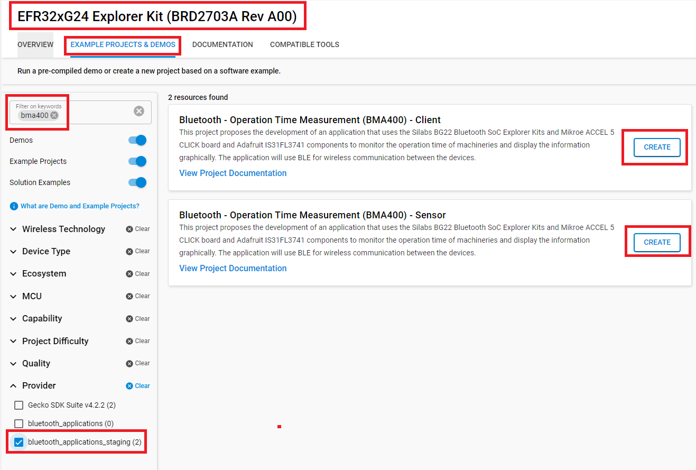

3. Build and flash this example to the board.

### Start with a "Bluetooth - SoC Empty" project

1. Create a **Bluetooth - SoC Empty** project for your hardware using Simplicity Studio 5.

2. copy all the .h and .c files to the following directory of the project root folder (overwriting existing file).

    - With **sensor** device: [bluetooth_operation_time_measurement_sensor](bluetooth_operation_time_measurement_sensor)

    - With **client** device: [bluetooth_operation_time_measurement_client](bluetooth_operation_time_measurement_client)

3. Install the software components:

    - Open the .slcp file in the project.

    - Select the SOFTWARE COMPONENTS tab.

    - Install the following components for **sensor** device:

        - [Application] → [Service] → [Simple timer]
        - [Bluetooth] → [NVM] → NVM Support
        - [Services] →  [NVM3] → NVM3 Core
        - [Services] →  [NVM3] → NVM3 Default Instance
        - [Platform] → [Driver] → [Button] → [Simple Button] → default instance name: btn0
        - [Services] → [IO Stream] → [IO Stream: USART] → default instance name: vcom
        - [Application] → [Utility] → [Log]
        - [Platform] →  [Driver]→ [I2C] →  [I2CSPM] → default instance name: mikroe
        - [Third Party Hardware Drivers] → [Sensors] → [MQ7 - ACCEL 5 CLICK (Mikroe)]

    - Install the following components for **client** device:
        - [Application] → [Service] → [Simple timer]
        - [Bluetooth] → [NVM] → NVM Support 
        - [Services] →  [NVM3] → NVM3 Core
        - [Services] →  [NVM3] → NVM3 Default Instance
        - [Services] → [IO Stream] → [IO Stream: USART] → default instance name: vcom
        - [Application] → [Utility] → [Log]
        - [Platform] → [Driver] → [Button] → [Simple Button] → default instance name: btn0
        - [Platform] → [Driver] → [I2C] → [I2CSPM] → default instance name: qwiic
        - [Third Party Hardware Drivers] → [Display & LED] → IS31FL3741 - 13x9 PWM RGB LED Matrix (Adafruit) - I2C

        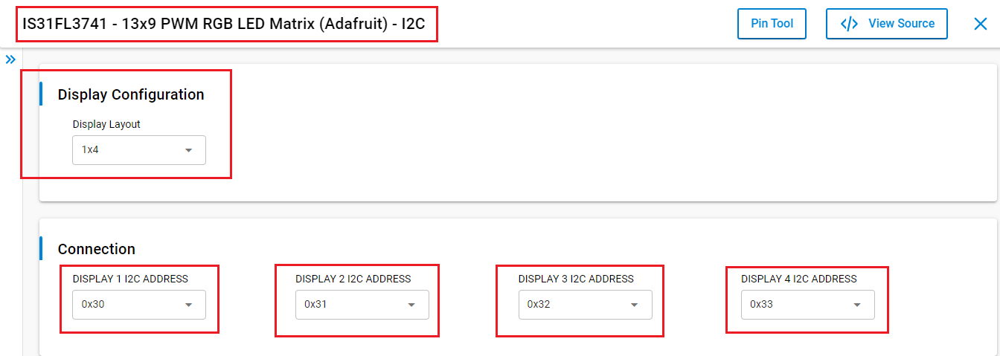

        - [Third Party Hardware Drivers] → [Services] → [GLIB - OLED Graphics Library]

4. Import the GATT configuration:

    - Open the .slcp file in the project again.
    - Select the CONFIGURATION TOOLS tab and open the "Bluetooth GATT Configurator".
    - Find the Import button and import the  gatt_configuration.btconf file.
        - Sensor: [gatt_configuration.btconf](bluetooth_operation_time_measurement_sensor/config/btconf/gatt_configuration.btconf)
        - Client: [gatt_configuration.btconf](bluetooth_operation_time_measurement_client/config/btconf/gatt_configuration.btconf)
    - Save the GATT configuration (ctrl-s).

5. Build and flash this example to the board.

**Note:**

- Make sure the [SDK extension](https://github.com/SiliconLabs/third_party_hw_drivers_extension/blob/master/README.md) already be installed and this repository is added to [Preferences > Simplicity Studio > External Repos](https://docs.silabs.com/simplicity-studio-5-users-guide/latest/ss-5-users-guide-about-the-launcher/welcome-and-device-tabs).

- SDK Extension must be enabled for the project to install some components for co monitor sensor and client projects.

- Do not forget to flash a bootloader to your board, see [Bootloader](https://github.com/SiliconLabs/bluetooth_applications/blob/master/README.md#bootloader) for more information.

## How it Works

#### Sensor overview ####

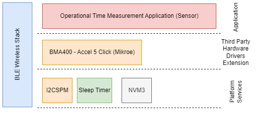

#### Sensor GATT Database ###

Advertisement Packet
Device name: bma400_sensor
- [Service] Operation Time Sensor 
  - [Char] Operation Time
    - [R/N] Get operation time so far in seconds
    - [W] Reset the operation time counter (valid value: 1)
#### Sensor Implementation ####

**Application initialization:**

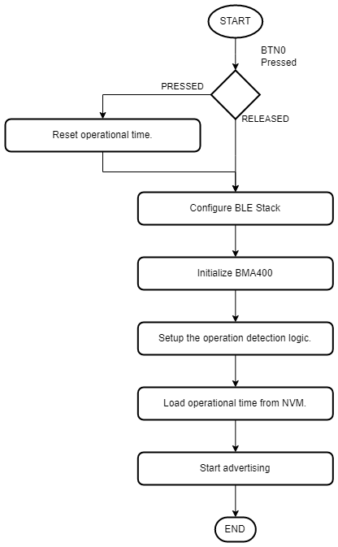

**Application runtime:**

The BMA400 accelerometer sensor detects the activity and application logic changes in its state in accordance with the figure below.

- Idle state: the device is turned off, the operation time is not measured
- Operation state: the device is turned on, the operation time measurement is active

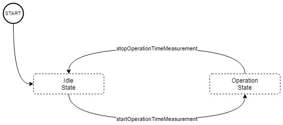

**Advertisement Packet:**

AdvData field in the advertisement packet is as table below:

| DeviceName | SampleCounter | Operation time |
|-----|-----|-----|
| bma400_sensor | 4 byte | 4 byte |

- SampleCounter: Device increases the counter value for each new measurement
- Operation time: Operation time in second
- Device is not connectable. It sends [manufacturer specific advertisement](https://github.com/SiliconLabs/bluetooth_stack_features/tree/master/advertising/advertising_manufacturer_specific_data) packets.

### Client ###

#### Client overview ###

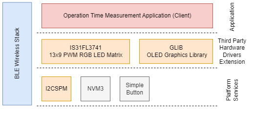

#### Client GATT Database ###

Advertisement Packet
Device name: bma400_client

GATT Database

- [Service] Operation Time Measurement Client
  - [Char] Operation Time Threshold
    - [R] Get the configured operation time threshold value
    - [W] Set operation time threshold value

#### Client Implementation ####

**Application initialization:**

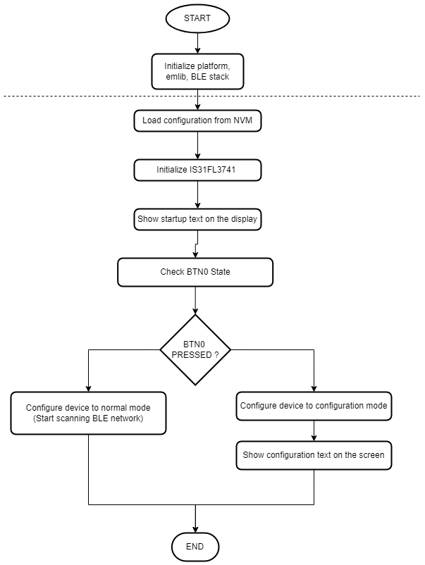

**Runtime - Configuration Mode:**

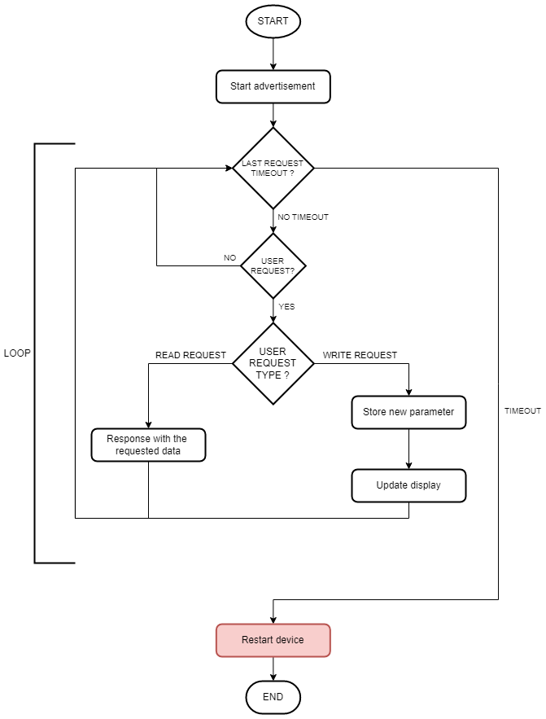

**Runtime - Normal Mode:**

*Client normal mode:*

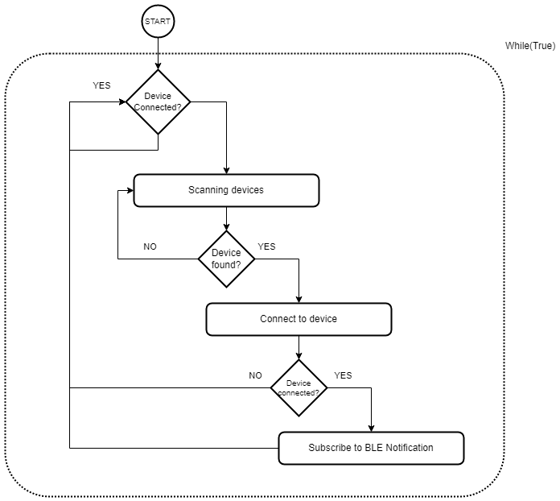

*BLE Notification Event:*

This function processes the measured values, checks the values against the configured thresholds. 

The measured operation time displayed on the connected LED matrix display.

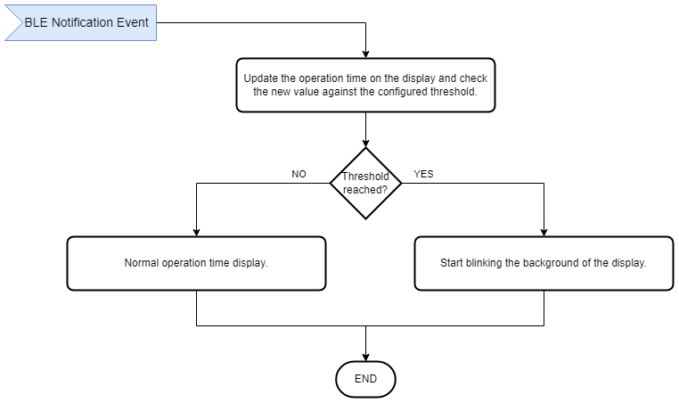

**Display:**

If the Client is in the configuration mode, the RGB LED matrix will show threshold value.

If the Client is in the normal mode, the OLED will show operation time receive from sensor device.
If the measured operation time reached the configured threshold, then besides showing the measured operation time, the background of the text blink in red.

### Testing ###

**Sensor:**

You can use a smartphone application such as the EFR Connect application, to see the advertising packet from the Sensor Device.

- Open the EFR Connect application.

- Open the Bluetooth Browser.

- Find the device advertising as bma400_sensor

- Connect to device name bma400_sensor, you should see the operation time service UUID. Please have a look at the red highlighted area below in the result pictures.

  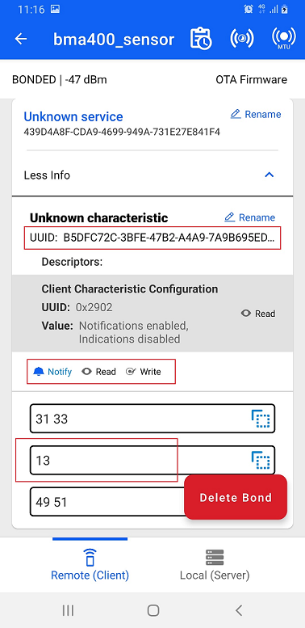

- After flashing the code to the sensor board, a similar output from the serial terminal is shown as below.

  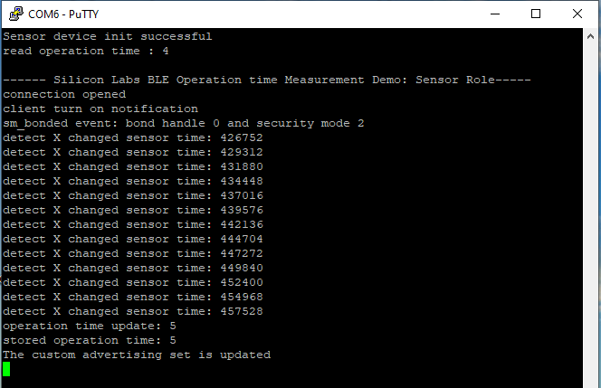

**Client:**

- After the firmware is configured, the device starts in normal mode. In this state, it starts scanning advertising devices.

- Open your terminal emulator and connect to your client device over its serial port. Set the baud rate to 115200. A similar output is expected as below.

    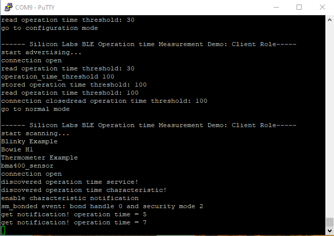

- **Note:** Button PB0 should be pressed during startup (power-on or reset) to run the client in Configuration Mode. The terminal will display the below text.

    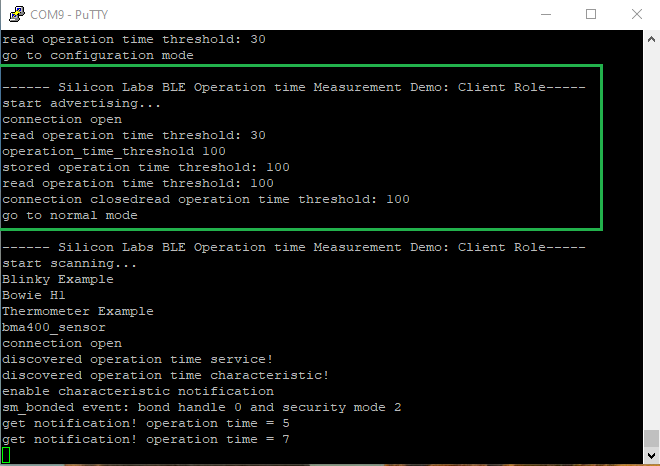