# Bluetooth - Optimized Energy Consuming Sensor #

## Overview ##

> **! THIS IS NOT A REFERENCE DESIGN !**

This example project is designed to be used within an energy-harvesting project powered by a harvester and taking sensor readings – This example code is destined to be used with various types of energy-harvest inputs, DC-DC circuity, PMICs, batteries, recharging circuits, and super-capacitors, etc. These hardware elements are not considered in this design.
This example is purely demonstrative of the lowest-power software configuration and provides valuable timing and energy measurements across different radio and MCU tasks.
The correct way to use this example is to have a known power budget in mind – this example will walk you through the various parameter settings and their tradeoffs to determine the most optimal application for the known energy budget.

For a reference design example visit here 

  - [https://www.silabs.com/support/training/optimize-iiot-with-wireless-asset-monitoring-and-energy-harvesting](https://www.silabs.com/support/training/optimize-iiot-with-wireless-asset-monitoring-and-energy-harvesting)

  - [https://www.silabs.com/support/training/app-104-harvesting-thermal-energy-to-power-asset-monitors-in-a-factory](https://www.silabs.com/support/training/app-104-harvesting-thermal-energy-to-power-asset-monitors-in-a-factory)

**Compatible energy harvest devices**

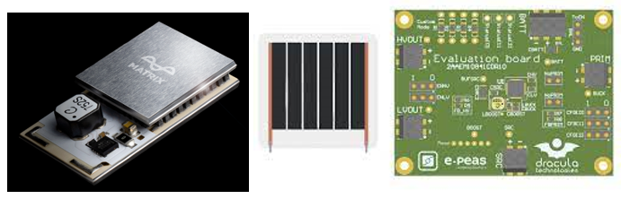

This application is meant to be powered from PV solar, vibration or thermal power sources.
These designs will require super-capacitor storage and power management circuits.

This project demonstrates the most energy-efficient way to take a sensor reading and transmit it.
This is achieved by putting the sensor and radio device to frequent sleep and making energy-based decisions before transmitting.

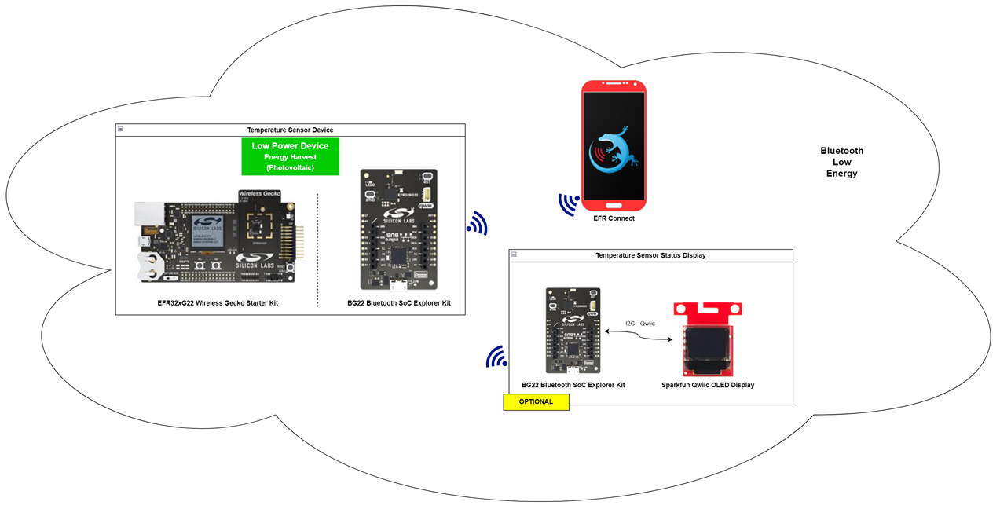

The system is composed of a sensor and a (at least one) client device. The sensor device will measure the internal temperature and then broadcast it within 1 second and then go to sleep mode. The client device will scan for the sensor device and get the temperature value from the sensor device's advertisement data then display it on the OLED screen or EFR Connect Application.

**Sensor**

This device will broadcast the internal temperature in the advertisement package in 1 second and then it will go into EM2 mode in 1 second then wake up to broadcast again. The sensor device will repeat that process 2 times before going into EM4 mode for 5 seconds.

**Sensor Status Display**

The client device will scan periodically the BLE network. Once it found the sensor device, it tries to get internal temperature value from the advertisement package to update the OLED display.

## Gecko SDK version ##

- GSDK v4.3.1
<<<<<<< HEAD
- [Third Party Hardware Drivers v1.6.0](https://github.com/SiliconLabs/third_party_hw_drivers_extension)
=======
- [Third Party Hardware Drivers v1.7.0](https://github.com/SiliconLabs/third_party_hw_drivers_extension)
>>>>>>> release/candidate

## Hardware Required ##

**Sensor**

- [EFR32xG22 2.4 GHz 6 dBm Radio Board](https://www.silabs.com/development-tools/wireless/slwrb4183a-efr32xg22-wireless-gecko-radio-board)

- [Wireless Starter Kit Mainboard](https://www.silabs.com/development-tools/wireless/bluetooth)

**Sensor Status Display**

- [BG22 Explorer Kit](https://www.silabs.com/development-tools/wireless/bluetooth/bg22-explorer-kit?tab=overview)

- [OLED Display - SSD1306](https://www.sparkfun.com/products/14532)

## Connections Required ##

The hardware connection is shown in the image below:

**Sensor** | **Sensor Status Display**
:-------------------------:|:-------------------------:
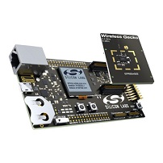                | 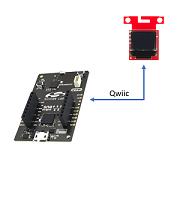

## Setup ##

To test this application, you can either create a project based on an example project or start with a "Bluetooth - SoC Empty" project based on your hardware.

**NOTE:**

- Make sure that the [Third Party Hardware Drivers](https://github.com/SiliconLabs/third_party_hw_drivers_extension) extension is added to the required SDK. You can go to [Preferences > Simplicity Studio > External Repos](https://docs.silabs.com/simplicity-studio-5-users-guide/latest/ss-5-users-guide-about-the-launcher/welcome-and-device-tabs) to add this extension.

- SDK Extension must be enabled for the project to install the required components.

### Create a project based on an example project ###

1. From the Launcher Home, add your hardware to My Products, click on it, and click on the EXAMPLE PROJECTS & DEMOS tab. Find the example project with the filter "optimized energy".

2. Click Create button on both **Bluetooth - Optimized Energy Consuming Sensor** and **Bluetooth - Optimized Energy Consuming Sensor - Status Display** examples. Example project creation dialog pops up -> click Create and Finish and the projects will be generated.

**Ssensor Device**

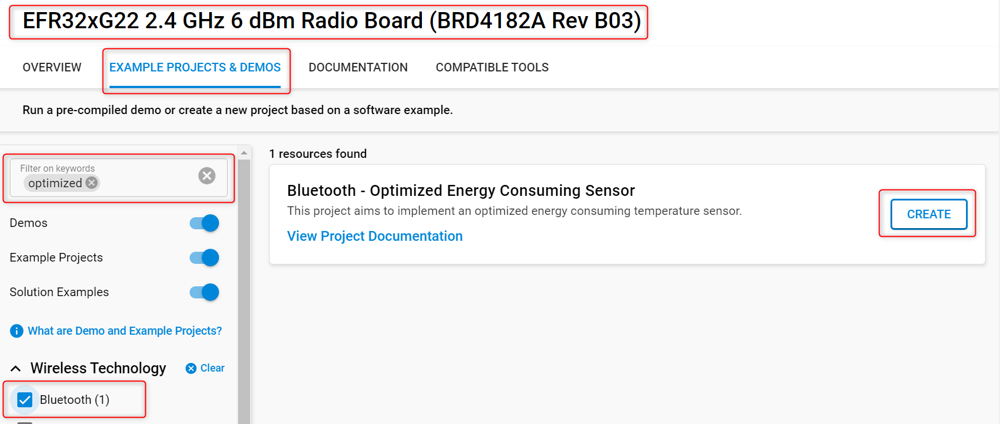

**Sensor Status Display Device**

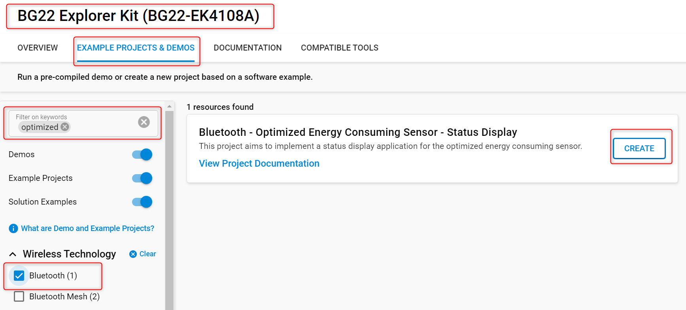

3. Build and flash the examples to the board.

### Start with a "Bluetooth - SoC Empty" project ###

1. Create **Bluetooth - SoC Empty** projects for your hardware using Simplicity Studio 5 (for both sensor and client devices).

2. Copy all attached files in *inc* and *src* folders into the project root folder (overwriting existing).

    - With **sensor** device: [bluetooth_optimized_energy_consuming_sensor](bluetooth_optimized_energy_consuming_sensor)
    - With **client** device: [bluetooth_optimized_energy_consuming_client](bluetooth_optimized_energy_consuming_client)

> **_NOTE_** \
The switch application uses the bare minimum of services to avoid wasting any energy. The following software components should be installed to make the example work.

3. Open the .slcp file. Select the **SOFTWARE COMPONENTS** tab and install the software components:

    - For **sensor** device:
        - [Services] → [IO Stream] → [IO Stream: USART] → default instance name: **vcom**
        - [Application] → [Utility] → [Log]

    - For **client** device:
        - [Services] → [IO Stream] → [IO Stream: USART] → default instance name: **vcom**
        - [Application] → [Utility] → [Log]
        - [Platform] → [Driver] → [I2C] → [I2CSPM] → default instance name: **qwiic**
        - [Third Party Hardware Drivers] → [Display & LED] → [SSD1306 - Micro OLED Breakout (Sparkfun) - I2C]
        - [Third Party Hardware Drivers] → [Services] → [GLIB - OLED Graphics Library]

4. Build and flash the project to your device.

**Note:**

- Make sure the [Third Party Hardware Drivers extension](https://github.com/SiliconLabs/third_party_hw_drivers_extension) is added to the required SDK: [Preferences > Simplicity Studio > SDKs](https://github.com/SiliconLabs/third_party_hw_drivers_extension/blob/master/README.md#how-to-add-to-simplicity-studio-ide).

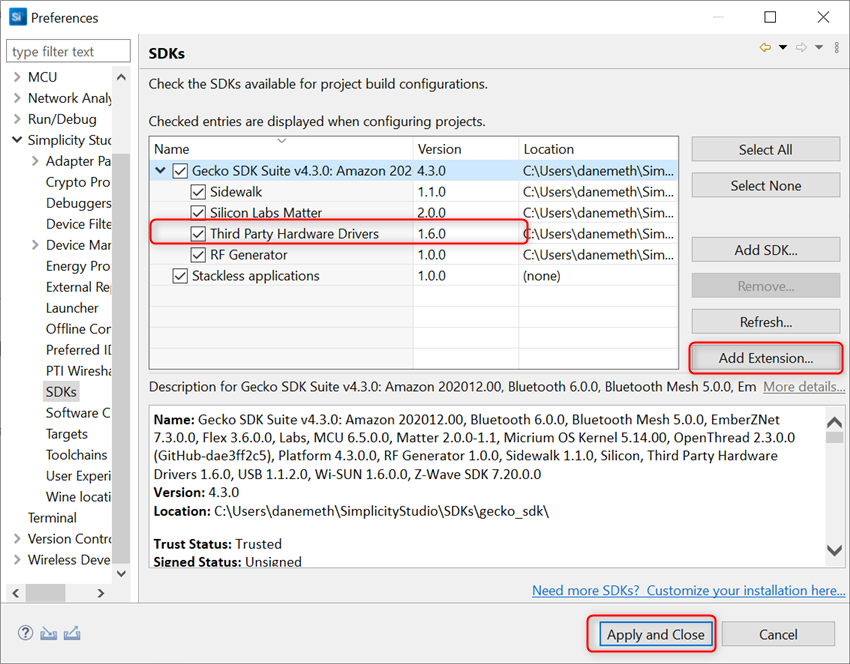

- SDK Extension must be enabled for the project to install components.

- Do not forget to flash a bootloader to your board, see [Bootloader](https://github.com/SiliconLabs/bluetooth_applications/blob/master/README.md#bootloader) for more information.

## How It Works ##

### Sensor ###

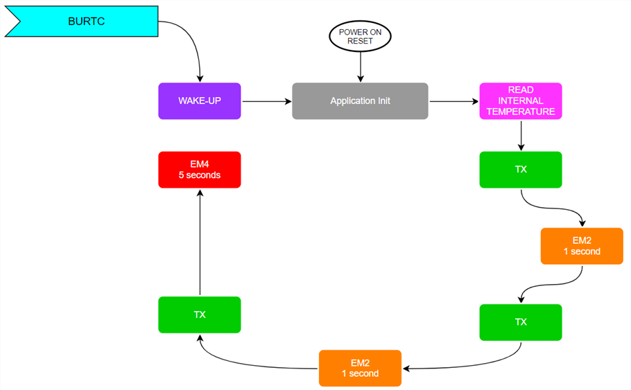

The energy-harvesting, battery-less applications have very finite amounts of energy available (~200..300uJ), therefore the application shall be optimized to transmit only the minimal required information within the shortest feasible time slot.

In these types of energy-harvesting devices, the products will spend the majority of their lifetime in deep sleep EM4.

After a power-on reset the application reads the internal temperature of the microcontroller and starts to transmit it, once the first advertisement is done the application logic sends the microcontroller into EM2 sleep mode for 1 second and repeats this transmit cycle twice.

The device goes into EM4 deep sleep mode right after transmitting the third message and stays in it until the BURTC (after 5 seconds) triggers the microcontroller to wake up.

The microcontroller wakes up and after the initialization process it begins to read the internal temperature and starts to transmit the messages in accordance with the figure above.

The payload size, TX power and the advertisement time significantly influence the required energy to transmit the switch status successfully.

> **_NOTE_** \
The default advertisement time is 100 ms, decreasing this value can help to optimize the application to meet the available energy budget.

In your implementation, you can vary the level and duration of sleep, and modify payload size and number of transmissions based on available energy or known energy budget.

More information about Bluetooth energy optimization is available [here](https://www.silabs.com/documents/public/application-notes/an1366-bluetooth-use-case-based-low-power-optimization.pdf).

**Bluetooth Stack Initialization**

The device is configured as:

- Non-connectable mode
- TX power is configured to 0 dB
- Advertisement duration is configured to 100 ms

A configuration switch is added to reduce the number of primary channels.

**Application runtime**

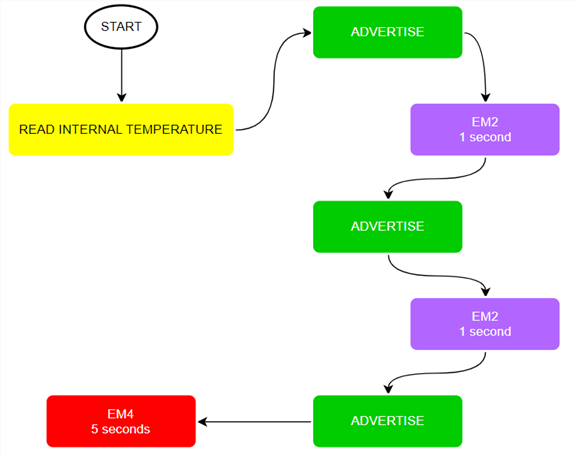

**Advertisement Packet**

The AdvData field in the advertisement packet is as table below:

| DeviceName | Internal Temperature |
|-----|-----|
| BG22_SE | 4 byte |

- Internal Temperature is in Celsius unit.
- Device is not connectable. It sends [manufacturer specific advertisement](https://github.com/SiliconLabs/bluetooth_stack_features/tree/master/advertising/advertising_manufacturer_specific_data) packets.

**Performance Measurements**

> **The results of the performance measurements below are not officially specified values!**

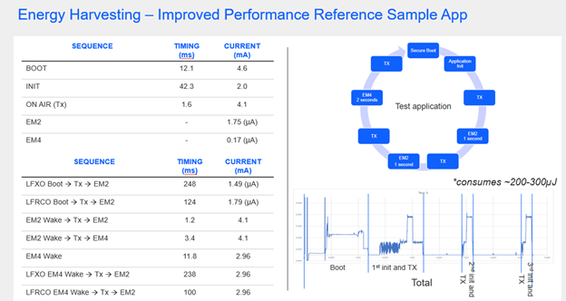

<table>
    <thead>
        <tr>
            <th>Device</th>
            <th>Action</th>
            <th>Measured</th>
            <th>Unit</th>
        </tr>
    </thead>
    <tbody>
        <tr>
            <td rowspan=13>xG22</td>
            <td>LFXO Power On -> TX -> EM2</td>
            <td>248</td>
            <td>ms</td>
        </tr>
        <tr>
            <td>LFRCO Power On -> TX -> EM2</td>
            <td>124</td>
            <td>ms</td>
        </tr>
        <tr>
            <td>LFXO EM4 wakeup Power On -> TX -> EM2</td>
            <td>238</td>
            <td>ms</td>
        </tr>
        <tr>
            <td>LFRCO EM4 wakeup Power On -> TX -> EM2</td>
            <td>100</td>
            <td>ms</td>
        </tr>
        <tr>
            <td>EM2 wakeup -> TX -> EM2 sleep</td>
            <td>2.064</td>
            <td>ms</td>
        </tr>
        <tr>
            <td>EM2 wakeup -> TX -> EM4 sleep</td>
            <td>4.17</td>
            <td>ms</td>
        </tr>
        <tr>
            <td>Power On -> Secure boot done</td>
            <td>19.8</td>
            <td>ms</td>
        </tr>
        <tr>
            <td>EM4 wakeup -> Secure boot done</td>
            <td>11.8</td>
            <td>ms</td>
        </tr>
        <tr>
            <td>LFXO EM2 current</td>
            <td>1.49</td>
            <td>uA</td>
        </tr>
        <tr>
            <td>LFRCO EM2 current</td>
            <td>1.79</td>
            <td>uA</td>
        </tr>
        <tr>
            <td>EM4 current</td>
            <td>0.24</td>
            <td>uA</td>
        </tr>
        <tr>
            <td>Secure boot average current</td>
            <td>2.799</td>
            <td>uA</td>
        </tr>
        <tr>
            <td>EM4 secure boot average current</td>
            <td>2.962</td>
            <td>uA</td>
        </tr>
    </tbody>
</table>

### Sensor status display ###

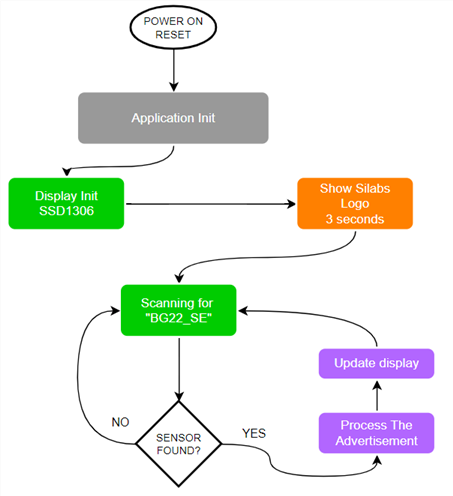

**Display**

The client device will display no data if there is no result after scanning for a period of time. Otherwise, it will display the internal temperature that is broadcasted by the sensor device.

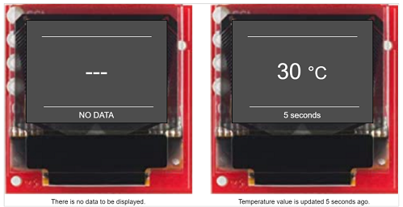

### Testing ###

**Sensor**

You can use a smartphone application such as the EFR Connect application, to see the advertising packet from the Sensor.

- Open the EFR Connect application.

- Open the Bluetooth Browser.

- Find the device advertising as **BG22_SE**.

    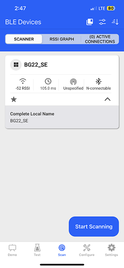

To see how the sensor device optimizes energy consumption, you can open the Energy Profier tool on SimplictyStudio to monitor the consumed current and power. You can easily see that the device consumes less current when it is in EM2 and EM4 mode.

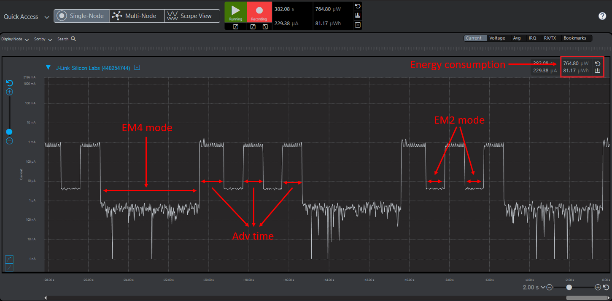

**Sensor Status Display**

The client device will display the temperature value that is broadcasted by the sensor device. If there is no device named **BG22_SE** found within 5 seconds client device will display "no data".

