# Bluetooth - Optimized Energy Consuming Switch #

## Overview ##

> **! THIS IS NOT A REFERENCE DESIGN !**

This example project is designed to be used within an energy-harvesting project – This example code is destined to be used with various types of energy-harvest inputs, DC-DC circuity, PMICs, batteries, recharging circuits, super-capacitors, etc. These hardware elements are not considered in this design.

This example is purely demonstrative of the lowest-power software configuration and provides valuable timing and energy measurements across different radio and MCU tasks.

The correct way to use this example is to have a known power budget in mind – this example will walk you through the various parameter settings and their tradeoffs to determine the most optimal application for the known energy budget.

The overview of this application is shown in the image below:

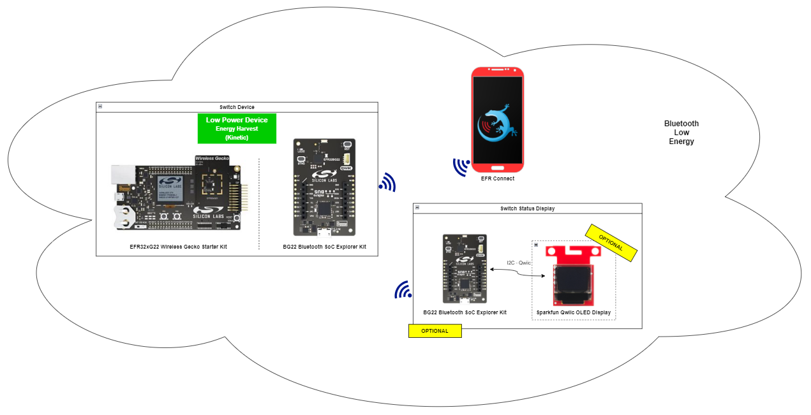

**Switch Device**

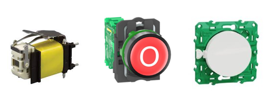

This application is meant to mimic how a battery-less kinetic energy switch would operate.
These designs will require super-capacitor storage and power management circuits.

The switch device is an EFR32xG22 Wireless Gecko Starter Kit, which has a button on the motherboard. 

In normal operation, this device is in sleep mode *(EM2) for decreasing energy consumption. When the button0 on-board is released, the device wakes up and advertises its name and state of the switch 3 times. After finishing the advertisement, it back to sleep mode.

> **_NOTE_** \
In this example, we use the Wireless Gecko Starter Kit’s built-in button PB – which will only wake up from EM2. A real application button connected to a GPIO can leverage GPIO interrupt wake-up from EM4.

**Switch Status Display Device**

The status display device represents a gateway.

The switch status display device is the BG22 Explorer Kit connected to the SparkFun Micro OLED Breakout or to EFR Connect Mobile Application. 

This device scans and analyzes the advertisement packet of the switch device to get the status of the switch. It controls the LED0 on-board depending on the gathered switch's status. For example, if the switch's status value is 1, LED0 is turned on and the switch's status value is 0, LED0 is turned off.

The gathered switch's status is shown on the SparkFun Micro OLED Breakout.

## Gecko SDK Version ##

- GSDK v4.3.1
- [Third Party Hardware Drivers v1.7.0](https://github.com/SiliconLabs/third_party_hw_drivers_extension)

## Hardware Required ##

**Switch Device**

- [EFR32xG22 Wireless Gecko Starter Kit](https://www.silabs.com/development-tools/wireless/efr32xg22-wireless-starter-kit?tab=overview)

**Switch Status Display Device**

- [BG22 Bluetooth SoC Explorer Kit - BG22-EK4108A](https://www.silabs.com/development-tools/wireless/bluetooth/bg22-explorer-kit?tab=overview)

- [SparkFun Micro OLED Breakout (Qwiic)](https://www.sparkfun.com/products/14532)

**NOTE:**
Tested boards for working with this example:

| Board ID | Description  |
| -------- | ------ |
| BRD4314A | [BGM220 Bluetooth Module Explorer Kit - BGM220-EK4314A](https://www.silabs.com/development-tools/wireless/bluetooth/bgm220-explorer-kit?tab=overview)   |
| BRD4108A | [BG22 Bluetooth SoC Explorer Kit - BG22-EK4108A](https://www.silabs.com/development-tools/wireless/bluetooth/bg22-explorer-kit?tab=overview)   |

## Connections Required ##

**Switch device**
The hardware connection is shown in the image below:

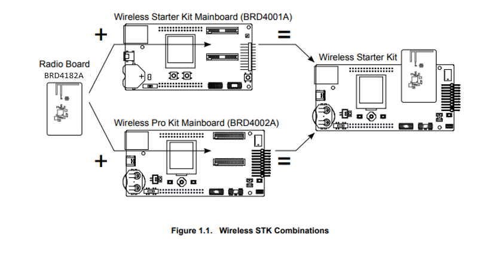

**Switch Status Display Device:**
The Distance Sparkfun sensor can be easily connected to the EFR32xG24 Explorer Kit via a Qwiic connection.

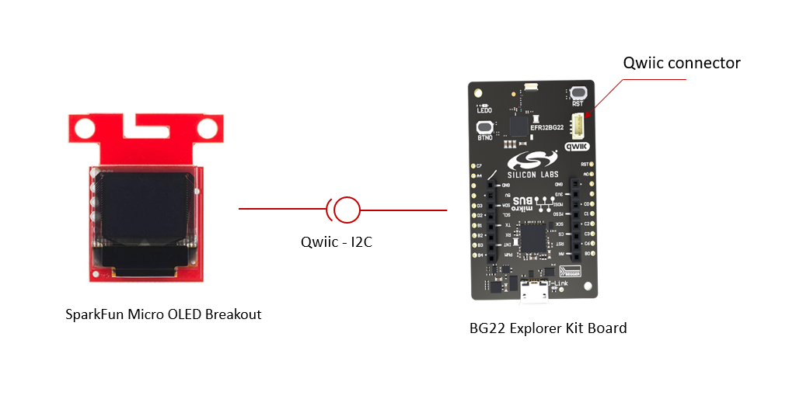

## Setup ##

To test this application, you can either create a project based on an example project or start with a "Bluetooth - SoC Empty" project based on your hardware.

### Create a project based on an example project ###

1. From the Launcher Home, add your hardware to My Products, click on it, and click on the **EXAMPLE PROJECTS & DEMOS** tab. Find the example project with the filter "optimized".

2. Click **Create** button on **Bluetooth - Optimized Energy Consuming Switch** for switch device and **Bluetooth - Optimized Energy Consuming Switch - Status Display** for switch status display. Example project creation dialog pops up -> click Create and Finish and Project should be generated.

**Switch device**

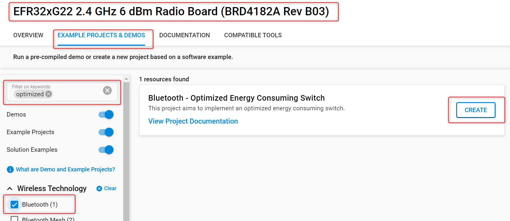

**Switch Status Display Device**

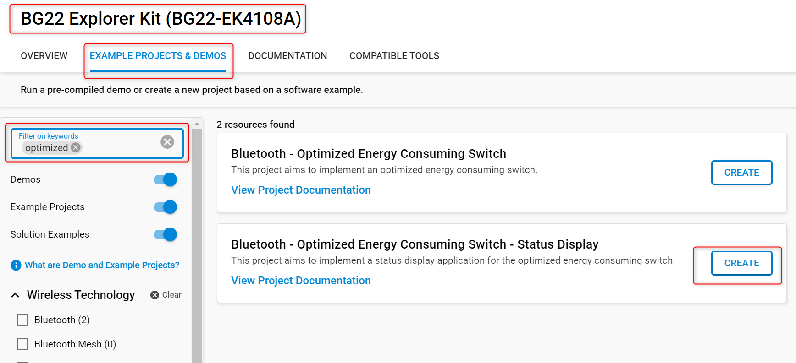

3. Build and flash these examples to boards.

### Start with a "Bluetooth - SoC Empty" project ###

1. Create a **Bluetooth - SoC Empty** project for your hardware using Simplicity Studio 5.

2. Copy all the .h and .c files to the following directory of the project root folder (overwriting the existing file).

    - With **switch** device:
      - [Header files](inc/switch_device/)
      - [Source files](src/switch_device/)
    - With **switch status display** device: 
      - [Header files](inc/display_device/)
      - [Source files](src/display_device/)

> **_NOTE_** \
The switch application uses the bare minimum of services to avoid wasting any energy. The following software components should be installed to make the example work.

3. Install the software components:

    - Open the .slcp file in the project.

    - Select the SOFTWARE COMPONENTS tab.

    - Install the following components for the **switch** device:
        - [Application] → [Timers] → [Sleep timer]
        - [Bluetooth] → [NVM] → NVM Support
        - [Services] →  [NVM3] → NVM3 Core
        - [Services] →  [NVM3] → NVM3 Default Instance
        - [Platform] → [Driver] → [Button] → [Simple Button] → default instance name: btn0
        - [Services] → [IO Stream] → [IO Stream: USART] → default instance name: vcom
        - [Application] → [Utility] → [Log]
        - [Platform] → [Board] → [Board Control]: Enable Virtual COM UART.

    - Install the following components for **switch status display** device:
        - [Services] → [IO Stream] → [IO Stream: USART] → default instance name: vcom
        - [Application] → [Utility] → [Log]
        - [Platform] → [Driver] → [LED] → [Simple LED] → default instance name: led0
        - [Platform] → [Driver] → [I2C] → [I2CSPM] → default instance name: qwiic
        - [Third Party Hardware Drivers] → [Display & LED] → [SSD1306 - Micro OLED Breakout (Sparkfun) - I2C]
        - [Third Party Hardware Drivers] → [Services] → [GLIB - OLED Graphics Library]

4. Build and flash these projects to boards.

**Note:**

- Make sure the [Third Party Hardware Drivers extension](https://github.com/SiliconLabs/third_party_hw_drivers_extension) is added to the required SDK: [Preferences > Simplicity Studio > SDKs](https://github.com/SiliconLabs/third_party_hw_drivers_extension/blob/master/README.md#how-to-add-to-simplicity-studio-ide).

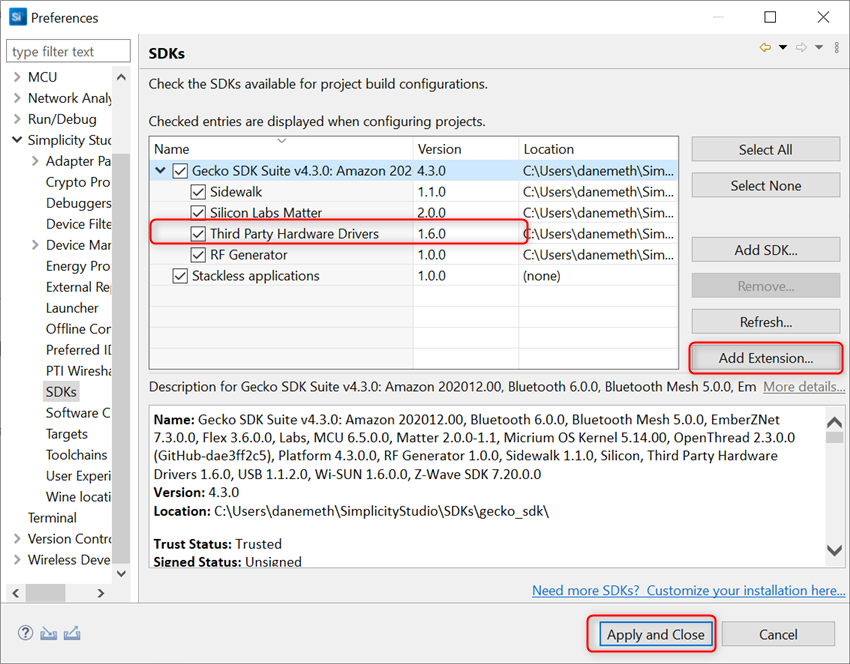

- SDK Extension must be enabled for the project to install components.

- Do not forget to flash a bootloader to your board, see [Bootloader](https://github.com/SiliconLabs/bluetooth_applications/blob/master/README.md#bootloader) for more information.

## How It Works ##

### Switch Device Overview ###

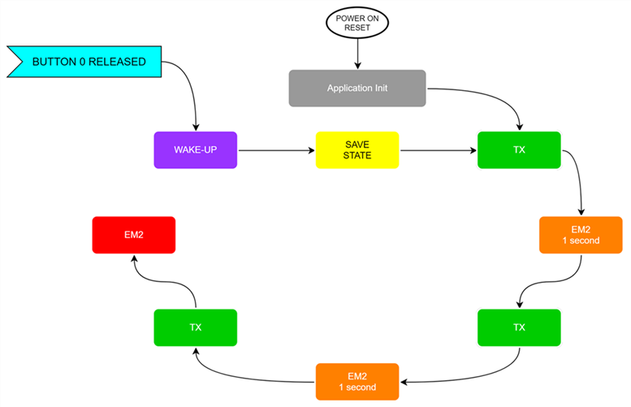

The energy-harvesting, battery-less kinetic switches have very finite amounts of energy available (~200..300uJ), therefore the application shall be optimized to transmit only the minimal required information within the shortest feasible time slot.

In these types of energy-harvesting devices, the products will spend the majority of their lifetime in deep sleep EM4 (EM2 in this example), or completely powered off (cold start).

After a power-on reset the application starts to transmit the actual, stored state of the switch, once the first advertisement is done the application logic sends the microcontroller into EM2 sleep mode for 1 second and repeats this transmit cycle twice.

The device goes into EM2 sleep mode right after transmitting the third message and stays in it until a button 0 release event triggers the microcontroller to wake up.

The microcontroller saves the actual state of the switch (ON/OFF) into the Non-Volatile Memory (NVM) and begins to transmit the switch status messages in accordance with the figure above.

The payload size, TX power and the advertisement time significantly influence the required energy to transmit the switch status successfully.

> **_NOTE_** \
The default advertisement time is 100 ms, decreasing this value can help to optimize the application to meet the available energy budget.

In your implementation, you can vary the level and duration of sleep, and modify payload size and number of transmissions based on available energy or known energy budget.

More information about Bluetooth energy optimization is available [here](https://www.silabs.com/documents/public/application-notes/an1366-bluetooth-use-case-based-low-power-optimization.pdf).

### Switch Device Implementation ###

**Application initialization**

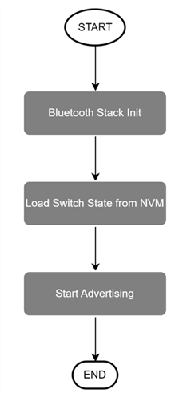

**Bluetooth Stack Initialization**

The device is configured as:

- Non-connectable mode
- TX power is configured to 0 dB
- Advertisement duration is configured to 100 ms

A configuration switch is added to reduce the number of primary channels.

**Application runtime**

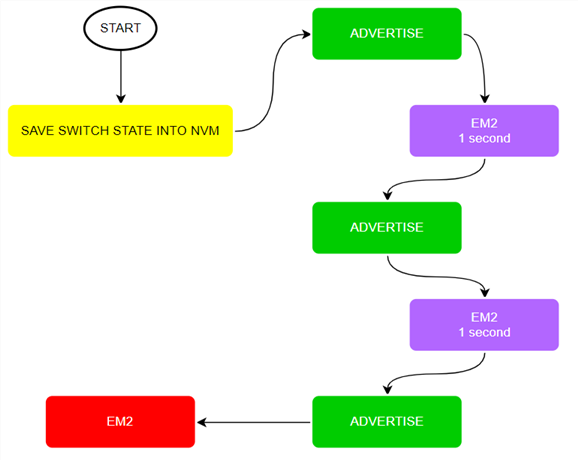

**Advertisement Packet**

The AdvData field in the advertisement packet is as table below:

| DeviceName | SwitchStatus |
|-----|------|
|  BG22_SW   | 1 byte |

- Switch Status: 0 - off; 1 - on

The device is not connectable. It sends manufacturer-specific advertisement packets.

**Performance Measurements**

> **The results of the performance measurements below are not officially specified values!**

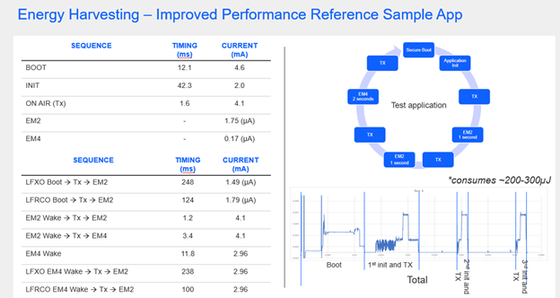

<table>
    <thead>
        <tr>
            <th>Device</th>
            <th>Action</th>
            <th>Measured</th>
            <th>Unit</th>
        </tr>
    </thead>
    <tbody>
        <tr>
            <td rowspan=13>xG22</td>
            <td>LFXO Power On -> TX -> EM2</td>
            <td>248</td>
            <td>ms</td>
        </tr>
        <tr>
            <td>LFRCO Power On -> TX -> EM2</td>
            <td>124</td>
            <td>ms</td>
        </tr>
        <tr>
            <td>LFXO EM4 wakeup Power On -> TX -> EM2</td>
            <td>238</td>
            <td>ms</td>
        </tr>
        <tr>
            <td>LFRCO EM4 wakeup Power On -> TX -> EM2</td>
            <td>100</td>
            <td>ms</td>
        </tr>
        <tr>
            <td>EM2 wakeup -> TX -> EM2 sleep</td>
            <td>2.064</td>
            <td>ms</td>
        </tr>
        <tr>
            <td>EM2 wakeup -> TX -> EM4 sleep</td>
            <td>4.17</td>
            <td>ms</td>
        </tr>
        <tr>
            <td>Power On -> Secure boot done</td>
            <td>19.8</td>
            <td>ms</td>
        </tr>
        <tr>
            <td>EM4 wakeup -> Secure boot done</td>
            <td>11.8</td>
            <td>ms</td>
        </tr>
        <tr>
            <td>LFXO EM2 current</td>
            <td>1.49</td>
            <td>uA</td>
        </tr>
        <tr>
            <td>LFRCO EM2 current</td>
            <td>1.79</td>
            <td>uA</td>
        </tr>
        <tr>
            <td>EM4 current</td>
            <td>0.24</td>
            <td>uA</td>
        </tr>
        <tr>
            <td>Secure boot average current</td>
            <td>2.799</td>
            <td>uA</td>
        </tr>
        <tr>
            <td>EM4 secure boot average current</td>
            <td>2.962</td>
            <td>uA</td>
        </tr>
    </tbody>
</table>

### Switch Status Display ###

**Display Implementation**

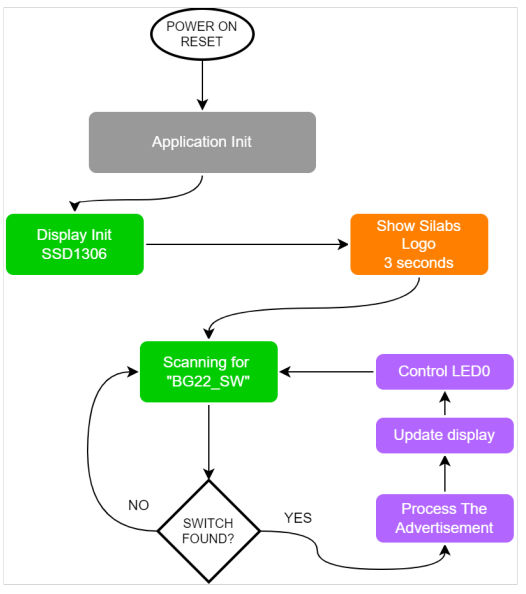

## Testing ##

**Switch device**

- After booting the switch device, it advertises 3 times and goes to sleep mode (EM2). 

  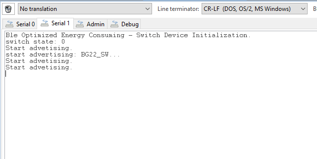

- Every time button 0 on-board is released, the switch device wakes up and saves the switch's state to NVM, and updates the advertisement packet. After that, this device advertises 3 times again and back to sleep mode after advertising.

  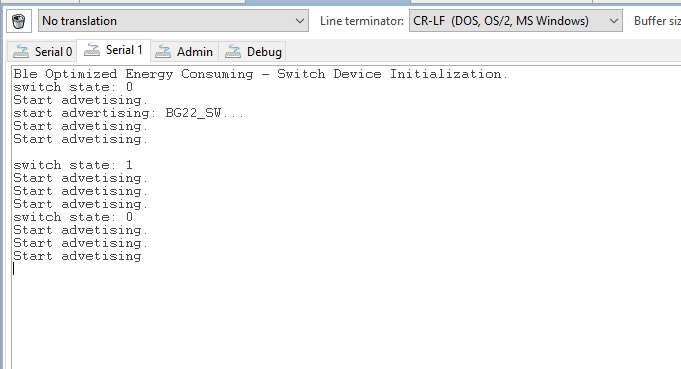

- Between two advertising times, the switch device is back in sleep mode (EM2) for 1 second. Select the debug interface as JTAG to detect the target part. Open the Energy Profiler to observe energy consumption.

    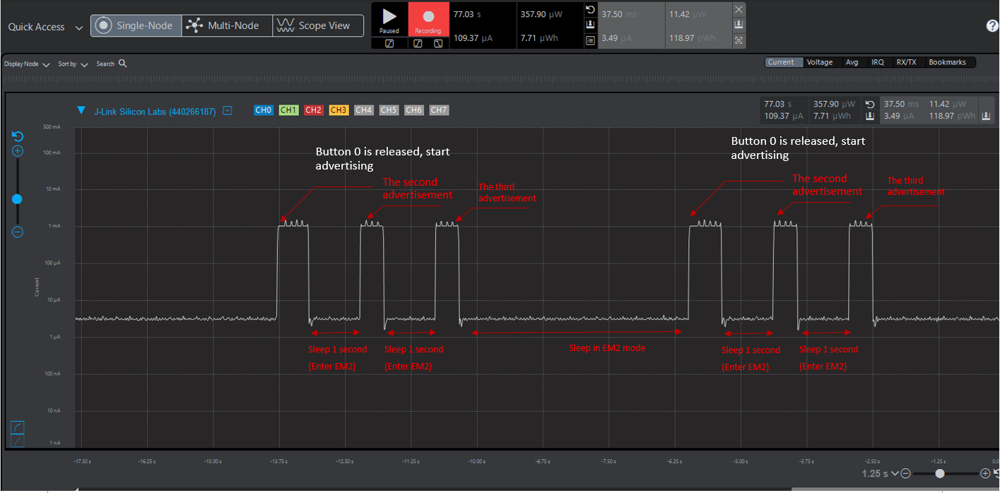

**Switch status display device**

- After the display device is turned on, the device starts in normal mode. In this state, it starts scanning the advertisement packet to find the switch device with name "BG22_SW".

    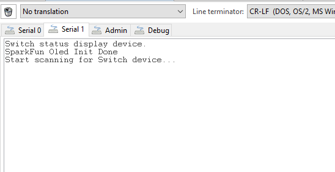

- When found the switch device, it gets the switch's state and controls the LED 0 on-board. If the switch's state is 1, the LED is turned on, and the switch's state is 0, the LED is turned off.

    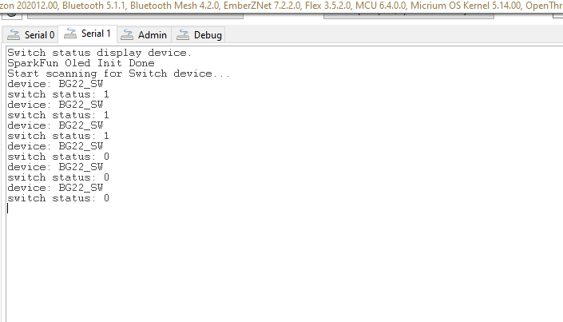

- This device also shows the switch's state on the Sparkfun Micro Oled.

    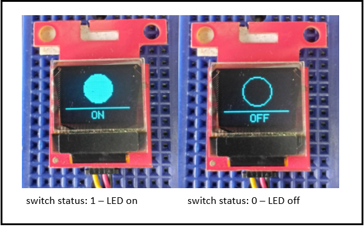
