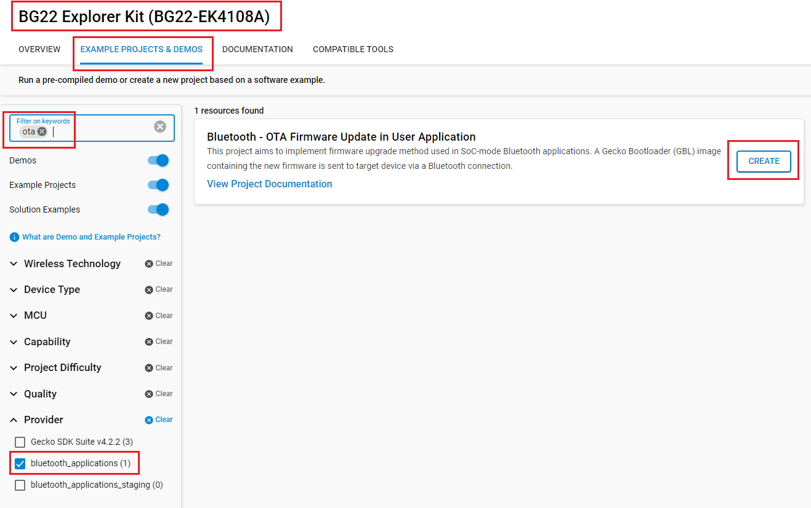
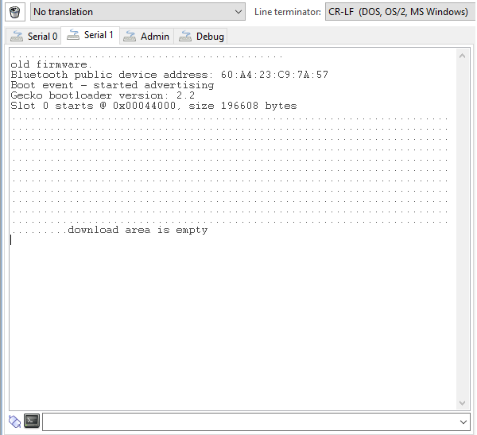

# Bluetooth - OTA Firmware Update in User Application #

## Background ##

This code example has a related User's Guide, here: [Uploading Firmware Images Using OTA DFU](https://docs.silabs.com/bluetooth/latest/general/firmware-upgrade/uploading-firmware-images-using-ota-dfu)

## Description ##

The article referred in the [Background](#background) section discusses two methods of performing OTA:

1. Using Apploader

2. Using user application

This code example demonstrates the second method. See the article [Uploading Firmware Images Using OTA DFU](https://docs.silabs.com/bluetooth/latest/general/firmware-upgrade/uploading-firmware-images-using-ota-dfu) for conceptual details.

The code sample provided in [AN1086: Using the Gecko Bootloader with the Silicon Labs Bluetooth® Applications](https://www.silabs.com/documents/public/application-notes/an1086-gecko-bootloader-bluetooth.pdf) is simplified to fit in one page. The full example provided here includes some additional debug prints and features, such as printing the estimated data transfer rate.

The main functional difference is related to erasing the download area. In the simplified code, the download area is erased when the remote OTA client starts the OTA process (writing value 0 to *ota_control*). In this example, the download area is erased at startup. The code also reads the content of the download area and does an erase only if needed (i.e., if the download area is not already blank) to avoid dropping the connection because of the supervision timeout. Erasing the whole download area (256k or more) will take several seconds (it is a blocking function call) and this can lead to supervision timeout unless the connection parameters are specifically adjusted to prevent it.

## Overview ##

This project aims to implement the firmware upgrade method used in SoC-mode Bluetooth applications. A Gecko Bootloader(GBL) image containing the new firmware is sent to the target device via a Bluetooth connection.

## Gecko SDK Suite version ##

- GSDK v4.4.0

## Hardware Required ##

- Silicon Labs EFR32 Development Kit

**NOTE:**
Tested boards for working with this example:

| Board ID | Description  |
| ---------------------- | ------ |
| BRD2704A | [SparkFun Thing Plus Matter - MGM240P - BRD2704A](https://www.sparkfun.com/products/20270) |
| BRD2601B | [EFR32xG24 Dev Kit - xG24-DK2601B](https://www.silabs.com/development-tools/wireless/efr32xg24-dev-kit?tab=overview)   |
| BRD2703A | [EFR32xG24 Explorer Kit - XG24-EK2703A](https://www.silabs.com/development-tools/wireless/efr32xg24-explorer-kit?tab=overview)    |
| BRD4108A | [BG22 Bluetooth SoC Explorer Kit - BG22-EK4108A](https://www.silabs.com/development-tools/wireless/bluetooth/bg22-explorer-kit?tab=overview)    |
| BRD4314A | [BGM220 Bluetooth Module Explorer Kit - BGM220-EK4314A](https://www.silabs.com/development-tools/wireless/bluetooth/bgm220-explorer-kit?tab=overview)    |

## Connections Required ##

- Connect the Bluetooth Development Kits to the PC through a compatible-cable. For example, a micro USB cable for the BGM220 Bluetooth Module Explorer Kit.

## Setup ##

To test this application, you can either create a project based on an example project or start with a "Bluetooth - SoC Empty" project based on your hardware.

### Create a project based on an example project ###

1. From the Launcher Home, add your hardware to MyProducts, click on it, and click on the **EXAMPLE PROJECTS & DEMOS** tab. Find the example project with filter "ota".

2. Click **Create** button on the **Bluetooth - OTA Firmware Update in User Application** examples. Example project creation dialog pops up -> click Create and Finish and Project should be generated.

3. Build and flash this example to the board.

### Start with a "Bluetooth - SoC Empty" project ###

1. Create a **Bluetooth - SoC Empty** project for your hardware using Simplicity Studio 5.

2. Since in this project, we do not use Apploader for firmware upgrade, remove Apploader from your application

   - Open the Project Configurator (that is, open the .slcp file in your project and select the Software Components tab)

   - Find the **OTA DFU** software component (Bluetooth > Utility > In-Place OTA DFU), and uninstall it

3. Import the attached GATT configuration file into the project.

   - Open the .slcp file in the project.

   - Select the **CONFIGURATION TOOLS** tab and open the **Bluetooth GATT Configurator**.

   - Find the Import button and import the attached **config/btconf/gatt_configuration.btconf** file.

   - Save the GATT configuration (ctrl-s).

4. Open the .slcp file. Select the SOFTWARE COMPONENTS tab and install the software components:

   - [Services] → [IO Stream] → [IO Stream: EUSART] → default instance name: vcom
   - [Application] → [Utility] → [Log]
      - If using WSTK, navigate to the  **Platform** > **Board** > **Board Control**  software component, open its configurator and **Enable Virtual COM UART**

5. Copy all attached files in *inc* and *src* folders into the project root folder (overwriting existing files).
6. Build the project and flash it to your target.

**NOTE:**

- Make sure that this repository is added to [Preferences > Simplicity Studio > External Repos](https://docs.silabs.com/simplicity-studio-5-users-guide/latest/ss-5-users-guide-about-the-launcher/welcome-and-device-tabs).

- Do not forget to flash a bootloader to your board, see [Bootloader](https://github.com/SiliconLabs/bluetooth_applications/blob/master/README.md#bootloader) for more information

## How It Works ##

You can generate OTA files by running the create_bl_files script in your project (Note: you may need to set up some environmental variables first as described in section 3.10 of [AN1086: Using the Gecko Bootloader with the Silicon Labs Bluetooth® Applications](https://www.silabs.com/documents/public/application-notes/an1086-gecko-bootloader-bluetooth.pdf)).

Once you generated the upgrade files

1. Copy them to your smartphone
2. Open EFR Connect on your phone
3. Find your device (advertising as Application OTA) in the Bluetooth Browser and connect to it
4. In the context menu select OTA
5. Try OTA using the application.gbl file(make sure the size of this file is less than size of download area).

You can check the debug prints to make sure that the application can detect the bootloader version and download area information correctly as the first test before trying any updates. Below is a sample of the debug prints when running on a BGM220 Bluetooth Module Explorer Kit(with 512k flash):

