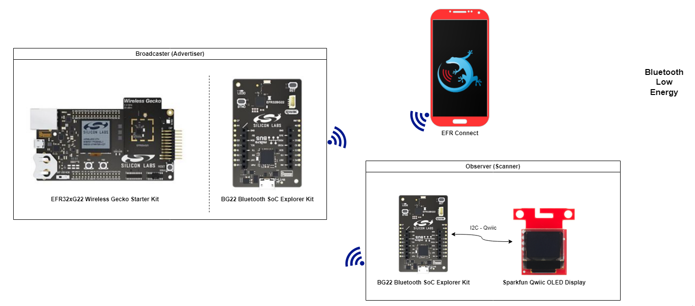
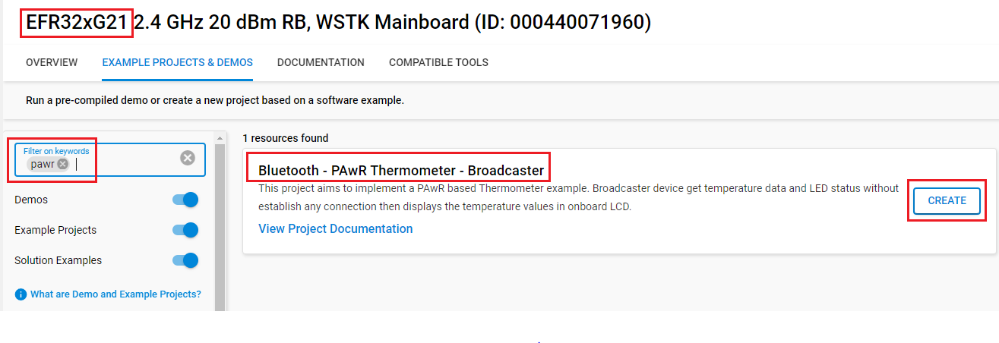
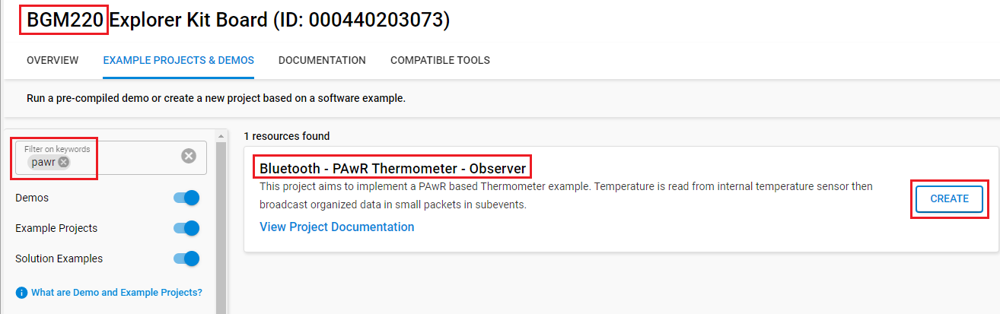
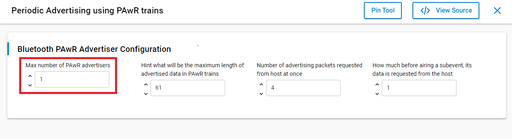
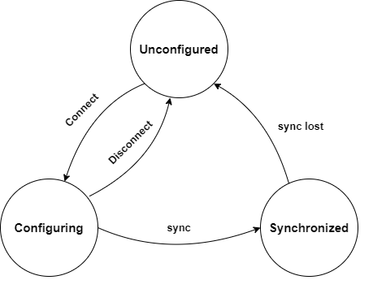
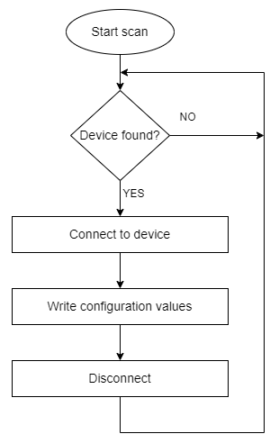
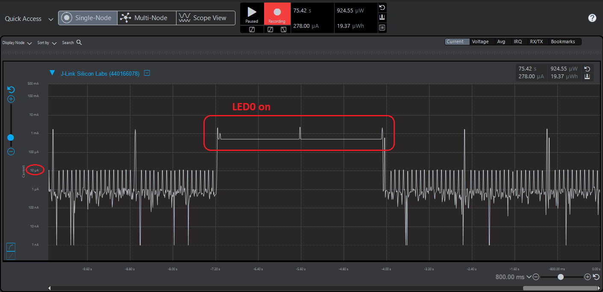

# Bluetooth -  PAwR Thermometer

## Overview

PAwR is a new Bluetooth Low Energy (LE) logical transport that provides a way to perform energy efficient, bi-directional, communication in a large-scale one-to-many topology. PAwR can broadcast organized data in small packets in sub-events. PAwR sub-events present established time slots that can be synchronized and responded to. Additionally, observers (end nodes) can choose to respond to singular or multiple sub-events on the application level. Scanning for sub-events enables a particularly power-friendly solution as end nodes only need to scan for minute periods of time.

For more information about PAwR please visit [this document](https://www.bluetooth.com/wp-content/uploads/2023/02/2301_5.4_Tech_Overview_FINAL.pdf)

This project aims to implement a PAwR-based Thermometer example.

**Broadcaster Device:**

The broadcaster supports multiple observers to sync with. This device is a WSTK and the application uses the display on the WSTK to show the connected nodes and temperatures. The BTN0 on the WSTK controls the LED0 on the observer boards. If the user pushes the BTN0 on the Broadcaster, then the LED0 toggles on each synced observer.

**Observer Device:**

The observer device is one of the Silabs Development Kits listed in the section **Required Hardware**, which has a built-in temperature sensor. This device periodically measures the temperature and sends it to the Broadcaster in a small packet with subevent and response slot decided by the Broadcaster. The package contains a processed temperature in Celsius and the LED0 status.

## Gecko SDK version

- GSDK v4.4.0

## Hardware Required

- **Broadcaster:**

  - [EFR32MG21 2.4 GHz +10 dBm radio board - BRD4180A](https://www.silabs.com/development-tools/wireless/efr32xg21-bluetooth-starter-kit)

- **Observers:**

  - [BGM220 Bluetooth Module Explorer Kit - BGM220 - EK4314A](https://www.silabs.com/development-tools/wireless/bluetooth/bgm220-explorer-kit)

## Connections Required

The hardware connection is shown in the image below:

## Setup

To test this application, you can either create a project based on an example project or start with a "Bluetooth - SoC Empty" project based on your hardware.

### Create a project based on an example project

1. From the Launcher Home, add your hardware to My Products, click on it, and click on the **EXAMPLE PROJECTS & DEMOS** tab. Find the example project with the filter "pawr".

2. Click **Create** button on each **Bluetooth - PAwR Thermometer - Broadcaster** and **Bluetooth - PAwR Thermometer - Observer** examples. Example project creation dialog pops up -> click Create and Finish and Project should be generated.
    

    

3. Build and flash this example to the board.

### Start with a "Bluetooth - SoC Empty" project

1. Create a **Bluetooth - SoC Empty** project for your hardware using Simplicity Studio 5.

2. Copy the following files into the project root folder (overwriting existing).

    - With **Broadcaster** device: `bluetooth_pawr_thermometer_broadcaster/src/appc.`

    - With **Observer** device: `bluetooth_pawr_thermometer_observer/src/app.c`

3. Install the software components:

    - Open the .slcp file in the project.

    - Select the SOFTWARE COMPONENTS tab.

    - Install the following components for **Observer** device:
        - [Platform] → [Driver] → [TEMPDRV]
        - [Platform] → [Driver] → [LED] → [Simple LED] → default instance name: led0
        - [Bluetooth] → [Bluetooth LE Controller (Link Layer)] → [Features with Commands and Events] → [Synchronization to Periodic Advertising with Responses trains]
        - [Bluetooth] → [Bluetooth LE Controller (Link Layer)] → [Features with Commands and Events] → [Synchronization to Periodic advertising trains by receiving PAST]

    - Install the following components for **Broadcaster** device:
        - [Services] → [IO Stream] → [IO Stream: USART] → default instance name: vcom
        - [Application] → [Utility] → [Log]
        - [Platform] → [Driver] → [Button] → [Simple Button] → default instance name: btn0
        - [Platform] → [Driver] → [GLIB Graphics Library]
        - [Bluetooth] → [Bluetooth LE Controller (Link Layer)] → [Features with Commands and Events] → [Extended Advertising]
        - [Bluetooth] → [Bluetooth LE Controller (Link Layer)] → [Features with Commands and Events] → [Periodic Advertising using PAwR trains]
        - [Bluetooth] → [Bluetooth LE Controller (Link Layer)] → [Features with Commands and Events] → [Transfer periodic synchronization information for a local advertising set]
          
        - [Platform] → [Board] → [Board Control] → enable *Virtual COM UART* and *Enable Display*

4. Import the GATT configuration:

    - Open the .slcp file in the project again.
    - Select the CONFIGURATION TOOLS tab and open the "Bluetooth GATT Configurator".
    - Find the Import button and import the  gatt_configuration.btconf file.
        - With **Observer** device: `bluetooth_pawr_thermometer_observer/config/btconf/gatt_configuration.btconf`
        - With **Broadcaster** device: `bluetooth_pawr_thermometer_broadcaster/config/btconf/gatt_configuration.btconf`
    - Save the GATT configuration (ctrl-s).

5. Build and flash each example to the board.

**Note:**

- Make sure that the bluetooth_applications repository is added to [Preferences > Simplicity Studio > External Repos](https://docs.silabs.com/simplicity-studio-5-users-guide/latest/ss-5-users-guide-about-the-launcher/welcome-and-device-tabs).

- These examples expect a specific Gecko Bootloader to be present on your device. For more details see [Bootloader](https://github.com/SiliconLabs/bluetooth_applications/blob/master/README.md#bootloader).

## How It Works

### Observer GATT Database

- [Service] **PAwR Service** with UUID = `74e2e878-e82c-4e07-b276-5d2affe4239f`
  - [Char] **Device Address** with UUID = `6a02d89c-80d5-4f4a-9162-4946120aab7c`
    - [W] The Broadcaster shall configure the Observer Address by writing an Observer Address value to this characteristic. Each Observer Address consists of 15 bits and is split into a Group ID and a Device ID. The Device ID is at the low byte, it's an 8-bit value, valid in the range of 1-255. 0 is the default (reset) value meaning no address assigned to the device yet. At the high byte position, there's the 7bit Group ID ranging from 0-127. The most significant bit within the high byte is reserved for future use. Each Observer is a member of a single group. Therefore, with 128 groups and 255 Device IDs per group, a total of 32,640 Observer devices can be allocated a locally unique address. Accessing the Observer address requires bonding and encryption.

### Synchronization Procedure

**Observer:**

The Observers on the network can be in one of three different states: Unconfigured, Configuring, or Synchronized, as shown below figure. Transitions between states are controlled by the Broadcaster and configuration parameters (subevent and response slot) are decided by the Broadcaster.

After power on, the Observer will be in an Unconfigured state, sending undirected, connectable advertisement packets. Once the Observer has been configured, this device periodically measures the temperature and sends it along with LED status to the Broadcaster.

**Broadcaster:**

After power on, the Broadcaster starts scanning for Observers by UUID, and once it finds one, creates a connection to it, writes configuration values (group ID and device ID) and then closes the connection. The figure below shows the Broadcaster state diagram. Once the Observer has been configured and the Broadcaster has closed the connection, the Observer will be in the Synchronized state (see Observer above). At this point, the Broadcaster will also show group ID, device ID, temperature and LED status of synchronized Observers on the WSTK LCD screen.

### Testing

This example will look something like the GIF below.

You can check the power consumption of *Observer Device*. It looks like the picture below:

**Observer Device**

