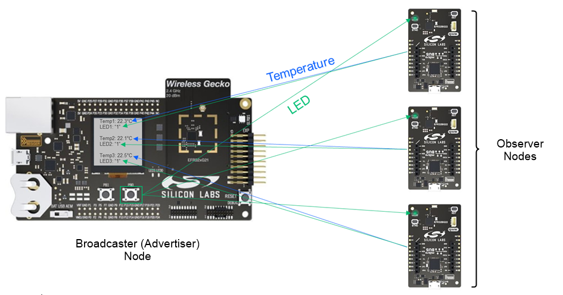

# Bluetooth -  PAwR Thermometer

## Overview

PAwR enables bidirectional communication in connectionless mode, a feature that has been impossible to achieve until Bluetooth v5.4. Now, PAwR can broadcast organized data in small packets in sub-events. PAwR sub-events present established time slots that can be synchronized and responded to. Additionally, observers (end nodes) can choose to respond to singular or multiple sub-events on the application level. Scanning for sub-events enables a particularly power-friendly solution as end nodes only need to scan for minute periods of time.

This project aims to implement a PAwR-based Thermometer example.

**Sensor Device (Advertiser)**

The sensor device is one of the Silabs Development Kits listed in the section **Required Hardware**, which has a built-in temperature sensor.

This device periodically measures the temperature and advertises it in a small packet. The advertisement package contains a measurement counter value and the processed temperature in Celsius.

**Client Device (Observer)**

The client device is a Silabs Development Kit, which is connected to a SparkFun OLED display.

This device collects the temperature data from the Sensor device via PAwR. The collected temperature will be used to trigger a cooling fan, air conditioner, heater, or other environmental-control element. In this example, the measured temperature will be shown on the OLED screen of the Client device.

## Gecko SDK version

- GSDK v4.3.1
- [Third Party Hardware Drivers v1.7.0](https://github.com/SiliconLabs/third_party_hw_drivers_extension)

## Hardware Required

### Silabs Development Kits

- [EFR32xG22 2.4 GHz 6 dBm Radio Board - MG22 - BRD4182A](https://www.silabs.com/development-tools/wireless/slwrb4182a-efr32xg22-wireless-gecko-radio-board)

- [BG22 Bluetooth SoC Explorer Kit - BG22 - EK4108A](https://www.silabs.com/development-tools/wireless/bluetooth/bg22-explorer-kit?tab=overview)

- [BGM220 Bluetooth Module Explorer Kit - BGM220 - EK4314A](https://www.silabs.com/development-tools/wireless/bluetooth/bgm220-explorer-kit?tab=overview)

### External Hardware

- [SparkFun Micro OLED Breakout (Qwiic)](https://www.sparkfun.com/products/14532)

**NOTE:**
Tested boards for working with this example:

| Board ID | Description  |
| ---------| ------------ |
| BRD2703A | [EFR32xG24 Explorer Kit - XG24-EK2703A](https://www.silabs.com/development-tools/wireless/efr32xg24-explorer-kit?tab=overview)    |
| BRD4108A | [BG22 Bluetooth SoC Explorer Kit - BG22-EK4108A](https://www.silabs.com/development-tools/wireless/bluetooth/bg22-explorer-kit?tab=overview) |
| BRD4314A | [BGM220 Bluetooth Module Explorer Kit - BGM220-EK4314A](https://www.silabs.com/development-tools/wireless/bluetooth/bgm220-explorer-kit?tab=overview)   |

## Connections Required

The hardware connection is shown in the image below:

**Client (Observer)**

SparkFun Micro OLED board can be easily connected to the EFR32xG22 Explorer Kit by using a Qwiic cable.

## Setup

To test this application, you can either create a project based on an example project or start with a "Bluetooth - SoC Empty" project based on your hardware.

### Create a project based on an example project

1. From the Launcher Home, add your hardware to My Products, click on it, and click on the **EXAMPLE PROJECTS & DEMOS** tab. Find the example project with the filter "pawr".

2. Click **Create** button on both **Bluetooth - PAwR Thermometer - Client** and **Bluetooth - PAwR Thermometer - Sensor** examples. Example project creation dialog pops up -> click Create and Finish and Project should be generated.

3. Build and flash this example to the board.

### Start with a "Bluetooth - SoC Empty" project

1. Create a **Bluetooth - SoC Empty** project for your hardware using Simplicity Studio 5.

2. Copy all the .h and .c files to the following directory of the project root folder (overwriting the existing file).

    - With **sensor** device: [bluetooth_pawr_thermometer_sensor](bluetooth_pawr_thermometer_sensor)

    - With **client** device: [bluetooth_pawr_thermometer_client](bluetooth_pawr_thermometer_client)

3. Install the software components:

    - Open the .slcp file in the project.

    - Select the SOFTWARE COMPONENTS tab.

    - Install the following components for **sensor** device:
        - [Platform] → [Driver] → [TEMPDRV]
        - [Services] → [IO Stream] → [IO Stream: USART] → default instance name: vcom
        - [Application] → [Utility] → [Log]
        - [Bluetooth] → [Bluetooth LE Controller (Link Layer)] → [Features with Commands and Events] →  [Extended Advertising]
        - [Bluetooth] → [Bluetooth LE Controller (Link Layer)] → [Features with Commands and Events] →  [Periodic Advertising]
        - [Bluetooth] → [Bluetooth LE Controller (Link Layer)] → [Features with Commands and Events] →  [Periodic Advertising using PAwR trains]
          

    - Install the following components for **client** device:
        - [Services] → [IO Stream] → [IO Stream: USART] → default instance name: vcom
        - [Application] → [Utility] → [Log]
        - [Bluetooth] → [Bluetooth LE Controller (Link Layer)] → [Features with Commands and Events] →  [Scanner for extended advertisements]
        - [Bluetooth] → [Bluetooth LE Controller (Link Layer)] → [Features with Commands and Events] →  [Synchronization to Periodic Advertising with Responses trains]
        - [Bluetooth] → [Bluetooth LE Controller (Link Layer)] → [Features with Commands and Events] →  [Synchronization to Periodic Advertising without responses trains]
        - [Third Party Hardware Drivers] → [Display & LED] → SSD1306 - Micro OLED Breakout (Sparkfun) - I2C
        - [Third Party Hardware Drivers] → [Services] → [GLIB - OLED Graphics Library]

4. Import the GATT configuration:

    - Open the .slcp file in the project again.
    - Select the CONFIGURATION TOOLS tab and open the "Bluetooth GATT Configurator".
    - Find the Import button and import the  gatt_configuration.btconf file.
        - Sensor: [gatt_configuration.btconf](bluetooth_pawr_thermometer_sensor/config/btconf/gatt_configuration.btconf)
        - Client: [gatt_configuration.btconf](bluetooth_pawr_thermometer_client/config/btconf/gatt_configuration.btconf)
    - Save the GATT configuration (ctrl-s).

5. Build and flash this example to the board.

**Note:**

- Make sure the [Third Party Hardware Drivers extension](https://github.com/SiliconLabs/third_party_hw_drivers_extension/blob/master/README.md) already be installed and *bluetooth_applications* repository is added to [Preferences > Simplicity Studio > External Repos](https://docs.silabs.com/simplicity-studio-5-users-guide/latest/ss-5-users-guide-about-the-launcher/welcome-and-device-tabs).

- SDK Extension must be enabled for the project to install some components in projects.

- Do not forget to flash a bootloader to your board, see [Bootloader](https://github.com/SiliconLabs/bluetooth_applications/blob/master/README.md#bootloader) for more information.

## How It Works

### Sensor Device (Advertiser)

#### Sensor GATT Database

PAwR Sync Service:

- [Name] PAwR Sync
- [UUID] 74e2e878-e82c-4e07-b276-5d2affe4239f
- Advertise service: On

#### Sensor Implementation

**Establish Advertisement**

**Application Initialization**

**Application Runtime**

The internal temperature sensor measures periodically and the application handle the event in accordance with the figure below.

**Advertisement Packet**

AdvData field in the sub-event packet is as table below:

| SampleCounter | Temperature |
|---------------|-------------|
| 1 byte | 1 byte |

- SampleCounter: The device increases the counter value for each new measurement
- Temperature: Temperature measured

The device continues to set the data in the sub-event with *SampleCounter=0* until the Client Device sync to the sub-event and send the new *SampleCounter*

### Client Device (Observer)

#### Client Overview

The Client Device is looking for PAwR Sync service of the Sensor Device. Then it stores the periodic interval and sync information and starts the synchronization procedure once it found one during the scanning phase.

#### Client Implementation

**Establish Synchronization**

**Application - Synchronization**

**Runtime - Synchronization**

**Display**

Client Device should display texts as follow:

- *NO DEVICE* label at the top center if there is no synched device
- *NO DATA* label at the bottom center if there is no data available
- *---* label at the center if NO DEVICE synched
- Temperature value at the center of the screen if a device is synched and at least one sample is available
- *SYNC[#x]* where x is the sample counter sent by the advertiser in the advertisement payload
- *SAMPLE#x* label at the bottom center if a device is synched and the scanner gathered x samples

### Testing

PAwR provides a bidirectional, connectionless communication mechanism. This example shows 2 devices communicating without establishing any connection.

After the main program is executed, the Sensor Device temperature measures the temperature from the internal sensor. After the Client Device finds the Sensor device, it asks for sampling data. Then the Sensor Device adds sample data in a sub-event that the Client Device request. The Client Device gets the data and shows it on an OLED screen as in the GIF below.  Temperature increases when we add a hot air blower near the Sensor Device.

The PAwR Broadcaster schedules transmissions in a series of events and sub-events, and Observers are expected to have synchronized in such a way as to listen during a specific sub-event or sub-events only. By synchronizing with the Sensor Device transmission schedule, the Client Device can scan in the most energy-efficient way. Now the device can go into sleep mode (active current about 1-10 µA) when it doesn't have to transmit or receive packets.

You can check the power consumption of two devices. It looks like the picture below:

**Sensor Device (Advertiser)**

**Client Device (Observer)**

