# People counting application with BLE

## Overview

This project aims to implement a people counting application using Silabs development kits integrated with the BLE wireless stack and a VL53L1X distance sensors.

The block diagram of this application is shown in the image below:

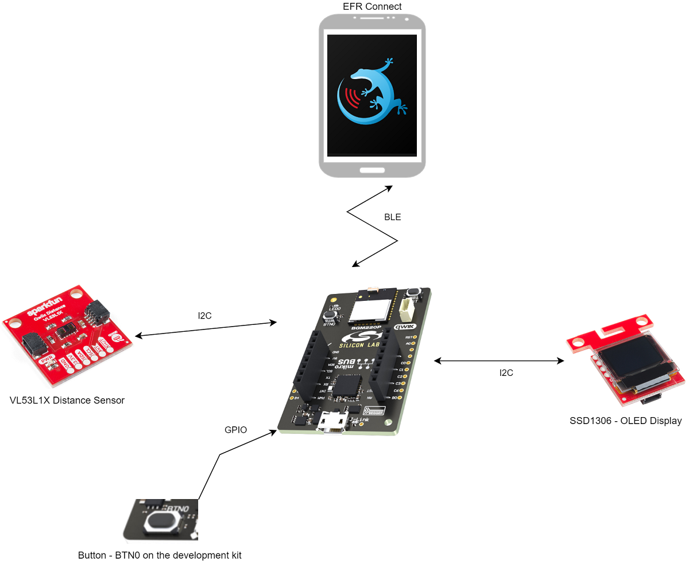

More detailed information can be found in the section [How it works](#how-it-works).

This code example referred to the following code examples. More detailed information can be found here:

- [OLED SSD1306 driver](https://github.com/SiliconLabs/platform_hardware_drivers/tree/master/oled_ssd1306_i2c)
- [Bluetooth security feature](https://github.com/SiliconLabs/bluetooth_stack_features_staging/tree/master/security)
- [Distance sensor driver](https://github.com/SiliconLabs/platform_hardware_drivers/tree/master/distance_vl53l1x)

## Gecko SDK Suite version

GSDK v4.0.2

## Hardware Required

- [BGM220 Bluetooth Module Explorer Kit](https://www.silabs.com/development-tools/wireless/bluetooth/bgm220-explorer-kit)

- [SparkFun Micro OLED Breakout (Qwiic) board](https://www.sparkfun.com/products/14532)

- [SparkFun Distance Sensor Breakout](https://www.sparkfun.com/products/14722)

## Connections Required

The hardware connection is shown in the image below:

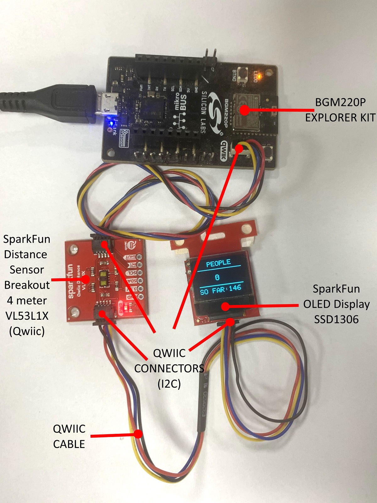

The I2C connection is make from BGM220 Bluetooth Module Explorer Kit to the Distance Sensor Breakout board and the Micro OLED Breakout by using the qwiic cable.

## Setup

To test this application, you can either import the provided `bluetooth_people_counting.sls` project file or start with an empty example project as the following:

1. Create a **Bluetooth - SoC Empty** project for the **BGM220 Bluetooth Module Explorer Kit** using Simplicity Studio 5.

2. Copy all attached files in *inc* and *src* folders into the project root folder (overwriting existing app.c).

3. Import the GATT configuration:

   - Open the .slcp file in the project.

   - Select the **CONFIGURATION TOOLS** tab and open the **Bluetooth GATT Configurator**.

   - Find the Import button and import the attached [gatt_configuration.btconf](config/gatt_configuration.btconf) file.

   - Save the GATT configuration (ctrl-s).

4. Open the .slcp file. Select the SOFTWARE COMPONENTS tab and install the software components:

    - Install **[Platform] > [Driver] > [I2CSPM]** component with add new instance name: **qwiic**. Set this component to use I2C1 peripheral, SCL to PD02 pin, SDA to PD03 pin.

        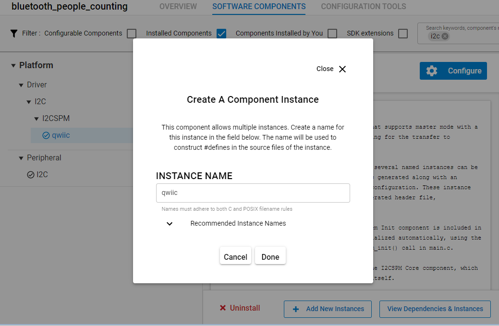
        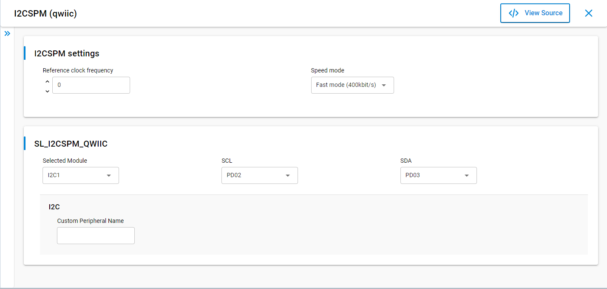

    - Install **[Platform] > [IO Stream] > [IO Stream: USART]** component with the default instance name: **vcom**.

    - Install **[Platform] > [Driver] > [Button] > [Simple Button]** component with the default instance name: **btn0**.

    - Install **[Platform] > [Driver] > [LED] > [Simple LED]** component with the default instance name: **led0**.

    - Install **[Services] > [NVM3] > [NVM3 Default Instance]** component.

    - Install **[Application] > [Utility] > [Log]** component.

5. Build and flash the project to your device.

## How it Works

### API overview

A detailed description of each function can be found in [doc/doxygen](doc/doxygen/html/modules.html).

### GATT Configurator

The application is based on the Bluetooth - SoC Empty example. Since the example already has the Bluetooth GATT server, advertising, and connection mechanisms, only minor changes are required.

The GATT changes were adding a new custom service (Air Quality Monitor) using UUID `3a79c933-c922-45c7-b5e7-9bdefd126dd9` which are 5 characteristics:

- **People Entered So Far**: UUID `cf88405b-e223-4976-82aa-78c6b305b0a8`

  - [**Readable**] - Get total number of people enter the room

  - [**Writable**] - Clear total number of people enter the room  

- **People Count**: UUID `2b9837e1-5560-49e5-a8cf-2f3b0db0bd6b`

  - [**Readable**] - Get number of people in the room

  - [**Writable**] - Clear number of people in the room  

- **Min Distance**: UUID `f2f7c459-e623-4970-ab36-d3a4651a694e`

  - [**Readable**] - Get minimum distance that is using by counting people algorithm (mm)

  - [**Writable**] - Set minimum distance that is using by counting people algorithm (mm)  

- **Max Distance**: UUID `d0a946d7-a183-4cb7-a9cb-b9c879cdb6fa`

  - [**Readable**] - Get maximum distance that is using by counting people algorithm (mm)

  - [**Writable**] - Set maximum distance that is using by counting people algorithm (mm)  

- **Distance Threshold**: UUID `0192bd9d-cb4f-49cc-b3dc-2d7facc9edcd`  
  - [**Readable**] - Get distance threshold that is using by counting people algorithm (mm)

  - [**Writable**] - Set distance threshold that is using by counting people algorithm (mm)(mm)  

- **Timing Budget**: UUID `01fb0e47-13c9-4369-88cc-07f58759a6a6`
  - [**Readable**] - Get timing budget that is using by counting people algorithm (ms)

  - [**Writable**] - Set timing budget that is using by counting people algorithm (ms)  

- **Notification Status**: UUID `ca89196b-76e2-41a0-9e41-342f4a2ff6f1`
  - [**Readable**] - Get notification status

  - [**Writable**] - Enable & disable notification status

- **Room capacity**: UUID `c714d394-7e0d-4c6a-a864-1183046a244c`
  - [**Readable**] - Get room capacity

  - [**Writable**] - Set room capacity

  - [**Notifiable**] - Get notification of room status( full or empty)

### People Counting Implementation

#### Application initialization

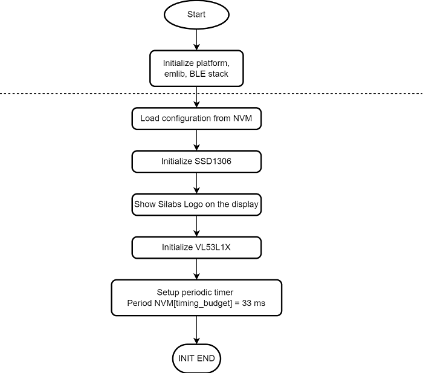  

#### Sensor initialization

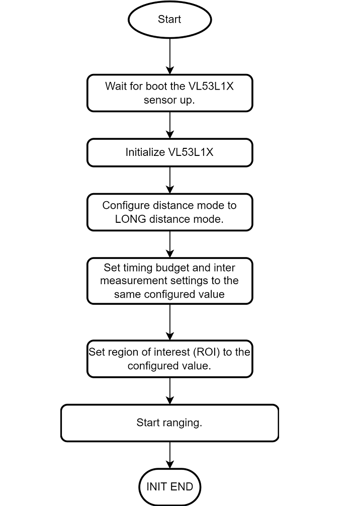  

#### Sensor sampling

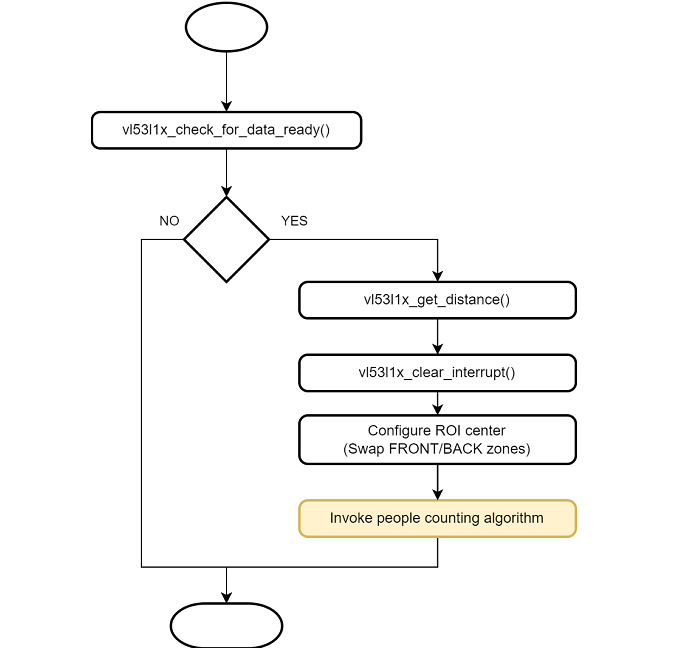

#### Application Workflows

1. Initialize the peripherals, the Bluetooth stack

2. Initialize and load the NVM3 configurations

3. Wait for the VL53L1X sensor is booted and initialize the VL53L1X sensor with the configurations from NVM3:

    - Distance mode: LONG

    - Timing budget: 33 ms

    - Region of interest SPADs: 8x16

4. Start ranging for the VL53L1X sensor.

5. Initialize the OLED display.

6. Start a periodic timer with period 1ms. The timer callback will fire an external event to ble stack and the event handler will do:

    - Check if ranging data is ready.

    - Get the new distance sample.

    - Calculate people counting algorithm with new distance sample.

    - Switch Region of interest( ROI) center to other zone( front or back)

7. Start a periodic timer with period 1000ms, The timer callback will fire an external event to ble stack and the event handler will display people counting data from the result of the counting algorithm calculation.

8. After the *sl_bt_evt_system_boot_id* event arrives, App sets up the security manager to bond with an iOS/Android device. And then start advertising.

9. Handle GATT event to help user configure the [counting algorithm](#counting-algorithm) and get the result from the algorithm calculation over the *EFR32 connect* mobile app

### Counting algorithm

The counting algorithm example relies on a list of states that have to occur in a certain order to detect if a person has crossed the specified area and in which direction this area has been crossed. These states are stored in a list and compared to two default lists of states that represent how the area is crossed in two different directions.

When no-one is seen in either of the two zones, the list of states is reset.
If we consider that a person detected in the front zone equals 2, and a person detected in the back zone equals 1, the algorithm adds the value of the two states and stores the result as soon as it changes.

Eventually, if the consecutive states in the list are 0, 1, 3, 2, 0 or 0, 2, 3, 1, 0 this means a person has been detected in one direction or the other, as described in figure below. List of status values.

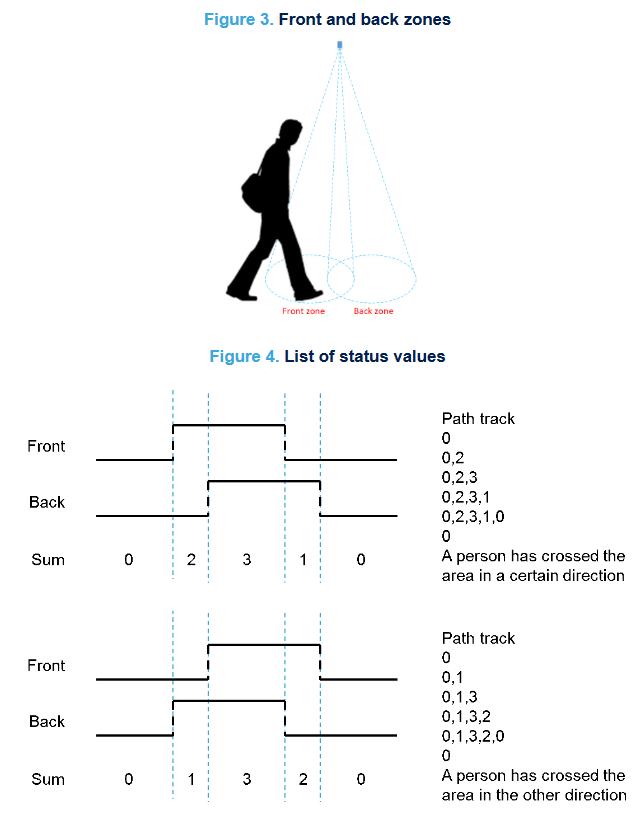  

Algorithm workflows

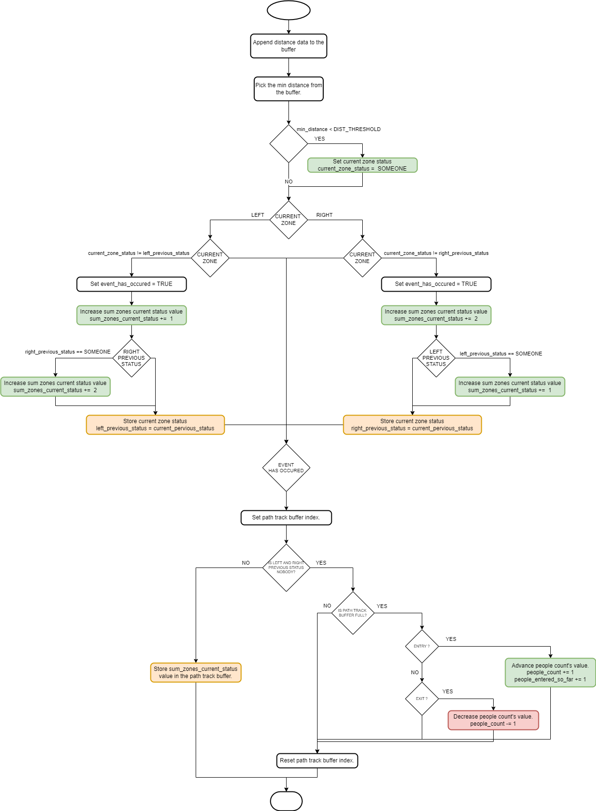

### OLED Display

- Display current people count and the value of the entered people so far

### Button

- Press button to clear current people count

### Room status notification

- To receive status of room(full or empty), the user need to use the [EFR Connect Mobile Application](#use-efr-connect-mobile-application) to enable notification
- If the number of people count is greater than room capacity then the device will send a "room is full" notification
- If the number of people count is zero then the device will send a "room is empty" notification

### Reset the counting value

- To reset the number of total people entered the room infomation, the user need to use the [EFR Connect Mobile Application](#use-efr-connect-mobile-application) to write 0 to the *People Entered So Far* characteristic
- To reset the number of people count infomation, the user need to use the [EFR Connect Mobile Application](#use-efr-connect-mobile-application) to write 0 to the *People Count* characteristic

### Use EFR Connect Mobile Application

#### Connect to the device

The Silicon Labs EFR Connect application utilizes the Bluetooth adapter on your phone/tablet to scan, connect and interact with BLE devices. To run this example, an iOS or Android smartphone with the EFR Connect app installed is required.

Open the EFR Connect application on your smartphone and allow the permission request when opened for the first time. Click [Develop] -> [Browser] and you will see a list of nearby devices which are sending Bluetooth advertisements. Find the one named *People Counting* and click the connect button on the right side. If app show the pairing request dialog, press **Pair** button to confirm authentication for the pairing process. After that, wait for the connection to be established and the GATT database to be loaded.

**Note**: The pairing process on Android and iOS devices is different. For more information, refer to bluetooth security.

| 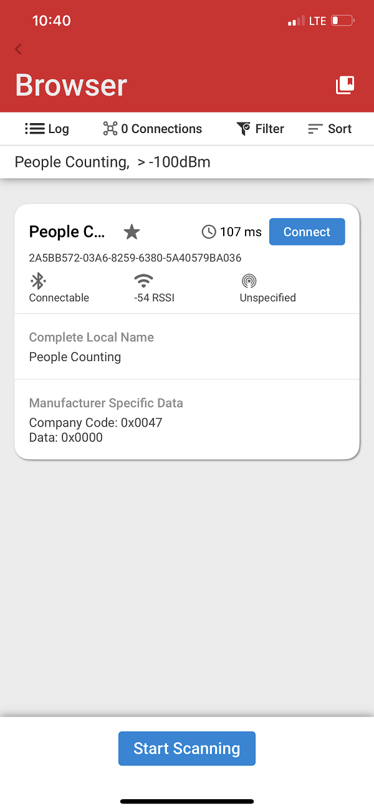 | 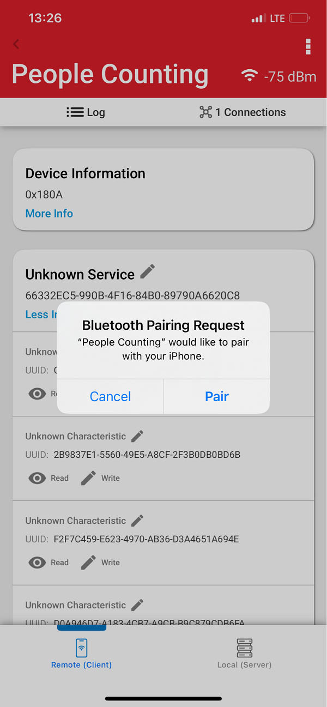|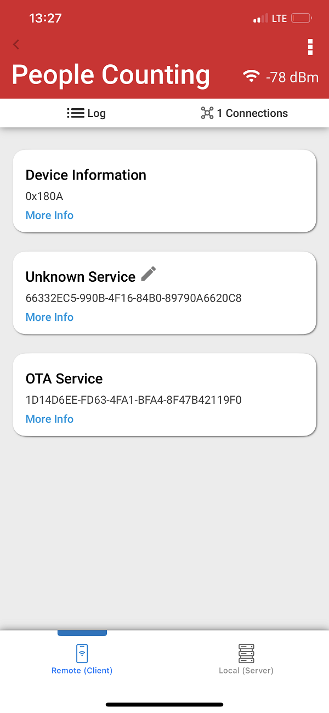|
| - | - | -|

#### Read/Write characteristics

The parameters of this example application can be easly configured via BLE characteristics. Values for the characteristics are handled by the application as ASCII strings. Tap on the main service to see the available characteristics. Please refer [GATT Configurator](#gatt-configurator) to choose correct characteristic.

**Read**

Push read button to request the value of a characteristic. (See ASCII fields.)

**Write**

For setting a parameter select a characteristic and tap on its write button. Type a new value in the ASCII field and push the **Send** button.

|People entered so far count|People count|Min distance|Max distance|
|-|-|-|-|
|- **Read** to get the current total people entered count   - **Write** *00 00* to reset total people entered count|- **Read** to get the current people count  - **Write** *00 00* to reset people count|- **Read** to get the current minimum distance setting  - **Write** to set minimum distance settings|- **Read** to get the current maximum distance setting  - **Write** to set maximum distance settings|

|Distance threshold|Timing budget|Notification status|Room capacity|
|-|-|-|-|
|- **Read** to get the current distance threshold setting  - **Write** to set distance threshold setting|- **Read** to get the current timing budget setting - **Write** to set timing budget setting|- **Read** to get the current notification status setting - **Write** to set notification status setting|- **Read** to get the current room capacity setting. - **Write** to set room capacity setting|

## .sls Projects Used

- [bluetooth_people_counting.sls](SimplicityStudio/bluetooth_people_counting.sls)
