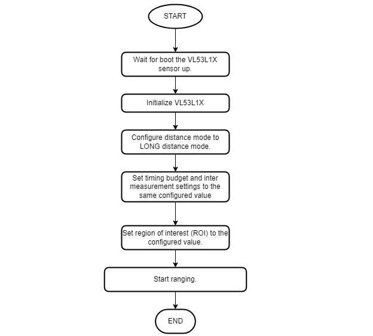
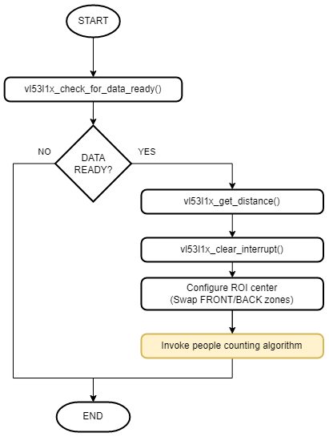

# Bluetooth - People Counting (VL53L1X) #

[%20board-green)](https://www.sparkfun.com/products/14532)

## Overview ##

This project aims to implement a people-counting application using Silicon Labs development kits integrated with the BLE wireless stack and a VL53L1X distance sensor.

This example can be as the first step in developing other upgrade applications based on it. It will be upgraded as a part of the people tracking system in the building or the factory and so on soon. Integrated with BLE wireless technology, therefore the user can control and monitor this system so easily.

## SDK version ##

- [SiSDK v2024.12.0](https://github.com/SiliconLabs/simplicity_sdk)
- [Third Party Hardware Drivers v4.1.0](https://github.com/SiliconLabs/third_party_hw_drivers_extension)

## Software Required ##

- [Simplicity Studio v5 IDE](https://www.silabs.com/developers/simplicity-studio)
- [Simplicity Connect Mobile App](https://www.silabs.com/developer-tools/simplicity-connect-mobile-app)

## Hardware Required ##

- 1x [Bluetooth Low Energy Development Kit](https://www.silabs.com/development-tools/wireless/bluetooth). For simplicity, Silicon Labs recommends the [BGM220-EK4314A](https://www.silabs.com/development-tools/wireless/bluetooth/bgm220-explorer-kit)
- 1x [SparkFun Micro OLED Breakout (Qwiic) board](https://www.sparkfun.com/products/14532)
- 1x [SparkFun Distance Sensor Breakout - VL53L1X](https://www.sparkfun.com/products/14722)
- 1x smartphone running the 'Simplicity Connect' mobile app

## Connections Required ##

The I2C connection is made from the BGM220 Bluetooth Module Explorer Kit to the Distance Sensor Breakout board and the Micro OLED Breakout by using the Qwiic cable.

The hardware connection is shown in the image below:

**Note:**

- If you use **SparkFun Thing Plus Matter - MGM240P** to run this application, you have to set up an external button, because it has no integrated button. Please, connect this button to **PB0** pin on the SparkFun Thing Plus Matter board.

- To connect the external button to the board and make the project more stable, you should use a ceramic capacitor (ex: Ceramic Capacitor 104) and a resistor to avoid the anti-vibration button used in the project as below.
  

## Setup ##

To test this application, you can either create a project based on an example project or start with a "Bluetooth - SoC Empty" project based on your hardware.

**NOTE**:

- Make sure that the [Third Party Hardware Drivers extension](https://github.com/SiliconLabs/third_party_hw_drivers_extension) is installed as part of the SiSDK and the [bluetooth_applications](https://github.com/SiliconLabs/bluetooth_applications) repository is added to [Preferences > Simplicity Studio > External Repos](https://docs.silabs.com/simplicity-studio-5-users-guide/latest/ss-5-users-guide-about-the-launcher/welcome-and-device-tabs).

- SDK Extension must be enabled for the project to install the required components.

### Create a project based on an example project ###

1. From the Launcher Home, add your hardware to **My Products**, click on it, and click on the **EXAMPLE PROJECTS & DEMOS** tab. Find the example project filtering by **"people counting"**.

2. Click **Create** button on the **Bluetooth - People Counting (VL53L1X)** example. Example project creation dialog pops up -> click Create and Finish and Project should be generated.

3. Build and flash this example to the board.

### Start with a "Bluetooth - SoC Empty" project ###

1. Create a **Bluetooth - SoC Empty** project for your hardware using Simplicity Studio 5.

2. Copy all attached files in **inc** and **src** folders into the project root folder (overwriting existing).

3. Import the GATT configuration:

    - Open the .slcp file in the project.

    - Select the **CONFIGURATION TOOLS** tab and open the **Bluetooth GATT Configurator**.

    - Find the Import button and import the configuration `bluetooth_people_counting/config/btconfig/gatt_configuration.btconf` file.

    - Save the GATT configuration (ctrl-s).

4. Open the .slcp file. Select the **SOFTWARE COMPONENTS** tab and install the software components:

    - [Services] → [IO Stream] → [IO Stream: USART] → default instance name: vcom

    - [Application] → [Utility] → [Log]

    - [Platform] → [Driver] → [I2CSPM] → default instance name: qwiic

    - [Platform] → [Driver] → [Button] → [Simple Button] → default instance name: btn0
  
    - [Platform] → [Driver] → [LED] → [Simple LED] → default instance name: led0

    - [Third Party Hardware Drives] → [Sensors] → [VL53L1X - Distance Sensor Breakout (Sparkfun)]
  
    - [Third Party Hardware Drives] → [Display & LED] → [SSD1306 - Micro OLED Breakout (Sparkfun - I2C)]

    - [Third Party Hardware Drives] → [Services] → [GLIB - OLED Graphics Library]
  
5. Build and flash the project to your device.

**Note:**

- A bootloader needs to be flashed to your board if the project starts from the "Bluetooth - SoC Empty" project, see [Bootloader](https://github.com/SiliconLabs/bluetooth_applications/blob/master/README.md#bootloader) for more information.

## How It Works ##

### GATT Database ###

Advertisement Packet Device name: **People Counting**

**GATT Database:**

- Device name: **People Counting**
- [Service] **People Counting**
  - [Char] **People Entered So Far**: `cf88405b-e223-4976-82aa-78c6b305b0a8`
    - [R] Get the number of people entering the room.
    - [W] Clear the number of people entering the room.
  - [Char] **People Count**: `2b9837e1-5560-49e5-a8cf-2f3b0db0bd6b`
    - [R] Get the number of people in the room.
    - [W] Clear the number of people in the room.
  - [Char] **Min Distance:**: `f2f7c459-e623-4970-ab36-d3a4651a694e`
    - [R] Get minimum distance that is used by counting people algorithm (mm).
    - [W] Set minimum distance that is used by counting people algorithm (mm).
  - [Char] **Max Distance:**: `d0a946d7-a183-4cb7-a9cb-b9c879cdb6fa`
    - [R] Get maximum distance that is used by counting people algorithm (mm).
    - [W] Set maximum distance that is used by counting people algorithm (mm).
  - [Char] **Distance Threshold:**: `0192bd9d-cb4f-49cc-b3dc-2d7facc9edcd`
    - [R] Get distance threshold that is used by counting people algorithm (mm).
    - [W] Set distance threshold that is used by counting people algorithm (mm).
  - [Char] **Timing Budget:**: `01fb0e47-13c9-4369-88cc-07f58759a6a6`
    - [R] Get timing budget that is used by counting people algorithm (ms).
    - [W] Set timing budget that is used by counting people algorithm (ms).
  - [Char] **Notification Status:**: `ca89196b-76e2-41a0-9e41-342f4a2ff6f1`
    - [R] Get notification status.
    - [W] Enable & disable notification status.
  - [Char] **Room capacity:**: `c714d394-7e0d-4c6a-a864-1183046a244c`
    - [R] Get room capacity.
    - [W] Set room capacity.
    - [N] Get notification of room status( full or empty).

### People Counting Implementation ###

#### Application initialization ####

  

#### Sensor initialization ####

  

#### Sensor sampling ####

#### Application Workflows ####

1. Initialize the peripherals, the Bluetooth stack

2. Initialize and load the previous configurations from NVM memory.

3. Wait for the VL53L1X sensor to be booted and initialize the VL53L1X sensor with the configurations from NVM3:

    - Distance mode: LONG

    - Timing budget: 33 ms

    - Region of interest SPADs: 8x16

4. Start ranging for the VL53L1X sensor.

5. Initialize the OLED display.

6. Start a periodical timer every second. The timer callback will raise an external event to the BLE stack and the event handler will do:

    - Check if the ranging data is ready.

    - Get a new distance sample.

    - Calculate people counting algorithm with new distance sample.

    - Switch the Region of Interest (ROI) center to other zones (front or back)

7. Start a periodical timer with 1000 milliseconds for each periodic period, The timer callback will raise an external event to the BLE stack and the event handler will display people counting data which was calculated by the people counting algorithm calculation.

8. After the **sl_bt_evt_system_boot_id** event arrives, the application sets up the security manager to bond with an iOS or Android device. And then start advertising.

9. Handle GATT events to help the user configure the counting algorithm and get the result from the algorithm calculation over the **Simplicity Connect** mobile application.

### People Counting algorithm ###

The counting algorithm example relies on a list of states that have to occur in a certain order to detect if a person has crossed the specified area and in which direction this area has been crossed. These states are stored in a list and compared to two default lists of states that represent how the area is crossed in two different directions.

When no one is seen in either of the two zones, the list of states is reset.
If we consider that a person detected in the front zone equals 2, and a person detected in the back zone equals 1, the algorithm adds these values and stores the result as soon as it changes.

Eventually, if the consecutive states in the list are 0, 1, 3, 2, 0 or 0, 2, 3, 1, 0 this means a person has been detected in one direction or the other, as described in the figure below. List of status values.

  

#### Algorithm workflows ####

### Testing ###

#### OLED Display ####

Display the number of people standing in the detected areas and the second value represents the number of people who entered the room.
  

#### Button ####

Press the button to clear the number of people who are standing in detected areas.

#### Room status notification ####

- To receive the room's state (full or empty), the user needs to enable notification for the **Room Capacity** characteristic.

- If the number of entered people is greater than the room capacity then the device will send a "room is full" notification to the client.
  
- If the number of entered people is zero then the device will send a "room is empty" notification to the client.

#### Reset the counting value ####

- To reset the number of people who entered the room, the user has to write 0 to the **People Entered So Far** characteristic.
  
- To reset the number of people currently, the user has to write 0 to the **People Count** characteristic.

#### Connect to the device ####

Follow the below steps to test the example with the Simplicity Connect application:

- Open the Simplicity Connect app on your smartphone and allow the permission requested the first time it is opened.

- Find your device in the Bluetooth Browser, advertising as *People Counting*, and tap Connect. Then you need accept the pairing request when connected for the first time. After that, wait for the connection to be established and the GATT database to be loaded.

  **Note**: The pairing process on Android and iOS devices is different. For more information, refer to Bluetooth security.

  |  | ||
  | - | - | -|

- You can launch Console that's integrated into Simplicity Studio or use a third-party terminal tool like TeraTerm to receive the data from the USB. A screenshot of the console output is shown in the figure below.

  
