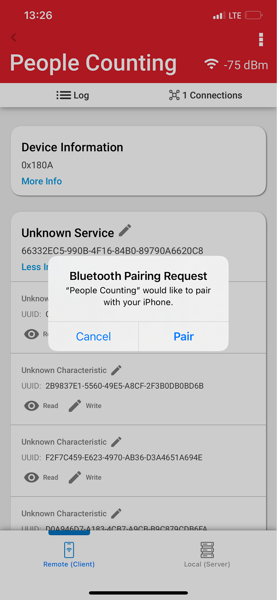

# Bluetooth - People Counting (AK9753) #

## Overview ##

This project aims to implement a people counting application using [SparkFun Human Presence Sensor Breakout - AK9753 (Qwiic)](https://www.sparkfun.com/products/14349) and Sparkfun development board [Sparkfun Thing Plus MGM240P](https://www.sparkfun.com/products/20270) with integrated BLE stack.

## Gecko SDK Suite version ##

- GSDK v4.2.1
- [Third Party Hardware Drivers v1.2.0](https://github.com/SiliconLabs/third_party_hw_drivers_extension)

## Hardware Required ##

- [SparkFun Thing Plus Matter - MGM240P - BRD2704A](https://www.sparkfun.com/products/20270)
- [SparkFun Human Presence Sensor Breakout - AK9753 (Qwiic)](https://www.sparkfun.com/products/14349)
- [SparkFun Micro OLED Breakout (Qwiic)](https://www.sparkfun.com/products/14532)

**NOTE:**
Tested boards for working with this example:

| Board ID | Description  |
| ---------------------- | ------ |
| BRD2704A | [SparkFun Thing Plus Matter - MGM240P - BRD2704A](https://www.sparkfun.com/products/20270) |
| BRD2601B | [EFR32xG24 Dev Kit - xG24-DK2601B](https://www.silabs.com/development-tools/wireless/efr32xg24-dev-kit?tab=overview)   |
| BRD2703A | [EFR32xG24 Explorer Kit - XG24-EK2703A](https://www.silabs.com/development-tools/wireless/efr32xg24-explorer-kit?tab=overview)    |
| BRD4108A | [BG22 Bluetooth SoC Explorer Kit - BG22-EK4108A](https://www.silabs.com/development-tools/wireless/bluetooth/bg22-explorer-kit?tab=overview)    |
| BRD4314A | [BGM220 Bluetooth Module Explorer Kit - BGM220-EK4314A](https://www.silabs.com/development-tools/wireless/bluetooth/bgm220-explorer-kit?tab=overview)    |

## Connections Required ##

The hardware connection is shown in the image below:

Listed below are the port and pin mappings for working with this example.

- Board: **BRD2704A - SparkFun Thing Plus Matter - MGM240P**

    | GPIO Pin | Connection | Pin function |
    |:---:|:-------------:|:---------------|
    | GPIOB | PB00 | Button |
    | SCL | PB03 | I2C Clock |
    | SDA | PB04 | I2C Data |

- Board: **BRD2601B - EFR32xG24 Dev Kit- xG24**

    | GPIO Pin | Connection | Pin function |
    |:---:|:-------------:|:---------------|
    | GPIOB | PB02 | Button |
    | SCL | PC04 | I2C Clock |
    | SDA | PC05 | I2C Data |

- Board: **BRD2703A - EFR32xG24 Explorer Kit - XG24**

    | GPIO Pin | Connection | Pin function |
    |:---:|:-------------:|:---------------|
    | GPIOB | PB02 | Button |
    | SCL | PC04 | I2C Clock |
    | SDA | PC05 | I2C Data |

- Board: **BRD4108A - BG22 Bluetooth SoC Explorer Kit - BG22**

    | GPIO Pin | Connection | Pin function |
    |:---:|:-------------:|:---------------|
    | GPIOB | PC07 | Button |
    | SCL | PD02 | I2C Clock |
    | SDA | PD03 | I2C Data |

- Board: **BRD4314 Bluetooth Module Explorer Kit**

    | GPIO Pin | Connection | Pin function |
    |:---:|:-------------:|:---------------|
    | GPIOB | PB00 | Button |
    | SCL | PD02 | I2C Clock |
    | SDA | PD03 | I2C Data |

## Setup ##

To test this application, you can either create a project based on an example project or start with a "Bluetooth - SoC Empty" project based on your hardware. 

**NOTE:**

- Make sure that the [SDK extension](https://github.com/SiliconLabs/third_party_hw_drivers_extension) is already installed and this repository is added to [Preferences > Simplicity Studio > External Repos](https://docs.silabs.com/simplicity-studio-5-users-guide/latest/ss-5-users-guide-about-the-launcher/welcome-and-device-tabs).

- SDK Extension must be enabled for the project to install the required components.

### Create a project based on an example project ###

1. From the Launcher Home, add your hardware to MyProducts, click on it, and click on the **EXAMPLE PROJECTS & DEMOS** tab. Find the example project with the filter "people".

2. Click **Create** button on the **Bluetooth - People Counting (AK9753)** example. Example project creation dialog pops up -> click Create and Finish and Project should be generated.

3. Build and flash this example to the board.

### Start with a "Bluetooth - SoC Empty" project ###

1. Create a **Bluetooth - SoC Empty** project for your hardware using Simplicity Studio 5.

2. Copy all attached files in *inc* and *src* folders into the project root folder (overwriting existing app.c).

3. Import the GATT configuration:

    - Open the .slcp file in the project.

    - Select the **CONFIGURATION TOOLS** tab and open the **Bluetooth GATT Configurator**.

    - Find the Import button and import the attached [gatt_configuration.btconf](config/btconf/gatt_configuration.btconf) file.

    - Save the GATT configuration (ctrl-s).
4. Open the .slcp file. Select the SOFTWARE COMPONENTS tab and install the software components:
    - Install [Platform] > [Driver] > [I2CSPM] component with the default instance name: **qwiic**.
    - Install [Platform] > [IO Stream] > [IO Stream: USART] component with the default instance name: **vcom**.
    - Install [Platform] > [Driver] > [Button] > [Simple Button] component with the instance name: **btn0**.
    - Install [Bluetooth] > [NVM] > [NVM Support] component.
    - Install [Application] > [Utility] > [Log] component.
    - [Third Party Hardware Drivers] → [Display & LED] → [SSD1306 - Micro OLED Breakout (Sparkfun) - I2C] → use default configuaration
    - [Third Party Hardware Drivers] → [Service] → [GLIB - OLED Graphics Library]
    - [Third Party Hardware Drivers] → [Sensors] → [AK9753 - Human Presence Sensor (Sparkfun) - I2C]
5. Build and flash the project to your device.

**NOTE:**
- Some boards do not have an integrated button. In this case, the user has to connect an external button to the board and config this button in accordance with project specifics. 
 
To make the driver more stable, use a ceramic capacitor (ex: Ceramic Capacitor 104) to avoid the anti-vibration button used in the project as below:

- Do not forget to flash a bootloader to your board, see [Bootloader](https://github.com/SiliconLabs/bluetooth_applications/blob/master/README.md#bootloader) for more information.

## How it Works

### Application overview

### GATT Configuration

The application is based on the Bluetooth - SoC Empty example. Since the example already has the Bluetooth GATT server, advertising, and connection mechanisms, only minor changes are required.

A new custom service (People Counting) with 8 characteristic must be added.

- **People Entered So Far**:
  - [**Readable**] - Get total number of people enter the room

  - [**Writable**] - Clear total number of people enter the room

- **People Count**:
  - [**Readable**] - Get number of people in the room

  - [**Writable**] - Clear number of people in the room

- **Room Capacity**:
  - [**Readable**] - Get the capacity of the room

  - [**Writable**] - Set the capacity of the

  - [**Notifiable**] - Get notification of room status( full or empty)

- **Lower Threshold**:
  - [**Readable**] - Get the lower threshold

  - [**Writable**] - Set the lower threshold

- **Upper Threshold**:
  - [**Readable**] - Get the upper threshold

  - [**Writable**] - Set the upper

- **IR Threshold**:
  - [**Readable**] - Get the IR threshold

  - [**Writable**] - Set the IR threshold

- **Hysteresis**:
  - [**Readable**] - Get hysteresis

  - [**Writable**] - Set hysteresis

- **Notification status**:
  - [**Readable**] - Get the notification status

  - [**Writable**] - Set the notification status

### People Counting Implementation

#### Application initialization

#### Sensor initialization

#### Application Workflows

1. Initialize the peripherals, the Bluetooth stack

2. Initialize and load the NVM3 configurations

3. Initialize the AK9753 sensor with the configuration loaded from NVM3:
    - Upper threshold: 100
    - Lower threshold: -200
    - IR Threshold: 800
    - Hysteresis: 50

4. Initialize OLED display

5. Start a periodic timer with a period of 1000ms, The timer callback will fire an external event to the BLE stack and the event handler will display people counting data from the result of the counting algorithm calculation.

6. After the *sl_bt_evt_system_boot_id* event arrives, application sets up the security manager to bond with an iOS/Android device. And then start advertising.

7. Handle GATT event to help users configure the [counting algorithm](#counting-algorithm) and get the result from the algorithm calculation over the *EFR32 connect* mobile

### Counting algorithm

The AK9753 sensor includes 4 IR sensors that are arranged in the picture below, and the detection algorithm will be based on the values of the IR2 and IR4.

We divide the ambient space into 3 areas: front, back and middle zone. Whenever a person appears in one of these 3 zones, a trigger will happen to notify that there is a person in this area and the status of this area will be also stored in a list. The order of these state values in the list is used to detect the moving direction of the person. For example, if the consecutive states in the list are 0, 1, 3, 2 or 0, 2, 3, 1 this means a person has been detected in one direction or the other.

When no-one is seen in either of the two zones, the list of states will be reset. The workflow of the whole algorithm is described in the picture below.

### OLED Display

- Display the current people count and people entered so far values.

### Button

- Press the button to reset the people count to 0.

### Room status notification

- To receive the status of the room (full or empty), the user should use the [EFR Connect Mobile Application](#use-efr-connect-mobile-application) to enable notification
- If the number of people counts is greater than the room capacity then the device will send a "room is full" notification
- If the number of people count is zero then the device will send a "room is empty".

### Reset the counting value

- To reset the number of total people who entered the room, the user should use the [EFR Connect Mobile Application](#use-efr-connect-mobile-application) to write 0 to the *People Entered So Far* characteristic
- To reset the number of people count, the user should use the [EFR Connect Mobile Application](#use-efr-connect-mobile-application) to write 0 to the *People Count* characteristic.

### Use EFR Connect Mobile Application

#### Connect to the device

The Silicon Labs EFR Connect application utilizes the Bluetooth adapter on your phone/tablet to scan, connect and interact with BLE devices. To run this example, an iOS or Android smartphone with the installed EFR Connect application is required.

Open the EFR Connect application on your smartphone and allow the permission request when opened for the first time. Click [Develop] -> [Browser] and you will see a list of nearby devices which are sending Bluetooth advertisements. Find the one named *People Counting* and click the connect button on the right side. If the application shows the pairing request dialog, press **Pair** button to confirm authentication for the pairing process. After that, wait for the connection to be established and the GATT database to be loaded.

**Note**: The pairing process on Android and iOS devices is different. For more information, refer to Bluetooth security.

|  | ||
| - | - | -|

#### Read/Write characteristics

The parameters of this example application can be easily configured via BLE characteristics. Values for the characteristics are handled by the application as ASCII strings. Tap on the main service to see the available characteristics. Please refer [GATT Configurator](#gatt-configurator) to choose the correct characteristic.

**Read**

Push the read button to request the value of a characteristic. (See ASCII fields.)

**Write**

For setting a parameter select a characteristic and tap on its write button. Type a new value in the ASCII field and push the **Send** button.

|People entered so far count|People count|Upper threshold|Lower threshold|
|-|-|-|-|
|- **Read** to get the current total people entered count   - **Write** *00 00* to reset total people entered count|- **Read** to get the current people count  - **Write** *00 00* to reset people count|- **Read** to get the current upper threshold setting  - **Write** to set upper threshold settings|- **Read** to get the current lower threshold setting  - **Write** to set lower threshold settings|

|IR threshold|Hysteresis|Notification status|Room capacity|
|-|-|-|-|
|- **Read** to get the current IR threshold setting  - **Write** to set IR threshold setting|- **Read** to get the current hysteresis setting - **Write** to set hyteresis setting|- **Read** to get the current notification status setting - **Write** to set notification status setting|- **Read** to get the current room capacity setting. - **Write** to set room capacity setting|
