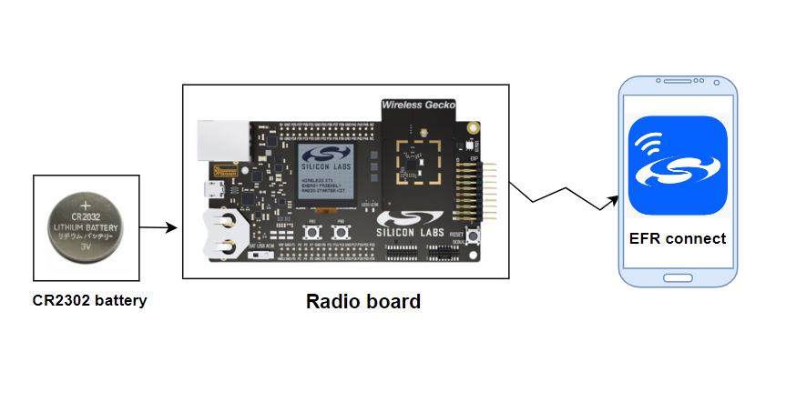
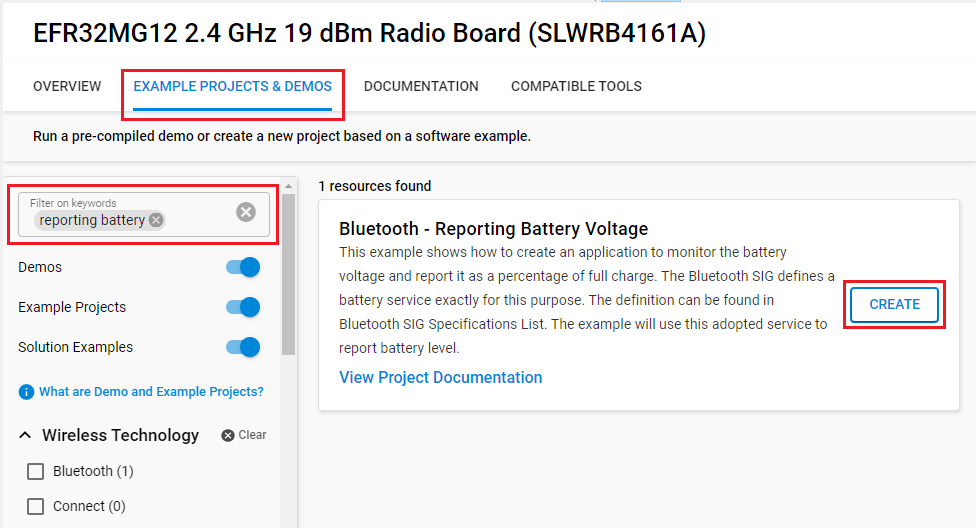
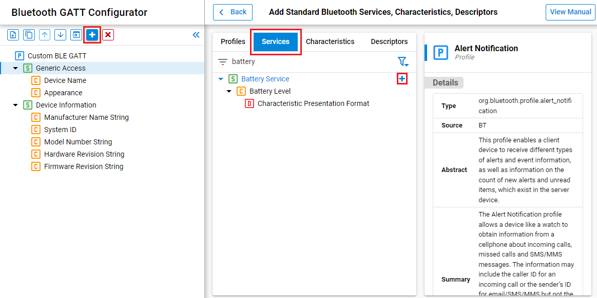
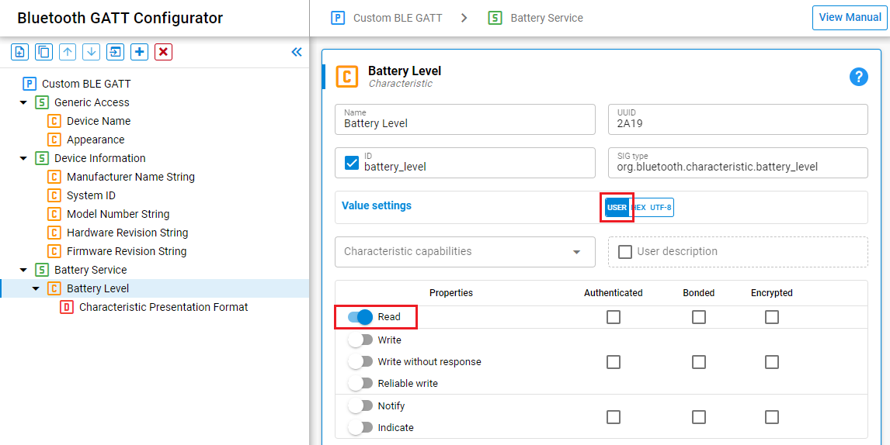
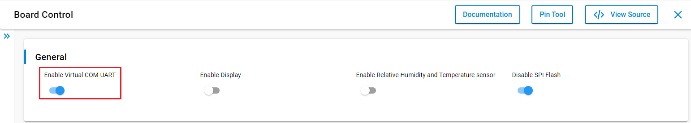
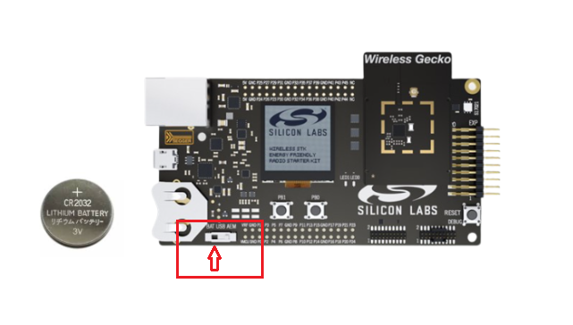
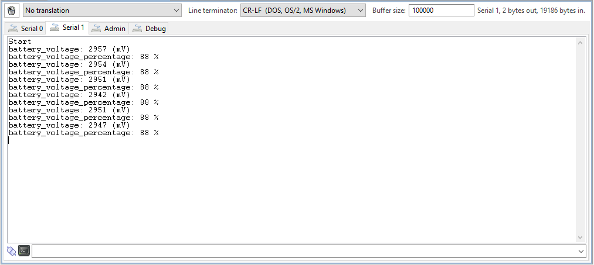
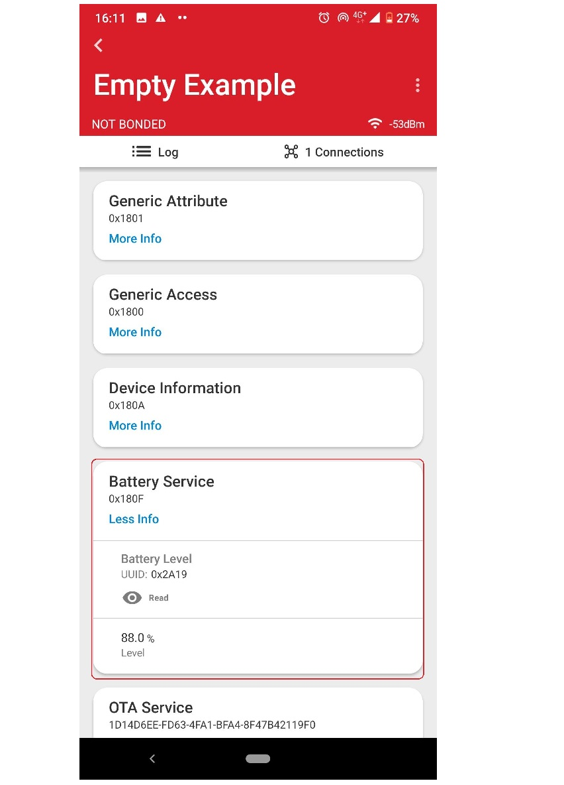

# Bluetooth - Reporting Battery Voltage

## Overview

This example shows how to create an application to monitor the battery voltage and report it as a percentage of full charge. The Bluetooth SIG defines a battery service exactly for this purpose. The definition can be found in [Bluetooth SIG Specifications List](https://www.bluetooth.com/specifications/specs/). The example will use this adopted service to report battery level. This example is very useful for users who want to monitor the battery voltage of their devices.

## Gecko SDK Suite version

- GSDK v4.2.1

## Hardware Required

- [BRD4161A - EFR32MG12 Wireless Gecko Starter Kit](https://www.silabs.com/development-tools/wireless/zigbee/slwrb4161a-efr32mg12-radio-board)
- CR2032 battery

**NOTE:**
Tested boards for working with this example:

| Board ID | Description  |
| ---------------------- | ------ |
| BRD4161A | [EFR32MG12 Wireless Gecko Starter Kit](https://www.silabs.com/development-tools/wireless/zigbee/slwrb4161a-efr32mg12-radio-board)    |

## Description
 
The battery level is measured using the EFR32’s ADC without the need for any external GPIO. In the attached `app.c` file, you will find functions which contain all code necessary to set up the ADC. The initial setup is performed by `init_adc_for_supply_measurement()`. This function mostly uses the defaults for the ADC with a few important adjustments. The inputs to the ADC are AVDD and VSS. The reference voltage is the internal 5 V reference. Users must choose the attenuation factors for the input voltage and the reference voltage. The following formulas are taken from the ADC section of the EFR32 reference manual. The attenuation factor for the reference voltage is defined as follows:
 
> ATTVREF = (VREFATT + 6) / 24 for VREFATT < 13, and (VREFATT - 3) / 12 for VREFATT ≥ 13
 
The attenuation for the input voltage is defined as follows:
 
> ATTVIN = VINATT / 12 for VINATT ≥ 3 (settings 0, 1, and 2 are not allowable values for VINATT)
 
The ADC is set up for 12 bit conversions, which results in a total of 4096 steps per conversion. The attenuation factor for the input voltage is chosen to 1 and the attenuation factor for the reference voltage is set to be 0.5. The full scale voltage for conversions is determined as follows:
 
> VFS = 2 × VREF × ATTVREF / ATTVIN
 
In the example,
 
> VFS = 2×(5.0)×(0.5)/(1)
> = 5.0 V
 
The number of volts per division, VFS/4096 = 1221 μV/division
 
Using this information, you can determine the battery supply voltage.
 
`app.c` file contains a function called `read_supply_voltage()`, which can be used to read the ADC converted value and return it as the battery voltage in mV.
 
The boot handler for the application starts a **sleep timer** to schedule an ADC conversion once per second. The handler for the timer will trigger an **external event** to the Bluetooth stack by using the function `sl_bt_external_signal()`. The handler for the external event in the event loop will start conversion and then read the converted value. The specification for the service requires the value to be reported as a percentage so the measured voltage is converted to a percentage of 3300 mV. This value is then used in the read request handler.

## Setup

To test this application, you can either create a project based on a example project or start with an "Bluetooth - SoC Empty" project based on your hardware.

### Create a project based on a example project

1. From the Launcher Home, add the your hardware to My Products, click on it, and click on the **EXAMPLE PROJECTS & DEMOS** tab. Find the example project with filter "reporting battery".

2. Click Create button on the **Bluetooth - Reporting Battery Voltage** example. Example project creation dialog pops up -> click Create and Finish and Project should be generated.

3. Build and flash this project to the board.

### Start with a "Bluetooth - SoC Empty" project

1. Create a **Bluetooth - SoC Empty** project for your hardware using Simplicity Studio 5.

2. Copy all attached files in inc and src folders into the project root folder (overwriting existing).

3. Import the GATT configuration:

    - Open the .slcp file in the project.

    - Select the **CONFIGURATION TOOLS** tab and open the **Bluetooth GATT Configurator**.

    - Find the Import button and import the attached [gatt_configuration.btconf](config/btconf/gatt_configuration.btconf) file.

    - Save the GATT configuration (ctrl-s).
    
    or you can configure using **Bluetooth GATT Configurator** tool.

    - Add **Battery Service** service.
    

    - Setting the **Battery Level** characteristic, change value type to **USER** and enable **Read** property.
    

4. Open the .slcp file. Select the **SOFTWARE COMPONENTS** tab and install the software components:

    - [Services] → [IO Stream] → [IO Stream: USART] → default instance name: vcom

    - [Application] → [Utility] → [Log]

    - [Platform] → [Board] → [Board Control] →  configure: Enable Virtual COM UART
    

    - [Platform] → [Peripheral] → [ADC]

5. Build and flash the project to your device.

**NOTE:**

- Make sure that this repository is added to [Preferences > Simplicity Studio > External Repos](https://docs.silabs.com/simplicity-studio-5-users-guide/latest/ss-5-users-guide-about-the-launcher/welcome-and-device-tabs).

## How It Works

Place the CR2032 battery to Starter Kit and change power switch from **AEM** to **BAT**

**Note:**

- If you choose the AEM power input, the battery level will always be 100%.
 
Launch the console to see log messages.  

 

Open the EFR Connect app on your smartphone, open the Bluetooth Browser tab, and connect to your device. Expand the Battery Service and then press **Read** button on the Battery Level characteristic.

