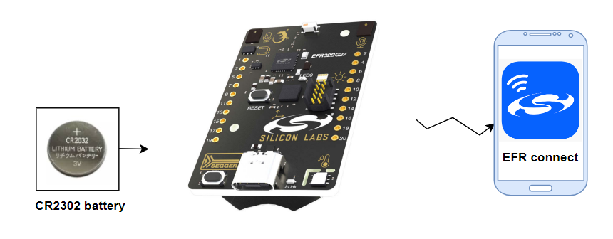

# Bluetooth - Reporting Battery Voltage

## Overview

This example shows how to create an application to monitor the battery voltage and report it as a percentage of full charge. The Bluetooth SIG defines a battery service exactly for this purpose. The definition can be found in [Bluetooth SIG Specifications List](https://www.bluetooth.com/specifications/specs/). The example will use this adopted service to report battery level. This example is very useful for users who want to monitor the battery voltage of their devices.

## Description

The battery level is measured using the EFR32’s IADC without the need for any external GPIOs. In the attached `app.c` file, you will find functions which contain all the necessary code to set up the IADC. The initial setup is performed by `init_adc_for_supply_measurement()`. This function mostly uses the defaults for the ADC with a few important adjustments. The inputs to the ADC are AVDD and GND. The IADC has an internal 1.21V bandgap reference voltage that is independent of the chip's voltage supplies, and it's capable of attenuating the supply voltage input by a factor of 4, meaning we must multiply the raw data with (4 * 1210) to get the VFS for this example:

> VFS = 4 * 1210 (mV)

By default, Series 2 devices' IADC use 12-bits (0 to 4095) so the number of volts per division shall be VFS/4095 = 1183 μV/division

`app.c` file contains a function called `read_supply_voltage()`, which can be used to read the ADC converted value and return it as the battery voltage in mV.

The boot handler for the application starts a **sleep timer** to schedule an ADC conversion once per second. The handler for the timer will trigger an **external event** to the Bluetooth stack by using the function `sl_bt_external_signal()`. The handler for the external event in the event loop will start conversion and then read the converted value. The specification for the service requires the value to be reported as a percentage so the measured voltage is converted to a percentage of 3300 mV. This value is then used in the read request handler.

## SDK version

- [SiSDK v2024.12.0](https://github.com/SiliconLabs/simplicity_sdk)

## Software Required

- [Simplicity Studio v5 IDE](https://www.silabs.com/developers/simplicity-studio)
- [Simplicity Connect Mobile App](https://www.silabs.com/developer-tools/simplicity-connect-mobile-app)

## Hardware Required

- 1x [Bluetooth Low Energy Development Kit](https://www.silabs.com/development-tools/wireless/bluetooth). For example, [XG24-DK2601B](https://www.silabs.com/development-tools/wireless/efr32xg24-dev-kit)
- 1x CR2032 battery
- 1x smartphone running the 'Simplicity Connect' mobile app

## Connections Required

- Connect the Bluetooth Development Kits to the PC through a compatible-cable.

## Setup

To test this application, you can either create a project based on an example project or start with a "Bluetooth - SoC Empty" project based on your hardware.

**NOTE**:

- Make sure that the [bluetooth_applications](https://github.com/SiliconLabs/bluetooth_applications) repository is added to [Preferences > Simplicity Studio > External Repos](https://docs.silabs.com/simplicity-studio-5-users-guide/latest/ss-5-users-guide-about-the-launcher/welcome-and-device-tabs).

- SDK Extension must be enabled for the project to install the required components.

### Create a project based on an example project

1. From the Launcher Home, add your hardware to My Products, click on it, and click on the **EXAMPLE PROJECTS & DEMOS** tab. Find the example project filtering by "reporting battery".

2. Click *Create* button on the **Bluetooth - Reporting Battery Voltage** example. Example project creation dialog pops up -> click Create and Finish and Project should be generated.

3. Build and flash this project to the board.

### Start with a "Bluetooth - SoC Empty" project

1. Create a **Bluetooth - SoC Empty** project for your hardware using Simplicity Studio 5.

2. Copy all attached files in *inc* and *src* folders into the project root folder (overwriting existing files).

3. Import the GATT configuration:

    - Open the .slcp file in the project.

    - Select the **CONFIGURATION TOOLS** tab and open the **Bluetooth GATT Configurator**.

    - Find the Import button and import the attached [gatt_configuration.btconf](config/btconf/gatt_configuration.btconf) file.

    - Save the GATT configuration (ctrl-s).

    or you can configure using **Bluetooth GATT Configurator** tool.

    - Add **Battery Service** service.
    

    - Setting the **Battery Level** characteristic, change value type to **USER** and enable **Read** property.
    

4. Open the .slcp file. Select the **SOFTWARE COMPONENTS** tab and install the software components:

    - [Services] → [IO Stream] → [IO Stream: USART] → default instance name: vcom

    - [Application] → [Utility] → [Log]

    - [Platform] → [Peripheral] → [IADC]

5. Build and flash the project to your device.

**NOTE:**

- A bootloader needs to be flashed to your board if the project starts from the "Bluetooth - SoC Empty" project, see [Bootloader](https://github.com/SiliconLabs/bluetooth_applications/blob/master/README.md#bootloader) for more information.

## How It Works

Use the CR2032 battery as the main power sources.

- If you are using Silicon Labs motherboards alongside Silicon Labs chips, make sure to turn **AEM** to **BAT**
- If you are using Development Kits alongside Silicon Labs chips, make sure use the battery as the main power source

**Note:**

- For those who uses Silicon Labs mother boards, if you choose AEM, the battery level will always be close to 100%
- For those who uses Silicon Labs Development Kits, if you use battery and also connect to the USB Connector at the same time, the battery level will always be close to 100%

Launch the console to see log messages.  

Follow the below steps to test the example with the Simplicity Connect application:

1. Open the Simplicity Connect app on your smartphone and allow the permission requested the first time it is opened.

2. Find your device in the Bluetooth Browser, advertising as *bma400_sensor*, and tap Connect.

3. Expand the Battery Service and then press **Read** button on the Battery Level characteristic.

   
