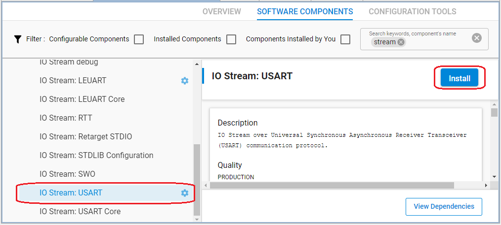
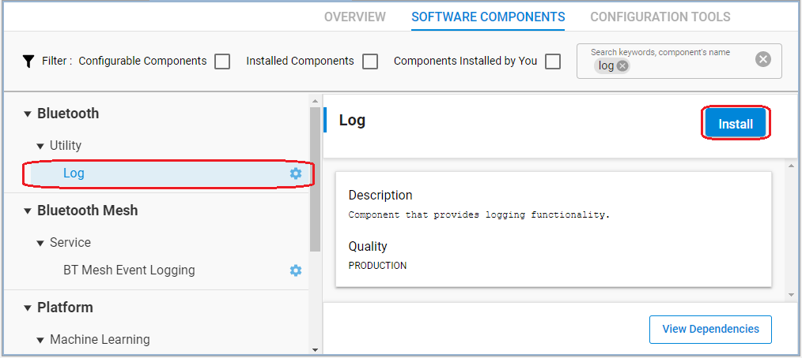
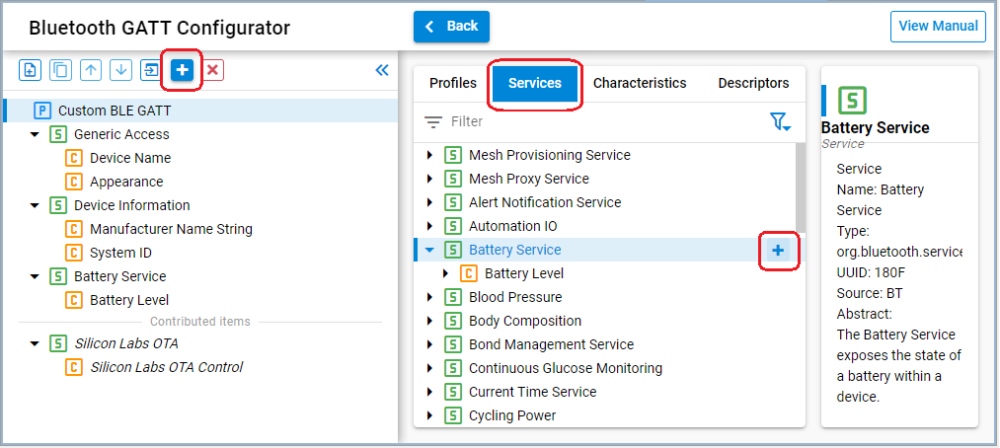
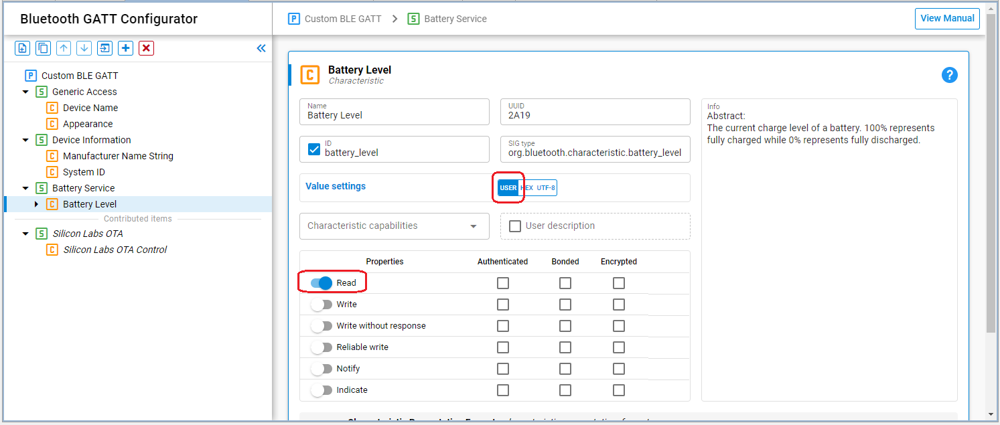
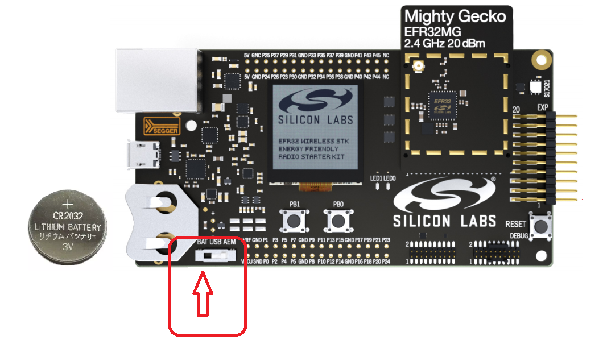
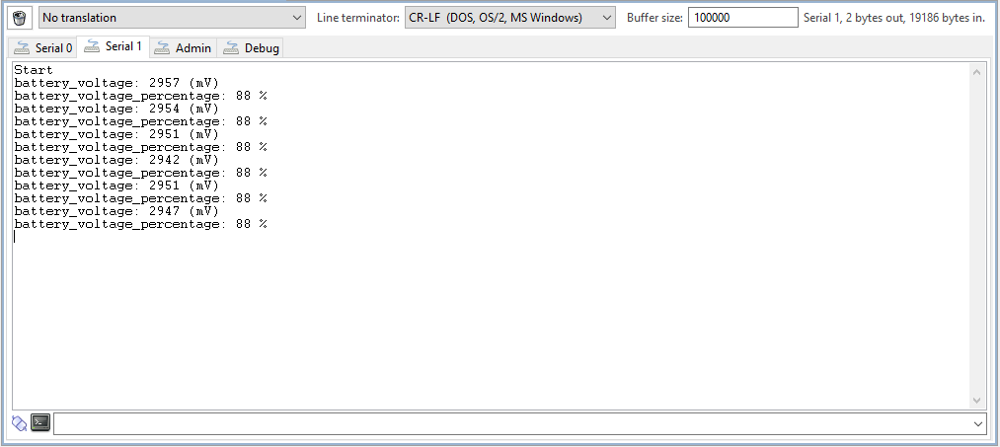
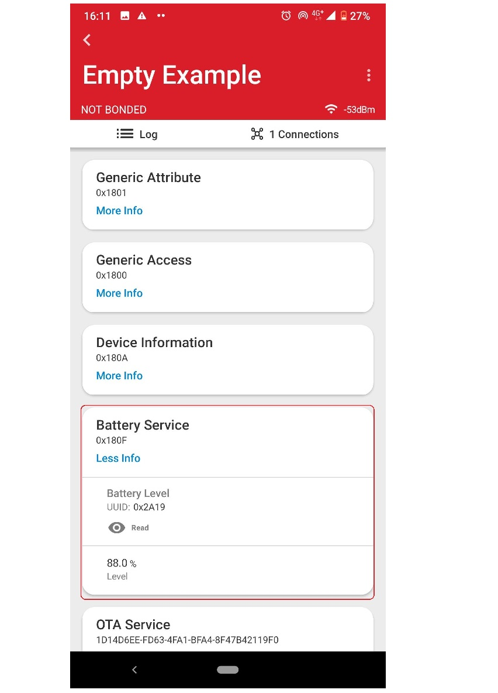

# Reporting Battery Voltage over BLE

## Description
 
This example shows how to create an application to monitor the battery voltage and report it as a percentage of full charge. The Bluetooth SIG defines a battery service exactly for this purpose. The definition can be found in [Bluetooth SIG Specifications List](https://www.bluetooth.com/specifications/specs/). The example will use this adopted service to report battery level.
 
The battery level is measured using the EFR32’s ADC without the need for any external GPIO. In the attached `app.c` file, you will find functions which contain all code necessary to set up the ADC. The initial setup is performed by `init_adc_for_supply_measurement()`. This function mostly uses the defaults for the ADC with a few important adjustments. The inputs to the ADC are AVDD and VSS. The reference voltage is the internal 5 V reference. Users must choose the attenuation factors for the input voltage and the reference voltage. The following formulas are taken from the ADC section of the EFR32 reference manual. The attenuation factor for the reference voltage is defined as follows:
 
> ATTVREF = (VREFATT + 6) / 24 for VREFATT < 13, and (VREFATT - 3) / 12 for VREFATT ≥ 13
 
The attenuation for the input voltage is defined as follows:
 
> ATTVIN = VINATT / 12 for VINATT ≥ 3 (settings 0, 1, and 2 are not allowable values for VINATT)
 
The ADC is set up for 12 bit conversions, which results in a total of 4096 steps per conversion. The attenuation factor for the input voltage is chosen to 1 and the attenuation factor for the reference voltage is set to be 0.5. The full scale voltage for conversions is determined as follows:
 
> VFS = 2 × VREF × ATTVREF / ATTVIN
 
In the example,
 
> VFS = 2×(5.0)×(0.5)/(1)
> = 5.0 V
 
The number of volts per division, VFS/4096 = 1221 μV/division
 
Using this information, you can determine the battery supply voltage.
 
`app.c` file contains a function called `read_supply_voltage()`, which can be used to read the ADC converted value and return it as the battery voltage in mV.
 
The boot handler for the application starts a **sleep timer** to schedule an ADC conversion once per second. The handler for the timer will trigger an **external event** to the Bluetooth stack by using the function `sl_bt_external_signal()`. The handler for the external event in the event loop will start conversion and then read the converted value. The specification for the service requires the value to be reported as a percentage so the measured voltage is converted to a percentage of 3300 mV. This value is then used in the read request handler.

## Setting up
 
1. Create a new **SoC-Empty** project.

2. Copy the attached **app.c** file into the project folder (replacing the existing one).

3. Config **Software components**, add **Print log** driver.

    - Install **IO Stream: USART** component with the default instance name: **vcom**  
    
    

    - Enable **Virtual COM UART** in the **Board Control** component  
      
      

    - Install the **Log** component (found under Bluetooth > Utility group)
      

4. Config **GATT** using **Bluetooth GATT Configurator** tool.

    - Add **Battery Service** service.  
      

    - Setting the **Battery level** characteristic, change value type to `user`. Enable `Read` property.
    

    - Or you can pess `Import` button and import the attached config file: [gatt_configuration.btconf](config/gatt_configuration.btconf)

4. **Save and close** then the tool will auto-generate to code.

5. Build and flash the project to your devices.

## Usage
 
To run the example:

1. Build the project and flash it to your hardware.  

2. Place the CR2032 battery to Starter Kit. Change power switch from AEM to BAT.  
If you choose the AEM power input, the battery level will always be 100%.

  

2. Launch the console to see log messages.  

  

Open the EFR Connect app on your smartphone, open the Bluetooth Browser tab, and connect to your device. Expand the Battery Service and then press `Read` button on the Battery Level characteristic.

  
