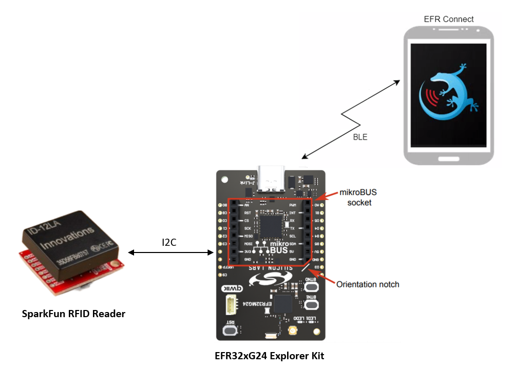
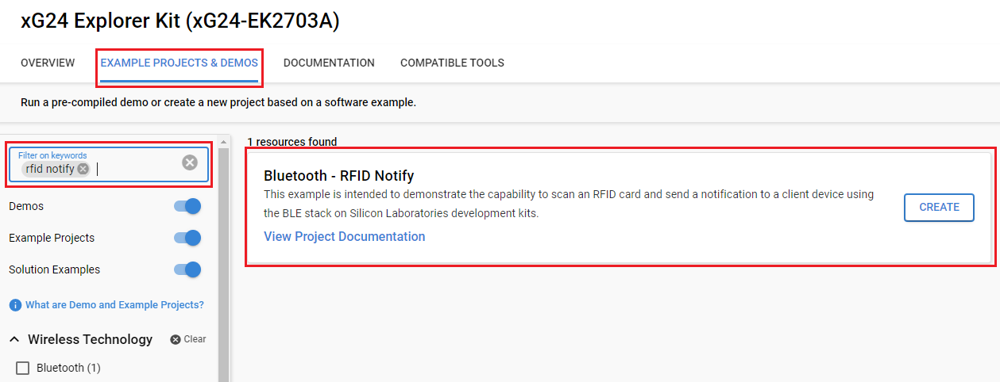
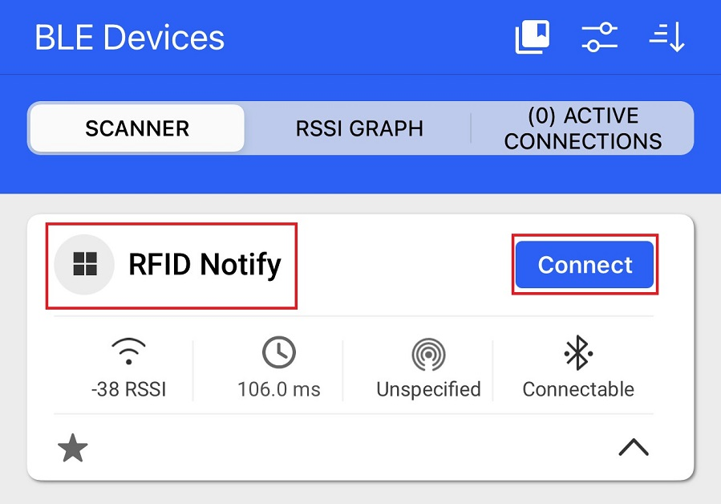
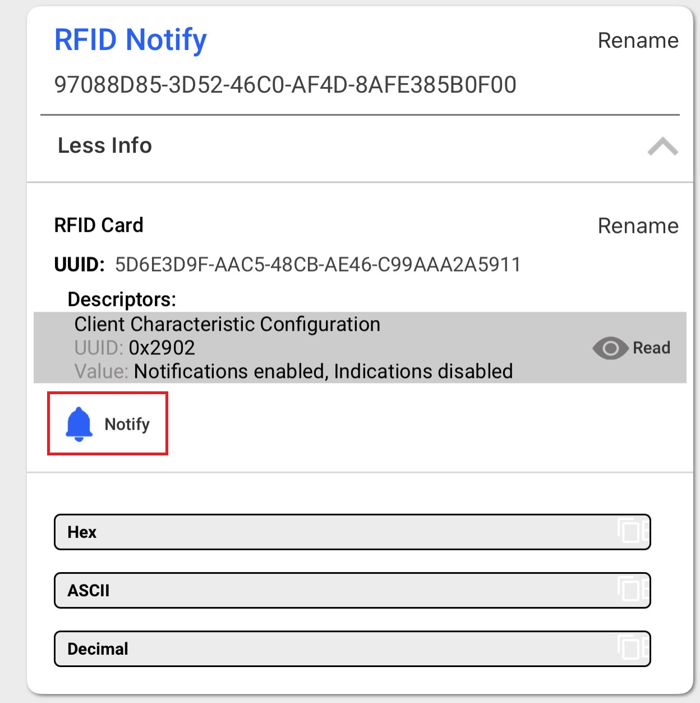
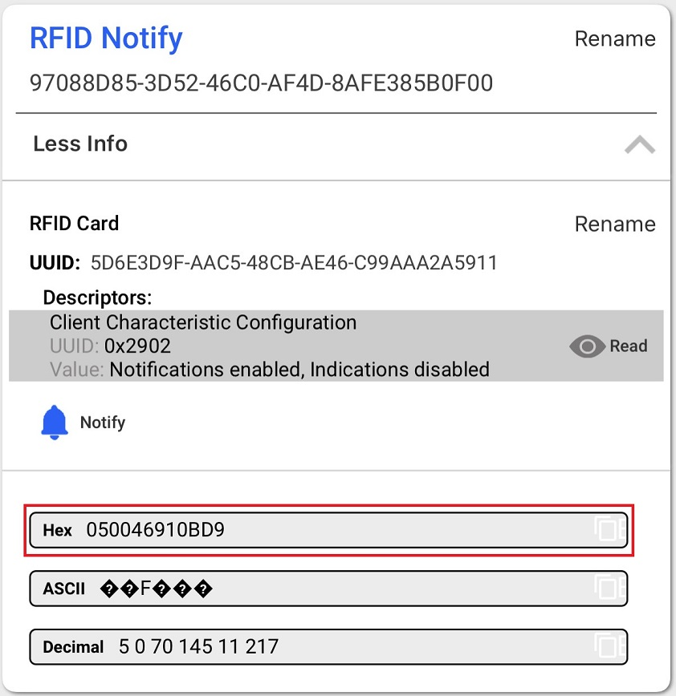
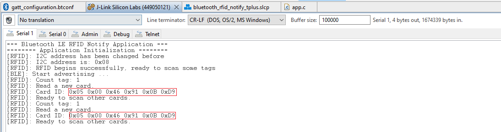

# Bluetooth - RFID Notify #

## Overview ##

This example is intended to demonstrate the capability to scan an RFID card and send a notification to a client device using the BLE stack on Silicon Laboratories development kits. A peer device can connect and receive notifications when a 125 kHz card is scanned.

This example is also the foundation for developing automatic door lock systems, automatic car parks, and so on. The system will use BLE for wireless communication between the Silicon Labs board and the EFR connect mobile application.

##  Gecko SDK version ##

 - GSDK v4.3.0

## Hardware Required ##

- [EFR32xG24-EK2703A Explorer Kit Board](https://www.silabs.com/development-tools/wireless/efr32xg24-explorer-kit?tab=overview)
  
- [ID-12LA SparkFun RFID Reader](https://www.sparkfun.com/products/11827)
  
- [125kHz RFID Card](https://www.sparkfun.com/products/14325)

**NOTE:**
Tested boards for working with this example:

| Board ID | Description  |
| ---------------------- | ------ |
| BRD2703A | [EFR32xG24 Explorer Kit - XG24-EK2703A ](https://www.silabs.com/development-tools/wireless/efr32xg24-explorer-kit?tab=overview)    |
| BRD2601B | [EFR32xG24 Dev Kit - XG24-DK2601B ](https://www.silabs.com/development-tools/wireless/efr32xg24-dev-kit?tab=overview)    |
| BRD4314A | [BGM220 Bluetooth Module Explorer Kit - BGM220-EK4314A](https://www.silabs.com/development-tools/wireless/bluetooth/bgm220-explorer-kit?tab=overview)  |
| BRD4108A | [BG22 Bluetooth SoC Explorer Kit - BG22-EK4108A](https://www.silabs.com/development-tools/wireless/bluetooth/bg22-explorer-kit?tab=overview)  |
| BRD2704A | [SparkFun Thing Plus Matter - MGM240P](https://www.sparkfun.com/products/20270)  |

## Connections Required ##

The following picture shows the system view of how it works.

The I2C connection is made from the Silicon Labs's Kit to the SparkFun RFID Reader board by using the qwiic cable.

## Setup ##

To test this application, you can either create a project based on an example project or start with a "Bluetooth - SoC Empty" project based on your hardware.

### Create a project based on an example project ###

1. From the Launcher Home, add your hardware to **My Products**, click on it, and click on the **EXAMPLE PROJECTS & DEMOS** tab. Find the example project with the filter **"rfid notify"**.

2. Click **Create** button on the **Bluetooth - RFID Notify** example. Example project creation dialog pops up -> click Create and Finish and Project should be generated.

3. Build and flash this example to the board.

### Start with a "Bluetooth - SoC Empty" project ###

1. Create a **Bluetooth - SoC Empty** project for your hardware using Simplicity Studio 5.

2. Copy all attached files in **inc** and **src** folders into the project root folder (overwriting existing).

3. Import the GATT configuration:

    - Open the .slcp file in the project.

    - Select the **CONFIGURATION TOOLS** tab and open the **Bluetooth GATT Configurator**.
    
    - Find the Import button and import the configuration `bluetooth_rfid_notify/config/btconfig/gatt_configuration.btconf` file.

    - Save the GATT configuration (ctrl-s).

4. Open the .slcp file. Select the **SOFTWARE COMPONENTS** tab and install the software components:

    - [Services] → [IO Stream] → [IO Stream: USART] → default instance name: vcom

    - [Application] → [Utility] → [Log]

    - [Third Party Hardware Drivers] → [Wireless Connectivity] → [ID-12LA - RFID Reader (Sparkfun) - I2C]

5. Build and flash the project to your device.

**Note:**

- Make sure the [Third Party Hardware Drivers Extension](https://github.com/SiliconLabs/third_party_hw_drivers_extension/blob/master/README.md) already be installed and this repository is added to [Preferences > Simplicity Studio > External Repos](https://docs.silabs.com/simplicity-studio-5-users-guide/latest/ss-5-users-guide-about-the-launcher/welcome-and-device-tabs).

- Do not forget to flash a bootloader to your board, see [Bootloader](https://github.com/SiliconLabs/bluetooth_applications/blob/master/README.md#bootloader) for more information.

## How It Works ##

### GATT Database ###

The application is based on the Bluetooth - SoC Empty example. Since the example already has the Bluetooth GATT server, advertising, and connection mechanisms, only minor changes are required.

Advertisement Packet Device name: **RFID Notify**

GATT Database

- Device name: **RFID Notify**

- **[Service] RFID Notify**

    - **[Char] RFID Card**

        - [N] Notify card's UID.

### Testing ###

Since the Bluetooth SIG has not defined a Service or Characteristic for RFID cards we will be creating a new custom service with UUID `97088d85-3d52-46c0-af4d-8afe385b0f00` and a custom characteristic with UUID `5d6e3d9f-aac5-48cb-ae46-c99aaa2a5911`. The custom characteristic has read and indicate properties and we assign an id of `card_uid` so that we can reference it in our application. The `card_uid` characteristic is 6 bytes which will contain the UID of the last card scanned.

When a card is scanned, the application will notify all connected devices, with the notification enabled, of the updated `card_uid` value.

You can use a smartphone app, such as the **EFR Connect** application on your phone, to connect to the board. Please, follow some steps below:

- Open the EFR Connect app.

- Open the Bluetooth Browser.

- Find the device advertising as **RFID Notify**.

- Click on **Connect** button.

When the device is connected, you have to find the **RFID Notify** service, then **RFID Card** and enable "Notify" for this characteristic as in the following picture:

After finishing all the steps above, you can tap an RFID card on the reader module and observe the value change. The Hex value represents the card's UID.

You can launch Console that's integrated into Simplicity Studio or use a third-party terminal tool like TeraTerm to receive the data from the USB. A screenshot of the console output is shown in the figure below.

