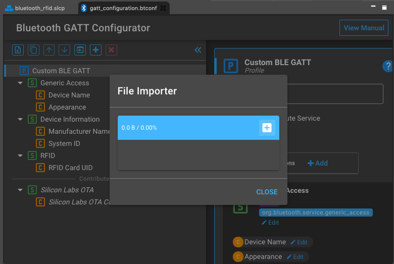
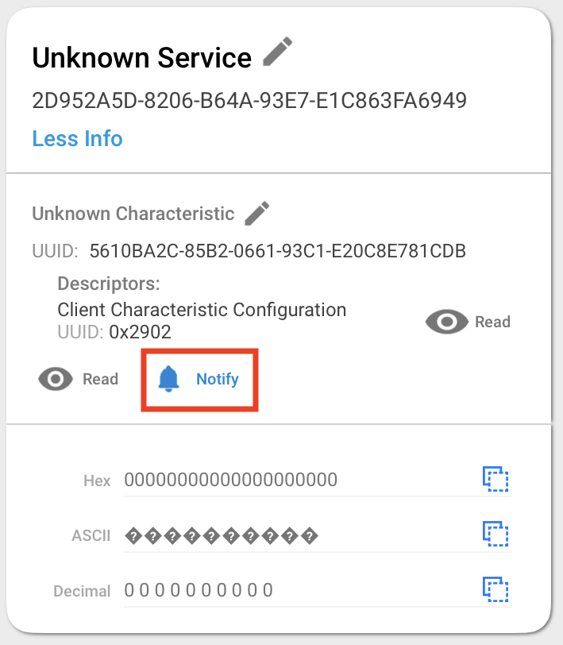
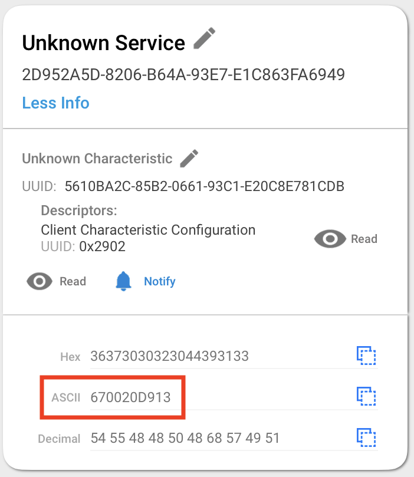

# RFID Card Scan over BLE


[](https://www.sparkfun.com/products/11827)
[](https://www.sparkfun.com/products/14325)


## Description
This project shows an example of a Bluetooth RFID Card Reader.

A peer device can to connect and receive notifications when a 125kHz card is scanned. It uses a reference [RFID driver](https://github.com/SiliconLabs/platform_hardware_drivers_staging/tree/master/rfid_id12la) component to interface with a UART connected ID-12la RFID reader module.

## Gecko SDK Version
Gecko SDK v3.1.2

## Hardware Required
- [BGM220-EK4314A BGM220 Bluetooth Module Explorer Kit (BRD4314A BGM220 Explorer Kit Board)](https://www.silabs.com/development-tools/wireless/bluetooth/bgm220-explorer-kit)
- [ID-12LA RFID Reader](https://www.sparkfun.com/products/11827)
- [125kHz RFID Card](https://www.sparkfun.com/products/14325)

## Setup
### Connections
Connect the RFID module to the BGM220P Explorer Kit as follows:
| BGM220P MikroBUS Socket | ID-12LA |
| ------- | ------- |
| 3V3 | Pin 2, Pin 11 (V) |
| GND | Pin 1, Pin 7 |
| RX | Pin 9 | 

> More information over the connectors and pinout of the BGM220P can be found in the [user guide](https://www.silabs.com/documents/public/user-guides/ug465-brd4314a.pdf).

### Creating a New Project

Import the [bluetooth_rfid.sls](SimplicityStudio/bluetooth_rfid.sls) project into Simplicity Studio 5 and flash the BGM220 Explorer Kit or follow these steps to start with an empty example project as a basis.

1. Create a "Bluetooth - SoC Empty" project for the "BGM220 Explorer Kit Board" using Simplicity Studio v5.

2. Once you have your new starter project, copy the [RFID driver](https://github.com/SiliconLabs/platform_hardware_drivers/tree/master/rfid_id12la) files into the project. Your project structure should look like the following:
    ```
    .
    ├── autogen                   # autogenerated files from components
    ├── config                    # configuration files from components
    ├── gecko_sdk_3.1.1           # Gecko SDK files
    ├── rfid_id_12la              # The RFID Driver
    │   ├── inc                   
    │   └── src
    └── ...
    ```

3. Add the driver includes to the path by opening the project properties and navigating to `C/C++ General > Paths and Symbols` and adding  `/${ProjName}/rfid_id_12la/inc` to the include directories list.

4. In the `.slcp` file go to the `Software Components` tab and add the following components:
   * `[Platform] > [Peripheral] > [EUSART]` (This includes the `EUSART` peripheral library)
   * `[Services] > [IO Stream] > [IO Stream: USART]` (you will need to name an instance of this component, e.g. "vcom")
   * `[Third Party] > [Tiny Printf]`
    
5. Import the GATT configuration to add the custom Service and Characteristic
   * Open the `.slcp` file in the project.
   * Select the `CONFIGURATION TOOLS` tab and open the "Bluetooth GATT Configurator".
   * Find the "Import" button and import the attached [gatt_configuration.btconf](config/gatt_configuration.btconf) file.
   * Save the GATT configuration: <kbd>control + s</kbd></br>
        

6. Replace the `app.c` file in the project's root folder with the [app.c](src/app.c) from this repository.

7. Build the project and flash to your device!

> Don't forget to flash a bootloader onto your board, if you have not done so already.

## How It Works

The application is based on the "Bluetooth - SoC Empty" example. Since the example project already has the Bluetooth GATT server, advertising, and connection mechanisms, only minor additions are required.

Since the Bluetooth SIG has not defined a Service or Characteristic for RFID cards we will be creating a new custom service with UUID `2d952a5d-8206-b64a-93e7-e1c863fa6949` and a custom characteristic with UUID `5610ba2c-85b2-0661-93c1-e20c8e781cdb`. The custom characteristic has read and indicate properties and we assign an id of `card_uid` so that we can reference it in our application. The `card_uid` characteristic is 10bytes which will contain the UID of the last card scanned.

When a card is scanned the application will notify all connected devices, with indications enabled, of the updated `card_uid` value.

Follow the below steps to test the example:

1. Open the EFR Connect app on your smartphone
2. Find your device in the Bluetooth Browser, advertising as "RFID Bluetooth Example", and tap Connect.
3. Find the unknown service matching the UUID we had defined above and read the unknown characteristic.
4. Enable indication on the unknown characteristic. 
5. Tap an RFID card to the reader module and observe the value change. The ASCII value represents the card's UID. 

You can launch the integrated serial console in Simplicity Studio or the serial terminal of your choice to view the logs from the virtual COM port. 


## .sls Projects Used

[bluetooth_rfid.sls](/SimplicityStudio/bluetooth_rfid.sls)

## How to Port to Another Part

Open the `.slcp` and in the "Overview" tab select "Change Target/SDK". Choose the new board or part to target and "Apply" the changes.
> There may be dependencies that need to be resolved when changing the target architecture.
