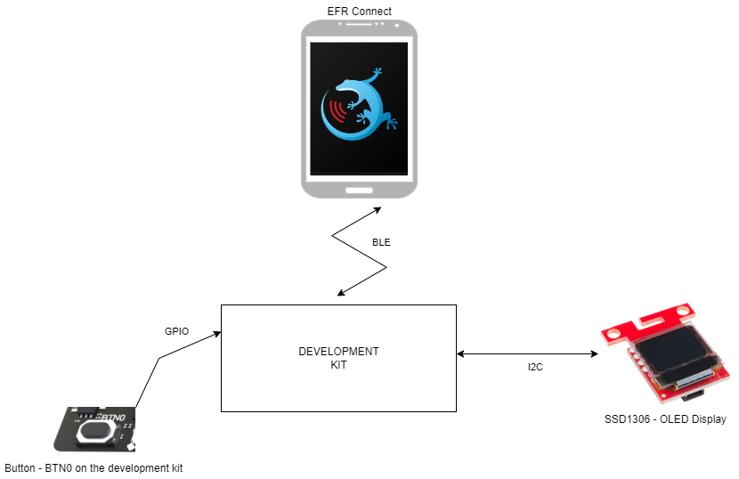
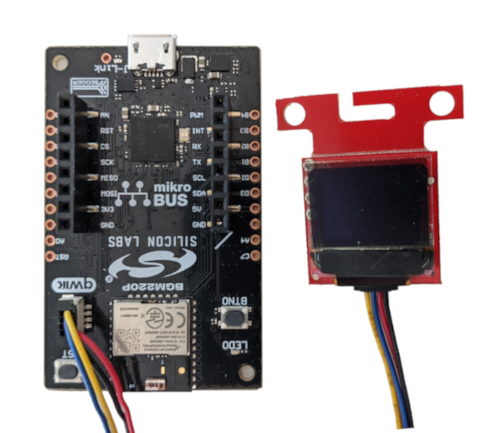
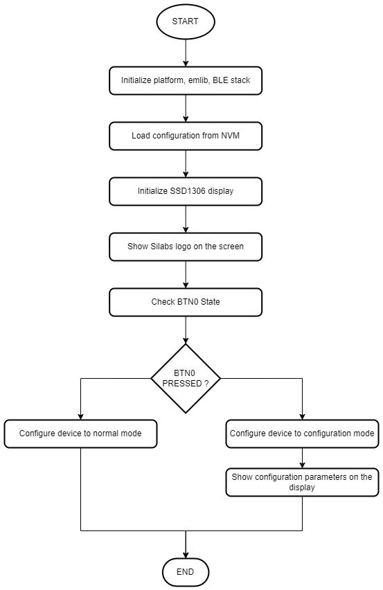
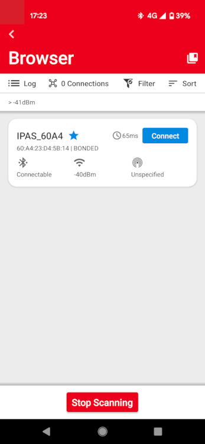
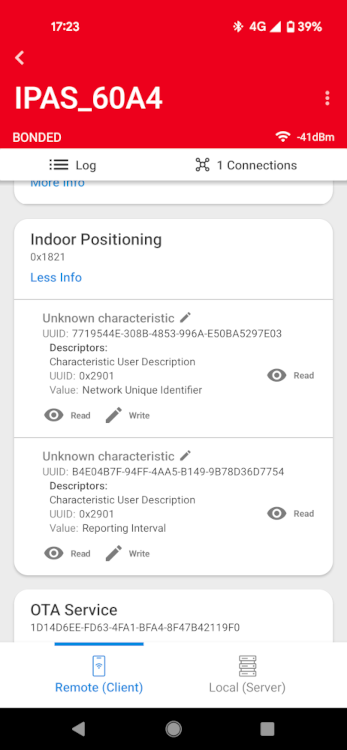
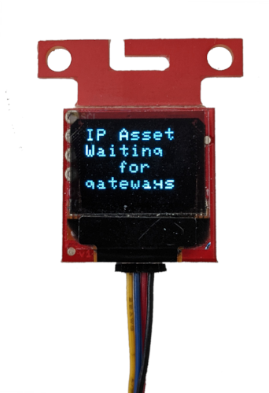
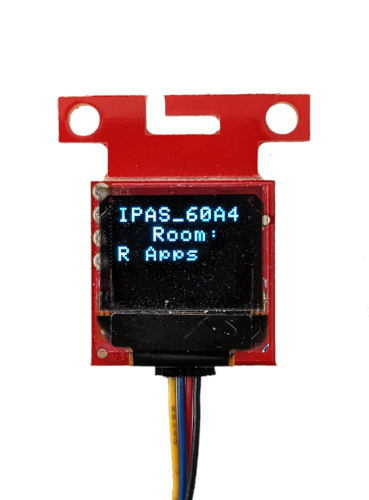

# Bluetooth - RSSI based room finding 

## Overview ##

Bluetooth RSSI Positioning is an application intended to showcase a room finder or asset locator service using the BLE stack on Silicon Laboratories development kits.

The block diagram of this application is shown in the image below:

More detailed information can be found in the section [How it works](#how-it-works).

This code example referred to the following code examples. More detailed information can be found here:

- [OLED SSD1306 driver](https://github.com/SiliconLabs/platform_hardware_drivers/tree/master/oled_ssd1306_i2c)

## Gecko SDK Suite version ##

GSDK v4.0.2

## Hardware Required ##

For the Asset:
- [BGM220 Bluetooth Module Explorer Kit](https://www.silabs.com/development-tools/wireless/bluetooth/bgm220-explorer-kit)
- [SparkFun Micro OLED Breakout (Qwiic) board](https://www.sparkfun.com/products/14532)

For the gateways:
- [EFR32xG22 Wireless Gecko Starter Kit](https://www.silabs.com/development-tools/wireless/efr32xg22-wireless-starter-kit)
- The example was done with an xG22 Wireless Starter Kit, however any other BLE capable development kit can be used.
- At least one gateway shall be active, however any number of gateways/rooms could be used.

## Connections Required ##

The hardware connection for the asset is shown in the image below:

The BGM220 explorer kit and the SparkFun Micro OLED Breakout (Qwiic) board can be connected with a [Flexible Qwiic Cable - Female Jumper](https://www.sparkfun.com/products/17261).

Gateways do not require a display.

## Setup ##

To set this application up, you can either import the provided `bluetooth_indoor_positioning_gateway.sls or bluetooth_indoor_positioning_asset.sls` project files or start with an empty example project as the following:

**Two separate projects shall be created, one for the Asset and one for the Gateways*

1. Create a **Bluetooth - SoC Empty** project for your device using Simplicity Studio 5.

2. Copy all attached files in *inc* and *src* folders into the project root folder (overwriting existing app.c).

3. Import the GATT configuration:

   - Open the .slcp file in the project.

   - Select the **CONFIGURATION TOOLS** tab and open the **Bluetooth GATT Configurator**.

   - Find the Import button and import the attached [gatt_configuration.btconf](config/gatt_configuration.btconf) file.

   - Save the GATT configuration (ctrl-s).

4. Open the .slcp file. Select the SOFTWARE COMPONENTS tab and install the software components:

    **Asset:**
    - Install **[Platform] > [Driver] > [I2CSPM]** component with add new instance name: **qwiic**. 
      - Set this component to use I2C1 peripheral, SCL to PD02 pin, SDA to PD03 pin.

      

    - Install **[Platform] > [IO Stream] > [IO Stream: USART]** component with the default instance name: **vcom**.

    - Install **[Platform] > [Driver] > [Button] > [Simple Button]** component with the default instance name: **btn0**.
      - SL_SIMPLE_BUTTON_SENSOR_INT_MODE → Poll and debounce
      - Selected Module → PB03

    - Install **[Services] > [NVM3] > [NVM3 Default Instance]** component.

    - Install **[Application] > [Utility] > [Log]** component.

    **Gateway:
    - Install **[Platform] > [IO Stream] > [IO Stream: USART]** component with the default instance name: **vcom**.

    - Install **[Platform] > [Driver] > [Button] > [Simple Button]** component with the default instance name: **btn0**.
      - SL_SIMPLE_BUTTON_SENSOR_INT_MODE → Poll and debounce
      - Selected Module → PB03

    - Install **[Services] > [NVM3] > [NVM3 Default Instance]** component.

    - Install **[Application] > [Utility] > [Log]** component.
    
5. Build and flash the projects to your devices.

### BLE RSSI Indoor Positioning Implementation ###

The Initialization software flow is as follows:

## How it Works ##

1. First, the software initializes the peripherals, the Bluetooth stack, and logging to the virtual COM port.
2. Application then check for the status of Button0 - either pressed or released.
3. Based on the button status, application either enters Configuration mode or Normal mode, both detailed below:

### Normal mode ###

Normal Mode is different for the two applications:
**Gateway**:
- Creates advertisement package from the configured Room ID, Room Name and Device Name
- Starts advertisements infinitely

**Asset**:
- Starts a periodic timer to trigger Room finding in given intervals.
- If the timer elapses, it trigger the room finding service which sets up and starts scanner to find gateways.
- Application is looking for gateways for a defined time limit (GATEWAY_FINDER_TIMEOUT_MS). Default value is 5 seconds.
- Once Gateway finding finished application checks if at least one gateway is found or not.
   - In case no gateways were found it displays "Waiting For Gateways" message on the OLED displays, resets the state of the room finder application and waits for the next trigger.
   - In case at least one gateway was found, it start collecting RSSI samples from all found gateways.
- Once enough samples were gathered, calculation starts and the application finds the closest gateway based on it's RSSI.
- The closest gateways data(Room name, Room Id) is used to create an advertisement package and starts advertising this data for 5 seconds.
- At the same time, the closest room's name is displayed on the OLED.
- Application resets the state and waits for the next trigger.

### Configuration mode ###

Configuration mode starts advertising, enables connections to the device and makes configuration updates possible. 

Both the Asset and the Gateway should be configured before using for the first time.

Follow the below steps to configure the devices for the example with the EFR Connect app:

1. Open the EFR Connect app on your iOS/Android device.

2. Hold down Button 0 while pressing the Reset button once and enter configuration mode.

3. Find your device in the Bluetooth Browser, advertising as either IPAS_#### or IPGW_####, and tap Connect. Then you need accept the pairing request when connected for the first time.

            
    
4. Find the Indoor Positioning service above the OTA service.

   

5. Read the descriptions to identify configuration options.

            

6. For both the **Asset** and the **Gateways** the Network Unique Identifier shall match, so enter a custom value for that(unsigned 4bytes (0 - 4294967295)

7. For the **Asset** the _Reporting Interval_ configuration value is the amount of time in seconds the asset recalculates it's own position and finds the closest room

8. You can launch the Console that is integrated on Simplicity Studio or can use a third-party terminal tool like TeraTerm to receive the data from the virtual COM port. Use the following UART settings: baud rate 115200, 8N1, no flow control. You should expect a similar output to the one below.

            

### GATT Configurator ###

The application is based on the Bluetooth - SoC Empty example. Since the example already has the Bluetooth GATT server, advertising, and connection mechanisms, only minor changes are required.

The GATT changes were adding a new service (Indoor Positioning) using UUID `1821` with 2 custom characteristics:

**Asset:**
- **Network Unique Identifier**: UUID `7719544e-308b-4853-996a-e50ba5297e03`

  - [**Readable**] - Get current unique network identifier

  - [**Writable with response**] - Set unique network identifier

- **Reporting Interval**: UUID `b4e04b7f-94ff-4aa5-b149-9b78d36d7754`

  - [**Readable**] - Get current reporting interval (in seconds)

  - [**Writable with response**] - Set reporting interval (in seconds)

**Gateway:**
- **Network Unique Identifier**: UUID `7719544e-308b-4853-996a-e50ba5297e03`

  - [**Readable**] - Get current unique network identifier

  - [**Writable with response**] - Set unique network identifier

- **Room ID**: UUID `41841d0f-5fee-400b-be5c-36323a41308d`

  - [**Readable**] - Get currently set Room Identifier

  - [**Writable with response**] - Set Room Identifier

- **Room Name**: UUID `c476ba11-db09-4bf5-9b82-6798560eb7aa`

  - [**Readable**] - Get currently set Room name

  - [**Writable with response**] - Set Room Name

### OLED Display ###

After the BLE stack's boot event is done, the following message will be displayed:

In case at least one gateway is in range "room finding" will start and will display the name of the closest room:

## .sls Projects Used ##

- [bluetooth_indoor_positioning_asset](Asset\SimplicityStudio\bluetooth_indoor_positioning_asset.sls)
- [bluetooth_indoor_positioning_gateway](Gateway\SimplicityStudio\bluetooth_indoor_positioning_gateway.sls)
