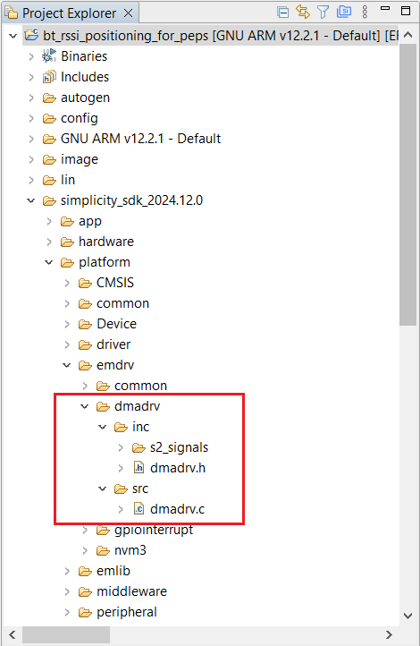

# Bluetooth - RSSI-based position estimation for PEPS #


## Summary ##

The project implements a rough RSSI-based position estimation for a Passive Entry Passive Start (PEPS) system. It consists of a central device and 4 or 8 peripheral units hooked up on a (TTL-level) LIN bus. The central device accepts incoming BLE connections and forwards the connection parameters to the peripheral units. These parameters are used for connection tracking to let the devices infer the RSSI values of the communication link, enabling multi-point trilateration.

## SDK version ##

- [SiSDK v2024.12.0](https://github.com/SiliconLabs/simplicity_sdk)

## Software Required ##

- [Simplicity Studio v5 IDE](https://www.silabs.com/developers/simplicity-studio)
- [Simplicity Connect Mobile App](https://www.silabs.com/developer-tools/simplicity-connect-mobile-app)

## Hardware Required ##

- At least 5 pieces of EFR32BG24 devices, the project is implemented on [BRD4186C](https://www.silabs.com/development-tools/wireless/xg24-rb4186c-efr32xg24-wireless-gecko-radio-board?tab=overview). One device is programmed as the leader device, and the remaining devices are programmed as follower units.

- 1x smartphone running the 'Simplicity Connect' mobile app

## Connections Required ##

The block diagram of this application is shown in the image below:


To set up the LIN bus, LIN_RX and LIN_TX pins of each device are connected. Then the combined RXTX signals are daisy-chained with twisted pair cables grounded on each device. The untwisted/unshielded segments of the wires are as short as possible to avoid picking up noise. The twisted cable could be replaced by some kind of coax cable. The bus is also terminated at both ends by 2.0 Kohm resistors connected to 3.3V. The resultant pull-up resistance is going to be `1 / (1 / 2.0 + 1 / 2.0) = 1.0 Kohm`.


The EXP pins are configured as:

| Pin    | GPIO | Name   | Description     |
|:------:|:----:|:------:|:---------------:|
| EXP_7  | PA05 | LIN_RX | LIN bus RX line |
| EXP_11 | PA06 | LIN_TX | LIN bus TX line |

The RX and TX pins of the LIN bus could be moved to other locations in case the new pins meet the following requirements:

- Able to operate in EM2 (in case EM2 sleep is allowed)
- USARTn_TX and USARTn_RX can be routed there (N is 0 by default, code must be modded to move to another port)
- PRS channels 4 and 5 can be routed there (code must be modded carefully to move to other PRS channels)
- The EXTI line of the RX pin can also be routed to a HW interrupt without conflicting with other pins
- The RX pin is an EM4 wakeup source (EM4WUx)

## Setup ##

To test this application, you can either create a project based on an example project or start with a "Bluetooth - SoC Empty" project based on your hardware.

**NOTE**:

- Make sure that the [bluetooth_applications](https://github.com/SiliconLabs/bluetooth_applications) repository is added to [Preferences > Simplicity Studio > External Repos](https://docs.silabs.com/simplicity-studio-5-users-guide/latest/ss-5-users-guide-about-the-launcher/welcome-and-device-tabs).

### Create a project based on an example project ###

1. From the Launcher Home, add your hardware to My Products, click on it, and click on the **EXAMPLE PROJECTS & DEMOS** tab. Find the example project filtering by "peps".

2. Click *Create* button on the **Bluetooth - RSSI-based position estimation for PEPS** example. Example project creation dialog pops up -> click Create and Finish and Project should be generated.


3. Build and flash this project to the board.

### Start with a "Bluetooth - SoC Empty" project ###

1. Create a **Bluetooth - SoC Empty** project for your hardware using Simplicity Studio 5.

2. Copy the `lin` folder and all attached files in `inc` and `src` folders into the project root folder (overwriting existing files).

3. Import the GATT configuration:

    - Open the .slcp file in the project

    - Select the **CONFIGURATION TOOLS** tab and open the **Bluetooth GATT Configurator**

    - Find the Import button and import the attached `config/btconf/gatt_configuration.btconf` file

    - Save the GATT configuration (ctrl-s)

4. Open the .slcp file. Select the **SOFTWARE COMPONENTS** tab and install the software components:

    - [Services] → [IO Stream] → [IO Stream: EUSART] → default instance name: vcom → Set FLow control to None
    

    - [Services] → [Command Line Interface] → [CLI Instance(s)] → default instance name: inst

    - [Services] → [Command Line Interface] → [Extensions] → [CLI: Storage in NVM3] → default instance name: inst

    - [Application] → [Utility] → [Log]

    - [Platform] → [Driver] → [GPIOINT]

    - [CMSIS] → [DSP] → [CMSIS-DSP]

    - [Third Party] → [Tiny printf]

    - [Third Party] → [Toolchain] → [GCC Toolchain]

    - [Platform] → [Toolchain] → [Memory configuration] → Set this component to use 65536 Stack size and 9200 Heap size.

    - [Platform] → [Board Drivers] → [Memory LCD] → [Peripheral Driver] → [Memory LCD with eusart SPI driver] → use default configuration

    - [Platform] → [Board Drivers] → [GLIB Graphics Library]

    - [Platform] → [Board] → [Board Control] → Configure: Enable Virtual COM UART and Display; Active SPI Flash
    

    - For supporting Radio debug PRS signals, the [Flex – RAIL PRS] component should be installed: [Flex] → [RAIL] → [Utility] → [Flex - RAIL PRS Support] → Add Instances:

      - Instance name: active
      
      - Instance name: dclk
      
      - Instance name: dout
      
      - Instance name: rxsync
      

5. Copy the `patch/dmadrv` folder into the appropriate folders (overwriting existing files). See the **Note** section below for more details.

   

6. Build and flash the project to your device.

**NOTE:**

- A bootloader needs to be flashed to your board if the project starts from the "Bluetooth - SoC Empty" project, see [Bootloader](https://github.com/SiliconLabs/bluetooth_applications/blob/master/README.md#bootloader) for more information.

- The DMADRV component had to be patched with a new callback registration function to allow changing DMA callbacks on the fly. So, after a new project has been created, the files that are located in the `patch/dmadrv` folder are copied into the new project into the appropriate folders:

  - `<Project’s SDK folder>/dmadrv/inc/dmadrv.h`
  - `<Project’s SDK folder>/dmadrv/src/dmadrv.c`

  The patched DMADRV component comes from the SiSDK v2024.12.0 and should work directly with the newer SDK versions. In case of issues, the `DMADRV_SetCallback()` and the `DMADRV_SetCallbackParam()` functions and their declarations should be copied into the new SDK files.

## How It Works ##

### Implementation ###

The project could be compiled into a 9-device setup by default, which could be altered by defining the **ENV_LOCATION_LITE** macro (which can be found in the `env.h` file) and selecting a 5-device configuration. One device is configured as a PEPS leader device, while the remaining devices are configured as PEPS follower devices, assigned to a specific location.

The leader device broadcasts itself as `PEPS Master`. Once a connection has been established, the leader device shares the connection parameters with the follower devices, which start monitoring the connection between the mobile and the leader device. Then the leader device starts a recurring timer with a 1-second interval to fetch the RSSI values from each follower. These values are used to calculate the location, distance, and angle of the mobile. They are also used to send back to the follower devices to display their part of the information.

The positioning is done by sharing an established Bluetooth connection between a mobile phone and the center device with additional monitoring units and tracking the RSSI changes of the communication link. The connection parameters of the leader (peripheral) device are extracted by calling the `sl_bt_connection_get_scheduling_details()` function. The parameters are loaded into the follower monitoring units by calling the `sl_bt_connection_analyzer_start()` function.

For successfully sniffing a BLE connection, it is inevitable to start following it at a known state and maintain synchronization during the whole process by capturing every connection event. The content of the connection events is not parsed, and only passive sniffing is done.

The connection parameters are returned by the `sl_bt_connection_get_scheduling_details()` function used to describe the state required to capture right the next connection event. In case of a miss, the monitoring device will not be able to follow the connection accurately. During the nature of the LIN bus, there is a high latency between the call to this function and the call to `sl_bt_connection_analyzer_start()` function which is done by the monitoring devices. This would ruin the whole sniffing process. To compensate for this high latency, an approximate time offset is applied. This offset is implicitly rounded up to start capturing at a known connection interval with correctly pre-adjusted parameters:

```txt
connparam_start_time_us = -47000;
```

### Calibration ###

The calibration parameters are determined by linear least squares regression algorithm which is done in the `peps_calibrate_location()` function. The `peps_calculate_location()` function implements least squares estimation with the collected RSSI values, as described in the following paper:

- Wang, Yapeng & Yang, Xu & Zhao, Yutian & Liu, Yue & Cuthbert, Laurie. (2013). [Bluetooth positioning using RSSI and triangulation methods](https://www.researchgate.net/publication/261056426_Bluetooth_positioning_using_RSSI_and_triangulation_methods). 2013 IEEE 10th Consumer Communications and Networking Conference, CCNC 2013. 837-842. 10.1109/CCNC.2013.6488558.

### Command line ###

- `env device set type PEPS_LEADER`
   Configure a device as the leader device – the bus must have exactly one leader device.
- `env device set type PEPS_FOLLOWER`
   Configure a device as a follower device
- `env device set address N`
   Set a base address for a device on the LIN bus (mainly for followers)
- `env device set name NAME`
   Set a name for a device (just for informational purposes)
- `env device info`
   Prints the configuration of a device
- `reset`
   Resets the device. After resetting the device, its actual role appears on the console as "PEPS <follower | leader> mode has been initialized."

Follower mode devices do not need any additional configuration.

On the leader device, the PEPS location information is configured as follows:

- `peps stop`
   Suspend the automatic data collection (for calibration or testing purposes)
- `peps start`
   Resume the automatic data collection
- `peps follower list`
   Lists the LIN bus configuration
- `peps follower location list`
   Lists the PEPS location information
- `peps follower add NAME PEPS_FOLLOWER N`
   Adds a device to the LIN bus configuration with the name NAME and the address N
- `peps follower remove name NAME`
   Remove a device from the LIN bus configuration by name
- `peps follower remove address ADDRESS`
   Remove a device from the LIN bus configuration by address
- `peps follower remove all`
   Remove all follower devices from the LIN bus configuration
- `peps follower location add name NAME LOCATION`
- `peps follower location add address N LOCATION`
   Adds a device to the location table by name/address
- `peps follower location remove name NAME`
   Removes a device from the location table by name

### LIN bus addressing ###

The lowest address supported on the LIN bus is 0 and the highest is 59. Each packet might contain up to 8 bytes of data, with the actual length defined internally relying on the address. This is because the LIN bus addresses are not assigned to devices but to functionality. Therefore, any device supporting the given functionality responds to a request. For example, if the address 42 represents "motor temperature" then a read from 42 means "tell me the motor temperature" and any device (hopefully at most 1) having the requested information responds.

- Addresses 1-5 are defined to be broadcast packets containing various parameters related to Bluetooth connection sniffing. The parameters have been shuffled around to get them in groups with up to 7 bytes in length. Each group has been expanded with a sequence ID. The sequence ID is increased each time the leader device starts broadcasting a new set of connection parameters. The follower devices will drop all info in case they see different sequence IDs in the configuration to avoid relying on mixed-up data.

- Address 6 broadcasts a disconnection event.

- A write to address 7 latches of the current RSSI values on the peripheral units for synchronized RSSI retrieval.

- The rest of LIN bus addresses depend on a configured base address of a device, let this be N for now, so:

  - Address N+0 is dedicated to fetching an 8-byte constant value from a device for testing purposes.
  - Address N+1 is for storing an 8-byte value to a device, which could be read back from address N+2.
  - Reading from address N+3 returns a measured RSSI value of the device.
  - Writing to address N+4 tells a device its measured distance and angle, to be displayed on the LCD of the device.
  - Reading from address N+5 returns a connection params status of the device, containing the internal sequence number of the device. This number matches with the sequence counter of the leader device. A bit field containing information about which connection params messages have been received and processed by a given device (0x1f for all received messages).

For a 5-device setup, the device base addresses could be 10, 20, 30 and 40, for example. For a 9-device setup, the range of device base addresses is as limited as 8 + 6 * A + B. Therefore, it should be less than or equal to 59. A possible layout could be 8, 14, 20, 26, 32, 38, 44 and 50.

### Locations ###

The 5-device setup supports the following locations: RIGHT_FRONT, RIGHT_REAR, LEFT_REAR, LEFT_FRONT and CENTER. The full 9-device setup supports the following locations: FRONT, RIGHT_FRONT, RIGHT_CENTER, RIGHT_REAR, REAR, LEFT_REAR, LEFT_CENTER, LEFT_FRONT and CENTER.


## Testing ##

After the devices have been flashed and the LIN bus is formed, the devices are configured via a CLI interface on the standard VCOM console. One device is configured as the leader device, and the remaining devices are configured as follower units. The roles can be set at the command line console:

   ```cmd
   env device set type PEPS_FOLLOWER
   env device set address <10 | 20 | 30 | 40>
   env device set name <DEV2TL | DEV3TR | DEV4BL | DEV5BR>
   ```

   ```cmd
   env device set type PEPS_LEADER
   env device set address 0
   env device set name DEV1C
   peps follower add DEV2TL PEPS_FOLLOWER 10
   peps follower add DEV3TR PEPS_FOLLOWER 20
   peps follower add DEV4BL PEPS_FOLLOWER 30
   peps follower add DEV5BR PEPS_FOLLOWER 40
   peps follower location add name DEV2TL LEFT_FRONT
   peps follower location add name DEV3TR RIGHT_FRONT
   peps follower location add name DEV4BL LEFT_REAR
   peps follower location add name DEV5BR RIGHT_REAR
   peps follower location set pos LEFT_FRONT -21.9 +23.1
   peps follower location set pos RIGHT_FRONT +21.6 +23.1
   peps follower location set pos LEFT_REAR -21.9 -22.8
   peps follower location set pos RIGHT_REAR +21.6 -22.8
   reset
   ```

To start estimating the location, perform the following steps:

1. Open the Simplicity Connect app on your smartphone and allow the permission requested the first time it is opened.
2. Find your device in the Bluetooth Browser, advertising as *PEPS Master*, and tap Connect.
3. While moving the connected mobile phone to the appropriate location between collecting the calibration points. The expected output of the leader device is something like this:

   

## Report Bugs & Get Support ##

To report bugs in the Application Examples projects, please create a new "Issue" in the "Issues" section of [bluetooth_applications](https://github.com/SiliconLabs/bluetooth_applications) repo. Please reference the board, project, and source files associated with the bug, and reference line numbers. If you are proposing a fix, also include information on the proposed fix. Since these examples are provided as-is, there is no guarantee that these examples will be updated to fix these issues.

Questions and comments related to these examples should be made by creating a new "Issue" in the "Issues" section of [bluetooth_applications](https://github.com/SiliconLabs/bluetooth_applications) repo.
