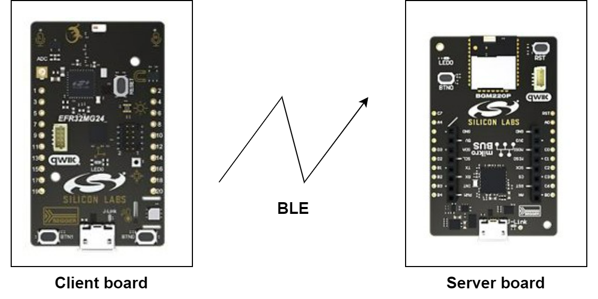
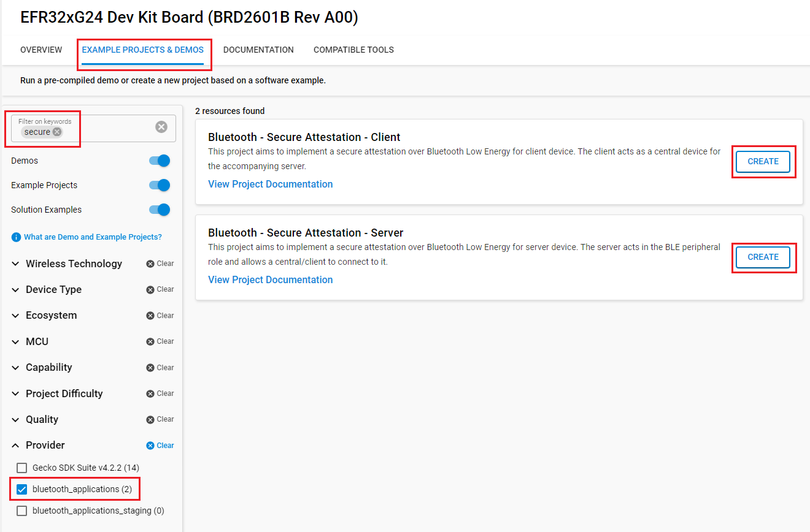
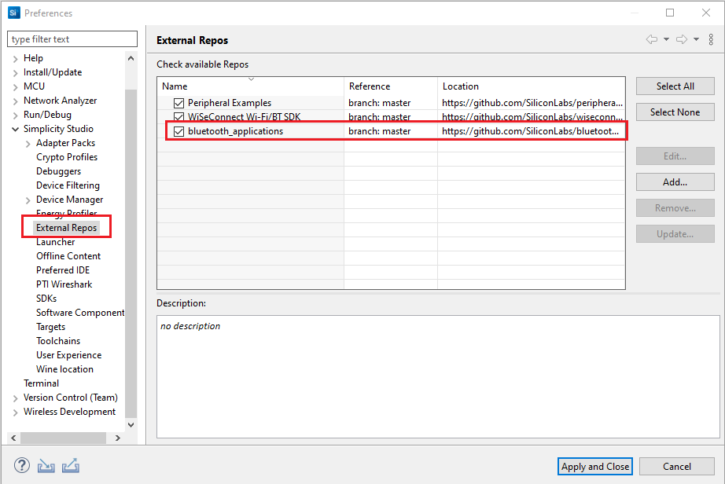
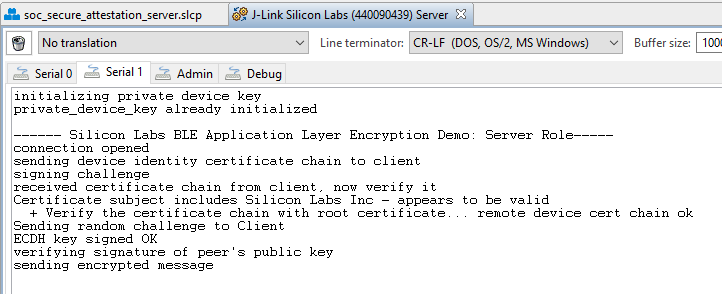
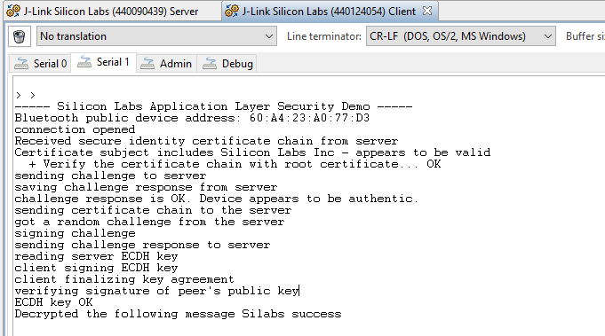

# Bluetooth - Secure Attestation #

## Description ##

This is a demonstration of a method for establishing secure identity over BLE by doing the following:

1. Exchanging device identity certificate chains

2. Key agreement signed with the device identity key established in the previous step

   Please see [AN1302: Bluetooth Low Energy Application Security Design Considerations](https://www.silabs.com/documents/public/application-notes/an1302-bluetooth-application-security-design-considerations.pdf) for a more detailed explanation of the communication flow.
3. This demonstration requires two projects: client and server. The client and server project must both be built and flashed to the specified target boards for the demonstration to function as intended.

## Gecko SDK Suite version ##

- GSDK v4.4.0

## Hardware Required ##

- Two Bluetooth capable radio boards
  - For Server security features should support Secure Root 
  - For Client security features should support Secure Vault High

**NOTE:**
Tested boards for working with this example:

**Server:** bt_secure_attestation_server.slcp

| Board ID | Description  |
| ---------------------- | ------ |
| BRD4314A | [BGM220 Bluetooth Module Explorer Kit - BGM220-EK4314A](https://www.silabs.com/development-tools/wireless/bluetooth/bgm220-explorer-kit?tab=overview)  |

**Client:** bt_secure_attestation_client.slcp

| Board ID | Description  |
| ---------------------- | ------ |
| BRD2601B | [EFR32xG24 Dev Kit - xG24-DK2601B](https://www.silabs.com/development-tools/wireless/efr32xg24-dev-kit?tab=overview)     |

## Connections Required ##

The hardware connection is shown in the image below:

## Setup ##

To test this application, you can either create a project based on an example project or start with a "Bluetooth - SoC Empty" project based on your hardware.

### Create a project based on an example project ###

1. From the Launcher Home, add your hardware to My Products, click on it, and click on the **EXAMPLE PROJECTS & DEMOS** tab. Find the example project with filter "secure".

2. Click **Create** button on the **Bluetooth - Secure Attestation - Server** and **Bluetooth - Secure Attestation - Client** examples. Example project creation dialog pops up -> click Create and Finish and Project should be generated.

3. Build and flash this example to the board.

### Start with a "Bluetooth - SoC Empty" project ###

1. Create a **Bluetooth - SoC Empty** project for your hardware using Simplicity Studio 5.

2. Copy all attached files in the *inc* and *src* folders into the project root folder (overwriting existing file).
    - With **Server** device: [bt_secure_attestation_server](bt_secure_attestation_server)

    - With **client** device: [bt_secure_attestation_client](bt_secure_attestation_client)
3. Import the GATT configuration:

    - Open the .slcp file in the project.

    - Select the **CONFIGURATION TOOLS** tab and open the **Bluetooth GATT Configurator**.

    - Find the Import button and import the attached file.

         - With **Server** device: `bt_secure_attestation_server/config/btconf/gatt_configuration.btconf`
         - With **client** device: `bt_secure_attestation_client/config/btconf/gatt_configuration.btconf`

    - Save the GATT configuration (ctrl-s).
4. Install the software components:
   - Open the .slcp file in the project.

   - Select the SOFTWARE COMPONENTS tab.

   - Install the following components for **Server** device:
      - [Services] → [IO Stream] → [IO Stream: EUSART] → default instance name: vcom
      - [Application] → [Utility] → [Log]
         - If using WSTK, navigate to the  **Platform** > **Board** > **Board Control**  software component, open its configurator and **Enable Virtual COM UART**
      - [Platform] → [Security] → [Mbed TLS] → [Authenticated Encryption] → [CCM Mode]
      - [Platform] → [Security] → [Mbed TLS] → [Elliptic Curves] → [secp256r1]
      - [Platform] → [Security] → [Mbed TLS] → [Signatures] → [ECDSA]
      - [Platform] → [Security] → [Mbed TLS] → [Upper Layer] → [PEM Parsing]
      - [Platform] → [Security] → [Mbed TLS] → [Upper Layer] → [Public-Key Abstraction Layer]
      - [Platform] → [Security] → [Mbed TLS] → [Upper Layer] → [X.509]
      - [Platform] → [Security] → [Mbed TLS] → [Key Derivation] → [HKDF]
      - [Platform] → [Security] → [Mbed TLS] → [Utilities] → [Error Helpers]

   - Install the following components for **Client** device:
      - [Services] → [IO Stream] → [IO Stream: EUSART] → default instance name: vcom
      - [Application] → [Utility] → [Log]
         - If using WSTK, navigate to the  **Platform** > **Board** > **Board Control**  software component, open its configurator and **Enable Virtual COM UART**
      - [Platform] → [Security] → [Mbed TLS] → [Authenticated Encryption] → [CCM Mode]
      - [Platform] → [Security] → [Mbed TLS] → [Elliptic Curves] → [secp256r1]
      - [Platform] → [Security] → [Mbed TLS] → [Signatures] → [ECDSA]
      - [Platform] → [Security] → [Mbed TLS] → [Upper Layer] → [PEM Parsing]
      - [Platform] → [Security] → [Mbed TLS] → [Upper Layer] → [Public-Key Abstraction Layer]
      - [Platform] → [Security] → [Mbed TLS] → [Upper Layer] → [X.509]
      - [Platform] → [Security] → [Mbed TLS] → [Key Derivation] → [HKDF]
      - [Platform] → [Security] → [Mbed TLS] → [Utilities] → [Error Helpers]
      - [Platform] → [Security] → [PSA Crypto] → [Built-In Keys] 

5. Build and flash the project to your device.

**NOTE:**
- Make sure that this repository is added to [Preferences > Simplicity Studio > External Repos](https://docs.silabs.com/simplicity-studio-5-users-guide/latest/ss-5-users-guide-about-the-launcher/welcome-and-device-tabs).

- Do not forget to flash a bootloader to your board, see [Bootloader](https://github.com/SiliconLabs/bluetooth_applications/blob/master/README.md#bootloader) for more information.

## How it Works ##

1. Flash one radio board with the client code and another one with the server code.
2. Open two instances of your favorite terminal program, and connect to both kits via the virtual COM port (find the JLink CDC UART ports). Use the following UART settings: **baud rate 115200, 8N1, no flow control**.
3. Press reset button on both kits.
4. The two kits will automatically find each other and set up a connection. You should see the logs on the terminal programs.
5. Once the connection is set up, the server and client will display the following on a serial console.

**NOTE**: Make sure that you are using the same baud rate and flow control settings in your starter kit and radio board or module firmware as well as your terminal program. For WSTK, this can be checked in Debug Adapters->Launch Console->Admin view, by typing "serial vcom".

### Creating the Certificate Chain ###

Now that you've seen a simple demo using the default identity attestation certificate chain, you can create your own certificate chain that will be unique to your devices.

1. Create a new chain of certificates by running create_cert_chain/build-id-cert-chain.bat

2. The certificates and public keys are placed in folder create_cert_chain. Copy the contents of each file to src/certificates.c, you'll find an array for each certificate, replacing the previous values.

3. Provision the device private signing key by copying the contents of the file to ../server/src/app.c, replacing the previous value.

4. Provision the root public signing key by copying the contents of the file to ../client/src/app.c, replacing the previous value.

5. Rebuild and flash both the server and client applications. Testing instructions are provided in the previous section.
