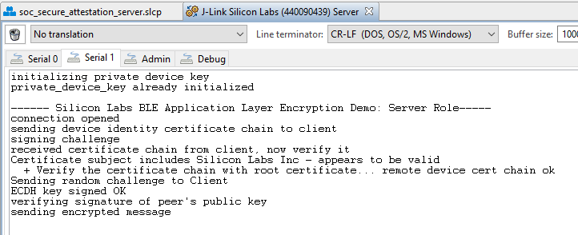

# Server


## Description

This file describes the server project and how to use it.

The server acts in the BLE peripheral role and allows a central/client to connect to it. Once the client and server are connected, they exchange secure identity certificate chains to perform authentication, perform an ECDH key exchange and finally the server encrypts and sends a simple test message. 

Most certificates are larger than the maximum size of a GATT characteristic, so each certificate is segmented into small enough segments to be transmitted and then reassembled by the receiver. 

Secure vault high devices, such as EFR32xG21B, securely store a private device key, this is programmed at the factory. All other devices must create their own private device key, preferably generated by and stored in a hardware security module (HSM). This private device key is used to sign the public key in an ECDH key exchange to verify authenticity. The EFR32 must then store the private device key as securely as possible. This example code initially stores the private device key in the userdata page at the very top of flash. The first time that the application runs, the key data is imported into a non-exportable PSA key and then the key material is erased from the userdata page. The private key is stored at the pre-defined address 0x7E400, which is not currently used by the Silicon Labs bootloader or Bluetooth stack. 

The public key of the client's root certificate is provisioned directly in app.c in PEM format. This key does not need to be kept secret but it does need to be tamper resistant. Tamper resistance of this key is achieved by enabling secure boot 

Several configurable parameters are found in app.h.

| Parameter               | Use                                                          |
| ----------------------- | ------------------------------------------------------------ |
| CERTIFICATE_BUFFER_SIZE | Determines the size of the buffer used for holding certificates while they are verified for authenticity. |
| CHALLENGE_SIZE          | Size, in bytes, of the random challenge. This can be increased if needed. No segmentation and reassembly is provided for the random challenge so it should fit within 1 MTU. |
| SE_MANAGER_PRINT_CERT   | Determines whether to print information about the received certificate chain. This symbol could be undefined for a simpler printout |
| PRIVATE_KEY_BASE        | The address where the private device key is located. If this value is changed, the hex file containing private device key must be changed to match. |


For more background on the communication flow of this secure attestation and application layer encryption, refer to AN1302.

## Gecko SDK Version

GSDK v3.2.2

## Hardware Required

EFR32MG22/EFR32BG22

## Connections Required

WSTK must be connected to computer through USB cable

## Setup

### Secure Boot

1. Begin by provisioning your device with the local development signing key. See section 2.2 of AN1218 for specific instructions.
2.  Now flash 'bootloader\signed-bootloader.s37' to your target board. This bootloader contains the certificate, secureboot-cert.bin, found in the same folder. The certificate is signed with the local development signing key. The bootloader, including the certificate, are signed with the private key in 'private-sign-key.pem'.
3. The bootloader project is provided in the bootloader folder in case you need to make further customizations. If the bootloader is changed, the output must be signed with the certificate and private key mentioned in the previous step.

### Application Project

1. Import the project (sls file) in the SimplicityStudio folder into your workspace and build the project.

2. Copy the 'private-sign-key.pem' file to the application project folder and rename it app-sign-key.pem.

3. run the 'create_bl_files.bat' on Windows or 'create_bl_files.sh' on MAC/Linux. This script will use the 'app-sign-key.pem' key copied over in step 2 to sign the apploader and application separately and combine them into a single GBL file.

4.  Flash 'output_gbl\full-signed.gbl' to the target hardware.

5. The device private signing key is found in the 'server\security' folder. Provision the device private signing key by using the following commands
   
```
python process-pem.py device\device-signing-private-key.pem
commander flash device\device-signing-private-key.pem --binary --address 0x7E400
```

note: The PEM string must be NULL terminated to be processed correctly. This is done by the python script.   note: the 'security' folder also contains the private key in PEM 

6. Once the application and private device signing key have been flashed to the target hardware, the client is ready to connect to the server.

7. After the client connects, the server will display the following on a serial console 



8. The test message which is encrypted and sent to the client is defined in app.c (line 510) as shown below:

```
    case gattdb_test_data:
      {
        const uint8_t plaintext[] = "Silabs success";
        static uint8_t ciphertext[32];
```

If you want to change the message, edit the value of 'plaintext'.

### Creating the Certificate Chain

Now that you've seen a simple demo using the default identity attestation certificate chain, you can create your own certificate chain that will be unique to your devices.

1.  Create a new chain of certificates by running security\build-id-cert-chain.bat

2. The certificates are placed in security\root\root-cert.pem, security\factory\factory-cert.pem, security\batch\batch-cert.pem and device\device-cert.pem. Copy the contents of each file to src\certificates.c, you'll find an array for each certificate, replacing the previous values. 

3. Provision the device private signing key by using the following commands

   ```
   python process-pem.py device\device-signing-private-key.pem
   commander flash device\device-signing-private-key.pem --binary --address 0x7E400
   ```
   
   note: The PEM string must be NULL terminated to be processed correctly. This is done by the python script.
   
4. Provision the root public signing key from security\root\root-signing-public-key.pem by copying the contents of the file to ..\client\src\app.c, replacing the previous value.

5. Rebuild and flash both the server and client applications. Testing instructions are provided in the previous section.

## Disclaimer

This sample application is only for demonstration purposes. The private device key is not really private at all, it's location in memory as well as it's value are known to anyone with access to this repository. For production, it is necessary to change the key and to make it unique for each device.


