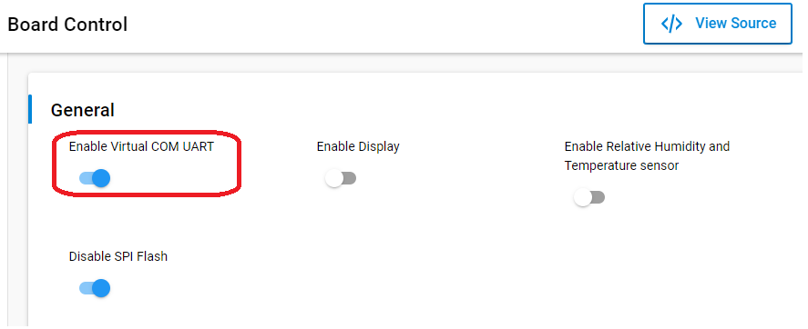
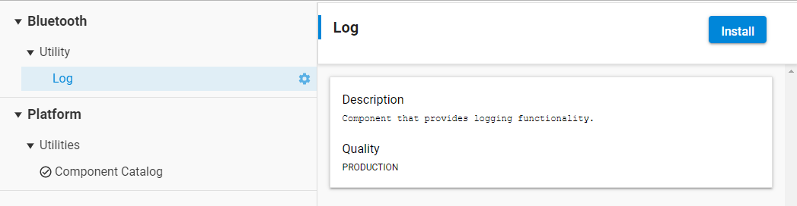
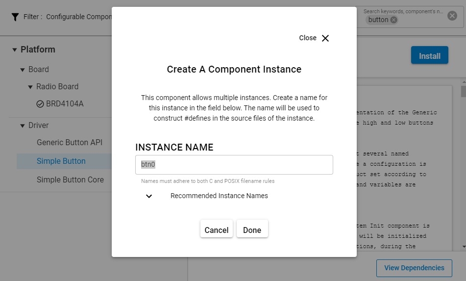
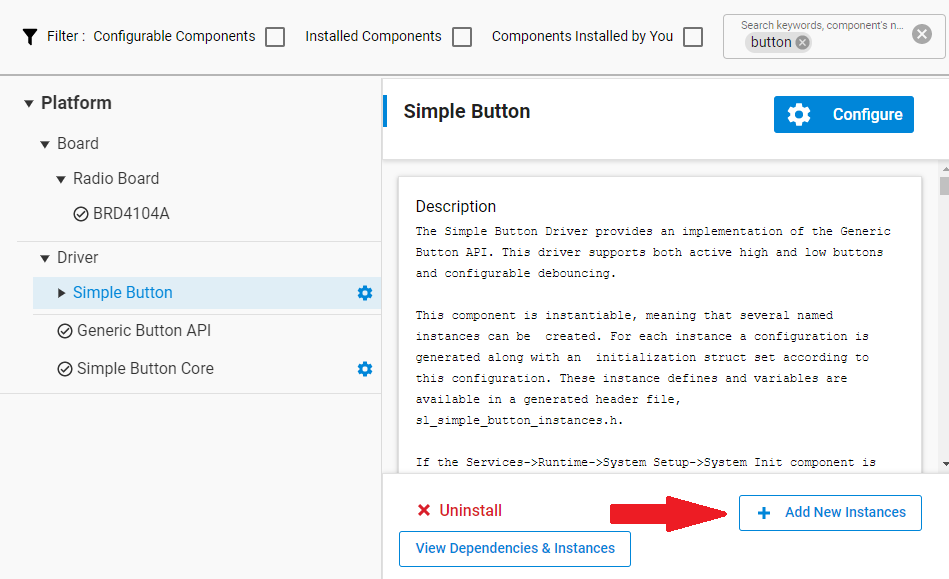
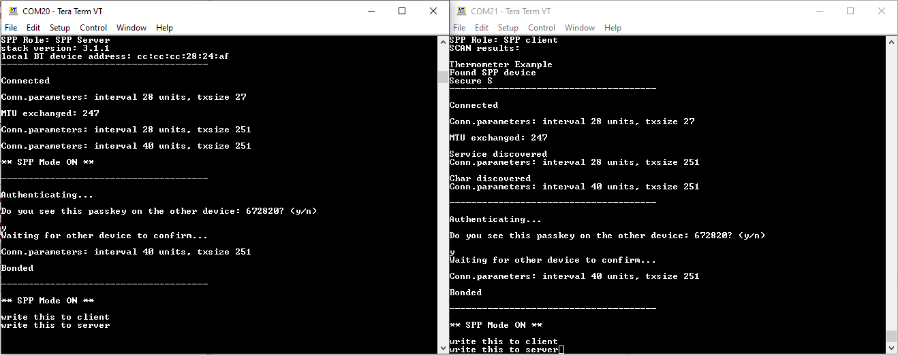
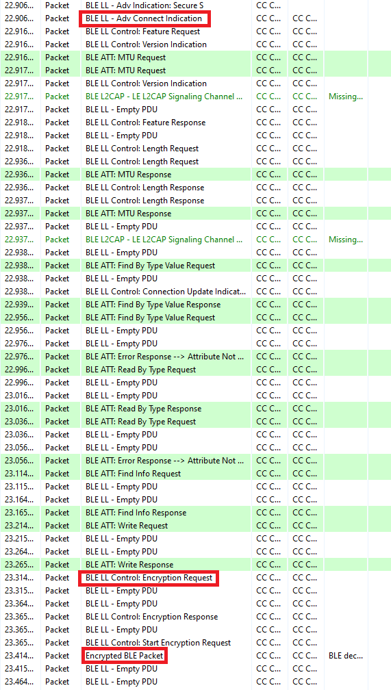

# Secure SPP (Serial Port Profile) over BLE #

## Background ##

This code example has a related User's Guide, here: [Using Bluetooth Security Features](https://docs.silabs.com/bluetooth/latest/general/security/using-bluetooth-security-features-in-silicon-labs-bluetooth-sdk).

## Description ##

This code example demonstrates how to build a secure Bluetooth connection between two EFR32 devices and how to implement secure serial communication between them. The example relies on the [Serial Port Profile (SPP) over BLE](https://github.com/SiliconLabs/bluetooth_applications/tree/master/bluetooth_spp_over_ble) example which implements the serial communication between the two devices. See the SPP example first to understand how it works. This example puts emphasis on the security side.

Just like with [SPP over BLE](https://github.com/SiliconLabs/bluetooth_applications/tree/master/bluetooth_spp_over_ble), the client and server roles are combined into one code. Upload the same code to both devices that you want to connect. The roles are configured by holding down either pushbutton at boot time. Holding down the button makes that device a central (client), which is scanning for other devices that implements the SPP service. If none of the buttons is held down during reset, the device becomes a peripherial (server) and starts advertising.

When the connection is built and services and characteristics are discovered, the devices have to go through an authentication phase before starting secure data transfer. In this example, I/O capabilities are defined to DisplayYesNo, which ultimately results in a Numeric Comparison pairing method. For details, see the description of [Pairing Processes](https://docs.silabs.com/bluetooth/latest/general/security/pairing-processes).

During the authentication phase, the devices have to confirm that they have successfully built a secure connection by showing passkeys on both devices. If the passkeys match and both devices confirm it, they are bonded (paired). If the devices were already bonded when they connected, the authentication is not needed again and the secure connection is automatically built using the long term key stored in the flash.

Bonding information including the long term key and other information persists over reset. To test the authentication repeatedly, implement a call to **sm_delete_bondings** with a trigger of your choice. Another option is to use Simplicity Commander tool to erase the devices' flash.

## Gecko SDK version ##

- GSDK v3.1.1

## Hardware Required ##

- 2 x WSTK board
- 2 x Bluetooth capable radio board, e.g: BRD4162A

## Set up ##

1. Create a **Bluetooth - SoC Empty** project in Simplicity Studio.

2. The function code is in the *app.c* file. Copy and replace this file to the project folder.

3. Install the software components to use the **VCOM** port (UART) for logging:
   - Open the .slcp file in the project.

   - Select the SOFTWARE COMPONENTS tab.

   - Install **IO Stream: USART** component with the default instance name: **vcom**  
    

   - Find the **Board Control** component and click to the **Configure** button like below
      
    Then enable *Virtual COM UART* under its configuration
    

   - Install the **Log** component (found under Bluetooth > Utility group)
   

   - Create the first button by installing the **Simple Button** component with the default instance name: **btn0**
     
   Create the second button by clicking the **Add New Instances** button with the default instance name: **btn1**
   

4. Import the GATT configuration:        
    - Open the **Bluetooth GATT Configurator** under the **CONFIGURATION TOOLS** tab.
    - Find the Import button and import the attached **gatt_configuration.btconf** file.
    
    - Save the GATT configuration (Ctrl+S).

5. Build and flash the project to each device. 

## Usage ##

1. Open a terminal program (e.g., TeraTerm) and connect to both devices to see the logs.

2. Press PB0 or PB1 on one of the devices while resetting it to put it into client mode.

3. Simply reset the other device to put it into server mode.

4. After the first boot, the authentication phase requires confirmation that the passkeys displayed on the two devices match. To confirm, send a 'y' or 'Y' character with the terminal. To decline send 'n' or 'N'.

5. After the authentication phase, use the application to send characters from one device to the other just like with the [SPP over BLE](https://github.com/SiliconLabs/bluetooth_applications/tree/master/bluetooth_spp_over_ble) example.

Terminal output

6. Reboot the devices and check if the secure connection is built automatically.

7. Open the Network Analyzer, connect to one of the devices, and check its traffic. You should see encrypted content.

Note: to get a proper log, Network Analyzer needs to observe the connection from the very beginning. Hence, after connecting to your device, reset it, and let the Network Analyzer observe the connection establishment process.

Network Analyzer log