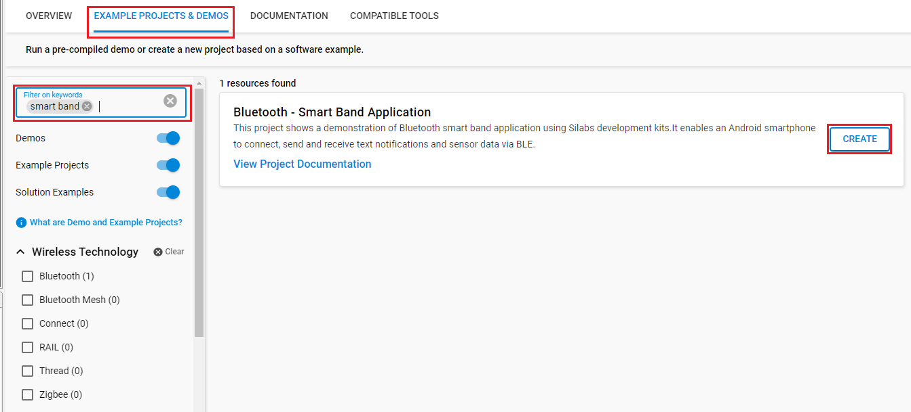

# Bluetooth - Smart Band Application

## Overview

This project shows a demonstration of **Bluetooth smart band application** using Silabs development kits. It can work and perform features like a Smartwatch. It enables an Android smartphone to connect, send and receive text notifications and sensor data via BLE.

## Gecko SDK Suite version

GSDK v4.4.0

## Hardware Required

- [SiLabs EFR32xG21 Radio Board BRD4180A](https://www.silabs.com/development-tools/wireless)

- [Wireless Starter Kit Mainboard (WSTK) BRD4001A](https://www.silabs.com/development-tools/wireless/efr32xg21-wireless-starter-kit?tab=overview)

- An Android smartphone with [DT78 Android app](https://github.com/fbiego/DT78-App-Android/raw/dev/app/release/DT78-App-v3.6.apk).

**NOTE:**
Tested boards for working with this example:

| Board ID | Description  |
| ---------------------- | ------ |
| BRD4180A | [SiLabs EFR32xG21 Radio Board BRD4180A](https://www.silabs.com/development-tools/wireless)    |
| BRD4180B | [SiLabs EFR32xG21 Radio Board BRD4180B](https://www.silabs.com/development-tools/wireless/slwrb4180b-efr32xg21-wireless-gecko-radio-board) |

## Connections Required

The block diagram of this application is shown in the image below:

More detailed information can be found in the section [How it works](#how-it-works).

## Setup

To test this application, you can either create a project based on an example project or start with a "Bluetooth - SoC Empty" project based on your hardware.

### Create a project based on an example project

1. From the Launcher Home, add your hardware to My Products, click on it, and click on the **EXAMPLE PROJECTS & DEMOS** tab. Find the example project with the filter "smart band".

2. Click **Create** button on **Bluetooth - Smart Band Application** example. Example project creation dialog pops up -> click Create and Finish and Project should be generated.

3. Build and flash this example to the board.

### Start with a "Bluetooth - SoC Empty" project

1. Create a **Bluetooth - SoC Empty** project for the **EFR32xG21 Radio Board**. Use the default project settings. Make sure to connect and select the EFR32xG21 from the **Debug Adapters** on the left before creating a project.

   

2. Copy all the .h and .c files to the following directory of the project root folder (overwriting the existing file).

3. Install the software components:

  **Services:**

- Install **IO Stream: USART** component with the default instance name: **vcom**.

    

- Install the **Sleep Timer** component, click on Configure and enable **wall clock functionality**.

     

     

  **Application:**

- If you are using an **xG22** Radio Board, install **Relative humidity and temperature sensor** component, if you are using an **xG21** device, install **Relative humidity and temperature sensor (Mock)** component.

     
     

- Install the **Log** component (under Utility).

     

  **Platform:**

- Configure **Board Control** component and enable **virtual com uart**.
     

     

- Install **Memory LCD with usart SPI driver** component.

     

- Install **Simple Button** component with the default instance name: **btn0**, add another instance with the default name: **btn1**.

     

     

- Install **Simple LED** component with the default instance name: **led0**, add another instance with the default name: **led1**.

     

     

- Install **GLIB Graphics Library** component.

     

- Install **Tiny printf** component.

     

4. Import the GATT configuration:

    - Open the .slcp file in the project again.
    - Select the CONFIGURATION TOOLS tab and open the "Bluetooth GATT Configurator".
    - Find the Import button and import the attached file: `config/btconf/gatt_configuration.btconf`
    - Save the GATT configuration (ctrl-s).
      

5. Build and flash this example to the board.

  **Note:**

- Do not forget to flash a bootloader to your board, see [Bootloader](https://github.com/SiliconLabs/bluetooth_applications/blob/master/README.md#bootloader) for more information.

6. DT78 Android app is a reverse-engineered Android app that reads app notifications on Android and sends them via BLE for WSTK to receive. More information about DT78 available [here](https://github.com/fbiego/DT78-App-Android).

   - To setup the DT78 Android app, download and install [this apk file](https://github.com/fbiego/DT78-App-Android/raw/dev/app/release/DT78-App-v3.6.apk). A popup may ask to allow installation from unknown sources which needs to be agreed upon. Once installed, open the app and the following screen should open. Click on 'Allow' and then click on 'Setup now'.

      

   - Click on 'Mac Address' -> 'BT Settings' and select 'Smart band Example'. A popup will ask to pair the device. Click on 'Pair'.

      

   - Once paired, return to the MAC Address menu where the paired device should be visible. Click on 'Smart band Example'. The device MAC Address will now be visible instead of 00:00:00:00:00:00. Go back to the main screen. If the device is paired correctly, the main screen should show the name of the device as 'Smart band Example' and the battery percentage next to it.

      

   - To get app notifications on EFR32, the apps need to be selected. Click on the 'Notification list' in the app and select the apps whose notifications are supposed to be received by EFR32. You can choose the App to receive notifications such as: Messenger, Facebook, Teams... A prompt may ask to allow DT78 to read notifications which need to be agreed for DT78 to read notifications. Once the apps are selected, go back to the main screen of DT78. The app will send the notifications to EFR32 via BLE whenever an app notification is received.

      

## How it Works

Upon reset, the application will clear the built-in display of WSTK.

The example has two sets of the information displayed on the screen:

- Time screen that displays time, date, and temperature.  
- Notification screen that shows the notifications and scrolls through them.

The image below describes how to navigate through screens:

- To start, press BTN0 or BTN1 to open the Time screen.
- From this screen, press BTN0 to open the Notification Screen.
- If the notification text is longer than what can be fit on the screen, scrolling is enabled automatically. Press BTN0 twice to scroll down through the notification. Similarly, the notifications can be scrolled up by pressing BTN1 twice.
- To go back from the Notification screen to the Time screen, Press BTN1 and then press BTN0 quickly.
- On the Time screen, pressing BTN1 turns off the screen.

Whenever app notifications from selected apps are received on the phone, they are sent to the EFR device by the DT78 app. These notifications are immediately displayed on the screen. The Notification screen opens and gets refreshed. For an xG21 device, the Time screen also shows a mock temperature value. For the xG22 device, the value is read from the onboard Si70xx sensor and displayed on the screen.

The find watch button on the DT78 app requests the battery level of the watch which is responded to with a mock battery percentage value on the 'TX' GATT characteristic. The initial value is 99 which is reduced by 1 each time the battery level is requested. In simple words, by pressing the 'Find Watch' button on the DT78 app, EFR32 responds with a battery percentage one less than the previous value.

### GATT Configurator

The application has a Bluetooth GATT server, advertising, and connection mechanisms. There are three services in total, two of which are default services for Generic Access and Device Information. The third service is custom-made to communicate with the DT78 Android application.

A new custom service (smartwatch) using UUID `6e400001-b5a3-f393-e0a9-e50e24dcca9e` is made which has 2 characteristics:

- **RX**: UUID `6e400002-b5a3-f393-e0a9-e50e24dcca9e`

  - [**Write**] - Get notification, time, and configuration data from the smartphone to the smart band.

  - [**Write with response**] - Set connection status

- **TX**: UUID `6e400003-b5a3-f393-e0a9-e50e24dcca9e`

  - [**Notify**] - Send battery level from smart band to smartphone.

This can also be observed in `gatt_configuration.btconf` in the project as shown below:

### Software Flow

1. First, the software initializes the peripherals, and the Bluetooth stack, and enables logging to the virtual COM port.

    

2. After the *sl_bt_evt_system_boot_id* event arrives, it sets up the security manager to bond with an iOS/Android device. Then, it starts advertising. As the smartphone (BLE Client) detects these advertisement packets, it sends a 'scan request' which is responded with a 'scan response' after which the connection is established.

3. Once the connection is established, a callback function is called each time a BLE event occurs. The image below shows the BLE events and corresponding actions taken by the callback function.

    

4. The data received is handled using the `dataFilter` function which acts on the received data as shown below:

    

5. When either the BTN0 or BTN1 are pressed, an Interrupt Service Routine (ISR) is run to make changes on the screen as discussed above. When BTN0 is pressed, LED0 lights up as a debug indicator. Similarly, LED1 lights up when BTN1 is pressed.

    

### Testing

You can launch the Console that is integrated into Simplicity Studio or use a third-party terminal tool like TeraTerm to receive the data from the virtual COM port. By default, only basic logs are enabled. To debug extensively, extended logs can be enabled by setting the `SMARTWATCH_UI_LOG_ENABLE` flag in `sl_smartwatch_ui.h`. Use the following UART settings: baud rate 115200, 8N1, no flow control. You should expect a similar output to the one below with extensive logs enabled.

