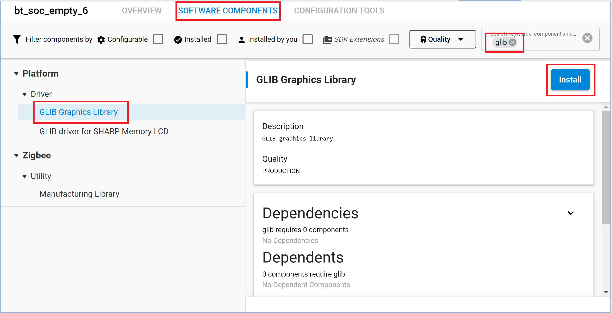

# Smart band application with BLE #

<!--  -->
<!--  -->
<!--  -->

<!--  -->
<!--  -->
<!--  -->

## Overview

This project shows a demonstration of **Bluetooth smart band application** using [SiLabs EFR32xG21 Radio Board BRD4180B](https://www.silabs.com/development-tools/wireless/slwrb4180b-efr32xg21-wireless-gecko-radio-board) and [Wireless Starter Kit Mainboard (WSTK) BRD4001A](https://www.silabs.com/development-tools/wireless/efr32xg21-wireless-starter-kit?tab=overview). It enables an Android smartphone to connect, send and receive text notifications and sensor data via BLE.

The block diagram of this application is shown in the image below:

More detailed information can be found in the section [How it works](#how-it-works).

## Gecko SDK Suite version

GSDK v4.1.0

## Hardware Required

- [SiLabs EFR32xG21 Radio Board BRD4180A](https://www.silabs.com/development-tools/wireless/slwrb4180b-efr32xg21-wireless-gecko-radio-board) or [SiLabs EFR32xG22 Radio Board BRD4182A](https://www.silabs.com/development-tools/wireless/slwrb4182a-efr32xg22-wireless-gecko-radio-board)

- [Wireless Starter Kit Mainboard (WSTK) BRD4001A](https://www.silabs.com/development-tools/wireless/efr32xg21-wireless-starter-kit?tab=overview) or 

- An Android smartphone with [DT78 Android app](https://github.com/fbiego/DT78-App-Android/raw/dev/app/release/DT78-App-v3.6.apk)

## Setup

To test this application, you can either import the provided `bt_soc_smart_band.sls` project file for your radio board (xG21 or xG22) or start with an empty example project as the following:

1. Create a **Bluetooth - SoC Empty** project for the **EFR32xG21 Radio Board** or the **EFR32xG22 Radio Board** (based on the one you are using) with Simplicity Studio 5. Use the default project settings. Make sure to connect and select the EFR32xG21 (or EFR32xG22) from the **Debug Adapters** on the left before creating a project.

   

2. Copy all attached files in _inc_ and _src_ folders into the project root folder (overwriting existing app.c).

3. Import the GATT configuration:

   - Open the .slcp file in the project.
   - Select the **CONFIGURATION TOOLS** tab and open the **Bluetooth GATT Configurator**.
   - Find the Import button and import the attached [gatt_configuration.btconf](config/gatt_configuration.btconf) file.
   - Save the GATT configuration (ctrl-s).

   

4. Open the .slcp file again. Select the **SOFTWARE COMPONENTS** tab and make the following changes:

  **Services:**

   - Install **IO Stream: USART** component with the default instance name: **vcom**.

     

   - Install the **Sleep Timer** component, click on Configure and enable **wall clock functionality**.

     

     

  **Application:**

   - If you are using an **xG22** Radio Board, install **Relative humidity and temperature sensor** component, if you are using an **xG21** device, install **Relative humidity and temperature sensor (Mock)** component.

     
     

   - Install the **Log** component (under Utility).

     

  **Platform:**

   - Configure **Board Control** component and enable **virtual com uart**.

     

     

   - Install **Memory LCD with usart SPI driver** component.

     

   - Install **Simple Button** component with the default instance name: **btn0**, add another instance with the default name: **btn1**.

     
     
     

   - Install **Simple LED** component with the default instance name: **led0**, add another instance with the default name: **led1**.

     
     
     

   - Install **GLIB Graphics Library** component.

     

   - Install **String Functions** component.

     

  **Third Party**
 
   - Install **Tiny printf** component.

     

   => Build and flash the project to your device.

5. Don't forget to flash a bootloader to your board, if you haven't already. See the [Special Notes](#special-notes).

6. DT78 Android app is a reverse-engineered Android app that reads app notifications on Android and sends them via BLE for WSTK to receive. More information about DT78 available [here](https://github.com/fbiego/DT78-App-Android).

   - To setup the DT78 Android app, download and install [this apk file](https://github.com/fbiego/DT78-App-Android/raw/dev/app/release/DT78-App-v3.6.apk). A popup may ask to allow installation from unknown sources which needs to be agreed upon. Once installed, open the app and the following screen should open. Click on 'Allow' and then click on 'Setup now'.
   
      

   - Click on 'Mac Address' -> 'BT Settings' and select 'Smart band Example'. A popup will ask to pair the device. Click on 'Pair'.
   
      

   - Once paired, return to the MAC Address menu where the paired device should be visible. Click on 'Smart band Example'. The device MAC Address will now be visible instead of 00:00:00:00:00:00. Go back to the main screen. If the device is paired correctly, the main screen should show the name of the device as 'Smart band Example' and the battery percentage next to it.
   
      

   - To get app notifications on EFR32, the apps need to be selected. Click on the 'Notification list' in the app and select the apps whose notifications are supposed to be received by EFR32. A prompt may ask to allow DT78 to read notifications which need to be agreed for DT78 to read notifications. Once the apps are selected, go back to the main screen of DT78. The app will send the notifications to EFR32 via BLE whenever an app notification is received.
   
      

## How it Works

Upon reset, the application will clear the built-in display of WSTK.

The example has two sets of the information displayed on the screen:
  - Time screen that displays time, date, and temperature.  
  - Notification screen that shows the notifications and scrolls through them.

The image below describes how to navigate through screens:
  - To start, press BTN0 or BTN1 to open the Time screen.
  - From this screen, press BTN0 to open the Notification Screen.
  - If the notification text is longer than what can be fit on the screen, scrolling is enabled automatically. Press BTN0 twice to scroll down through the notification. Similarly, the notifications can be scrolled up by pressing BTN1 twice.
  - To go back from the Notification screen to the Time screen, Press BTN1 and then press BTN0 quickly.
  - On the Time screen, pressing BTN1 turns off the screen.

Whenever app notifications from selected apps are received on the phone, they are sent to the EFR device by the DT78 app. These notifications are immediately displayed on the screen. The Notification screen opens and gets refreshed. For an xG21 device, the Time screen also shows a mock temperature value. For the xG22 device, the value is read from the onboard Si70xx sensor and displayed on the screen.

The find watch button on the DT78 app requests the battery level of the watch which is responded to with a mock battery percentage value on the 'TX' GATT characteristic. The initial value is 99 which is reduced by 1 each time the battery level is requested. In simple words, by pressing the 'Find Watch' button on the DT78 app, EFR32 responds with a battery percentage one less than the previous value.

You can launch the Console that is integrated into Simplicity Studio or use a third-party terminal tool like TeraTerm to receive the data from the virtual COM port. By default, only basic logs are enabled. To debug extensively, extended logs can be enabled by setting the `SMARTWATCH_UI_LOG_ENABLE` flag in `sl_smartwatch_ui.h`. Use the following UART settings: baud rate 115200, 8N1, no flow control. You should expect a similar output to the one below with extensive logs enabled.

### GATT Configurator

The application has a Bluetooth GATT server, advertising, and connection mechanisms. There are three services in total, two of which are default services for Generic Access and Device Information. The third service is custom-made to communicate with the DT78 Android application.

A new custom service (smartwatch) using UUID `6e400001-b5a3-f393-e0a9-e50e24dcca9e` is made which has 2 characteristics:

- **RX**: UUID `6e400002-b5a3-f393-e0a9-e50e24dcca9e`

  - [**Write**] - Get notification, time, and configuration data from the smartphone to the smart band.

  - [**Write with response**] - Set connection status

- **TX**: UUID `6e400003-b5a3-f393-e0a9-e50e24dcca9e`

  - [**Notify**] - Send battery level from smart band to smartphone.

This can also be observed in `gatt_configuration.btconf` in the project as shown below:

### Software Flow

1. First, the software initializes the peripherals, and the Bluetooth stack, and enables logging to the virtual COM port.

    

2. After the *sl_bt_evt_system_boot_id* event arrives, it sets up the security manager to bond with an iOS/Android device. Then, it starts advertising. As the smartphone (BLE Client) detects these advertisement packets, it sends a 'scan request' which is responded with a 'scan response' after which the connection is established.

3. Once the connection is established, a callback function is called each time a BLE event occurs. The image below shows the BLE events and corresponding actions taken by the callback function.

    

4. The data received is handled using the `dataFilter` function which acts on the received data as shown below:

    

5. When either the BTN0 or BTN1 are pressed, an Interrupt Service Routine (ISR) is run to make changes on the screen as discussed above. When BTN0 is pressed, LED0 lights up as a debug indicator. Similarly, LED1 lights up when BTN1 is pressed.

    

### .sls Projects Used

- `bt_soc_smart_band-xG21.sls`
- `bt_soc_smart_band-xG22.sls`

## Special Notes

The EFR32xG21/EFR32xG22 boards also require a bootloader to run the application. You can either use the provided bootloader-apploader file: 

   - for xG21: [bootloader-apploader-xg21](bootloader/bootloader-apploader-xg21.hex) 
   - for xG22: [bootloader-apploader-xg22](bootloader/bootloader-apploader-xg22.hex)

or perform the instructions below to create a bootloader file:

1. Create an **Bootloader - SoC Bluetooth AppLoader OTA DFU** project for the **EFR32xG21 Wireless Pro Kit Mainboard** or **EFR32xG22 Wireless Pro Kit Mainboard** (the board you are using) with Simplicity Studio v5 with the default project settings. Make sure to connect and select the EFR32xG21 or EFR32xG22 from the **Debug Adapters** on the left before creating a project.

   

2. Save the files, build, and be ready to flash. To build the project from the **Simplicity IDE**, press the hammer sign from the above toolbar. If there is no warning, it will have a Binaries-folder in the project. Expand the folder and click the right mouse on the .s37 file then select **Flash to Device**. Flash Programmer dialog should be opened then, select the correct file to flash the program.

