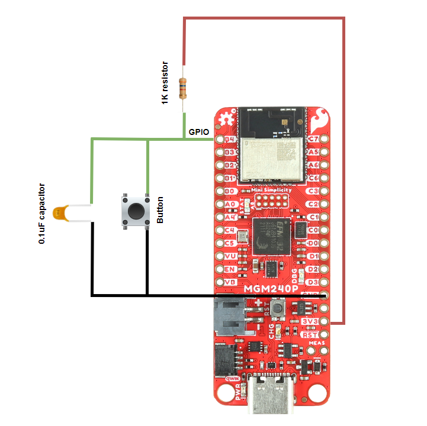
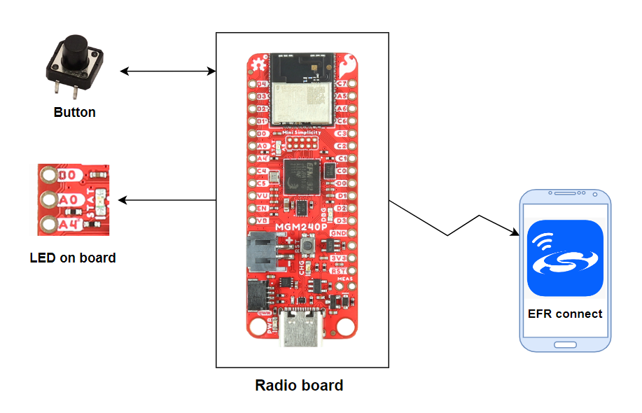
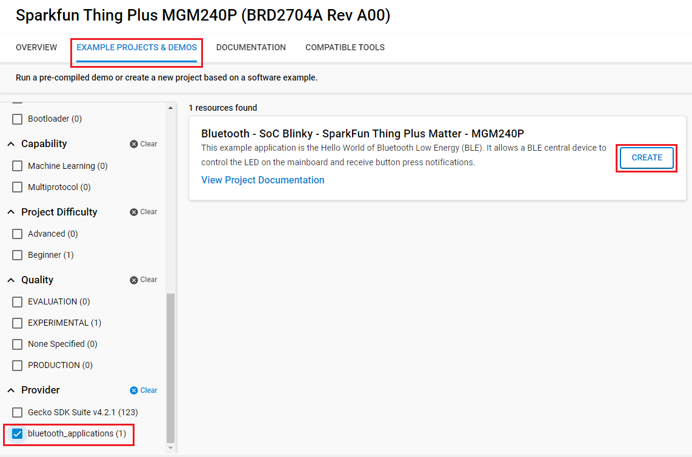
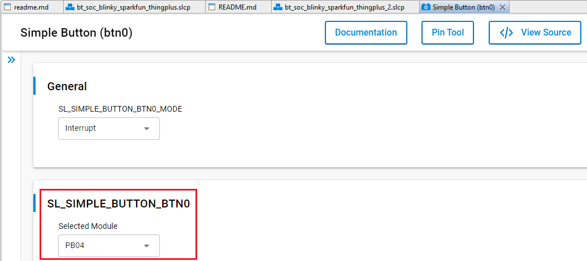
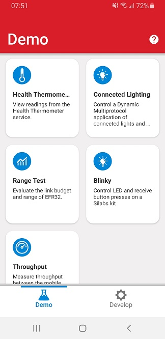
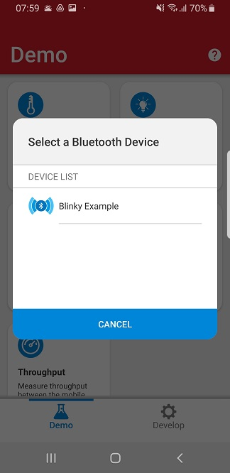
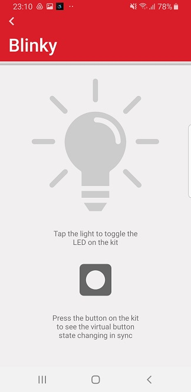
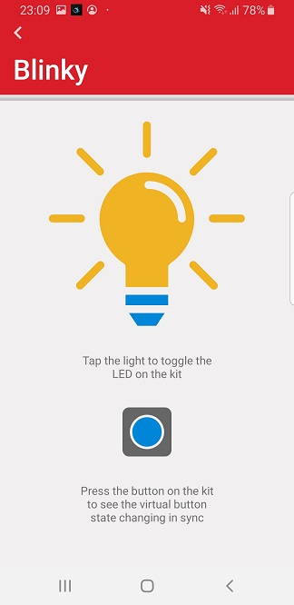

# Bluetooth - SoC Blinky - SparkFun Thing Plus Matter - MGM240P #

## Overview ##

This example application is the "Hello World" of Bluetooth Low Energy (BLE). It will also provide a starting point for developers who are interested in developing BLE applications with the SparkFun Thing Plus Matter Board. It allows a BLE central device to control the LED on the mainboard via write operations from a GATT client. It also can receive button press notifications when the external button state changes (pressed or released). This example will not be supported directly by Silicon Labs' GSDK, but users will be able to download it from GitHub.

## Gecko SDK Suite version ##

- GSDK v4.4.0

## Hardware Required ##

- [SparkFun Thing Plus Matter - MGM240P - BRD2704A](https://www.sparkfun.com/products/20270).
- An external button, because it has no integrated button.

**Note:**

- To connect the external button to the board and make the project more stable, you should use a ceramic capacitor (ex: Ceramic Capacitor 104) and a resistor to avoid the anti-vibration button used in the project as below.

## Connections Required ##

The following picture shows the system view of how it works.

Listed below are the port and pin mappings for work with this example.

Board: **BRD2704A - SparkFun Thing Plus Matter - MGM240P Board**

| Button Pin | Connection | Pin function |
|:---:|:-------------:|:---------------|
| Pin 1 | PB04 | Button |
| Pin 2 | GND | GND |

## Setup ##

To test this application, you can either create a project based on an example project or start with a "Bluetooth - SoC Empty" project based on your hardware.

### Create a project based on an example project ###

1. From the Launcher Home, add your hardware to My Products, click on it, and click on the **EXAMPLE PROJECTS & DEMOS** tab. Find the example project with the filter "soc blinky".

2. Click **Create** button on the **Bluetooth - SoC Blinky - SparkFun Thing Plus Matter - MGM240P** example. Example project creation dialog pops up -> click Create and Finish and Project should be generated.

3. Build and flash this example to the board.

### Start with a "Bluetooth - SoC Empty" project ###

1. Create a **Bluetooth - SoC Empty** project for your hardware using Simplicity Studio 5.

2. Copy all attached files in *inc* and *src* folders into the project root folder (overwriting existing).

3. Import the GATT configuration:

    - Open the .slcp file in the project.

    - Select the **CONFIGURATION TOOLS** tab and open the **Bluetooth GATT Configurator**.

    - Find the Import button and import the attached [gatt_configuration.btconf](config/btconf/gatt_configuration.btconf) file.

    - Save the GATT configuration (ctrl-s).

4. Open the .slcp file. Select the SOFTWARE COMPONENTS tab and install the software components:

    - [Services] → [IO Stream] → [IO Stream: USART] → default instance name: vcom

    - [Application] → [Utility] → [Log]

    - [Platform] → [Driver] → [LED] → [Simple LED] → default instance name: led0.

    - [Platform] → [Driver] → [Button] → [Simple Button] → set instance name: btn0 → configure btn0 to PB04 pin.
    

5. Build and flash the project to your device.

**Note:**

- Make sure that to add this repository to [Preferences > Simplicity Studio > External Repos](https://docs.silabs.com/simplicity-studio-5-users-guide/latest/ss-5-users-guide-about-the-launcher/welcome-and-device-tabs).

- Do not forget to flash a bootloader to your board, see [Bootloader](https://github.com/SiliconLabs/bluetooth_applications/blob/master/README.md#bootloader) for more information

## How It Works ##

This example implements a simple custom GATT service with two characteristics. One characteristic controls the state of the LED (ON/OFF) via write operations from a GATT client, and the second characteristic sends notifications to subscribed clients when the button state changes (pressed or released).

To test this demo, install EFR Connect for [Android](https://play.google.com/store/apps/details?id=com.siliconlabs.bledemo&hl=en&gl=US) or [iOS](https://apps.apple.com/us/app/efr-connect/id1030932759). The source code for the mobile application is available on [Github](https://github.com/SiliconLabs?q=efrconnect&type=&language=&sort=).

After launching the application go to the demo view and select the Blinky demo. A pop-up will show all the devices around you that are running the SoC-Blinky firmware. Tap on the device to go into the demo view.

 

Tap the light on the mobile application to toggle the LED on the mainboard. When you press/release the external button, the state changes for the virtual button on the application as well.

 

The animation below showcases the demo running on a SparkFun Thing Plus Board (MGM240P - BRD2704A) with the mobile application running on an Android device.

