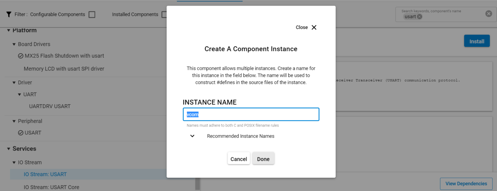
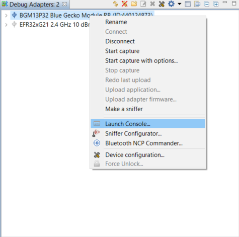
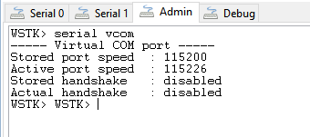

# SPP (Serial Port Profile) over BLE


## Overview ##

This example provides a simple template for SPP-like communication (also know as wire replacement), where Bluetooth serves as a transport channel for serial communication between two devices.  To keep the code as short and simple as possible, the features are minimal. Users are expected to customize the code as needed to match their project requirements.

Although the serial communication is symmetric between the two devices, still there is a server and a client in the communication due to the nature of Bluetooth technology. The associated sample code is a single application that implements both server and client roles. The role is selected at compilation time with the compiler switch **SPP_OPERATION_MODE**.


## Description ##

### SPP Server ###
Because Bluetooth Low Energy does not have a standard SPP service, it needs to be implemented as a custom service. The custom service is as minimal as possible. Only one characteristic is used for both incoming and outgoing data. The service is defined in the *gatt_configuration.btconf* file associated with this document and shown below.
``` xml
 <!--SPP Service-->
  <service advertise="true" name="SPP Service" requirement="mandatory" sourceId="" type="primary" uuid="4880c12c-fdcb-4077-8920-a450d7f9b907">
    <informativeText/>
    <!--SPP Data-->
    <characteristic const="false" id="spp_data" name="SPP Data" sourceId="" uuid="fec26ec4-6d71-4442-9f81-55bc21d658d6">
      <informativeText/>
      <value length="20" type="hex" variable_length="true">00</value>
      <properties>
        <write_no_response authenticated="false" bonded="false" encrypted="false"/>
        <notify authenticated="false" bonded="false" encrypted="false"/>
      </properties>
    </characteristic>
  </service>
```
At boot event, the server is put into advertisement mode. This example uses advertising packets that are automatically filled by the stack. In the custom SPP service definition (see above), *advertise* is set to *true*, meaning that the stack will automatically add the 128-bit UUID in advertisement packets. The SPP client will use this information to recognize the SPP server among other BLE peripherals.

For incoming data (data sent by the SPP client and written to UART in the SPP server), unacknowledged write transfers (*write_no_response*) are used, which provides a better performance than normal acknowledged writes because several write operations can fit into one connection interval.

For outgoing data (data received from UART and sent to SPP client), notifications with the command `sl_bt_gatt_server_send_notification` are used. Notifications are unacknowledged, which again allows several notifications to fit into one connection interval.
Note that data transfers are unacknowledged at GATT level. This means that at **application level**, no acknowledgments occur. However, at the lower protocol layers, each packet is still acknowledged and retransmissions are used when needed to ensure that all packets are delivered.
The core of the SPP example implementation is a 256-byte FIFO buffer (data[] in send_spp_data function) used to manage outgoing data. Data is received from UART and pushed to the SPP client using notifications. Incoming data from client raises the `sl_bt_evt_gatt_server_attribute_value` event. The received data is then copied to UART.


### SPP client ###

In terms of incoming/outgoing UART data, the SPP client works the same way as the SPP server. A similar 256-byte FIFO buffer is used with the following differences:

Data is received over the air by notifications(`sl_bt_evt_gatt_characteristic_value` event). Data is sent by calling `sl_bt_gatt_write_characteristic_value_without_response`.

The client is more complex than the server because it needs to detect the SPP server by looking at the advertisement packets. Additionally, the client needs to do service discovery after connecting to the client to get the information about the remote GATT database.

To use the SPP service, the client needs to know the characteristic handle values. The handles are discovered dynamically so that hard-coded values are not needed. This is essential if the SPP server needs to be ported to some other BLE module and the handle values are not known in advance.

At startup, the client starts discovery by calling `sl_bt_scanner_start `. For each received advertisement packet, the stack will raise event `sl_bt_evt_scanner_scan_report`. To recognize the SPP server, the client scans through each advertisement packet and searches for the 128-bit service UUID that is assigned for the custom SPP service.

Scanning advertisement packets is done with the function `process_scan_response`. Advertising packets include one or more advertising data elements that are encoded as defined in the BT specification. Each advertising element begins with a length byte that indicates the length of that field, which makes scanning through all elements in a while-loop easy.

The second byte in the advertising element is the AD type. The predefined types are listed in [Blutetooth SIG website](https://www.bluetooth.com/specifications/assigned-numbers/Generic-Access-Profile).

In this use case, types 0x06 and 0x07 that indicate incomplete/complete list of 128-bit service values are relevant. If this AD type is found, the AD payload is compared against the known 128-bit UUID of the SPP service to check if there is a match.

After finding a match in the advertising data, the client opens a connection by calling `sl_bt_connection_open `. When the connection is opened, the next task is to discover services and figure out the handle value that corresponds to the SPP_data characteristic (see XML definition of our custom service attached).

The service discovery is implemented as a simple state machine and the sequence of operations after connection is opened and summarized below:

1) Call `sl_bt_gatt_discover_primary_services_by_uuid ` to start service discovery

2) Call `sl_bt_gatt_discover_characteristics ` to find the characteristics in the SPP service (in FIND_SERVICE state)

3) Call `sl_bt_gatt_set_characteristic_notification` to enable notifications for spp_data characteristic (in FIND_CHAR state)

Note that in step one above, only services that match the specific UUID are relevant for service discovery. Another option is to call `sl_bt_gatt_discover_primary_services` and return list of all services in the remote GATT database.

After each procedure in the above sequence is completed, the stack will raise event `sl_bt_evt_gatt_procedure_completed`. The client uses a variable *main_state* to keep track of the current state. The `sl_bt_evt_gatt_procedure_completed` event will trigger the state machine to move on to the next logical state.

When notifications are enabled, the application is in transparent SPP mode, which is indicated by writing string "SPP Mode ON" to UART. After this point, any data that is received from UART is sent to server using non-acknowledged write transfer. Similarly, all data received via notifications (event: `sl_bt_evt_gatt_characteristic_value`) is copied to the local UART.

Note that on the server application the "SPP Mode ON" string is printed to the console. On the server side, this is done when the remote client has enabled notifications for the spp_data characteristic.

Data is handled transparently, meaning that the transmitted values can be either ASCII strings or binary data, or a mixture of these. 

### Power management ###
USART peripheral is not accessible in EM2 sleep mode. For this reason, both the client and the server applications disable sleeping (EM2 mode) temporarily when the SPP mode is active. **SPP mode** in this context means that the client and server are connected and that the client has enabled notifications for the SPP_data characteristics.

When SPP mode is entered, the code calls `sl_power_manager_add_em_requirement(SL_POWER_MANAGER_EM1)` to temporarily disable sleeping. When connection is closed (or client disables notifications), `sl_power_manager_remove_em_requirement(SL_POWER_MANAGER_EM1)` is called to re-enable sleeping.


### Known issues ###
This example implementation does not guarantee 100% reliable transfer. For incoming data, the driver uses a FIFO buffer whose size is defined using symbol `SL_IOSTREAM_USART_VCOM_RX_BUFFER_SIZE` (default value is 32).

To get a more reliable operation, increase the `SL_IOSTREAM_USART_VCOM_RX_BUFFER_SIZE` value. However, even with a large FIFO buffer, some data may get lost if the data rate is very high. If the FIFO buffer in RAM becomes full, the driver will simply drop the bytes that do not fit.


## Gecko SDK version ##
GSDK v3.1.0


## Hardware Required ##

- Two WSTK boards
- Two Bluetooth capable radio boards, e.g: BRD4306B


## Setup ##

To create an SPP Server:

1. Create a **Bluetooth - SoC Empty** project
2. Import the GATT configuration 
   1. Open the .slcp file in the project
   2. Select the SOFTWARE COMPONENTS tab
   3. Open the "Bluetooth GATT Configurator" under the Advanced Configurators
   4. Find the Import button and import the attached *gatt_configuration.btconf* file
   5. Save the GATT configuration (ctrl-s)
3. Open the "Software components" tab again and do the following changes:
- Install **IO Stream: USART** component with the defaul instance name: **vcom**



- Find the **Board Control** component  and enable *Virtual COM UART* under its configuration

- Install the **Log** component (found under Bluetooth > Utility group)

4. Replace the *app.c* file in the project with the provided *app.c*
5. Compile and flash to the target
6. Do not forget to flash a bootloader to your board, if you have not done so already.


To create a client:

1. Create a **Bluetooth - SoC Empty** project
2. Open the "Software components" tab after opening the .slcp file, and do the following changes:

- Install **IO Stream: USART** component with the defaul instance name: **vcom**


- Find the **Board Control** component  and enable *Virtual COM UART* under its configuration

- Install the **Log** component (found under Bluetooth > Utility group)

4. Replace the *app.c* file in the project with the provided *app.c*
5. Set the role to **SPP_CLIENT_MODE** with the compiler switch **SPP_OPERATION_MODE** in *app.c*
6. Compile and flash to the target
7. Do not forget to flash a bootloader to your board, if you have not done so already.


## Usage ##

1. Flash one radio board with the client code, and another one with the server code. 
2. Open two instances of your favorite terminal program, and connect to both kits via the virtual COM port (find the JLink CDC UART ports). Use the following UART settings: **baud rate 115200, 8N1, no flow control**.
3. Press reset button on both kits.
4. The two kits will automatically find each other and set up a connection. You should see the logs on the terminal programs
5. Once the connection is set up and SPP mode is on, type anything to either of the terminal programs and see it appearing on the other terminal.


**NOTE**: Make sure that you are using the same baud rate and flow control settings in your starter kit and radio board or module firmware as well as your terminal program. For WSTK, this can be checked in Debug Adapters->Launch Console->Admin view, by typing "serial vcom".





