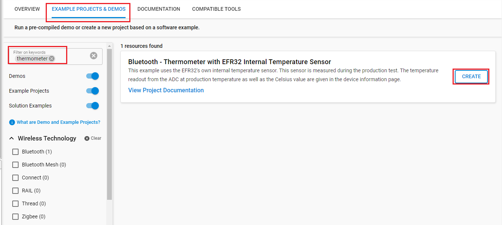
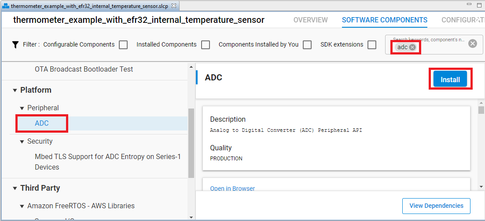
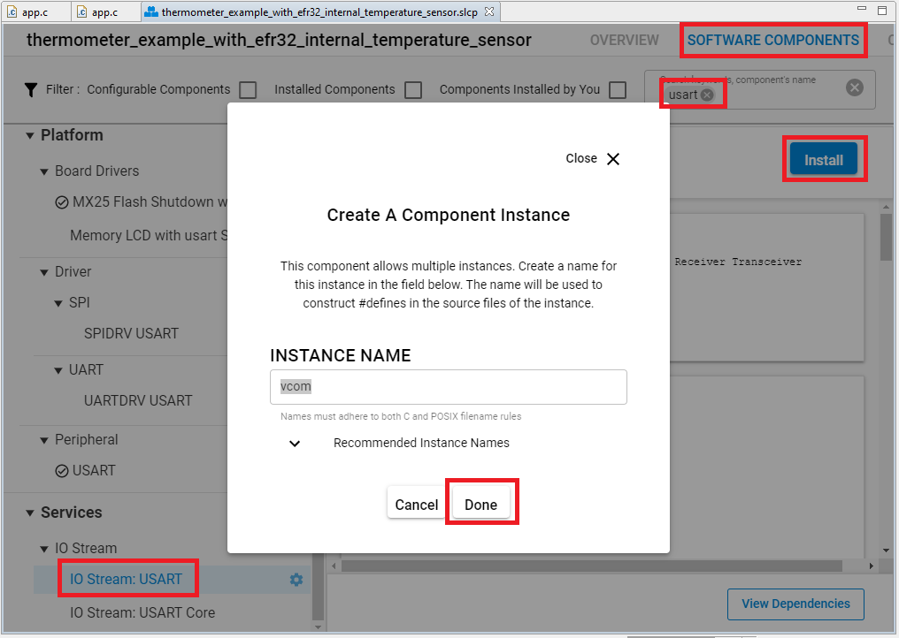
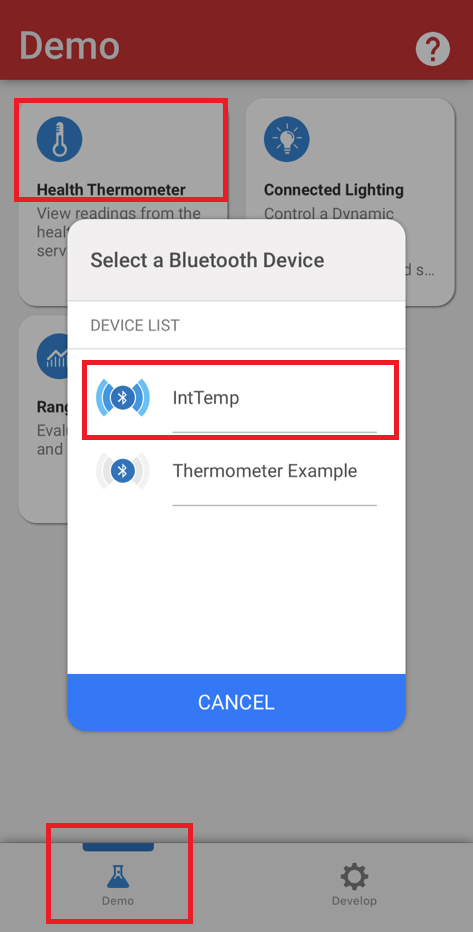
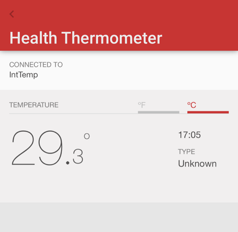
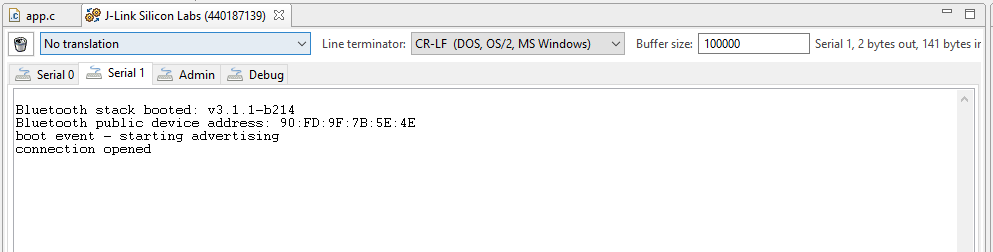

# Bluetooth - Thermometer with EFR32 Internal Temperature Sensor #


## Description ##

This example is an adaptation of the standard 'SOC - Thermometer' example. However, instead of accessing the Si7021 Temperature and Relative Humidity sensor through I2C, this example uses the EFR32's own internal temperature sensor. This sensor is measured during the production test. The temperature readout from the ADC at production temperature as well as the Celsius value are given in the device information page. Using these and the millivolts per degrees slope in the sensor data sheet, the current temperature can be calculated as follows:

```c
T_Celsius = T_Calibration - (ADC_Calibration_Reading - ADC_Current_Reading) * V_Ref / (4096 * Slope)
```

For more information, see the ADC section of the reference manual of your chosen hardware, e.g., [EFR32xG12](https://www.silabs.com/documents/public/reference-manuals/efr32xg12-rm.pdf).

These are the changes to the basic SoC-Thermometer example:

- *init_adc* function to initialize ADC with the correct voltage reference and prescaler.

- *read_adc* function to get a single sample readout from ADC, which has a busy wait loop for simplicity.

- *convert_to_millicelsius* function takes the sample and uses the calibration values in the above formula to get the result as degrees Celsius. The returned value is given in millicelsius.

- *measure_temperature* function is nearly identical to the one in the Thermometer example except for this line that uses the above functions:

```C
temperature_data = convert_to_millicelsius(read_adc());
```

## Gecko SDK version ##

- GSDK v4.4.0

## Hardware Required ##

- One WSTK board: BRD4001A
- One Bluetooth radio board, e.g: BRD4161A, BRD4162A

**NOTE:**
Tested boards for working with this example:

| Board ID | Description  |
| ---------------------- | ------ |
| BRD4162A | [SLWRB4162a efr32mg12 radio board](https://www.silabs.com/development-tools/wireless/zigbee/slwrb4162a-efr32mg12-radio-board) |
| BRD4161A | [SLWRB4161a efr32mg12 radio board](https://www.silabs.com/development-tools/wireless/zigbee/slwrb4161a-efr32mg12-radio-board)   |

## Connections Required ##

- Connect the Bluetooth Development Kits to the PC through a compatible-cable.

## Setup ##

To test this application, you can either create a project based on an example project or start with a "Bluetooth - SoC Empty" project based on your hardware.

**NOTE:**

- Make sure that the [SDK extension](https://github.com/SiliconLabs/third_party_hw_drivers_extension) is already installed and this repository is added to [Preferences > Simplicity Studio > External Repos](https://docs.silabs.com/simplicity-studio-5-users-guide/latest/ss-5-users-guide-about-the-launcher/welcome-and-device-tabs).

- SDK Extension must be enabled for the project to install the required components.

### Create a project based on an example project ###

1. From the Launcher Home, add your hardware to My Products, click on it, and click on the **EXAMPLE PROJECTS & DEMOS** tab. Find the example project with the filter "thermometer".

2. Click **Create** button on the **Bluetooth - Thermometer With EFR32 Internal Temperature Sensor** example. Example project creation dialog pops up -> click Create and Finish and Project should be generated.


3. Build and flash this example to the board.

### Start with a "Bluetooth - SoC Empty" project ###

1. Create a **Bluetooth - SoC Empty** project for your hardware using Simplicity Studio 5.

2. Import the GATT configuration:
   - Open the .slcp file in the project.
   - Select the CONFIGURATION TOOLS tab and open the "Bluetooth GATT Configurator".
   - Find the Import button and import the attached *gatt_configuration.btconf* file.
   - Save the GATT configuration (ctrl-s).
   

3. Open the .slcp file again. Select the "SOFTWARE COMPONENTS" tab and do the following changes:

   - Install the **ADC** component (found under Platform > Peripheral).
   

   - Install **IO Stream: USART** component with the default instance name: **vcom**.
   

   - Find the **Board Control** component and enable *Virtual* COM UART* under its configuration.

   - Install the **Log** component (found under Bluetooth > Utility group).

4. Replace the *app.c* file in the project with the provided *app.c*.

5. Build and flash to the target.

**Note:**

- Make sure that this repository is added to [Preferences > Simplicity Studio > External Repos](https://docs.silabs.com/simplicity-studio-5-users-guide/latest/ss-5-users-guide-about-the-launcher/welcome-and-device-tabs).

- Do not forget to flash a bootloader to your board, see [Bootloader](https://github.com/SiliconLabs/bluetooth_applications/blob/master/README.md#bootloader) for more information.

## How It Works ##

Follow the below steps to test the example:

1. Open the EFR Connect app on your smartphone.

2. Find your device in the Health Thermometer, advertising as IntTemp and connect to it.

   

   *HTM Scan*

   

   *HTM Reading*

3. You can launch the Console that is integrated on Simplicity Studio or can use a third-party terminal tool like TeraTerm to receive the logs from the virtual COM port.

   
