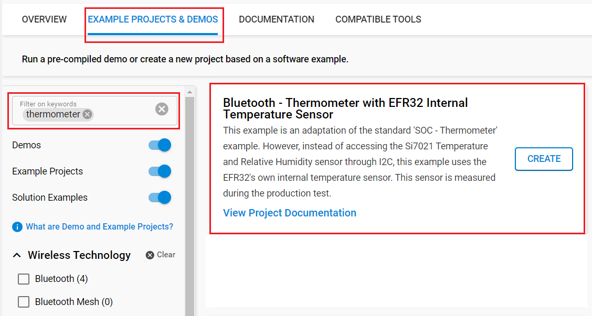

# Bluetooth - Thermometer with EFR32 Internal Temperature Sensor #

## Description ##

This example is an adaptation of the standard 'SOC - Thermometer' example. However, instead of accessing the Si7021 Temperature and Relative Humidity sensor through I2C, this example uses the EFR32's own internal temperature sensor. This sensor is measured during the production test.

For more information, see the ADC section of the reference manual of your chosen hardware, e.g., [EFR32xG12](https://www.silabs.com/documents/public/reference-manuals/efr32xg12-rm.pdf).

## SDK version ##

- [SiSDK v2024.12.0](https://github.com/SiliconLabs/simplicity_sdk)

## Software Required ##

- [Simplicity Studio v5 IDE](https://www.silabs.com/developers/simplicity-studio)
- [Simplicity Connect Mobile App](https://www.silabs.com/developer-tools/simplicity-connect-mobile-app)

## Hardware Required ##

- 1x [Bluetooth Low Energy Development Kit](https://www.silabs.com/development-tools/wireless/bluetooth). For simplicity, Silicon Labs recommends the [BGM220-EK4314A](https://www.silabs.com/development-tools/wireless/bluetooth/bgm220-explorer-kit)
- 1x smartphone running the 'Simplicity Connect' mobile app

## Connections Required ##

- Connect the Bluetooth Development Kits to the PC through a compatible-cable. For example, a micro USB cable for the BGM220 Bluetooth Module Explorer Kit.

## Setup ##

To test this application, you can either create a project based on an example project or start with a "Bluetooth - SoC Empty" project based on your hardware.

**NOTE**:

- Make sure that the [bluetooth_applications](https://github.com/SiliconLabs/bluetooth_applications) repository is added to [Preferences > Simplicity Studio > External Repos](https://docs.silabs.com/simplicity-studio-5-users-guide/latest/ss-5-users-guide-about-the-launcher/welcome-and-device-tabs).

### Create a project based on an example project ###

1. From the Launcher Home, add your hardware to My Products, click on it, and click on the **EXAMPLE PROJECTS & DEMOS** tab. Find the example project filtering by "thermometer".

2. Click **Create** button on the **Bluetooth - Thermometer With EFR32 Internal Temperature Sensor** example. Example project creation dialog pops up -> click Create and Finish and Project should be generated.

3. Build and flash this example to the board.

### Start with a "Bluetooth - SoC Empty" project ###

1. Create a **Bluetooth - SoC Empty** project for your hardware using Simplicity Studio 5.

2. Import the GATT configuration:
   - Open the .slcp file in the project.
   - Select the CONFIGURATION TOOLS tab and open the "Bluetooth GATT Configurator".
   - Find the Import button and import the attached *gatt_configuration.btconf* file.
   - Save the GATT configuration (ctrl-s).
   

3. Install the software components:

   - [Services] → [IO Stream] → [IO Stream: USART] → default instance name: vcom
   - [Application] → [Utility] → [Log]
   - [Application] → [Utility] → [Timer]
   - [Platform] → [Driver] → [TEMPDRV]
   - [Bluetooth] → [Application] → [GATT Services] → [Health Thermometer API]

4. Replace the *app.c* file in the project with the provided `src/app.c`.

5. Build and flash to the target.

**Note:**

- A bootloader needs to be flashed to your board if the project starts from the "Bluetooth - SoC Empty" project, see [Bootloader](https://github.com/SiliconLabs/bluetooth_applications/blob/master/README.md#bootloader) for more information.

## How It Works ##

Follow the below steps to test the example:

1. Open the Simplicity Connect app on your smartphone and allow the permission requested the first time it is opened.

2. Find your device in the Health Thermometer, advertising as IntTemp and connect to it. Upon connection, will automatically enable notifications and display the temperature data.

   

   

   

3. You can launch the Console that is integrated on Simplicity Studio to receive the logs from the virtual COM port.

   
