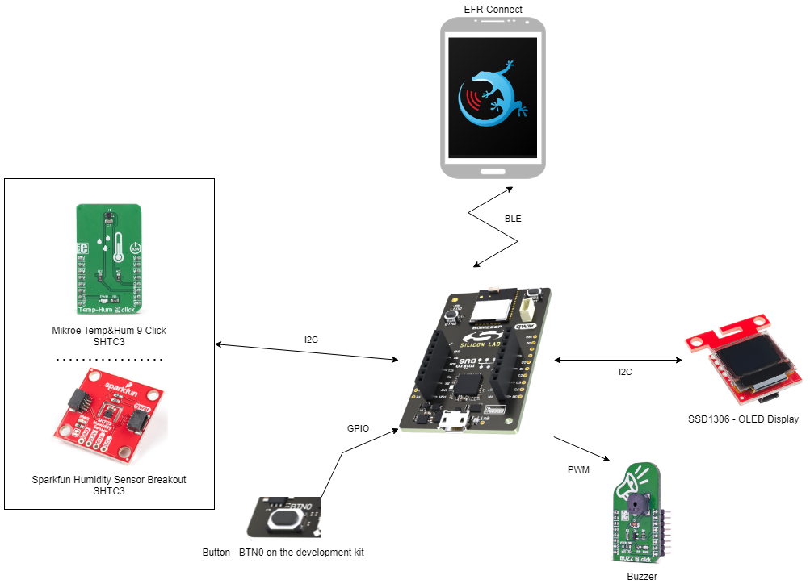
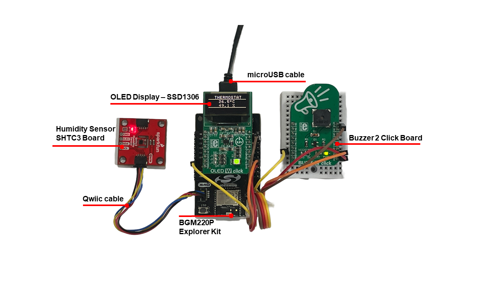
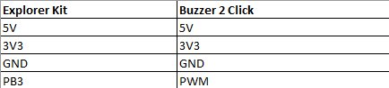
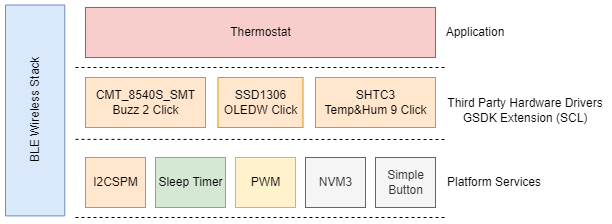
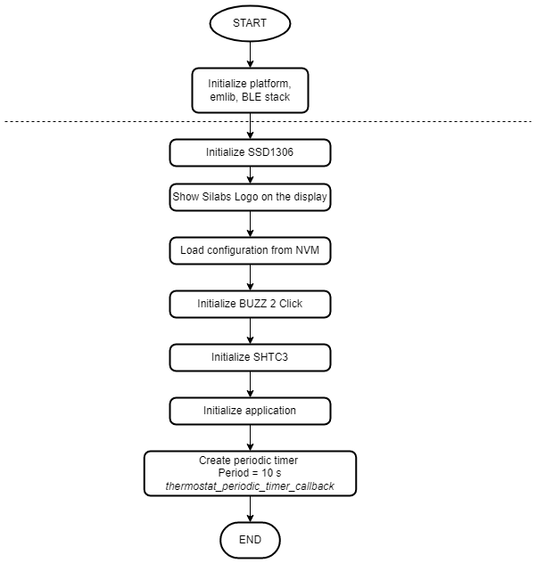
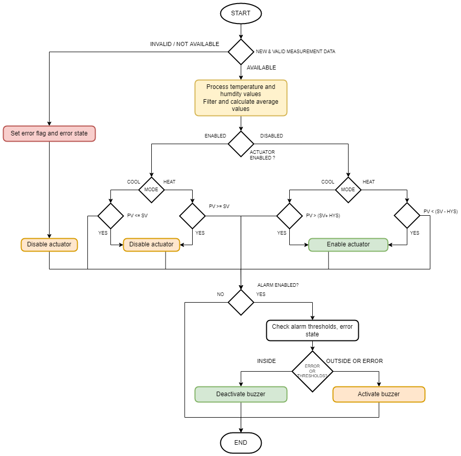
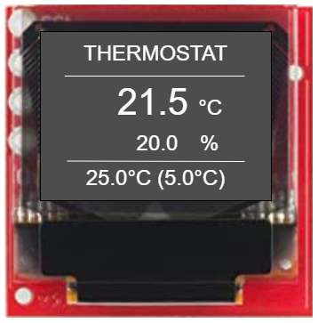
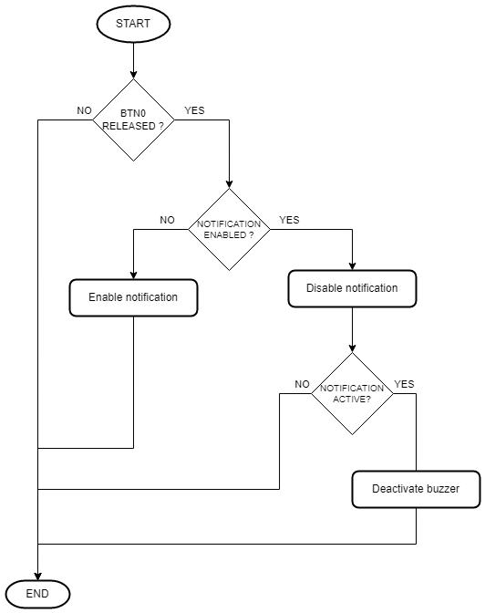
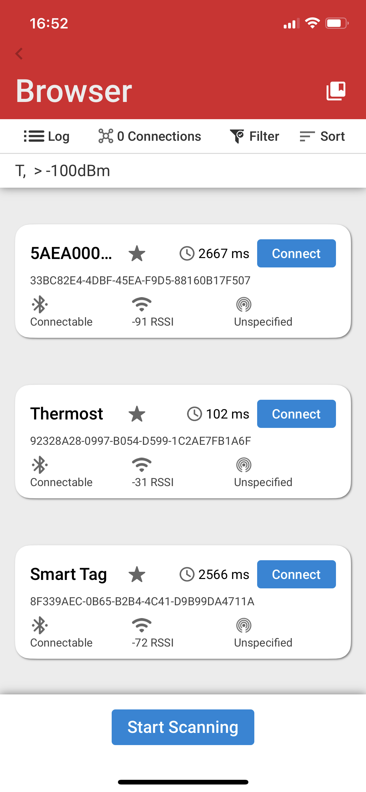
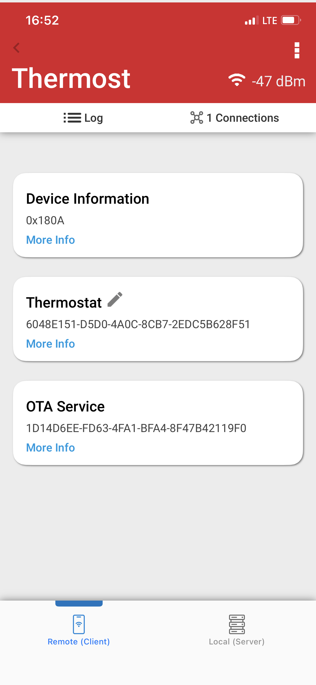

# Thermostat (SHTC3) with BLE

## Summary

This project aims to implement a thermostat system using Silabs development kits and external sensors integrated with the BLE wireless stack.

The block diagram of this application is shown in the image below:

More detailed information can be found in the section [How it works](#how-it-works).

This code example referred to the following code examples. More detailed information can be found here:

- [OLED SSD1306 driver](https://github.com/SiliconLabs/platform_hardware_drivers/tree/master/oled_ssd1306_i2c)
- [Bluetooth security feature](https://github.com/SiliconLabs/bluetooth_stack_features_staging/tree/master/security)
- [SHTC3 Humidity Sensor driver](https://github.com/SiliconLabs/platform_hardware_drivers/tree/master/humidity_shtc3)
- [Buzzer driver](https://github.com/SiliconLabs/platform_hardware_drivers/tree/master/magnetic_buzzer)

## Required Hardware

- [BGM220 Bluetooth Module Explorer Kit](https://www.silabs.com/development-tools/wireless/bluetooth/bgm220-explorer-kit)

- [Humidity Sensor - SHTC3 Board](https://www.sparkfun.com/products/16467)

- [Buzzer 2 Click Board](https://www.mikroe.com/buzz-2-click)

- [OLED Display - SSD1306](https://www.sparkfun.com/products/14532)

## Hardware Connection

The hardware connection is shown in the image below:

The I2C connection is made from the BGM220 Bluetooth Module Explorer Kit to the Humidity Sensor board by using the qwiic cable and the Micro OLED Breakout connects to Explorer kit using SPI protocol via mikroe connection.

In this project, mikroe's default PWM pin is changed from pin PB4 to pin PB3 to avoid overlapping pins between OLED Display and Buzzer.
In this project, mikroe's default PWM pin is changed from pin PB4 to pin PB3 to avoid overlapping pins between OLED Display and Buzzer. Connect between explorer kit and buzzer as shown below.

## Setup

You can either import the provided bluetooth_thermostat.sls project file or start with an empty example project as the following:

1. Create an "Bluetooth - SoC  Empty" for the "BGM220 Explorer Kit Board" using Simplicity Studio v5. Use the default project settings.

2. Copy all attached files in *inc* and *src* folders into the project root folder (overwriting existing app.c).

3. Install the software components:

    - Open the .slcp file in the project.

    - Select the SOFTWARE COMPONENTS tab.

    - Install the following components for device:

        - [Services] → [Sleep Timer]
        - [Services] →  [NVM3] → NVM3 Core
        - [Services] →  [NVM3] → NVM3 Default Instance
        - [Services] → [IO Stream] → [IO Stream: USART] → default instance name: vcom
        - [Application] → [Utility] → [Log]
        - [Application] → [Utility] → [Assert]
        - [Third Party] → [Tiny printf]
        - [Platform] → [Driver] → [Button] → [Simple Button] → default instance name: btn0
        - [Platform] → [Driver] → [LED] → [Simple LED] → default instance name: led0
        - [Platform] → [Driver] → [PWM] → [PWM] → default instance name: mikroe and change PWM pin to PB3.
        - [Third Party Hardware Drivers] → [Display & LED] → [SSD1306 - OLED W Click (Mikroe) - SPI]
        - [Third Party Hardware Drivers] → [Audio & Voice] → [CMT_8540S_SMT - Buzz 2 Click (Mikroe)]
        - [Third Party Hardware Drivers] → [Sensors] → [SHTC3 - Temp&Hum 9 Click (Mikroe)]
        - [Third Party Hardware Drivers] → [Service] → [GLIB - OLED Graphics Library]

4. Import the GATT configuration:

   - Open the .slcp file in the project.

   - Select the **CONFIGURATION TOOLS** tab and open the **Bluetooth GATT Configurator**.

   - Click on the Import button and import the attached [gatt_configuration.btconf](config/gatt_configuration.btconf) file.

   - Save the GATT configuration (ctrl-s).

5. Build and flash this example to the board.

**Note:**

- Make sure the SDK extension already be installed. If not please follow [this documentation](https://github.com/SiliconLabs/platform_hardware_drivers_sdk_extensions/blob/master/README.md).

- SDK Extension must be enabled for the project to install any components.

- The example project are built on the BRD4314A board. So users should add the BRD4314A to MyProducts to able be see them on the Launcher Home of Simplicity Studio IDE.

## How it Works

### Application overview

### GATT Configurator

The application is based on the Bluetooth - SoC Empty example. Since the example already has the Bluetooth GATT server, advertising, and connection mechanisms, only minor changes are required.

The GATT changes were adding a new custom service (Thermostat ) which are 8 characteristics:

- **Mode**:

  - [**Readable**] - Get mode value

  - [**Writable**] - Set mode value - mode (0 - heat, 1 - cool)

- **Setpoint (SV)**:

  - [**Readable**] - Get setpoint value

  - [**Writable**] - Set setpoint value - setpoint (e.g.: 2500 => 25.0 °C, limits: -35 °C ↔ + 120 °C, -3500 ↔ 12000)

- **Temperature (PV)**:

  - [**Readable**] - Get current averaged temperature value (e.g.: 2500 => 25.0 °C)

- **Humidity**:

  - [**Readable**] - Get current averaged humidity value (e.g.: 2500 => 25.0 %)

- **Hysteresis (HYS)**:
  - [**Readable**] - Get hysteresis value

  - [**Writable**] - Set hysteresis value - hysteresis  (e.g.: 2500 => 25.0 °C, limits:  0 ↔ (HIGH-LOW) thresholds)

- **Lower threshold**:
  - [**Readable**] - Get lower threshold value

  - [**Writable**] - Set lower threshold value - lower_threshold (-3500 <= VAL < Upper threshold value)

- **Upper threshold**:
  - [**Readable**] - Get upper threshold value

  - [**Writable**] - Set upper threshold value - upper_threshold (-3500 <= VAL < Upper threshold value)

- **Threshold alarm status**:
  - [**Readable**] - Get threshold alarm status (0 - disabled, 1 - enabled, 2 - alarm active)

  - [**Writable**] - Set threshold alarm status - is_alarm_active (0 - disabled or 1 - enabled )

### Thermostat Implementation

#### Application initialization

  

#### Application Workflows

1. Initialize the peripherals, the Bluetooth stack

2. Initialize and load the NVM3 configurations

3. Wait for the sensor is booted and initialize the sensor with the configurations from NVM3:

4. Initialize the OLED display.

5. Start a periodic timer with period 1000ms, The timer callback will fire an external event to ble stack and the event handler will display people counting data from the result of the counting algorithm calculation.

6. After the *sl_bt_evt_system_boot_id* event arrives, App sets up the security manager and starts advertising.

7. Handle GATT event to help user configure the [Use EFR Connect Mobile Application](#use-efr-connect-mobile-application) and get the result from the algorithm calculation over the *EFR32 connect* mobile app

Algorithm workflows

### OLED Display

- Display current people count and the value of the entered people so far
  
  

### Button

- When the button is released, it checks the alarm feature status, and buzzer state in accordance with the flowchart below.

  

### Use EFR Connect Mobile Application

#### Connect to the device

The Silicon Labs EFR Connect application utilizes the Bluetooth adapter on your phone/tablet to scan, connect and interact with BLE devices. To run this example, an iOS or Android smartphone with the EFR Connect app installed is required.

Open the EFR Connect application on your smartphone and allow the permission request when opened for the first time. Click [Develop] -> [Browser] and you will see a list of nearby devices which are sending Bluetooth advertisements. Find the one named *People Counting* and click the connect button on the right side.

|  | ||
| - | - | -|

#### Read/Write characteristics

The parameters of this example application can be easly configured via BLE characteristics. Values for the characteristics are handled by the application as ASCII strings. Tap on the main service to see the available characteristics. Please refer [GATT Configurator](#gatt-configurator) to choose correct characteristic.

**Read**
Push read button to request the value of a characteristic. (See ASCII fields.)

**Write**
For setting a parameter select a characteristic and tap on its write button. Type a new value in the ASCII field and push the **Send** button.

|Mode|Setpoint|Temperature(SV)|Humidity (PV)|
|-|-|-|-|
|- **Read** to get mode value   - **Write** to set mode value - mode (0 - heat, 1 - cool)|- **Read** to get setpoint value  - **Write** to set setpoint value - setpoint (e.g.: 2500 => 25.0 °C, limits: -35 °C ↔ + 120 °C, -3500 ↔ 12000)|- **Read** to get current averaged temperature value (e.g.: 2500 => 25.0 °C)|- **Read** to get current averaged humidity value (e.g.: 2500 => 25.0 %)|

|Hysteresis |Lower threshold|Upper threshold|Threshold alarm status|
|-|-|-|-|
|- **Read** to get hysteresis value  - **Write** to set hysteresis value - hysteresis  (e.g.: 2500 => 25.0 °C, limits:  0 ↔ (HIGH-LOW) thresholds) |- **Read** to get lower threshold value - **Write** to set lower threshold value - lower_threshold (-3500 <= VAL < Upper threshold value)|- **Read** to get upper threshold value - **Write** to set upper threshold value - upper_threshold (-3500 <= VAL < Upper threshold value)|- **Read** to get threshold alarm status (0 - disabled, 1 - enabled, 2 - alarm active). - **Write** to set threshold alarm status - is_alarm_active (0 - disabled or 1 - enabled )|

## Report Bugs & Get Support

To report bugs in the Application Examples projects, please create a new "Issue" in the "Issues" section of [platform_hardware_drivers_sdk_extensions](https://github.com/SiliconLabs/platform_hardware_drivers_sdk_extensions) repo. Please reference the board, project, and source files associated with the bug, and reference line numbers. If you are proposing a fix, also include information on the proposed fix. Since these examples are provided as-is, there is no guarantee that these examples will be updated to fix these issues.

Questions and comments related to these examples should be made by creating a new "Issue" in the "Issues" section of [platform_hardware_drivers_sdk_extensions](https://github.com/SiliconLabs/platform_hardware_drivers_sdk_extensions) repo.
