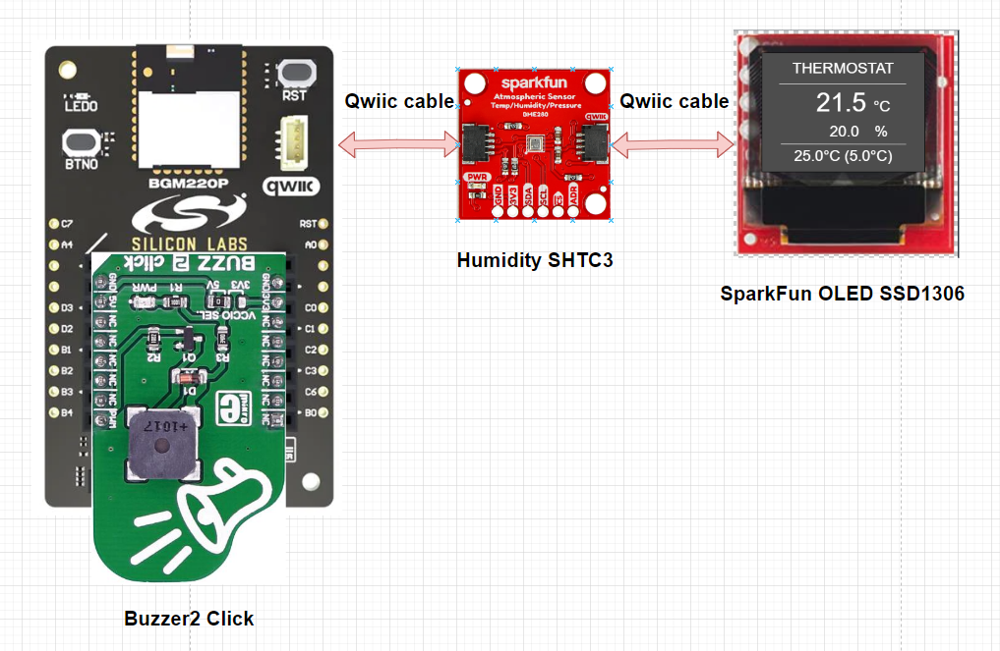
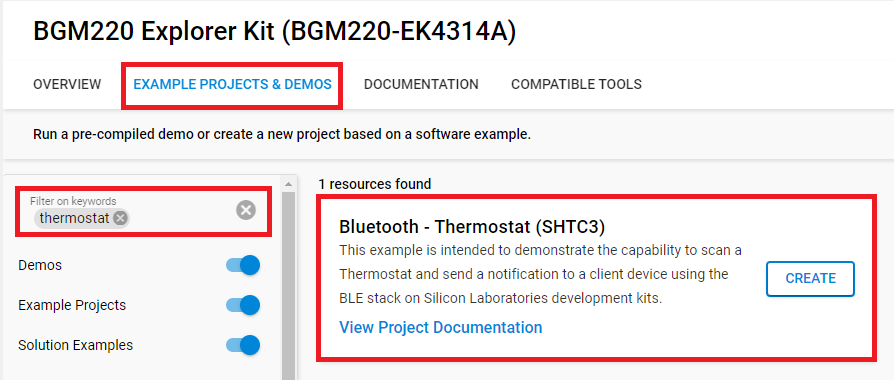

# Bluetooth - Thermostat (SHTC3)

## Summary

This project aims to implement a thermostat system using Silicon Labs development kits and external sensors integrated with the BLE wireless stack.

The block diagram of this application is shown in the image below:

More detailed information can be found in the section [How it works](#how-it-works).

This code example referred to the following code examples. More detailed information can be found here:

- [OLED SSD1306 driver](https://github.com/SiliconLabs/third_party_hw_drivers_extension/tree/master/app/documentation/example/sparkfun_micro_oled_ssd1306)
- [Bluetooth security feature](https://github.com/SiliconLabs/bluetooth_stack_features/tree/master/security)
- [SHTC3 Humidity Sensor driver](https://github.com/SiliconLabs/third_party_hw_drivers_extension/tree/master/app/documentation/example/mikroe_temphum9_shtc3)
- [Buzzer driver](https://github.com/SiliconLabs/third_party_hw_drivers_extension/tree/master/app/documentation/example/mikroe_buzz2_cmt_8540s_smt)

## SDK version

- [SiSDK v2024.12.0](https://github.com/SiliconLabs/simplicity_sdk)
- [Third Party Hardware Drivers v4.1.0](https://github.com/SiliconLabs/third_party_hw_drivers_extension)

## Software Required

- [Simplicity Studio v5 IDE](https://www.silabs.com/developers/simplicity-studio)
- [Simplicity Connect Mobile App](https://www.silabs.com/developer-tools/simplicity-connect-mobile-app)

## Required Hardware

- 1x [Bluetooth Low Energy Explorer Kit](https://www.silabs.com/development-tools/wireless/bluetooth). For simplicity, Silicon Labs recommends the [BGM220-EK4314A](https://www.silabs.com/development-tools/wireless/bluetooth/bgm220-explorer-kit)
- 1x [Humidity Sensor - SHTC3 Board](https://www.sparkfun.com/products/16467)
- 1x [Buzzer 2 Click Board](https://www.mikroe.com/buzz-2-click)
- 1x [OLED Display - SSD1306](https://www.sparkfun.com/products/14532)
- 1x smartphone running the 'Simplicity Connect' mobile app

## Hardware Connection

The hardware connection is shown in the image below:

The I2C connection is made from the BGM220 Bluetooth Module Explorer Kit to the Humidity Sensor board and the Micro OLED Breakout by using the Qwiic cable.

## Setup

To test this application, you can either create a project based on an example project or start with a "Bluetooth - SoC Empty" project based on your hardware.

**NOTE**:

- Make sure that the [Third Party Hardware Drivers extension](https://github.com/SiliconLabs/third_party_hw_drivers_extension) is installed as part of the SiSDK and the [bluetooth_applications](https://github.com/SiliconLabs/bluetooth_applications) repository is added to [Preferences > Simplicity Studio > External Repos](https://docs.silabs.com/simplicity-studio-5-users-guide/latest/ss-5-users-guide-about-the-launcher/welcome-and-device-tabs).

- SDK Extension must be enabled for the project to install the required components.

### Create a project based on an example project

1. From the Launcher Home, add your product name to My Products, click on it, and click on the **EXAMPLE PROJECTS & DEMOS** tab. Find the example project filtering by "thermostat".

2. Click **Create** button on **Bluetooth - Thermostat** project. Example project creation dialog pops up -> click Create and Finish and source code should be generated.
  

3. Build and flash this example to your board.

### Start with a "Bluetooth - SoC Empty" project

1. Create a **Bluetooth - SoC Empty** project for your hardware using Simplicity Studio 5.

2. Copy all attached files in `inc` and `src` folders into the project root folder (overwriting the existing files).

3. Import the GATT configuration:

    - Open the .slcp file in the project.

    - Select the **CONFIGURATION TOOLS** tab and open the **Bluetooth GATT Configurator**.

    - Find the Import button and import the attached `config/btconf/gatt_configuration.btconf` file.

    - Save the GATT configuration (ctrl-s).

4. Open the .slcp file. Select the SOFTWARE COMPONENTS tab and install the software components:

    - [Services] → [Timers] → [Sleep Timer]
    - [Services] → [IO Stream] → [IO Stream: USART] → default instance name: "vcom"
    - [Application] → [Utility] → [Log]
    - [Application] → [Utility] → [Assert]
    - [Third Party] → [Tiny printf]
    - [Platform] → [Driver] → [Button] → [Simple Button] → default instance name: "btn0"
    - [Platform] → [Driver] → [LED] → [Simple LED] → default instance name: "led0"
    - [Platform] → [Driver] → [PWM] → [PWM] → default instance name: "mikroe"
    - [Platform] → [Driver] → [I2C] → [I2CSPM] → default instance name: "qwiic"
    - [Third Party Hardware Drivers] → [Display & LED] → [SSD1306 - Micro OLED Breakout (Sparkfun) - I2C]
    - [Third Party Hardware Drivers] → [Audio & Voice] → [CMT_8540S_SMT - Buzz 2 Click (Mikroe)]
    - [Third Party Hardware Drivers] → [Sensors] → [SHTC3 - Temp&Hum 9 Click (Mikroe)]
    - [Third Party Hardware Drivers] → [Service] → [GLIB - OLED Graphics Library]

5. Build and flash the project to your device.

**Note:**

- A bootloader needs to be flashed to your board if the project starts from the "Bluetooth - SoC Empty" project, see [Bootloader](https://github.com/SiliconLabs/bluetooth_applications/blob/master/README.md#bootloader) for more information.

## How it Works

### Application Overview

### GATT Configurator

The application is based on the Bluetooth - SoC Empty example. Since the example already has the Bluetooth GATT server, advertising, and connection mechanisms, only minor changes are required.

The GATT changes were adding a new custom service (Thermostat ) which are 8 characteristics:

- **Mode**:

  - [**Readable**] - Get mode value

  - [**Writable**] - Set mode value - mode (0 - heat, 1 - cool)

- **Setpoint (SV)**:

  - [**Readable**] - Get setpoint value

  - [**Writable**] - Set setpoint value - setpoint (e.g.: 2500 => 25.0 °C, limits: -35 °C ↔ + 120 °C, -3500 ↔ 12000)

- **Temperature (PV)**:

  - [**Readable**] - Get current averaged temperature value (e.g.: 2500 => 25.0 °C)

- **Humidity**:

  - [**Readable**] - Get current averaged humidity value (e.g.: 2500 => 25.0 %)

- **Hysteresis (HYS)**:
  - [**Readable**] - Get hysteresis value

  - [**Writable**] - Set hysteresis value - hysteresis  (e.g.: 2500 => 25.0 °C, limits:  0 ↔ (HIGH-LOW) thresholds)

- **Lower threshold**:
  - [**Readable**] - Get a lower threshold value

  - [**Writable**] - Set lower threshold value - lower_threshold (-3500 <= VAL < Upper threshold value)

- **Upper threshold**:
  - [**Readable**] - Get upper threshold value

  - [**Writable**] - Set upper threshold value - upper_threshold (-3500 <= VAL < Upper threshold value)

- **Threshold alarm status**:
  - [**Readable**] - Get threshold alarm status (0 - disabled, 1 - enabled, 2 - alarm active)

  - [**Writable**] - Set threshold alarm status - is_alarm_active (0 - disabled or 1 - enabled )

### Thermostat Implementation

#### Application initialization

  

#### Application Workflows

1. Initialize the peripherals, the Bluetooth stack

2. Initialize and load the NVM3 configurations

3. Wait for the sensor to be booted and initialize the sensor with the configurations from NVM3:

4. Initialize the OLED display.

5. Start a periodic timer with a period of 1000ms, The timer callback will fire an external event to BLE stack and the event handler will display people counting data from the result of the counting algorithm calculation.

6. After the *sl_bt_evt_system_boot_id* event arrives, App sets up the security manager and starts advertising.

7. Handle GATT event to help the user configure the [Use Simplicity Connect Mobile Application](#use-simplicity-connect-mobile-application) and get the result from the algorithm calculation over the *EFR32 connect* mobile app

#### Algorithm workflows

### OLED Display

- Display the current people count and the value of the entered people so far
  
  

### Button

- When the button is released, it checks the alarm feature status, and buzzer state in accordance with the flowchart below.

  

### Use Simplicity Connect Mobile Application

#### Connect to the device

Follow the below steps to test the example with the Simplicity Connect application:

1. Open the Simplicity Connect app on your smartphone and allow the permission requested the first time it is opened.

2. Find your device in the Bluetooth Browser, advertising as *Thermostat*, and tap Connect.

   |  |  |
   |-|-|

#### Read/Write characteristics

The parameters of this example application can be easily configured via BLE characteristics. Values for the characteristics are handled by the application as ASCII strings. Tap on the main service to see the available characteristics. Please refer [GATT Configurator](#gatt-configurator) to choose the correct characteristic.

**Read**
Push read button to request the value of a characteristic. (See ASCII fields.)

**Write**
For setting a parameter select a characteristic and tap on its write button. Type a new value in the ASCII field and push the **Send** button.

| Characteristics | Read  | Write |
| :-------------- | ----- |------ |
| **Mode** | - Read to get mode value | - Write to set mode value - mode (0 - heat, 1 - cool) |
| **Setpoint** | - Read to get setpoint value | - Write to set setpoint value - setpoint (e.g.: 2500 => 25.0 °C, limits: -35 °C ↔ + 120 °C, -3500 ↔ 12000) |
| **Temperature(SV)** | - Read to get current averaged temperature value (e.g.: 2500 => 25.0 °C) | |
| **Humidity (PV)** | - Read to get current averaged humidity value (e.g.: 2500 => 25.0 %) | |
| **Hysteresis** | - Read to get hysteresis value | - Write to set hysteresis value - hysteresis (e.g.: 2500 => 25.0 °C, limits: 0 ↔ (HIGH-LOW) thresholds) |
| **Lower threshold** | - Read to get lower threshold value | - Write to set lower threshold value - lower_threshold (-3500 <= VAL < Upper threshold value) |
| **Upper threshold** | - Read to get upper threshold value | - Write to set upper threshold value - upper_threshold (-3500 <= VAL < Upper threshold value) |
| **Threshold alarm status** | - Read to get threshold alarm status (0 - disabled, 1 - enabled, 2 - alarm active). | - Write to set threshold alarm status - is_alarm_active (0 - disabled or 1 - enabled) |

## Report Bugs & Get Support

To report bugs in the Application Examples projects, please create a new "Issue" in the "Issues" section of [bluetooth_applications](https://github.com/SiliconLabs/bluetooth_applications) repo. Please reference the board, project, and source files associated with the bug, and reference line numbers. If you are proposing a fix, also include information on the proposed fix. Since these examples are provided as-is, there is no guarantee that these examples will be updated to fix these issues.

Questions and comments related to these examples should be made by creating a new "Issue" in the "Issues" section of [bluetooth_applications](https://github.com/SiliconLabs/bluetooth_applications) repo.
