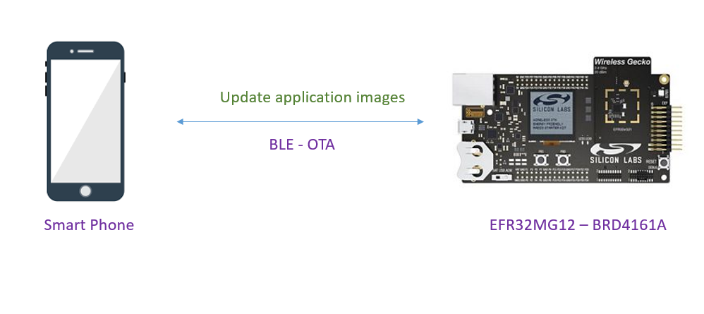
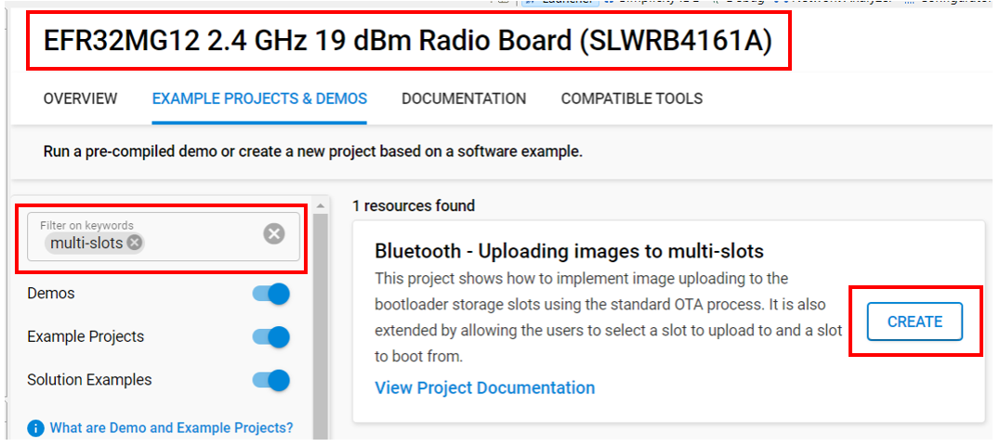
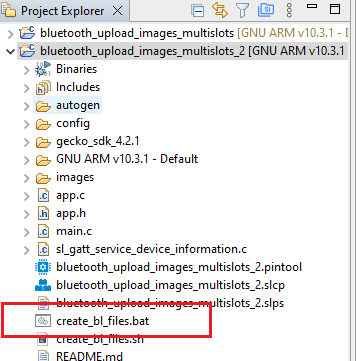
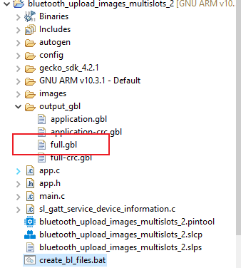
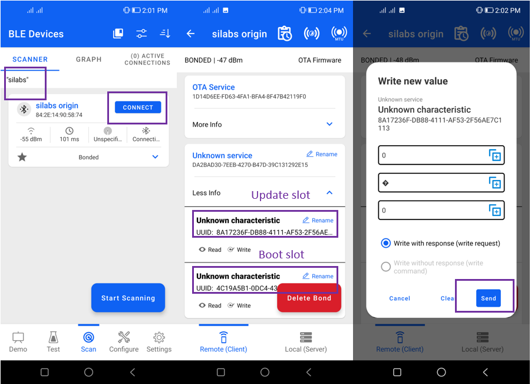
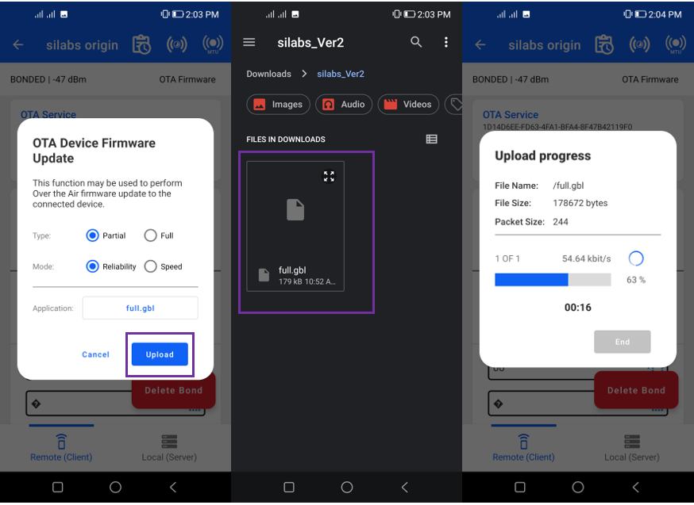

# Bluetooth - Uploading images to multi-slots #

## Description ##

The project implements image uploading to the bootloader storage slots using the standard OTA process. It is also extended by allowing the users to select a slot to upload and boot from. You are free to modify this example according to your needs.

The following picture shows the system view of how it works.

## Gecko SDK Suite version ##

- GSDK v4.2.1

## Hardware Required ##

- [EFR32MG12 2.4 GHz 19 dBm Radio Board Brd4161a](https://www.silabs.com/documents/public/reference-manuals/brd4161a-rm.pdf)

- [BRD4001A A01 Wireless Starter Kit Mainboard](https://www.silabs.com/documents/public/schematic-files/BRD4001A-A01-schematic.pdf)

- Smartphone

## Connections Required ##

The following picture shows the hardware for the device (with EFR32MG12).

## Setup ##

To test this application, you can either create a project based on an example project or start with a "Bluetooth - SoC Empty" project based on your hardware.

### Create a project based on an example project ###

To implement the bluetooth - uploading images to multiple slots application, we need to have a bootloader which supports multiple images.

#### Create bootloader project ###
1. From the Launcher Home, add the your hardware to MyProducts, click on it, and click on the **EXAMPLE PROJECTS & DEMOS** tab. Find the example project with filter "bootloader".

2. Create an **Bootloader - SoC Internal Storage (multiple images on 1MB device)** project in Simplicity Studio.

3. Build the project and flash the bootloader to your device.

#### Create application project ###

4. Back to the Launcher Home, Find the example project with filter "multi-slots".

5. Create **TWO** projects with the **Bluetooth - Uploading images to multiple slots** example. These example projects creation dialog pops up -> click Create and Finish and Projects should be generated.

6. At the first **Bluetooth - Uploading images to multiple slots** project:
    - Open the .slcp file in the project.

    - Select the **CONFIGURATION TOOLS** tab and open the **Bluetooth GATT Configurator**.

    - Change the Device Name to “silabs origin”.

    - Save GATT database.

7. Build and flash this first project to your boards.

8. At the second **Bluetooth - Uploading images to multiple slots** project:

    - Open the .slcp file in the project.

    - Select the **CONFIGURATION TOOLS** tab and open the **Bluetooth GATT Configurator**.

    - Change the Device Name to “silabs version 1”.

    - Save GATT database.

9. Build this second project.

### Create a project from empty ###

1. From the Launcher Home, add the your hardware to My Products, click on it, and click on the **EXAMPLE PROJECTS & DEMOS** tab. Find the example project with filter "bootloader".

2. Create an **Bootloader - SoC Internal Storage (multiple images on 1MB device)** project in Simplicity Studio.

3. Build the project and flash the bootloader to your device.

4. Create a **Bluetooth – SoC Empty** project.

5. Copy all attached files in *inc* and *src* folders into the project root folder (overwriting existing).

6. Open the .slcp file. Select the SOFTWARE COMPONENTS tab and install these software components:

    - [Services] → [IO Stream] → [IO Stream: USART] → default instance name: vcom
    - [Application] → [Utility] → [Log]
    - [Application] → [Utility] → [Assert]
    - [Platform] → [Board] → [Board Control] → enable *Virtual COM UART*
   - [Bluetooth] → [OTA] → [In-Place OTA DFU]: **uninstall**.

   *(This will uninstall Apploader, remove OTA DFU service and the OTA control characteristics handler code.)*

7. Import the GATT configuration:

    - Open the .slcp file in the project.

    - Select the **CONFIGURATION TOOLS** tab and open the **Bluetooth GATT Configurator**.
    
    - Find the Import button and import the attached [gatt_configuration.btconf](config/btconf/gatt_configuration.btconf) file.

    - Save the GATT configuration (ctrl-s).

8. Build and flash this first project to your device.

9. Make a copy of this project to have the second project.

10. In the second project, change the Device Name to “silabs version 1” in the GATT Configurator, and save the GATT database

11. Build this second project.

## How it work

1. In the second project, run create_bl_files.bat. You may need to set up some environmental variables first, as described in section 3.10 of [AN1086: Using the Gecko Bootloader with the Silicon Labs Bluetooth® Applications](https://www.silabs.com/documents/public/application-notes/an1086-gecko-bootloader-bluetooth.pdf)

2. Find the full.gbl file in output_gbl folder.

3. Copy full.gbl to your smartphone.
4. Open EFR Connect app on your smartphone.
5. Find your device with Bluetooth browser (advertising as **silabs origin**) and connect to it.
6. Find the unknown service and open it (this is your custom service including Upload slot and Bootload slot characteristics).

7. Open the first characteristic (this is the upload characteristic) and write the slot number, that you want to upload to, in it, for example 0x00.

8. In the local menu select OTA Firmare.
9. Select the partial type.
10. Select the full.gbl file you want to upload.
11. Click Upload. The file will be uploaded to the selected slot.

12. Open the second characteristic in the unknown service (Bootload slot) and write the slot number (e.g. 0x00), that you want to load the application from, in it. The device will trigger a reset and the new application will be loaded.
13. Reload and find your device advertising itself as “silabs version 1”.

