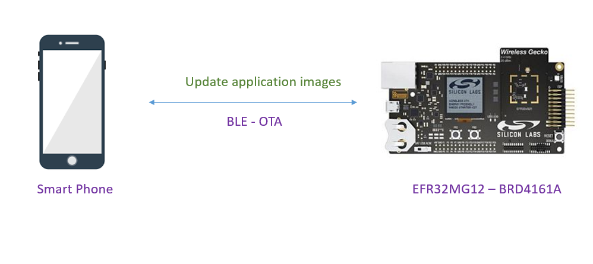
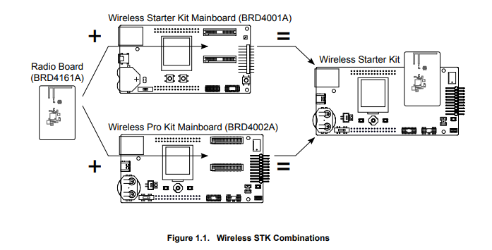
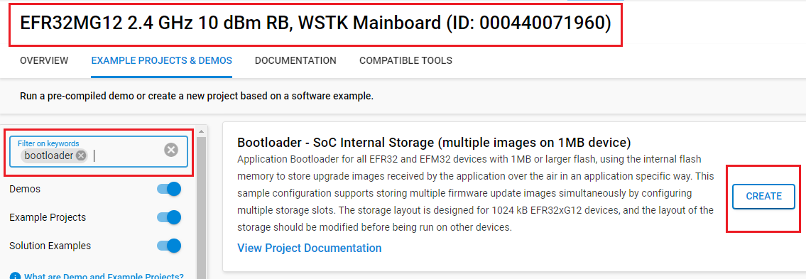
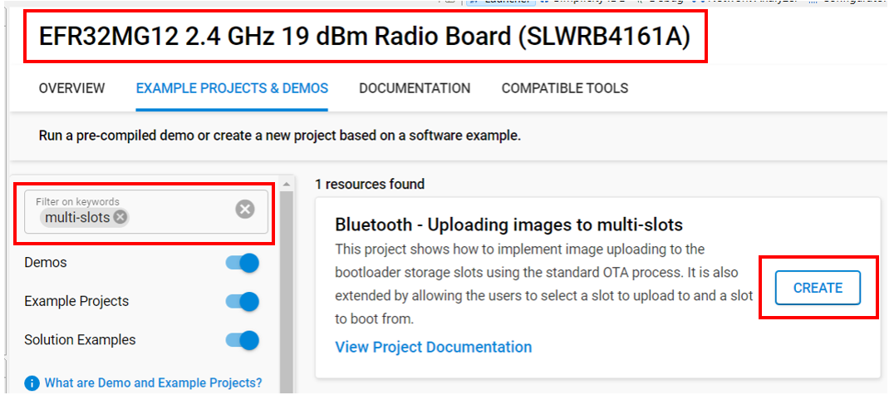
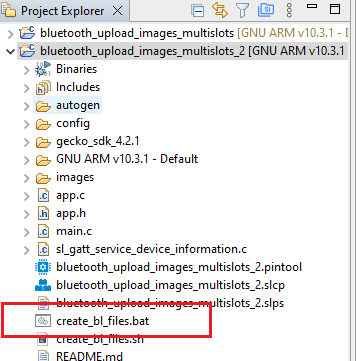
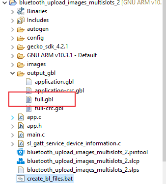
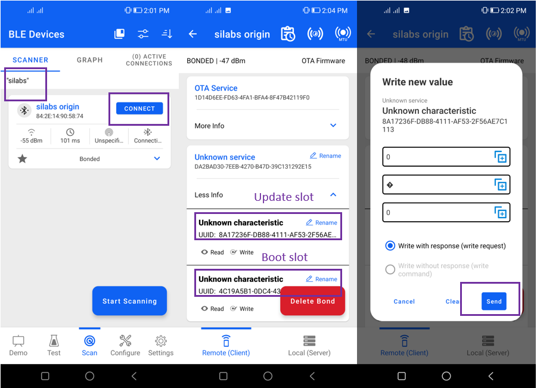
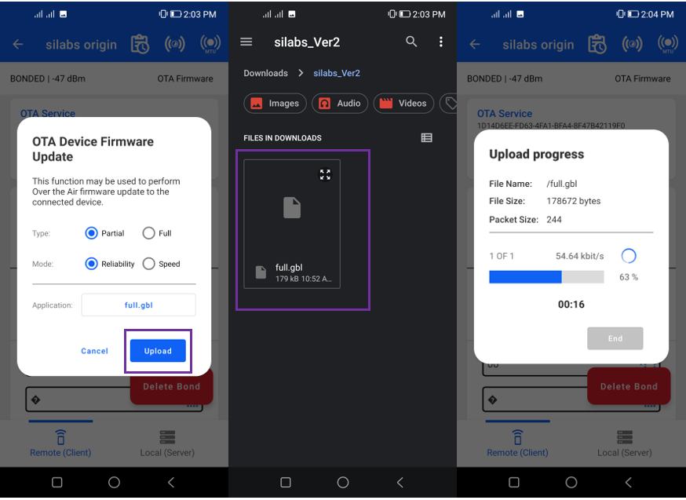
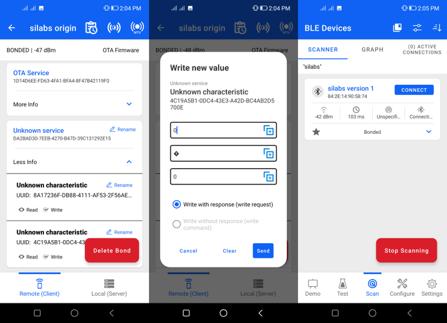

# Bluetooth - Uploading images to multi-slots #

## Description ##

The project implements image uploading to the bootloader storage slots using the standard OTA process. It is also extended by allowing the users to select a slot to upload and boot from. You are free to modify this example according to your needs.

The following picture shows the system view of how it works.

## SDK version ##

- [GSDK v4.4.5](https://github.com/SiliconLabs/gecko_sdk)

## Software Required ##

- [Simplicity Studio v5 IDE](https://www.silabs.com/developers/simplicity-studio)
- [Simplicity Connect Mobile App](https://www.silabs.com/developer-tools/simplicity-connect-mobile-app)

## Hardware Required ##

- 1x [SLWRB4161A] EFR32MG12 2.4 GHz +19 dBm 1 MB Flash Radio Board
- 1x [SI-MB4002A](https://www.silabs.com/development-tools/wireless/wireless-pro-kit-mainboard) Wireless Pro Kit Mainboard
- 1x smartphone running the 'Simplicity Connect' mobile app

## Connections Required ##

The following picture shows the hardware for the device (with EFR32MG12).

## Setup ##

To test this application, you can either create a project based on an example project or start with a "Bluetooth - SoC Empty" project based on your hardware.

**NOTE**:

- Make sure that the [bluetooth_applications](https://github.com/SiliconLabs/bluetooth_applications) repository is added to [Preferences > Simplicity Studio > External Repos](https://docs.silabs.com/simplicity-studio-5-users-guide/latest/ss-5-users-guide-about-the-launcher/welcome-and-device-tabs).

### Create a project based on an example project ###

To implement the Bluetooth - Uploading Images to Multiple Slots application, we need to have a bootloader that supports multiple images.

#### Create bootloader project ###

1. From the Launcher Home, add your product name to MyProducts, click on it, and click on the **EXAMPLE PROJECTS & DEMOS** tab. Find the example project filtering by "bootloader".

2. Create a **Bootloader - SoC Internal Storage (multiple images on 1MB device)** project in Simplicity Studio.

    

3. Build the project and flash the bootloader to your device.

#### Create application project ###

1. Back to the Launcher Home, Find the example project filtering by "multi-slots".

2. Create **TWO** projects with **Bluetooth - Uploading images to multiple slots** example. These example projects creation dialog pops up -> click Create and Finish and Projects should be generated.

    

3. At the first **Bluetooth - Uploading images to multiple slots** project:
    - Open the .slcp file in the project.

    - Select the **CONFIGURATION TOOLS** tab and open the **Bluetooth GATT Configurator**.

    - Change the Device Name to “silabs origin”.

    - Save the GATT database.

4. Build and flash this first project to your boards.

5. At the second **Bluetooth - Uploading images to multiple slots** project:

    - Open the .slcp file in the project.

    - Select the **CONFIGURATION TOOLS** tab and open the **Bluetooth GATT Configurator**.

    - Change the Device Name to “silabs version 1”.

    - Save the GATT database.

6. Build this second project.

### Create a project from Bluetooth - SoC Empty project ###

1. From the Launcher Home, add your product name to My Products, click on it, and click on the **EXAMPLE PROJECTS & DEMOS** tab. Find the example project filtering by "bootloader".

2. Create a **Bootloader - SoC Internal Storage (multiple images on 1MB device)** project in Simplicity Studio.

    

3. Build the project and flash the bootloader to your device.

4. Create a **Bluetooth – SoC Empty** project.

5. Copy all attached files in the *inc* and *src* folders into the project root folder (overwriting existing).

6. Open the .slcp file. Select the SOFTWARE COMPONENTS tab and install these software components:

    - [Services] → [IO Stream] → [IO Stream: USART] → default instance name: vcom
    - [Application] → [Utility] → [Log]
    - [Application] → [Utility] → [Assert]
    - [Platform] → [Board] → [Board Control] → enable *Virtual COM UART*
    - [Bluetooth] → [OTA] → [In-Place OTA DFU]: **uninstall**.

   *(This will uninstall Apploader and remove OTA DFU service and the OTA control characteristics handler code.)*

7. Import the GATT configuration:

    - Open the .slcp file in the project.

    - Select the **CONFIGURATION TOOLS** tab and open the **Bluetooth GATT Configurator**.

    - Find the Import button and import the attached `config/gatt_configuration.btconf` file.

    - Save the GATT configuration (ctrl-s).

8. Build and flash this first project to your device.

9. Make a copy of this project to have the second project.

10. Similar to the second project, change the Device Name to “silabs version 1” in the GATT Configurator, and save the GATT database

11. Build these projects.

## How It Works ##

Follow the below steps to test the example:

1. In the second project, run create_bl_files.bat. You may need to set up some environmental variables first, as described in section 3.10 of [AN1086: Using the Gecko Bootloader with the Silicon Labs Bluetooth® Applications](https://www.silabs.com/documents/public/application-notes/an1086-gecko-bootloader-bluetooth.pdf).

    

2. Find the full.gbl file in the 'output_gbl' folder.

    

3. Copy full.gbl to your smartphone.

4. Open the Simplicity Connect app on your smartphone and allow the permission requested the first time it is opened.

5. Find your device in the Bluetooth Browser, advertising as *silabs origin*, and tap Connect

6. Find the unknown service and open it (this is your custom service including Upload slot and Bootload slot characteristics).

7. Open the first characteristic (this is the upload characteristic) and write the slot number, that you want to upload to, in it, for example: 0x00.

    

8. In the local menu select OTA Firmare.
9. Select the partial type.
10. Select the full.gbl file you want to upload.
11. Click Upload. The file will be uploaded to the selected slot.

    

12. Open the second characteristic in the unknown service (Bootload slot) and write the slot number (e.g. 0x00), that you want to load the application from, in it. The device will trigger a reset and the new application will be loaded.
13. Reload and find your device advertising itself as “silabs version 1”.

    
