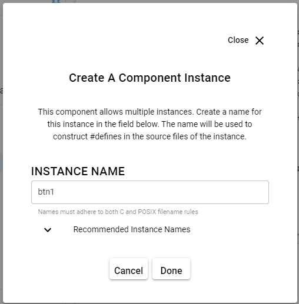
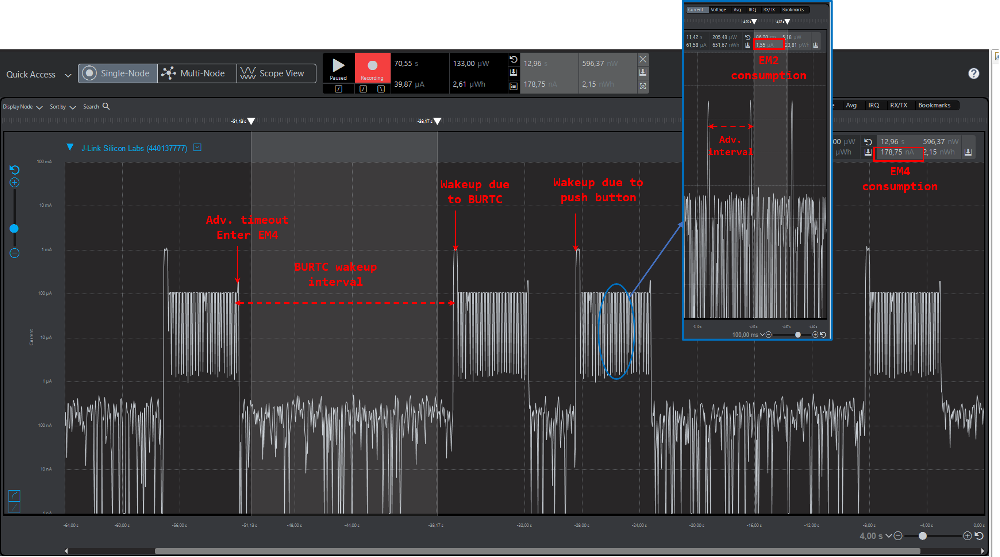

# Using EM4 Energy Mode in Bluetooth Beacon App


## Summary ##
This code example shows the use of sleep mode EM4 in a Bluetooth Beacon Application. The use case addressed in the attached example code is that of a Bluetooth iBeaconing device which operates in deep sleep mode EM4. When either the user interrupts the operation via a button press, or the BURTC counter reaches top value (15000 = 15 sec), the device exits from EM4 and advertises for 5 seconds before going back to EM4 again. BURTC counter resets everytime the device exits from EM4.

Note that wake-up from EM4 is performed through a reset. Thus, no data is retained from the previous state, and the stack is reinitialized. 

## Gecko SDK version ##

SDK v3.1.2

## Hardware Required ##
- WSTK
- EFR32xG22 radio board 
  
Note that `BRD4182A` radio board is used for preparing this example code. If you are using any other radio board or testing this on your custom board, please refer to the reference manual of your target device and use the right EM4WU Pin for the push button.

## Setup ##

1. Create `Bluetooth - SoC iBeacon` example project for your radio board using Simplicity Studio 5.
2. Open the `*.slcp` file in your project and install `Simple Button` driver.
3. When prompted to create a component instance, create a name for the button instance in the provided field. We are creating btn1 button instance in this example, since EM4WU Pin is button 1 in BRD4182A. 
    

4. Copy and overwrite the attached `app.c` file into your project directory.
   
5. Compile and flash the project to your radio board.
6. Set the WSTK in AEM mode using the 3-way switch.
7. In Simplicity Studio, open Energy Profiler.
8. On the top left under Quick Access -> Start Energy Capture.
9. Press Reset on the WSTK. The device will advertise an iBeacon Packet for 5 seconds and goes to EM4. During the advertising period, the device goes to EM2 energy mode between advertising intervals. This is managed by the power manager in the main loop.

## How it Works ##

To initialize a device for EM4:

```C
EMU_EM4Init_TypeDef em4Init = EMU_EM4INIT_DEFAULT;
EMU_EM4Init(&em4Init);
```

To wake-up from EM4 using a specific module, the EM4WUEN register of that module must be enabled. In this example code, this is done via the call to  `BURTC_Init()` and `GPIO_EM4EnablePinWakeup()` for the BURTC and GPIO wakeup pin, respectively.

The average current consumption in EM4 deep sleep mode is ~115 nA.

