# Bluetooth - DW3000 TWR demo


[](https://www.mikroe.com/uwb-2-click)


## Summary

Ultra-wideband (UWB) is a radio technology based on the IEEE 802.15.4a and 802.15.4z standards that can enable a more precise measure of the Time of Flight of the radio signal, leading to centimeter accuracy distance/location measurement. UWB technology can be implemented in different ways based on the target applications needs: Time Difference of Arrival (TDoA), Two Way Ranging, or Phase Difference of Arrival (PDoA).

This example is based on **DW3000 TWR demo** example, which can be downloaded from the [DW3000 module page](https://www.qorvo.com/products/p/DWM3000). The demo consists of two Mikroe UWB 2 Click units with DW3000 IC, one running a NODE application and the other a TAG application. The node performs double-sided two-way ranging with a tag, and then calculates the range (and optionally PDoA with tag’s x, y location coordinates) and reports the results to an external application (e.g. PC GUI application). The PC GUI application then plots the position of the tags based on the reported values.

## Gecko SDK Suite version

- GSDK v4.4.3
- [Third-Party Hardware Drivers v2.0.2](https://github.com/SiliconLabs/third_party_hw_drivers_extension)

## Required Hardware

- [EFR32xG24 Explorer Kit](https://www.silabs.com/development-tools/wireless/efr32xg24-explorer-kit?tab=overview)

- [UWB 2 Click board™](https://www.mikroe.com/uwb-2-click)

**NOTE:**
Tested boards for working with this example:

| Board ID | Description  |
| --- | --- |
| BRD2703A | [xG24-EK2703A - EFR32xG24 Explorer Kit](https://www.silabs.com/development-tools/wireless/efr32xg24-explorer-kit?tab=overview)    |

## Hardware Connection

The DWM3000 - UWB 2 Click board™ supports MikroBus. Therefore, it can connect easily to the MikroBus header of the EFR32xG24 Explorer Kit. Be sure that the 45-degree corner of the board matches the 45-degree white line of the Explorer Kit. The hardware connection is shown in the image below:

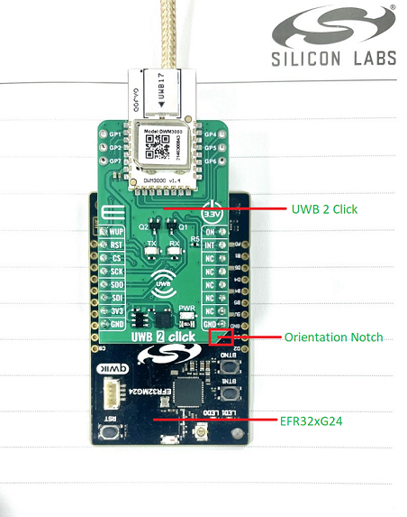

## Setup

### Create a project based on an example project

1. From the Launcher Home, add the BRD2703A to My Products, click on it, and click on the **EXAMPLE PROJECTS & DEMOS** tab. Find the example project filtering by "twr".

2. Click **Create** button on the **Bluetooth - UWB Slotted TWR Demo** example. Example project creation dialog pops up -> click Create and Finish and Project should be generated.

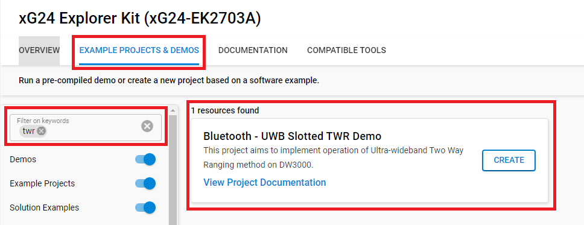

3. Build and flash this example to the board.

**Note:**

- Make sure that the SDK extension has already been installed. If not, please follow [this documentation](https://github.com/SiliconLabs/third_party_hw_drivers_extension/blob/master/README.md#how-to-add-to-simplicity-studio-ide).

- SDK Extension must be enabled for the project to install "DWM3000 - UWB 2 Click (Mikroe)" component.

### Port to different board or custom hardware (EFR32xG24)

1. Create a project based on an example project follow the [previous section](#create-a-project-based-on-an-example-project)
2. Open .slcp file, slect **OVERVIEW** section and change the target board or target MCU

    | | |
    | --- | --- |
    | 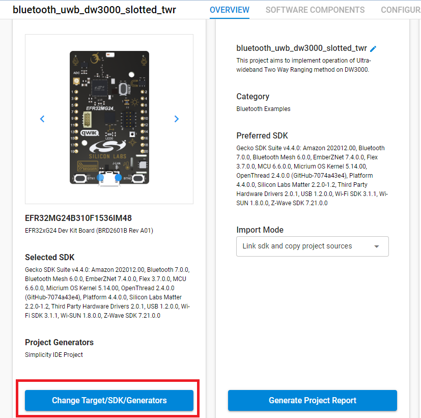 | 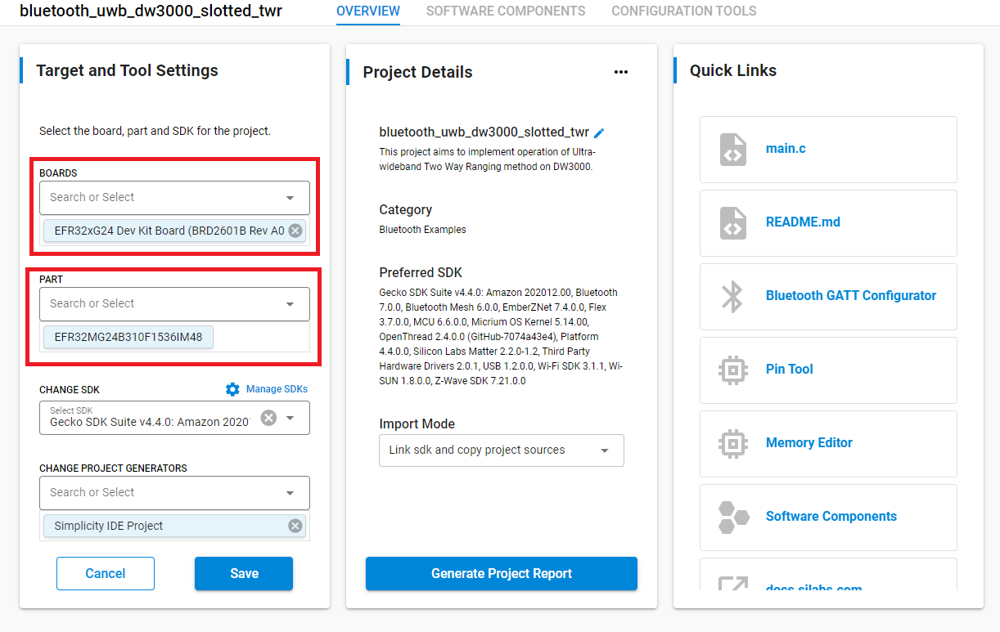 |

3. Open .slcp file, slect **SOFTWARE COMPONENTS** section, find the component with name **DWM3000 - UWB 2 Click (Mikroe)** in **SDK Extension: Third Party Hardware Drivers** and modify the GPIO configuration.

    | | | |
    | --- | --- | --- |
    | 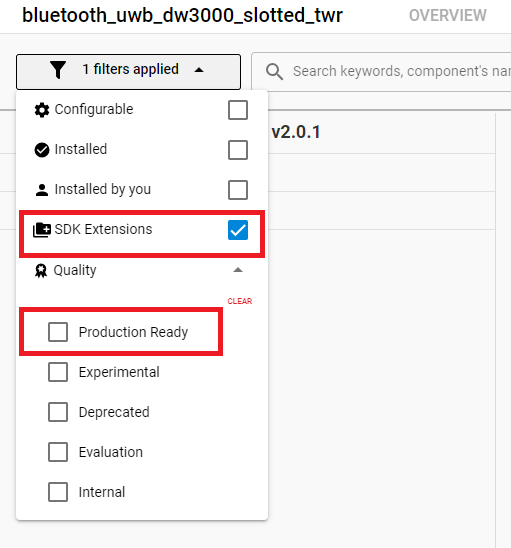 | 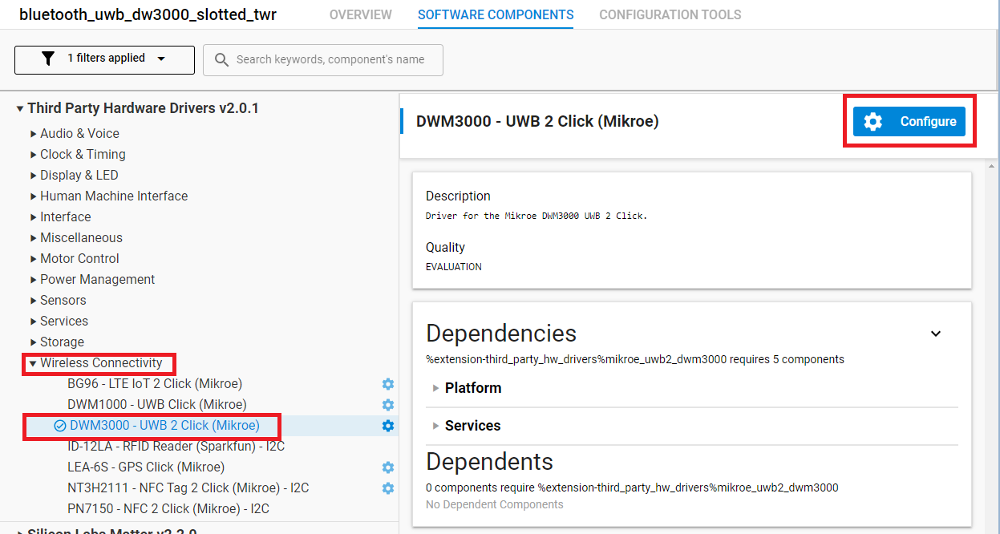 | |

    The current used pin configuration is as follows:

    | Functionality name | Macro name | GPIO port and pin |
    | --- | --- | --- |
    | DW3000 SPI Clock | DWM3000_CLK | gpioPortC1 |
    | DW3000 SPI Master In, Slave Out | DWM3000_MISO |gpioPortC2 |
    | DW3000 SPI Master Out, Slave In | DWM3000_MOSI | gpioPortC3 |
    | DW3000 SPI Chip Select | DWM3000_CS | gpioPortC0 |
    | DW3000 Interrupt | DWM3000_INT | gpioPortB1 |
    | DW3000 Reset | DWM3000_RESET | gpioPortC8 |

4. Open file: src/platform/port/port_uart.h and modify the GPIO configuration. The current used pin configuration is as follows:
    | Functionality name | Macro name | GPIO port and pin |
    | --- | --- | --- |
    | Virtual COM UART enable (if exists, can be undefined) | HAL_UART_ENABLE_PORT, HAL_UART_ENABLE_PIN | undefined |
    | Virtual COM UART Tx | HAL_UART_TX_PORT, HAL_UART_TX_PIN | gpioPortA5 |
    | Virtual COM UART Rx | HAL_UART_RX_PORT, HAL_UART_RX_PIN | gpioPortA6 |
    | Button | HAL_IO_PORT_BUTTON, HAL_IO_PIN_BUTTON | gpioPortB2 |
    | Error LED | HAL_IO_PORT_LED_ERROR, HAL_IO_PIN_LED_ERROR | gpioPortA4 |

5. Open file: linkerfile.ld and modify the memory configuration to match with the new target MCU. The current memory configuration of brd2703a board is as follows:

    ```
    FLASH_PAGE_SIZE = 0x2000;
    FLASH_SIZE = 0xfe000;
    RAM_SIZE = 0x40000;
    ```

## How It Works

The detailed documentation can be downloaded from [Qorvo website](https://www.qorvo.com/products/d/da007992). In that package you can find the example document with path: Software/Slotted_TWR_Demo_ARM/Docs/SW-DW3000-TWR-demo.pdf

### Basic operation

The basic operation of the system is as follows: The node performs double-sided two-way ranging with a tag, and then calculates the range (and optionally PDoA with tag’s x, y location coordinates) and reports the results to an external application (e.g. PC GUI application). The PC GUI application then plots the position of the tags based on the reported values. The image bellow describes the Discovery and Ranging phases

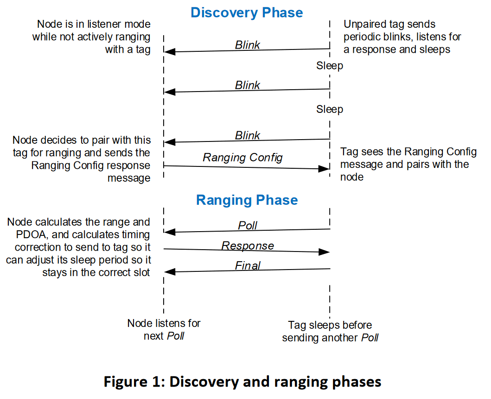

1. TAGs start operating in Discovery mode, periodically sending Blink messages.
2. The node listens for Blink messages from tags and when a Blink message is received, the node responds to the tag with a Ranging Config message.
3. The Ranging Config message provides information to the tag describing how to perform ranging with the node. This information includes the PAN ID, the short address of the node, a short address assignment for the tag, timing parameters for the ranging phase to be used at the start of the next ranging exchange. Upon receiving the Ranging Config message, the tag operation changes to the Ranging mode where it periodically initiates ranging exchanges with the node.
4. Each ranging exchange starts with the tag sending a Poll message.
5. When the node receives the Poll message, it replies with a Response message, and the tag completes the ranging exchange by sending a Final message.
6. The node then calculates the range to the tag which it reports via USB/UART for displaying by the PC GUI application.

NOTE: when using configurations with STS modes, the STS timestamp should be validated before replying to the Poll or Response messages.

### Concept of Discovered and Known tags lists

Before the node starts ranging to a tag, the tag needs to be added to a list specifying tags to which the node is allowed to range with. This list of tags is called "known tags list" or KList. Every record in the KList has all necessary information about each tag including: its 64-bit address, assigned 16-bit (short) address, assigned slot number, etc. This information is supplied to the tag in the Ranging Config reply by the node following the reception of the tag’s blink message. The KList can be saved and it will then be available for use during autonomous working mode of the NODE (i.e. after start-up).

### Testing

The testing can be done with 2 devices, one runs as NODE, one runs as TAG. It also can work with one NODE and many TAGs.

#### Testing with controlling of the embedded applications over uart console

To test the ranging application with uart console, we need 2 devies with TWR Demo application running. Then using the teminal console tool like PUTY to connect with them over UART (JLINK USB-UART bridge)

1. Setup operation mode: Setup one device as NODE by sending command: "NODE", one device as TAG by sending command: "TAG" as the picture bellow
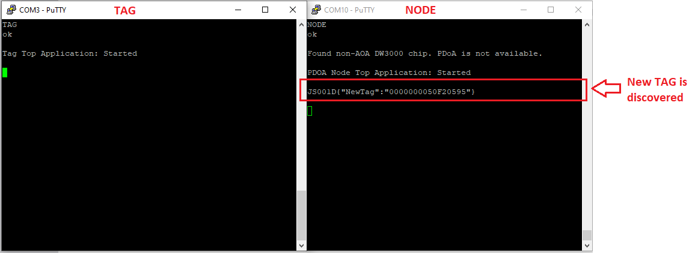
After the operation mode of the TAG device is changed, it will periodically sending "blink messages". And when the TAG is discovered, the NODE will report the TAG's address as 64 bits hex.

2. Add TAG with addr64 to known tags list (KList): Use ADDTAG command on the NODE device:
    > ADDTAG \<addr64\> \<addr16\> \<mFast\> \<mSlow\> \<mMode\>

    - \<addr64\> is address of the tag, hexadecimal, must be 16 characters; 
    - \<addr16\> is request to assign this short address of the tag, hexadecimal; This address may be automatically changed by the node, as KList is protected from adding of identical addresses in it.
    - \<mFast\> is hexadecimal value which will be used by the tag if it considered it is moving. This is in number of superframes. For example, 1 means that the Tag, when its moving, will range to the Node every superframe, and “0A” \(decimal 10\) means tag will range to the node every 10-th superframe.
    - \<mSlow\> is hexadecimal value which will be used by the tag if it considered it is not moving, i.e. stationary. This value usually specified to a big number, 64 hexadecimal means tag will range to the node every 100 superframes. See Example below.
    - \<mMode\> is a hexadecimal bitfield parameter to pass to the tag. Bit 0 indicates tag shall use IMU to detect if it stationary or moving. Bits 1-15 are not used.

    Example:
    > ADDTAG 0000000050f20595 1000 2 64 1

    This instructs the node to add the tag to the KList with long address “0x0000000050f20595”, try to assign to this tag a new short address “0x1000”, configure tag to use IMU, the tag should range to the node every 2 superframes if it is moving (giving superframe is 100 ms, this means tag will range 5 times a second), and when tag is stationary, range every 100 superframes, i.e. every 10 seconds. On success the command will return a "TagAdded" JSON object with actual parameters, assigned to the tag

3. Ranging phase: If the TAG is successfull added, the NODE device will start ranging imediately and then report the distance beetween TAG and NODE periodically.

    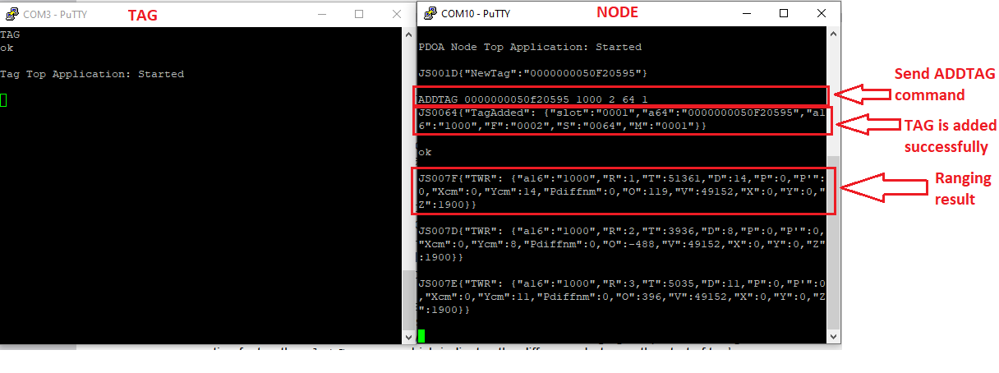

#### Testing with controlling of the embedded applications over a PC GUI app

When NODE top-level application is running, it can be controlled externally by UART and accepting specific commands, which belongs specifically to the NODE top-level application.

1. Setup operation mode: Connect 2 devices to PC by using USB cable. Then setup one device as TAG by sending command: "TAG", use PDoA GUI PC application to connect to other device to make it as a NODE.

    - When the PDoA GUI connected to the NODE, it will show as the picture bellow.
    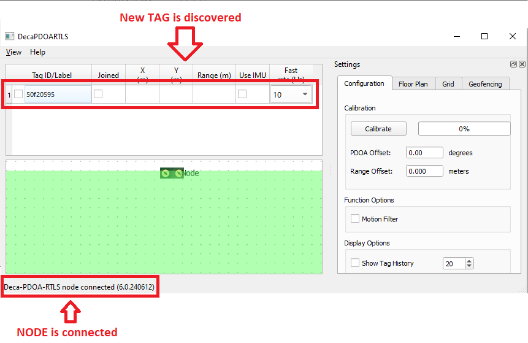
    - When new TAG is discovered, it will be shown in the device list table. Select the joined checkbox to add new TAG, the ranging phase will start imediately after that. Then the PDoA GUI will show the TAG relative location to the NODE in green area.
    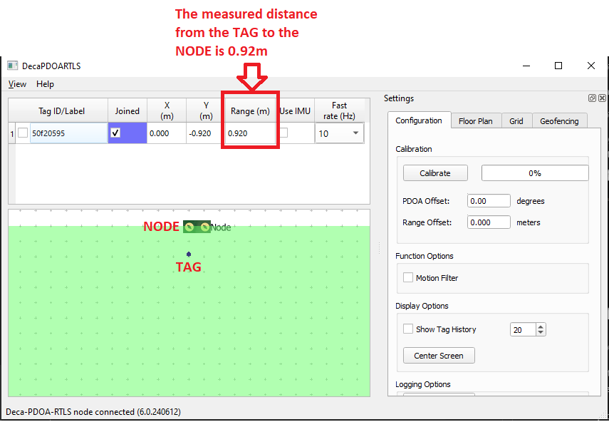