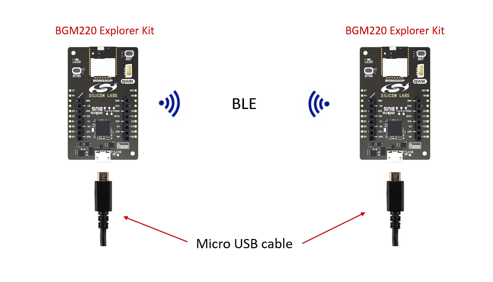
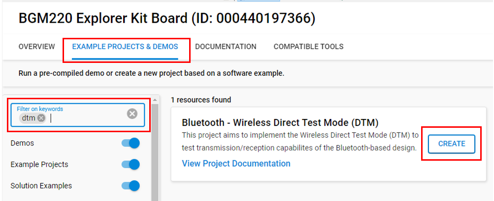
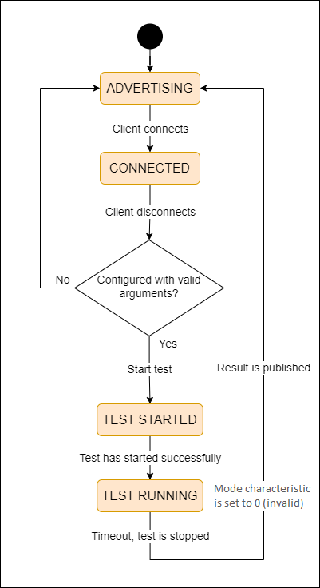
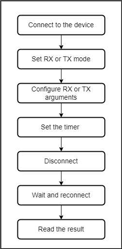
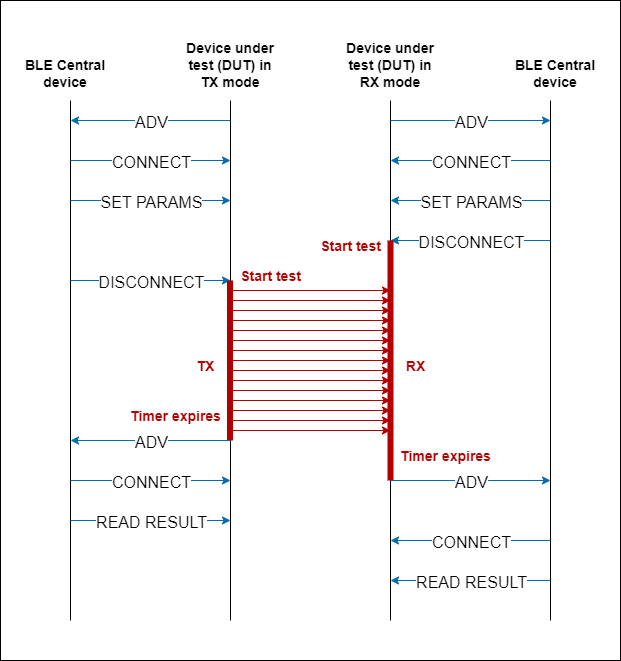
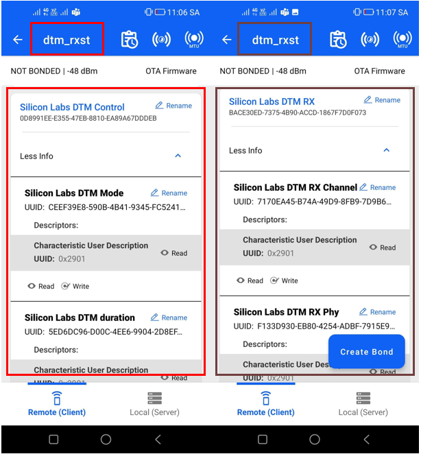
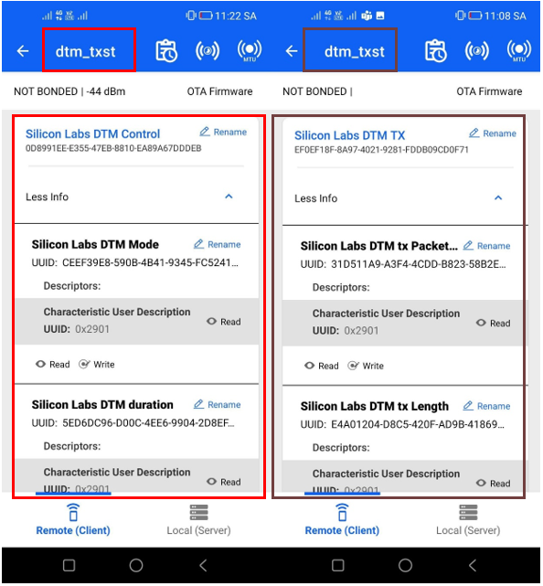
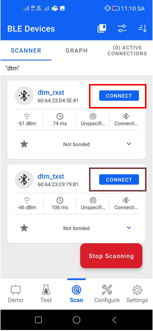
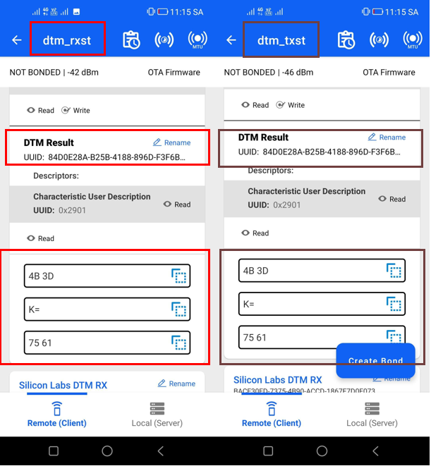

# Bluetooth - Wireless Direct Test Mode (DTM) #

## Overview ##

This project aims to implement the Wireless Direct Test Mode (DTM) to test the transmission/reception capabilities of the Bluetooth-based design.

Designing an embedded system correctly is a complex task. As a result, radio testing is a critical step that any design cycle needs to implement. This example shows how to use DTM routines completely wirelessly, where physical access is not required to the device.

Because it is wireless, a Bluetooth-based design might need to support a wireless-based testing method because some devices can be fully enclosed, preventing any physical access via wired protocols such as UART.

The Direct Test Mode (DTM) routines are part of the BGAPI. The most common way to use them is by having a device programmed with Network Co-Processor (NCP) firmware and launching the commands from a host using BGAPI over UART. For more information about DTM and radio testing, see [AN1267: Radio Frequency Physical Layer Evaluation in Bluetooth SDK v3.x](https://www.silabs.com/documents/public/application-notes/an1267-bt-rf-phy-evaluation-using-dtm-sdk-v3x.pdf).

## Gecko SDK Version ##

- GSDK v4.4.0

## Hardware Required ##

- 2 x [BGM220-EK4314A (BGM220 Bluetooth Module Explorer Kit)](https://www.silabs.com/development-tools/wireless/bluetooth/bgm220-explorer-kit)

## Connections Required ##

The following picture shows the connection for this application:

## Setup ##

To test this application, You can either create a project based on an example project or start with an empty example project.

### Create a project based on an example project ###

1. From the Launcher Home, add your product name to My Products, click on it and click on the **EXAMPLE PROJECTS & DEMOS** tab. Find the example project with the filter "dtm".

2. Click **Create** button on **Bluetooth - Wireless Direct Test Mode (DTM)** project. Example project creation dialog pops up -> click Create and Finish and source code should be generated.

      

3. Build and flash this example to your board.

### Start with a "Bluetooth - SoC Empty" project ###

1. Create a **Bluetooth - SoC Empty** project for your hardware using Simplicity Studio 5.

2. Copy the app.c file from the *src* folder into the project root folder (overwriting the existing app.c).

3. Import the GATT configuration:

   - Open the .slcp file in the project.
   - Select the **CONFIGURATION TOOLS** tab and open the **Bluetooth GATT Configurator**.
   - Find the Import button and import the attached [gatt_configuration.btconf](config/btconf/gatt_configuration.btconf) file.
   - Save the GATT configuration (ctrl-s).

4. Open the .slcp file again. Select the **SOFTWARE COMPONENTS** and install the [Bluetooth]->[Stack]->[DTM]->[**Direct Test Mode**] Software Component.

5. Build and flash this project to your board.

## How It Works ##

### Application Overview ###

The following flowchart explains how the application works from the perspective of the RX/TX DUT.

### GATT Database ###

The application is based on the Bluetooth - SoC Empty example. Since the example already has the Bluetooth GATT server, advertising, and connection mechanisms, only minor changes are required.

The GATT changes were adding 3 custom services, which the configuration parameters are organized to. The control service also stores the test result which is published after the test has finished.

| Service Name      | UUID                                 |
| ----------------- | ------------------------------------ |
| Silicon Labs DTM control | 0d8991ee-e355-47eb-8810-ea89a67dddeb |
| Silicon Labs DTM RX | bace30ed-7375-4b90-accd-1867f7d0f073 |
| Silicon Labs DTM TX | ef0ef18f-8a97-4021-9281-fddb09cd0f71 |

### Silicon Labs DTM control service ###

Custom service contains characteristics to run a DTM test on the device.
This service provides the following characteristics:

| Characteristic Name       | Length | Properties | Description |
| ------------------------- | ------ | ---------- | ----------- |
| Silicon Labs DTM mode     | 1 byte | Read, Write | The DTM mode of the device: RX: 1, TX: 2, CW: 3 |
| Silicon Labs DTM duration | 2 bytes | Read, Write | The duration of the DTM test in seconds |
| Silicon Labs DTM result   | 2 bytes | Read | Stores the result of the DTM test |

### Silicon Labs DTM RX service ###

Custom service contains characteristics to configure the device in DTM receiver mode.

| Characteristic Name       | Length | Properties | Description |
| ------------------------- | ------ | ---------- | ----------- |
| Silicon Labs DTM rx channel | 1 byte | Read, Write | Bluetooth channel to use |
| Silicon Labs DTM rx phy | 1 byte | Read, Write | PHY to use (enum)|

### Silicon Labs DTM TX service ###

Custom service contains characteristics to configure the device in DTM transmitter mode.

| Characteristic Name       | Length | Properties | Description |
| ------------------------- | ------ | ---------- | ----------- |
| Silicon Labs DTM tx packet type | 1 byte | Read, Write | Packet type to transmit |
| Silicon Labs DTM tx length | 1 byte | Read, Write | Packet length in bytes |
| Silicon Labs DTM tx channel | 1 byte | Read, Write | Bluetooth channel to use |
| Silicon Labs DTM tx phy | 1 byte | Read, Write | PHY to use (enum)|
| Silicon Labs DTM tx power level | 1 byte | Read, Write | TX power level in unit dBm |

### Application Operation ###

The Devices Under Test (DUTs) are BLE server devices that can be used either as transmitters or as receivers. You can use a single client device to control both DUTs or separate clients, one for each device.

The receiver portion of the test is triggered by a call to the following routine (see [detailed command description](https://docs.silabs.com/bluetooth/latest/bluetooth-stack-api/sl-bt-test#sl-bt-test-dtm-rx) in the Bluetooth API):

      sl_bt_test_dtm_rx(uint8_t channel, uint8_t phy);

The transmitter portion of the test is triggered using the following routine (see [detailed command description](https://docs.silabs.com/bluetooth/latest/bluetooth-stack-api/sl-bt-test#sl-bt-test-dtm-tx-v4) in the Bluetooth API):

      sl_bt_test_dtm_tx_v4(uint8_t packet_type,
                           uint8_t length,
                           uint8_t channel,
                           uint8_t phy,
                           int8_t power_level);

The client will send the arguments of the sl_bt_test_dtm_rx and sl_bt_test_dtm_tx_v4 routines respectively to the receiver and the transmitter. In addition, it will also pass a time argument which is the duration of the test. This example allows passing the arguments to the DUT over the air, through a custom GATT service for each of the commands and triggers the test commands on both the receiver and the transmitter. Furthermore, it allows reading the number of packets received/sent after the test is completed on both TX/RX DUTs. The following charts indicate the sequence of steps allowing the client to control the two devices. Typically, one is the transmitter and the other is the receiver.

**To ensure that packets are not lost by the receiver, the receiver should be started first and stay in RX test mode for a longer period than the transmitting device so that all packets are captured.**

After the timer has elapsed, the routine that ends the test is called and triggers the tester to re-advertise so the master can reconnect and read the result from both TX and RX DUTs. After the test, the mode characteristic is zeroed out. To run the next test, the mode characteristic has to be set explicitly. This mechanism prevents the device to run unintentional tests after BLE disconnect.

### Error handling ###

If an error occurs, the device sets all characteristics to zero in the *DTM mode* GATT service then it starts advertising.

### Advertising ###

The device is advertising the following elements:
      - Device name which is "dtm_test" by default
      - The Silicon Labs DTM control service UUID (0d8991ee-e355-47eb-8810-ea89a67dddeb)

## Testing ##

1. Power up the receiver device.

2. Connect to a device called *dtm_test* via Bluetooth using EFR connect application on a smartphone or any Bluetooth client program you prefer.

3. First, configure the server device using its *DTM control* GATT service. Set RX mode by writing value 0x01 to the *mode characteristic*. Write the duration time value to the *duration characteristic* in seconds. This tells the receiver how long it must be in RX mode (this mode is entered once the client drops the connection).

4. Write the two arguments for [sl_bt_test_dtm_rx](https://docs.silabs.com/bluetooth/latest/bluetooth-stack-api/sl-bt-test#sl-bt-test-dtm-rx) via the characteristics in the *DTM RX* GATT service.

      

5. Power up the transmitter device.

6. Connect to the second device that advertises the same name *dtm_test* via Bluetooth. You can also change the device name to more easily distinguish between RX and TX DUTs.

7. Configure the server device using its *DTM control* GATT service. Set TX mode by writing value 0x02 to the *mode characteristic*. Write the duration time value to the *duration characteristic* in seconds. This tells the transmitter how long it must be in TX mode (this mode is entered once the client drops the connection). The duration of the transmission on the TX device should be less than the duration of the reception on the RX device to prevent any packets from being lost.

8. Write the five arguments for [sl_bt_test_dtm_tx_v4](https://docs.silabs.com/bluetooth/latest/bluetooth-stack-api/sl-bt-test#sl-bt-test-dtm-tx-v4) via the characteristics in the *DTM TX* GATT service.

      

9. Disconnect the client device from the **receiver** first (that will trigger the receiver to start RX test mode).

10. Afterwards, disconnect the client device from the **transmitter** (that will trigger the transmitter to start TX test mode).

11. Test is running until the configured test duration time expires.

12. After the test has finished on the devices, they start advertising again.

      

13. Reconnect and read out the results. The result corresponds to the number of packets received (if the result is read on the receiver) and the number of packets transmitted (if the result is read on the transmitter).

      

 Enable the read feature for the DTM Result characteristic and get the result. To ensure the TX/RX function works properly, it is important for the value on both the receiver and transmitter to be identical.
