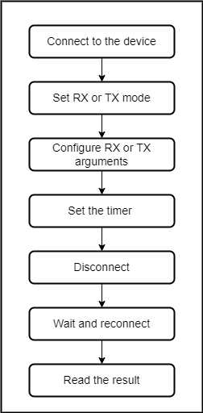
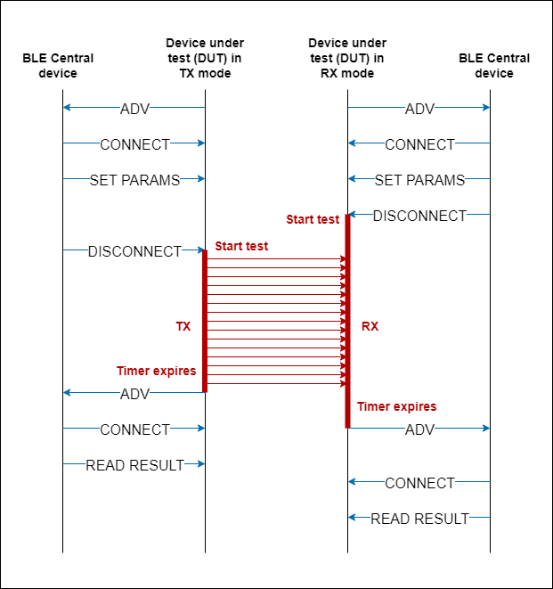
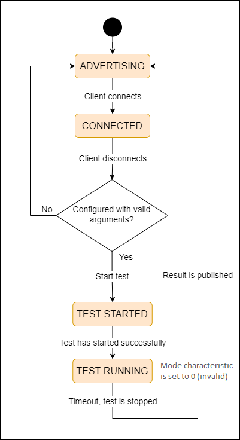

# Implementing Wireless Direct Test Mode (DTM)

## Overview

Designing an embedded system correctly is a complex task. As a result, radio testing is a critical step that any design cycle needs to implement. This example shows how to use DTM routines completely wirelessly where physical access is not required to the device.

Because it is wireless, a Bluetooth-based design might need to support wireless-based testing method because some devices can be fully enclosed, preventing any physical access via wired protocols such as UART.

The Direct Test Mode (DTM) routines are part of the BGAPI and can be used to test transmission/reception capabilites of your design. The most common way to use them is having a device programmed with Network Co-Processor (NCP) firmware and launching the commands from a host using BGAPI over UART. For more information about DTM and radio testing, see [AN1267: Radio Frequency Physical Layer Evaluation in Bluetooth SDK v3.x](https://www.silabs.com/documents/public/application-notes/an1267-bt-rf-phy-evaluation-using-dtm-sdk-v3x.pdf).

## Gecko SDK Suite version

GSDK v4.1

## Hardware Required

- 2 x [BGM220-EK4314A (BGM220 Bluetooth Module Explorer Kit)](https://www.silabs.com/development-tools/wireless/bluetooth/bgm220-explorer-kit)

## Setup

To utilize the wireless testing solution, two devices are needed running the wireless DTM firmware, one as the radio transmitter and another as the radio receiver. A third device is additionally needed to configure the test parameters on the transmitter and receiver. A smartphone with EFR Connect app ([Apple Store](https://apps.apple.com/us/app/silicon-labs-blue-gecko-wstk/id1030932759), [Play Store](https://play.google.com/store/apps/details?id=com.siliconlabs.bledemo&hl=en)) is suitable for this purpose.

You can either import the provided `bluetooth_wireless_dtm.sls` project file or start with an empty example project as the following:

1. Create a **Bluetooth - SoC Empty** project for the **BGM220 Explorer Kit Board** using Simplicity Studio 5. Use the default project settings. Make sure to connect and select the BGM220 Explorer Kit Board from the **Debug Adapters** on the left before creating a project.

2. Copy the app.c file from the _src_ folder into the project root folder (overwriting the existing app.c).

3. Import the GATT configuration:

   - Open the .slcp file in the project.
   - Select the **CONFIGURATION TOOLS** tab and open the **Bluetooth GATT Configurator**.
   - Find the Import button and import the attached [gatt_configuration.btconf](config/gatt_configuration.btconf) file.
   - Save the GATT configuration (ctrl-s).

4. Open the .slcp file again. Select the **SOFTWARE COMPONENTS** and install the [Bluetooth]->[Stack]->[DTM]->[**Direct Test Mode**] Software Component.

5. Don't forget to flash a bootloader to your board, if you haven't done so already.

## GATT Database

The configuration parameters are organized to 3 custom services. The control service also stores the test result which is published after the test has finished. 

| Service Name      | UUID                                 |
| ----------------- | ------------------------------------ |
| Silicon Labs DTM control | 0d8991ee-e355-47eb-8810-ea89a67dddeb |
| Silicon Labs DTM RX | bace30ed-7375-4b90-accd-1867f7d0f073 |
| Silicon Labs DTM TX | ef0ef18f-8a97-4021-9281-fddb09cd0f71 |

### Silicon Labs DTM control service

Custom service contains characteristics to run a DTM test on the device. 
This service provide the following characteristics:

| Characteristic Name       | Length | Properties | Description | 
| ------------------------- | ------ | ---------- | ----------- |
| Silicon Labs DTM mode     | 1 byte | Read, Write | The DTM mode of the device: RX: 1, TX: 2, CW: 3 |
| Silicon Labs DTM duration | 2 bytes | Read, Write | The duration of the DTM test in seconds |
| Silicon Labs DTM result   | 2 bytes | Read | Stores the result of the DTM test |

### Silicon Labs DTM RX service

Custom service contains characteristics to configure the device in DTM receiver mode.

| Characteristic Name       | Length | Properties | Description | 
| ------------------------- | ------ | ---------- | ----------- |
| Silicon Labs DTM rx channel | 1 byte | Read, Write | Bluetooth channel to use |
| Silicon Labs DTM rx phy | 1 byte | Read, Write | PHY to use ([enum](https://docs.silabs.com/bluetooth/latest/a00092#ga35a5e3ed16a6fc6186b45b47565759bc))|

### Silicon Labs DTM TX service

Custom service contains characteristics to configure the device in DTM transmitter mode.

| Characteristic Name       | Length | Properties | Description | 
| ------------------------- | ------ | ---------- | ----------- |
| Silicon Labs DTM tx packet type | 1 byte | Read, Write | Packet type to transmit |
| Silicon Labs DTM tx length | 1 byte | Read, Write | Packet length in bytes | 
| Silicon Labs DTM tx channel | 1 byte | Read, Write | Bluetooth channel to use |
| Silicon Labs DTM tx phy | 1 byte | Read, Write | PHY to use ([enum](https://docs.silabs.com/bluetooth/latest/a00092#ga35a5e3ed16a6fc6186b45b47565759bc))|
| Silicon Labs DTM tx power level | 1 byte | Read, Write | TX power level in unit dBm |

## How it Works

The Devices Under Test (DUTs) are BLE server devices which can be used either as transmitters or as receivers. You can use a single client device to control both DUTs or separate clients, one for each device.

The receiver portion of the test is triggered by a call to the following routine (see [detailed command description](https://docs.silabs.com/bluetooth/latest/a00092#gaf05ab5487716fdc835037f5febcae0d2) in the Bluetooth API):

      sl_bt_test_dtm_rx(uint8_t channel, uint8_t phy);

The transmitter portion of the test is triggered using the following routine (see [detailed command description](https://docs.silabs.com/bluetooth/latest/a00092#ga9cbb848ae0ff9dd24ba1ca5bb9c547a4) in the Bluetooth API):

      sl_bt_test_dtm_tx_v4(uint8_t packet_type,
                           uint8_t length,
                           uint8_t channel,
                           uint8_t phy,
                           int8_t power_level);

The client will send the arguments of the sl_bt_test_dtm_rx and sl_bt_test_dtm_tx_v4 routines respectively to the receiver and the transmitter. In addition, it will also pass a time argument which is the duration of the test. This example allows passing the arguments to the DUT over the air, through a custom GATT service for each of the commands, and trigger the test commands on both the receiver and the transmitter. Furthermore, it allows reading the number of packets received/sent after the test is completed on both TX/RX DUTs. The following charts indicate the sequence of steps allowing the client to control the two devices. Typically, one is the transmitter and the other is the receiver. 

**To ensure that packets are not lost by the receiver, the receiver should be started first and stay in RX test mode for a longer period than the transmitting device so that all packets are captured.**

After the timer has elapsed, the routine that ends the test is called and triggers the tester to re-advertise so the master can reconnect and read the result from both TX and RX DUTs. After the test, the mode characteristic is zeroed out. In order to run the next test, the mode characteristic has to be set explicitely. This mechanism prevents the device to run unintentional tests after BLE disconnect. The following high-level state machine explains how the tester works from the perspective of the RX/TX DUT.

### Error handling
If an error occurs, the device sets all characteristics to zero in the *DTM mode* GATT service then it starts advertising.

### Advertising

The device is advertising the following elements:
 - Device name which is "dtm_test" by default
 - The Silicon Labs DTM control service UUID (0d8991ee-e355-47eb-8810-ea89a67dddeb) 

## Usage

1. Power up the receiver device.

2. Connect to device called *dtm_test* via Bluetooth using a smartphone application or any Bluetooth client program you prefer.

3. First, configure the server device using its *DTM control* GATT service. Set RX mode by writing value 0x01 to the *mode characteristic*. Write the the duration time value to the *duration characteristic* in seconds. This tells the receiver how long it must be in RX mode (this mode is entered once the client drops the connection).
   
4. Write the two arguments for [sl_bt_test_dtm_rx](https://docs.silabs.com/bluetooth/latest/a00088#gaf05ab5487716fdc835037f5febcae0d2) via the characteristics in the *DTM RX* GATT service.
   
5. Power up the transmitter device.

6. Connect to the second device that advertises the same name *dtm_test* via Bluetooth. You can also change the device name to more easily distinguish between RX and TX DUTs.

7. Configure the server device using its *DTM control* GATT service. Set TX mode by writing value 0x02 to the *mode characteristic*. Write the duration time value to the *duration characteristic* in seconds. This tells the transmitter how long it must be in TX mode (this mode is entered once the client drops the connection).
   
8. Write the five arguments for [sl_bt_test_dtm_tx_v4](https://docs.silabs.com/bluetooth/latest/a00088#ga9cbb848ae0ff9dd24ba1ca5bb9c547a4) via the characteristics in the *DTM TX* GATT service.
   
9. Disconnect the client device from the __receiver__ first (that will trigger the receiver to start RX test mode).

11. Only after, disconnect the client device from the __transmitter__ (that will trigger the transmitter to start TX test mode).

12. Test is running until the configured test duration time expires.

13. After the test has finished on the devices, they start advertising again.

13. Reconnect and read out the results. The result corresponds to the number of packets received (if the result is read on the receiver) and the number of packets transmitted (if the result is read on the transmitter).