## Deprecation Notice


This code has been deprecated. It has been provided for historical reference only and should not be used. This code will not be maintained. This code is subject to the quality disclaimer at the point in time prior to deprecation and superseded by this deprecation notice.

### Reasoning

This code example is marked as deprecated because Bluetooth soft timers became deprecated in GSDK v3.2. Soft timers will be removed from the Bluetooth stack, and using the sleep timer platform component will be the preferred way for timing. The usage of sleep timer and watchdog is demonstrated with code examples in the Gecko SDK and under [https://github.com/SiliconLabs/peripheral_examples](https://github.com/SiliconLabs/peripheral_examples). 


# Using Watchdog in Bluetooth Applications

## Description

This software example will show you how to use a Watchdog timer in the Bluetooth application context. The Watchdog is an EFR32/BGM peripheral which allows to detect and reset/reboot an EFR32/BGM device when it hangs and becomes unresponsive (e.g., software stalemate).

The Watchdog API is fairly simple. The Watchdog has to be initialized once after reset with `WDOG_Init(&init)` and it has to be fed from time to time before the Watchdog timer expires using `WDOG_Feed()`. In a Bluetooth context, the most suitable way to feed the Watchdog is by using a **soft timer**. A soft timer event is triggered by the stack each time the timer expires. If the stack stops working, a soft timer event is not generated and the Watchdog is not fed. Ultimately, this will reset the device.

The soft timer is initialized by calling the function:

```C
sl_status_t sl_bt_system_set_soft_timer(uint32_t time,
                                        uint8_t handle,
                                        uint8_t single_shot)
```

Each time it triggers, it will activate the event `sl_bt_evt_system_soft_timer_id`, and you will write the handling code for this event in the event loop.

To determine whether you recovered from a crash with a Watchdog reset or whether the device was reset normally, use the function `RMU_ResetCauseGet()`.

## SDK version ##

- GSDK v3.1.1

## Hardware Required ##

- One WSTK board: BR4001A
- One Bluetooth radio board, e.g: BRD4162A

## Connections Required ##

- Connect the BRD4162A Dev Kit to the PC through a USB cable.

## Setup

1. Create a new **SoC-Empty** project.

2. Copy the attached **app.c** file into the project folder (replacing the existing one).

3. Config **Software components**, add: **Simple LED** driver,  **Simple button** driver, **Watchdog** driver, **RMU** driver (RMU is used to get the cause of the last reset), and **Print log** driver.  

    - Install **Simple LED** driver with default instances `led0`  
    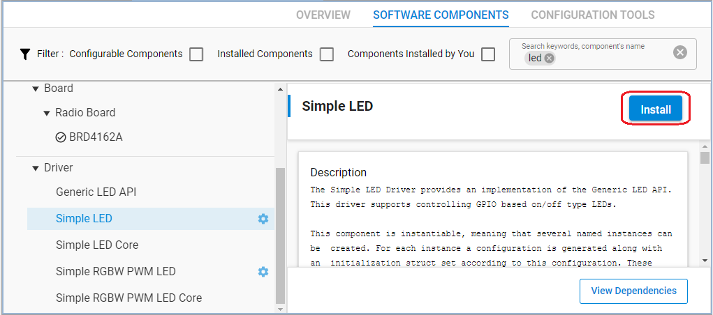  
    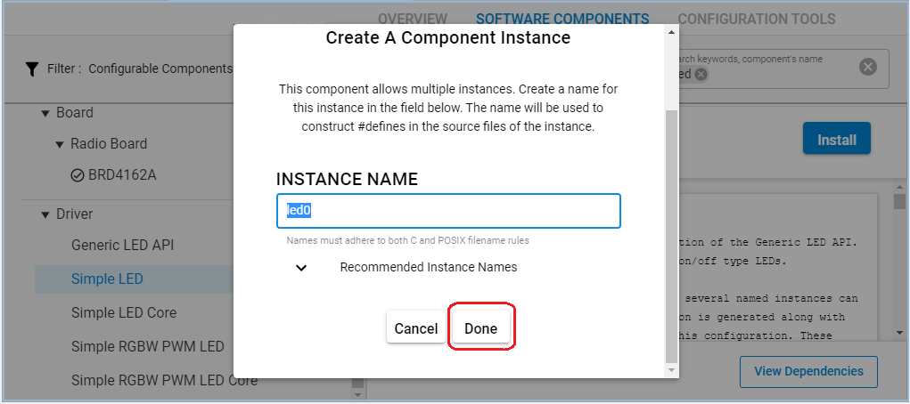  

    - Install **Simple button** driver with default instances `btn0`  
    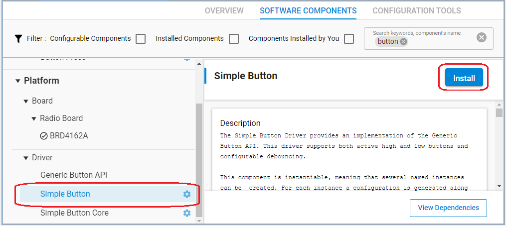  
    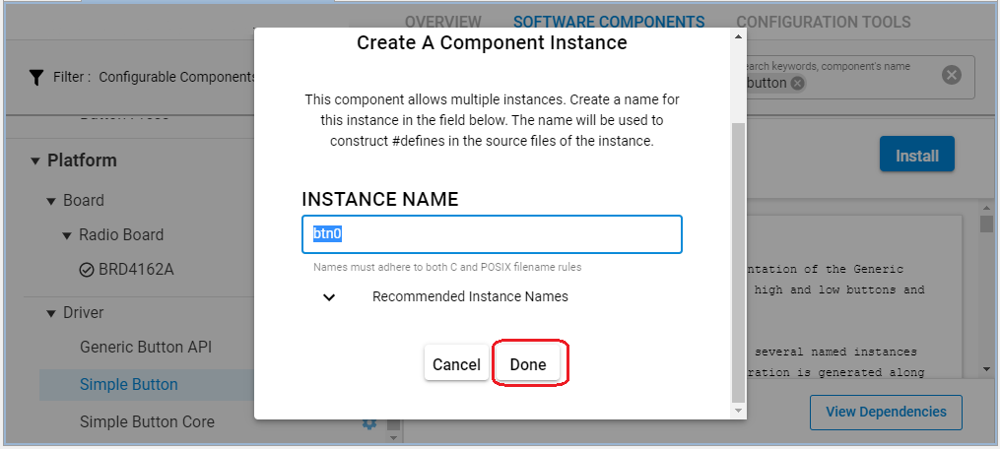  

    - Install **WDOG** component  
    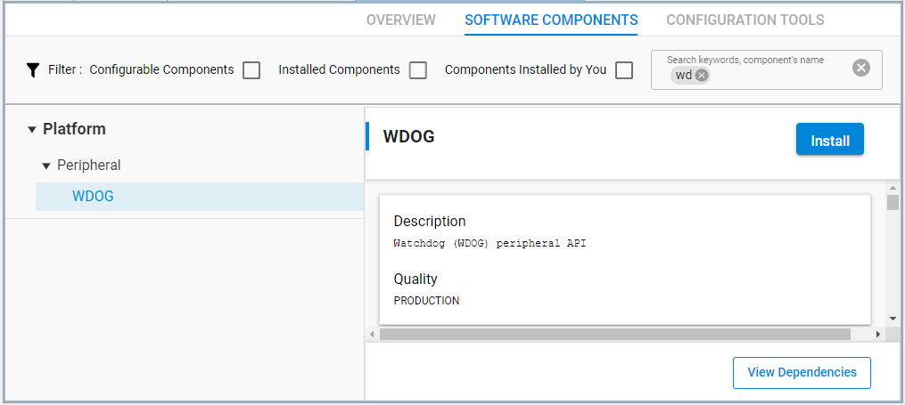  

    - Install **RMU** component  
    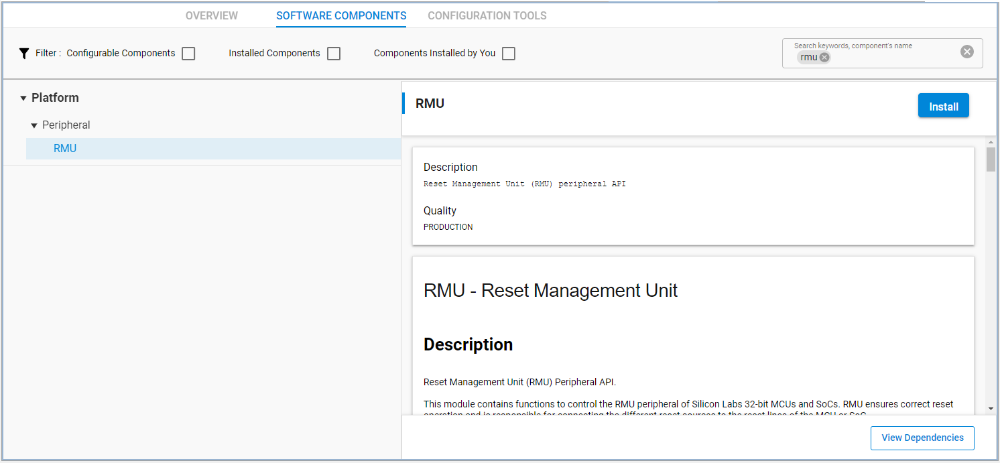  

    - Install **IO Stream: USART** component with the default instance name: **vcom**  
    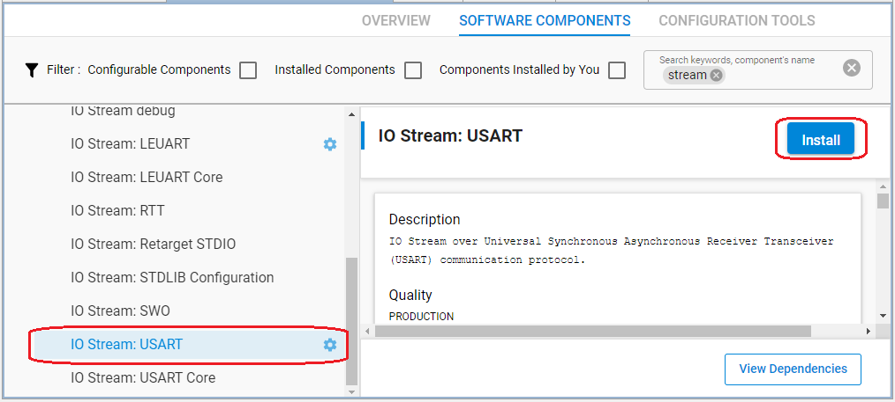
    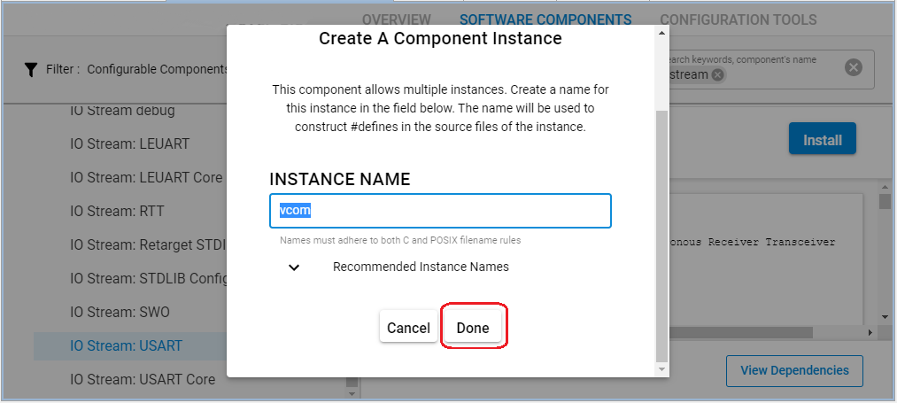

    - Enable **Virtual COM UART** in the **Board Control** component  
    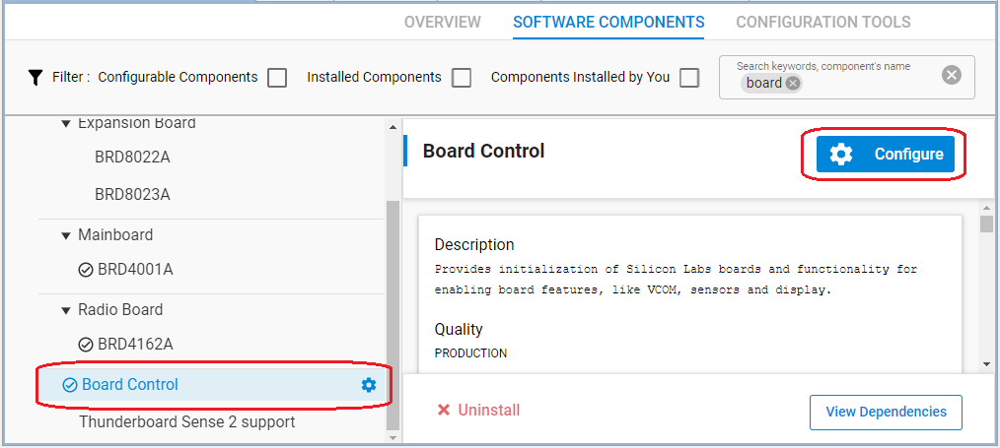  
    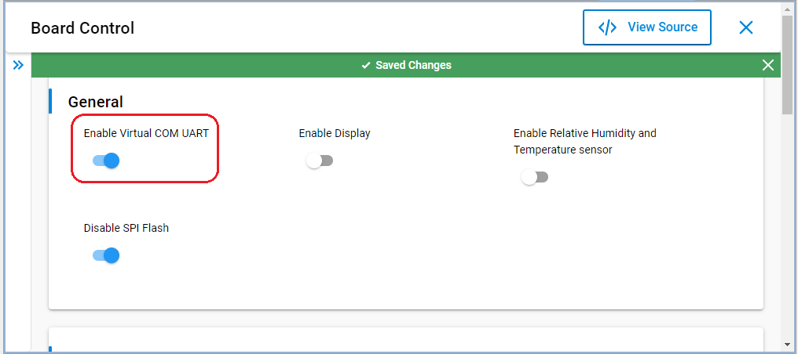  

    - Install the **Log** component (found under Bluetooth > Utility group)
    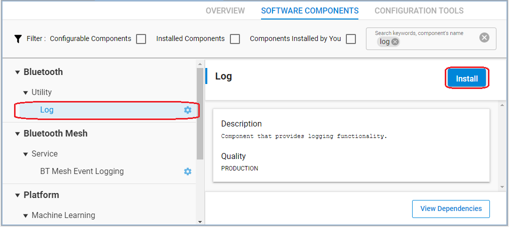  

4. **Save and close** then the tool will auto-generate to code.

5. Build and flash the project to your devices.

## How It Works ##

The attached example application sets a Watchdog period of 2 seconds and sets up a soft timer to feed the Watchdog every second (1s). The LED0 is also toggled on every soft timer event to make the heartbeat visible.

Open terminal to see the log message:  
In **Debug Adapter** window in the Studio, right-click on your board, select **Launch Console**. Choose tab **Serial 1** and press **Enter**.  
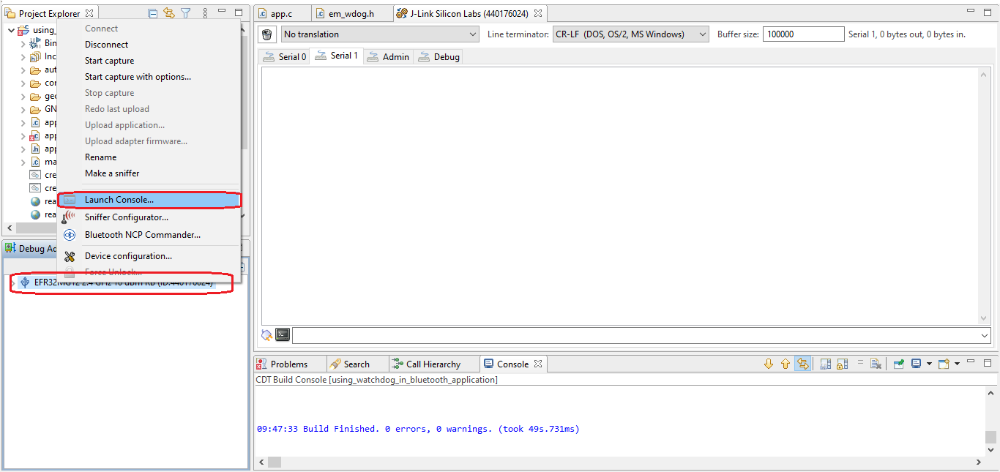  

Push button `PB0` to stop the soft timer. After 2s timeout without being fed, the watchdog will reset the device.  

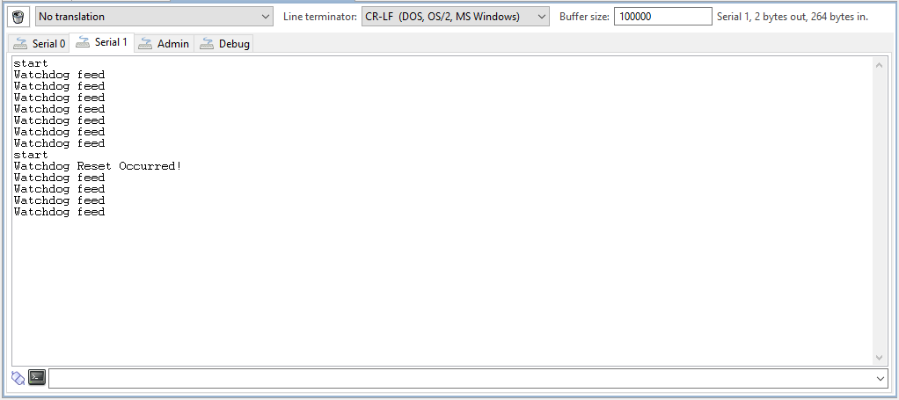  
