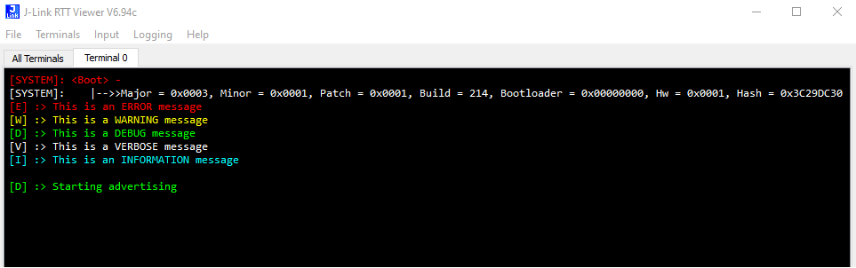
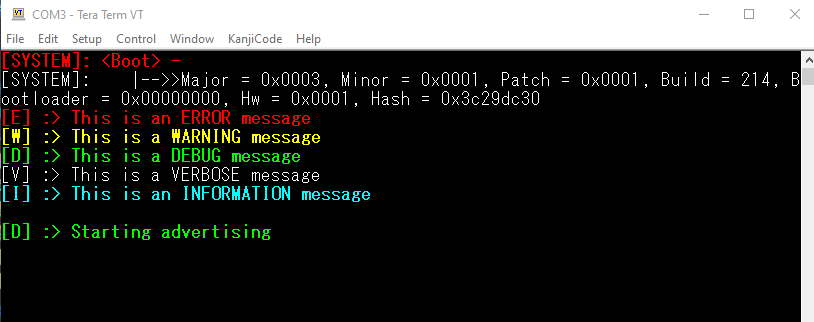
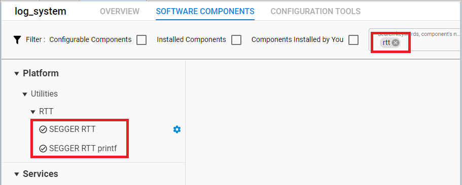
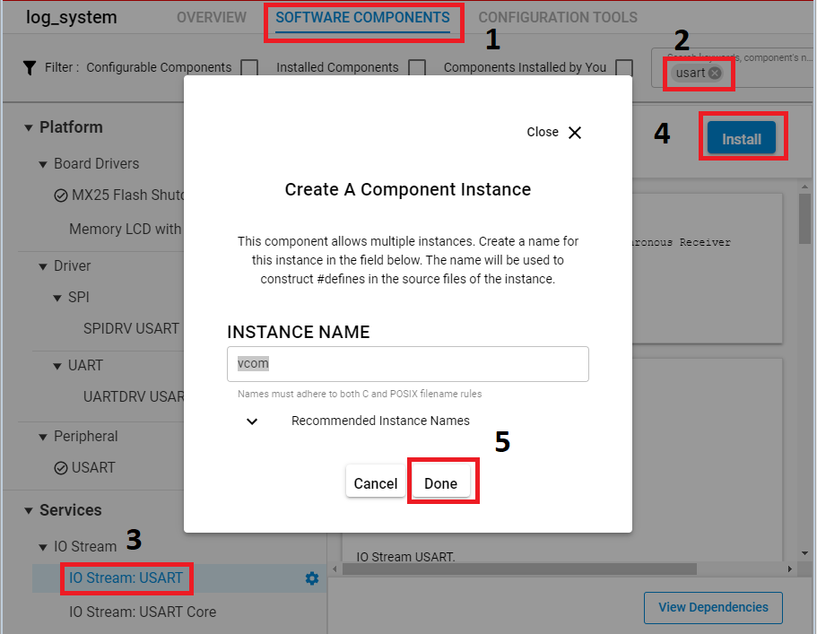
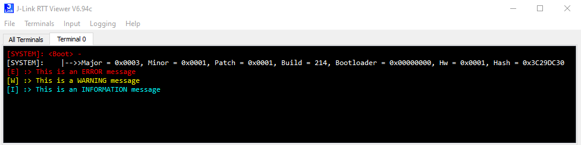
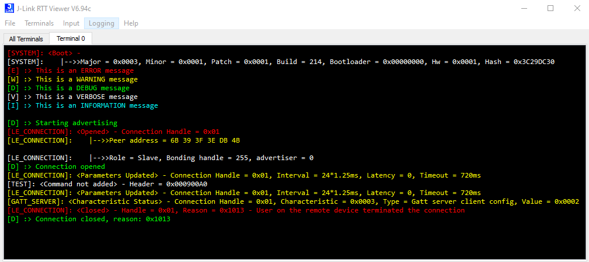
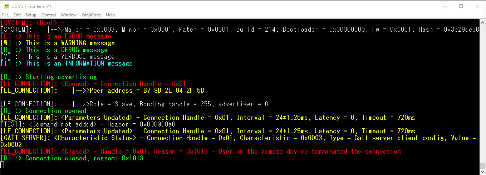

# Log System ##


## Description ##
 
Logging is very important for developing embedded products. This is especially true for connection-based wireless products because the use of breakpoints will probably result in dropped connections, whereas issues can be easily addressed by walking through the log.

This example introduces a simple implementation of logging on EFR32 based devices. The key point of the example code is to introduce a way to classify the log into different levels, where each level of log has its own identifier. Let’s start with 2 design sketches, which demonstrate outputting the log via RTT and VCOM(UART).



Using RTT



Using VCOM

The images above show different levels of logging in different colors. This example introduces 5 logging levels, as shown below.

| Type                   | color  |
| ---------------------- | ------ |
| Error (highest level)  | Red    |
| Warning                | Yellow |
| Information            | Blue   |
| Debug                  | Green  |
| Verbose (lowest level) | White  |

## Gecko SDK version ##
 
GSDK v3.1.1
 
## Hardware Required ##
 
- A WSTK board.

- A Bluetooth capable radio board, e.g: BRD4161A.
 
## Setup ##

To be able to test the logger module do as follows:

1. Create a **Bluetooth - SoC Empty** project.

2. Copy the attached app.c, log.h files into your project (overwriting existing app.c).

3. `LOG_PORT`, defined in *log.h*, can be set to **SEGGER_JLINK_VIEWER** or **PORT_VCOM** to determine if you want to send debug messages via DEBUG port or COM port (UART). Please uncomment to choose your terminal output.

   - **SEGGER_JLINK_VIEWER** – the log will be out from J-Link RTT. 
   - **PORT_VCOM** – the log will be out from VCOM via USB.

```c
#ifndef LOG_PORT
// choose your terminal output
#define LOG_PORT                        (PORT_VCOM)
//#define LOG_PORT                      (SEGGER_JLINK_VIEWER)
#endif
```

4. Install the software components:

   a) Open the .slcp file in the project.

   b) Select the SOFTWARE COMPONENTS tab.

   c) If you use **SEGGER_JLINK_VIEWER** for logging, find and install **SEGGER RTT** and **SEGGER RTT printf** components.



   d) If you use the **VCOM** port (UART) for logging:
   - Install **IO Stream: USART** component with the default instance name: **vcom**.



   - Find the **Board Control** component  and enable *Virtual COM UART* under its configuration.

   - Install the **Log** component (found under Bluetooth > Utility group).

5. Define `LOG_LEVEL` in *log.h*. The definition of `LOG_LEVEL` determines which level of logging should be output to the terminal. As you can see from the table above, error has the highest level while verbose has the lowest level. For example, If the `LOG_LEVEL` is defined as information level, then error, warning and information log will be sent to the terminal, the debug and verbose log which have lower level than information will not be sent to the terminal. See figure below, which shows the log as information level without modifying anything from the first figure, using RTT.



6. Build and flash the project to your device.

7. Do not forget to flash a bootloader to your board, if you have not done so already.
 
## How It Works ##
 
1. On your PC open a terminal program and connect to the chosen port (e.g. you can use TeraTerm to connect via VCOM and RTT Viewer to connect via DEBUG port).

2. Reset your device and observe the log messages.

3. You may also open a Bluetooth connection to see more logs by using the EFR Connect app on your smartphone. After opening the EFR Connect app, find your device in the Bluetooth Browser, advertising as Empty Example, tap Connect then Disconnect and check the logs. 



Using RTT viewer



Using VCOM

You can add new logs to your project. The following are 5 corresponding functions to send the log. The input parameter of these five functions is the same as standard printf();.

- `LOGE()` – Send ERROR log.
- `LOGW()` – Send  WARNING log.
- `LOGI()` – Send INFORMATION log.
- `LOGD()` – Send DEBUG log.
- `LOGV()` – Send VERBOSE log.

Use these functions in your code to print different level logs.
