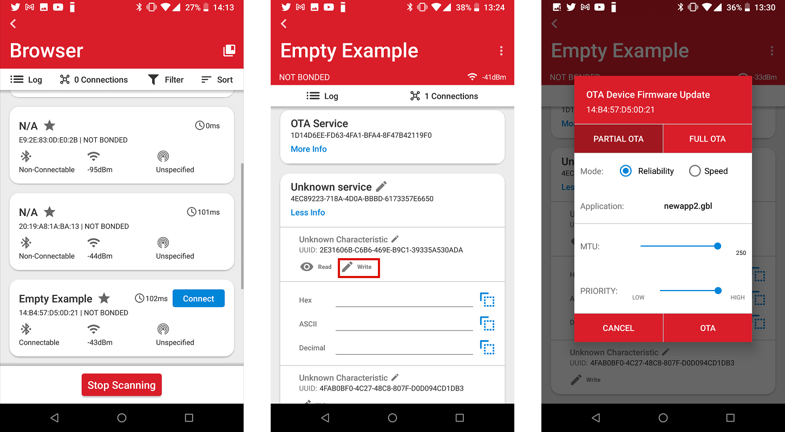
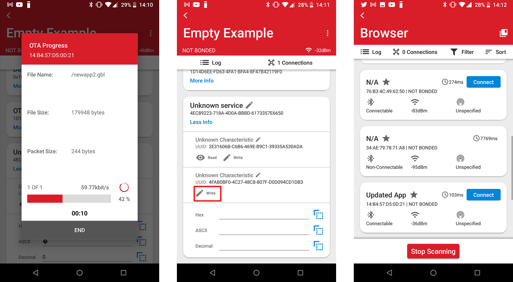

# Uploading Images to Internal/External Flash Using OTA DFU

## Background

This code example has a related User's Guide, here: [Uploading Firmware Images Using OTA DFU](https://docs.silabs.com/bluetooth/latest/general/firmware-upgrade/uploading-firmware-images-using-ota-dfu)

## Description

The attached code implements image uploading to the bootloader storage slots using the standard OTA process. It is also extended by allowing the users to select a slot to upload to and a slot to boot from. You are free to modify this example according to your needs.

## Setting up

To create a project with multi-slot OTA DFU, follow these steps:

1. Create an **Internal Storage Bootloader (multiple images)** or a **SPI Flash Storage Bootloader (multiple images)** project in Simplicity Studio.

2. Check the Storage Slot configuration in AppBuilder and modify it according to your needs.

3. Generate and build the project.

4. Flash the bootloader to your device.

   

5. Create a **Bluetooth – SoC Empty** project.

6. Open Project Configurator by opening the .slcp file in your project and selecting the Software Components tab.

7. Find the **OTA DFU** component (Bluetooth > Utility > OTA DFU) and uninstall it.

   * this will uninstall Apploader, remove OTA DFU service and the OTA control characteristics handler code.

8. Open GATT Configurator (Software Components > Advanced Configurators > Bluetooth GATT Configurator).

9. Find the import button, and import the attached .btconf file.

   * this will re-add the OTA DFU service, and a custom service where upload slot and boot slot can be selected.

10. Save the GATT database.

11. Copy the attached *ota_dfu_multislot.c* and *ota_dfu_multislot.h* files into the project.

12. Open autogen/sl_bluetooth.c and

    1. Add #include “ota_dfu_multislot.h” to the beginning of the file
    2. Add multislot_ota_dfu_on_event(evt); before sl_bt_on_event(evt); into sl_bt_process_event()
    3. Save the file

13. Build the project.

14. Flash the image to your device.

## Usage

1. Make a copy of your multi-slot OTA DFU project.
2. Change the Device Name from “Empty Example” to “Updated App” in the GATT Configurator, and save the GATT database
3. Build the project.
4. Run create_bl_files.bat. Note, that you may need to set up some environmental variables first, as described in section 3.10 of [AN1086: Using the Gecko Bootloader with the Silicon Labs Bluetooth® Applications](https://www.silabs.com/documents/public/application-notes/an1086-gecko-bootloader-bluetooth.pdf)
5. Find the full.gbl file in output_gbl folder.
6. Copy full.gbl to your smartphone.
7. Open EFR Connect app on your smartphone.
8. Find your device with Bluetooth browser (advertising as Empty Example) and connect to it.
9. Find the unknown service and open it (this is your custom service including Upload slot and Bootload slot characteristics).
10. Open the first characteristic (this is the upload characteristic) and write the slot number, that you want to upload to, in it, for example 0x00.
11. In the local menu select OTA DFU.
12. Select the partial OTA tab.
13. Select the full.gbl file you want to upload.
14. Click OTA. The file will be uploaded to the selected slot.
15. Now you may need to reconnect.
16. Open the second characteristic in the unknown service (Bootload slot) and write the slot number (e.g. 0x00), that you want to load the application from, in it. The device will trigger a reset and the new application will be loaded.
17. Disconnect and find your device advertising itself as “Updated App”.

